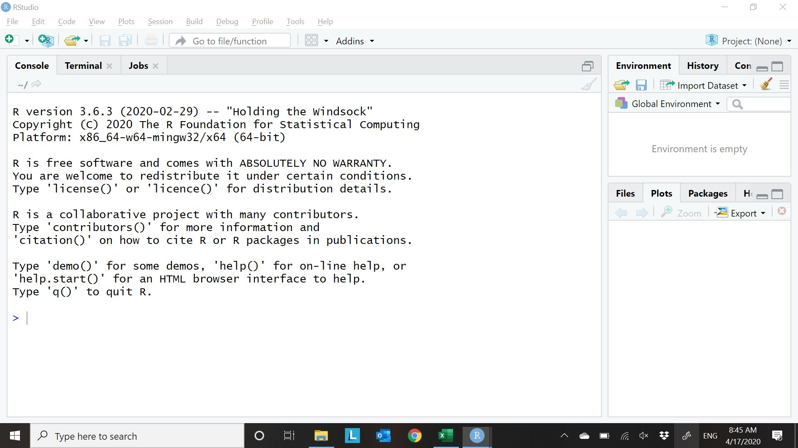

# (PART\*) Fundamentals {-}

# Introduction {#introduction}

This is an introductory course in statistics for economics. It is similar to
courses taught all over the world to first and second year university students
in business, economics, and other social sciences.

::: {.goals data-latex=""}
**Course goals**

By the end of this course, you will:

Develop computer skills:

1. Clean, analyze, and graph data in Excel.
2. Clean, analyze, and graph data in R.
3. Follow recommended practices for data management and reproducible analysis.

Become familiar with basic statistical concepts:

4. Calculate and interpret probabilities and expected values.
5. Explain the relationship between population and sample.
6. Describe the properties of a statistic including its
   probability distribution, expected value, and variance.
7. Describe the properties of an estimator including its
   bias and mean squared error.
8. State and apply the law of large numbers and central limit theorem.

Apply these skills in combination to analyze real-world economic data:

9.  Construct and interpret common charts including histograms, scatter plots,
    and time-series plots.
10. Construct and interpret frequency tables and cross-tabulations.
11. Construct and interpret common univariate and bivariate statistics,
    including	mean, variance, standard deviation, covariance and correlation.
12. Construct and interpret hypothesis tests and confidence intervals.

We will be switching back and forth between theory, data analysis and
applications.  All three skill sets are valuable.
:::

Hopefully, you are in this course because you are fascinated by statistics 
and can't wait to learn more about it.  But most of you are taking it because 
it's a required course. So I'd like to motivate everyone to take this course
as an opportunity to learn some very useful skills.

## Course context {#course-goals-and-context}

The context of this course is a world that is awash in data:

- Retailers maintain databases of transactions.
- Manufacturers track product quality and costs.
- Marketers collect data on customers and potential customers.
- Governments record everyone's interactions with schools,
    tax authorities, social welfare, health care and criminal justice.
- Employers maintain detailed personnel records. 
 
These databases can be linked and analyzed in various ways, and many 
of the world's most successful organizations rely heavily on the innovative
gathering and usage of data:

- Google's core product (its search engine) is built on the 
  innovative analysis of massive amounts of data.
- Google and the major social media companies operate a business model of 
  providing valuable "free" services in order to gather data on consumers that
  can then be directly or indirectly sold to other businesses.
- Amazon and other retailers use sophisticated data analysis techniques like
  machine learning and A/B testing to fine-tune product descriptions, generate
  better recommendations, and set prices so as to maximize profits.

Much of this data analysis is done by statisticians or computer scientists,
but a substantial amount is done by economists. For example, Amazon is the
second-largest employer of PhD economists in the United States
(after the U.S. Federal Reserve System). The average economist does not
have a computer scientist's expertise on computers, or a business person's
expertise on markets, but knows enough about both to be quite useful to
an organization that has data and wants money.

This course will not qualify you for those jobs - they typically require a
graduate degree - but it is a first step in that direction, and there are
many other good jobs where data analysis skills are a big asset.
So you should take this course as a lucrative investment opportunity, and not
just a requirement for your major.

::: {.economics data-latex=""}
**Be the Mona Lisa**

Students should always think about the future and remember that labour markets
are driven by supply and demand.  In the labour market, your skills and effort
are the product, and you are the seller. Like all sellers, you want your
product to be expensive.  This requires that you have skills that are both:

- Wanted by employers (high demand)
- Uncommon (low supply)

For example, consider these four objects:

{width=20%}
{width=20%}
{width=20%}
{width=30%}  
Which one has a high price?

To have a well-paid career, you need to be like the Mona Lisa. If your skills
are useful but common (like water), or rare but useless (like my one-of-a-kind
but not particularly good drawing of the Mona Lisa) your labour will sell at a
low price.  If your skills are common and useless (like garbage), your labour
may not sell at any price.

The combined ability to analyze data in a sophisticated way, and to explain the
results in written or oral presentation, is an extremely useful and uncommon
skill. Most of you do not have the technical skills of your colleagues in
Computer Science, but if you can combine a reasonable level of computer skills
with writing, knowledge of the underlying statistical principles, and the
ability to recognize the economic context of a situation, you will do
quite well.
:::

## Expectations {#organization-and-expectations}

This textbook and course are constructed under the assumptions that:

1. You have taken Principles of Microeconomics and Principles of Macroeconomics.
   -  Ideas from those courses will be used in applications and examples.
2. You can do high-school level math including algebra and basic set theory and
   have taken or are currently taking an introductory calculus course.
   - You will not be asked to solve integrals.
   - You may be asked to take a simple derivative or two.
   - We will use concepts like functions, sequences and limits that are
     emphasized in an introductory calculus course.
   - The [Math Review](#math-review) appendix reviews the relevant concepts
     and provides practice problems.
3. You have access to a desktop or laptop computer, internet access,
   and basic computer skills:
   - Open, close, save, rename, move, and copy files.
   - Create and use folders (also called directories) and subfolders.
   - Install and run applications (also called programs).

This is not a textbook on introductory economics, high school math, or computer
science. If you are a little behind in those skills, you can catch up but you
will need to be proactive in asking for help.

::: {.sfu data-latex=""}
**ECON 233**

ECON 233 is the first course in the two-course econometrics sequence that is
required for all economics majors at SFU.  If you've never seen the word before,
"econometrics" just means statistics and data analysis for economics.

All economics majors have the option of taking ECON 233 or BUS 232, so you may
be wondering what the difference is. Either course is suitable preparation for
ECON 333, but there are some key differences: 

- *Tools:* ECON 233 uses both Excel and R, while BUS 232 uses Excel. 
  - You are likely to use R in ECON 333 and other upper-division ECON courses,
    so it is nice to get used to it now.
- *Applications:* ECON 233 emphasizes economics applications, while BUS 232
  emphasizes business applications.

ECON 233 is also part of the Social Data and Analytics (SDA) minor; if you are
an economics student and are interested in that minor you are recommended to
take ECON 233.
:::

If you continue in an economics major, you will take at least one additional
course  in econometrics. In those courses, you will learn more advanced
techniques such as linear regression, you will use statistical packages such as
R more extensively, and you will go deeper into the theory.

::: {.sfu data-latex=""}
**Related SFU courses**

The second required course in the econometrics sequence for SFU economics
majors is
[ECON 333:Statistical Analysis of Economic Data](https://www.sfu.ca/students/calendar/2022/fall/courses/econ/333.html).
In ECON 333, you will learn a more advanced set of techniques including linear
regression analysis and you will gain more experience with R.

We also offer several related electives. If you find you enjoy and/or do well in
this course, I would encourage you to take some of these course:

- [ECON 334: Data Visualization and Economic Analysis](https://www.sfu.ca/students/calendar/2021/spring/courses/econ/334.html) 
  is an elective focusing on exploratory data analysis and visualization.
- [ECON 335: Introduction to Causal Inference and Policy Evaluation](https://www.sfu.ca/students/calendar/2021/spring/courses/econ/335.html)
  is an elective focusing on the problem of inferring cause-and-effect from
  economic data, and using data to forecast the effects of economic policies.
- [ECON 433: Financial and Time Series Econometrics](https://www.sfu.ca/students/calendar/2021/spring/courses/econ/433.html)
  is an advanced elective focusing on techniques for analyzing the kind of time
  series data that is used in macroeconomics and financial markets.
- [ECON 435: Econometric Methods](https://www.sfu.ca/students/calendar/2021/spring/courses/econ/435.html)
  is an advanced course in statistics and econometrics that is part of our
  honours sequence. It gives you the opportunity and tools to write a serious
  empirical research paper. Students who are not in the honours program are
  still eligible to take ECON 435 if they have a 3.0 CGPA and the course
  prerequisites.
   
I would also encourage you to take courses outside of the economics department,
and to consider a 
[Statistics minor](https://www.sfu.ca/students/calendar/2021/spring/programs/statistics/minor.html)
or the interdisciplinary
[Social Data Analytics (SDA) minor](https://www.sfu.ca/students/calendar/2021/spring/programs/social-data-analytics/minor.html).
:::

## Computer resources {#computer-resources}

To do the computer work you will need a computer with internet access and
the following software applications installed:

1. Microsoft Excel
2. R
3. RStudio

You will also want to install an R "package" known as the Tidyverse.

Excel is a commercial application, while R and RStudio are both open-source
(free). They are available for both Windows and macOS.  The examples in the
textbook use Windows.

We will use Excel [right away](#basic-data-cleaning-with-excel).  We will
not need R until [much later](#an-introduction-to-r), but it is best
to get your system set up now.

:::sfu
**ECON 233 on Canvas**

Course materials for ECON 233, including the syllabus, lectures, and
assignments are available at the course Canvas site
https://canvas.sfu.ca/courses/87847.
:::

### Installing Microsoft Excel {#installing-microsoft-excel}

Microsoft Excel is a well-known spreadsheet program that is available for both
Windows and macOS. Alternatives to Excel include
[Google Sheets](https://www.google.ca/sheets/about/) and Apple's
[Numbers](https://www.apple.com/ca/numbers/).  We will use Excel, but the basic
skills are transferable to any spreadsheet program.

::: {.sfu data-latex=""}
**Using Excel at SFU**

SFU has a licensing agreement with Microsoft that allows its students 
free installation of the entire Microsoft Office suite, including Excel. 
Installation instructions are available at:

https://www.sfu.ca/itservices/technical/software/office365.html.

Excel is also available in all campus computer labs.
:::

Once you have installed Excel, you should confirm that it is working by starting
the program. You should see something that looks like this:  
 

### Installing R and RStudio {#installing-r-and-rstudio}

We will also use a more specialized statistical program called R, and a related
application called RStudio. R is a programming language used for statistical
analysis, and the application that interprets and executes R code.  RStudio is
an "Integrated Development Environment" (IDE) for R.  An IDE is a collection of
tools tools for building and running programs, packaged up in a single
user-friendly interface.

Alternatives to R include the (quite expensive) statistical packages 
[SAS](https://www.sas.com/) and [Stata](https://www.stata.com/), as well as the
(free) general-purpose programming language [Python](https://www.python.org/).
The best known IDE is Microsoft's 
[Visual Studio](https://visualstudio.microsoft.com/).

::: {.sfu data-latex=""}
**Using R/RStudio at SFU**

R and RStudio are available in all campus computer labs.

You can also install them on your own computer by following the instructions
below.
:::

Both R and RStudio are open-source, and are available free of charge for both
Windows and macOS. Installation instructions are available at:

https://posit.co/download/rstudio-desktop/#download.

Be sure to install R first, then RStudio.

After installing R and RStudio, you should confirm that they are working by
opening RStudio.  You should see something like this:  


### Installing the Tidyverse {#installing-the-tidyverse}

One of the most useful features of R is that it allows users to write and
distribute ***packages*** that extend its capabilities. There are thousands
of packages available; we will use a particularly popular and useful package
called the ***Tidyverse***.

To install the Tidyverse package:

1. Open RStudio if it isn't already open.
2. Click in the `Console` window (you will see it towards the bottom of the
   screen).
3. Enter `install.packages("tidyverse")` (i.e., type it and hit the `<enter>`
   key).

Once the installation is concluded and the `>` prompt reappears you can test to
make sure the installation worked.

4. Enter `library(tidyverse)` in the console window.  
   - If you get an error message like
     ```Error in library(tidyverse) : there is no package called ‘tidyverse’```
     you may have forgotten to install the package; go back to step 2 above.
   - If you don't get an error message (it's OK if you get some message about
     "Conflicts"), the installation worked.

If you run into trouble here, don't worry. We will not need the Tidyverse for 
a few weeks, so there is plenty of time to get help.
