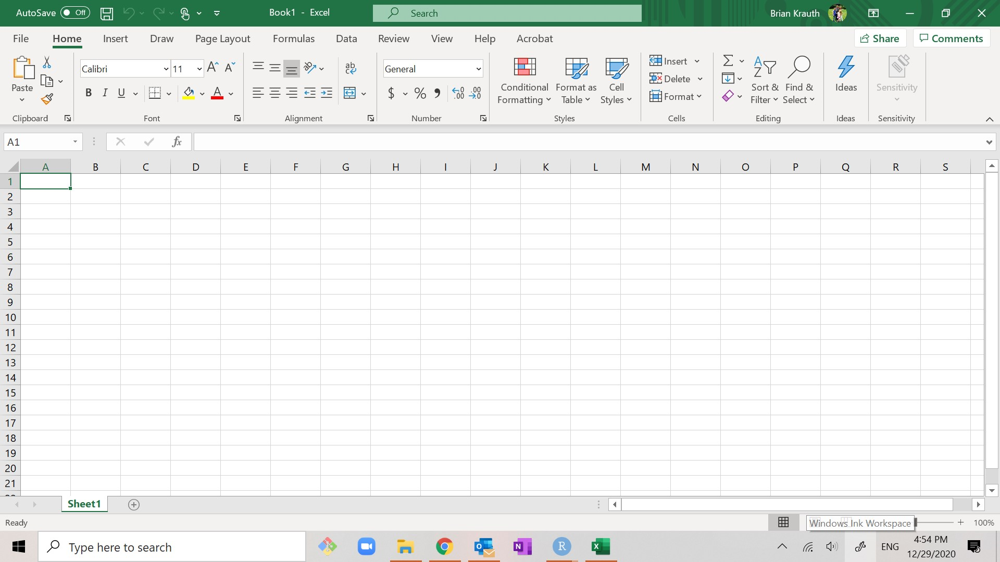
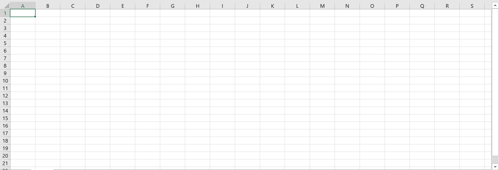
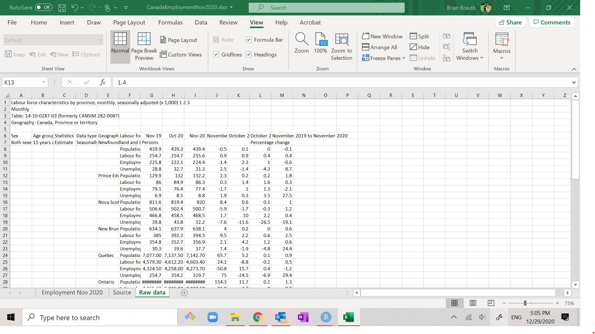
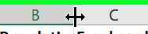

# Basic data cleaning with Excel

Excel is the most commonly-used example of a ***spreadsheet***, a software 
program designed for the tabulation, analysis, and display of data. Its main 
competitors include Google Sheets and Apple Numbers. It is widely used
in business and government, so good Excel skills are valuable in the labour
market.

::: goals
**Chapter goals**

In this chapter we will learn how to:

 - Use basic Excel terminology and concepts including:
   - Workbooks, worksheets, and cells
   - Cell contents and display format
   - Cell ranges
   - Relative and absolute cell addresses
   - Numeric, text, date, and logical  data tpes
 - Use Excel tools to view data, including:
   - Sorting
   - Filtering
   - Freezing panes
   - Changing cell size
 - Use Excel tools to enter new data and "clean" existing data, including
   - Fill and series
   - Formulas
   - Functions
   - Number formats
 - Follow good data management practices 
   - Practice data documentation and version control
   - Identify the characteristics of tidy data
:::

## A quick tour of Excel

Many of you have probably used Excel before, but there are many features
you are probably not yet familiar with.  We will start by going over some
of its basic characteristics and terminology.

### Terminology and interface

Start Excel. Your screen should look something like this:

When giving instructions, I will refer to various elements of Excel's user
interface by name. You may have been using these elements for years without
ever knowing their names, so I will list them here:

- The ***menu bar*** is at the top of the screen. 
   
- The ***ribbon*** is below the menu bar
   
  - The ribbon has buttons for performing simple actions.
  - The buttons are grouped by function, for example there is a group called
    "Clipboard" and another called "Font".
    - Within each function group, there is usually a little icon in the
      lower-right corner that you can click on to access additional options.
  - If your ribbon is not visible:
    - You can make it visible by clicking "Home" (or anything else) on the
      menu bar. 
    - Once you have made the ribbon visible, you can keep it visible by
      clicking on the little thumbtack icon in its lower right corner.
  - The contents of the ribbon depend on the currently-active menu bar option
    (usually but not always `Home`). 
    - I will assume that Home is the currently-active option; if it isn't
      you can just click on `Home` to make it the currently-active option.
- The ***formula bar*** is just below the ribbon.
    
   - It shows the contents of the current cell.
   - You can type in it to change the contents of the current cell.
- The ***insert function*** button is to the left of the formula bar. 
   {height=16pt} 
   - We will learn to use this later.
- Most of the screen displays a grid of ***cells*** that is called 
   a ***spreadsheet*** or ***worksheet***:
   
  - Columns are identified by letter.
  - Rows are identified by number.
  - Cells are identified by coumn and row.  For example, the cell 
    in column A, row 2 is called cell A2.
- Below the worksheet is a row of tabs:  
  
  - You can click on a tab to switch to that worksheet.
  - You can double-click on a tab to change its name.
  - You can click on the "+" button to add a new worksheet.
- An Excel file is called a ***workbook***.
  - Each workbook contains one or more worksheets.
  - in Windows, Excel files normally have the `.xlsx` extension. 
  - Older files sometimes have the `.xls` extension.

### Tidy data

Download the data file at https://bvkrauth.github.io/files/CanadaEmploymentNov2020.xlsx and open it in Excel.
    
This data file provides the main employment statistics for Canadian provinces
in November 2020.

::: economics
**Economics review: Employment statistics**

Employment statistics were covered in ECON 105. 

- These statistics are reported monthly by Statistics Canada and
  are based on the Labour Force Survey (LFS), a monthly survey of the
  **civilian, non-institutionalized, working-age population of Canada**.
  - "civilian" excludes those on active military duty
  - "non-institutionalized" excludes people in prison, hospitals, 
    nursing homes, etc.
  - "working-age" excludes those under age 15
  - People living on reserve are also not covered by the LFS
- The LFS population is grouped into three categories:
  - **Employed**: worked for pay or profit in the previous week, or had
    a job and was absent (e.g. due to illness or vacation).
  - **Unemployed**: not employed in the previous week, but either looking
    for work, on temporary layoff, or had a job to start within the
    next four weeks.
  - **Not in the labour force**: everyone else.  This includes retirees,
    full-time students who aren't working for pay, and anyone else
    who is neither working nor looking for work.
- These basic counts are then used to calculate several other statistics
  - The **labour force** is the total count of those who are employed or
    unemployed.
  - The **labour force participation rate** is the proportion or percentage
    of the population that is in the labour force. The Canadian
    LFP rate is typically around 65%.
  - The **unemployment rate** is the proportion of the labour force that
    is unemployed. The Canadian unemployment rate is typically 5-10%.

The unemployment rate and LFP rate are key indicators of labour market
conditions. A higher-than-usual unemployment rate means that workers
are having difficulty finding work, and a lower-than-usual LPF rate
means that some workers have stopped looking for work.
:::

The data in this file takes the form of what data scientists sometimes
call ***tidy*** data. Tidy data takes a simple and convenient format:

- Data is arranged in one or more simple rectangular grids or ***tables***.
  - In Excel, tables should always start in cell A1.
- Each column in a table represents a distinct ***variable*** or attribute.
  - The top row should give an informative and unique name for each variable.
  - In Excel, the variable names are usually in **boldface**. 
- Each row in a table represents a distinct ***observation*** or ***case***.
  - The first column should provide a unique identifier for 
    each observation.
- All observations in a table come from the same ***unit of observation***
  - In this example, the unit of observation is the Canadian province. 
    That is, each row represents a different province.
  - If we have data at another unit of observation (for example, if we have 
    data on individual cities, or for Canada as a whole), that data should
    should be in another table.
- The order in which observations are listed is irrelevant to the analysis.
  - In this example, the observations are listed in alphabetical order. But
    we could re-order it by population without changing the meaning of 
    any of the data.
  - If there is a natural ordering of the data, that ordering should be
    expressed in a variable. For example, a data set on annual GDP should not
    just be a list of GDP values that happens to be ordered by year. It 
    should also include a variable for the year.

To see what messy data looks like, click on the `Raw data` tab at the bottom 
of the page.  This worksheet shows the original data set as I originally
downloaded it from Statistics Canada.
   
This data set is messy in many ways - it does not have a simple tabular
form starting in cell A1, the headings have multiple rows, and the table
has variables in rows and observations in columns.

If we are lucky, our data is already tidy. But most data sources are messy, 
and we will often need to "clean" our data (convert from a messy to a tidy
format) before starting our analysis. In many projects, the data cleaning 
is a bigger job than the data analysis.

### Sorting

We will start by learning a few tools for viewing our data, starting
with ***sorting***.

The original data are in alphabetical order by province name. But suppose 
we wanted it to ordered by population (with the highest populations on top)
instead. Here's all we need to do:

1. Select any cell in the `Population` column.
2. Select `Home > Sort and Filter > Sort Largest to Smallest`.

As you can see, the data set is now sorted by population. We can follow
similar steps to put the data set back in alphabetical order:

1. Select any cell in the `Province` column.
2. Select `Home > Sort and Filter > Sort A to Z`.

Notice that Excel can tell whether a column contains numbers or text, and 
will sort accordingly. 

::: fyi
**Advanced options**

- You can sort in ascending or descending order
- You can sort on multiple columns by selecting the "Custom sort" option.
:::

### Filtering

We will often want to look at a particular subgroup of observations.
This is called  ***filtering***.

Suppose we only want to see data for larger provinces. Here's what we can do:

1. Select `Home > Sort and Filter > Filter`. If you look at the column headers 
   in your sheet you will see that they have become drop-down boxes.
3. Click on the drop-down box for `Population`, then select 
   `Number filters > Greater Than...`
4. Enter one million (`1000000`) in the box and select `OK`.

At this point, only the provinces with at least one million residents
appear in the table. Don't worry, the other ones haven't gone anywhere.

We can undo the filter and remove the drop-down boxes by selecting
`Home > Sort and Filter > Filter`.

::: fyi
**Advanced options**

- You can filter on more complex criteria.
- You can combine sorting and filtering.
:::

### Freezing panes

Go down to row 50 or so in your worksheet. Notice that you can't 
see the variable names in row 1 any more. This is fine for our current
data set, but it would be a problem if we had more than a few rows.

The solution to this problem is to ***freeze panes***, which means 
to keep some rows and/or columns visible regardless of which cell 
the cursor is in.

1. Go back to cell A1.
2. Select `View > Freeze Panes > Freeze Top Row`.

Now go back down to row 50 or so. You will see that the top row is still
displayed and you can see the variable names.

To undo this, select `View > Freeze Panes > Unfreeze Panes`.

::: fyi
**Advanced options**

- You can also freeze the first column
- You can freeze any number of rows and columns.
:::

### Changing cell size

You may notice that cell B8 (Ontario population) appears to contain "######" 
rather than a number.  The cause of this problem is that the cell is not wide
enough to display the correct number. So let's make it wider.

We have several options for doing this:

- *From the menu*: Select any cell in column B, and then select 
  `Home > Format > Cell Width...`.  A dialog box will appear that allows you
  to enter your preferred width. Try 10.
- *With the mouse*: Move your cursor to the line between column headers B 
  and C until the cursor looks like this: {height=16pt}. Click on the mouse and drag the cursor to
  resize the column.
- *Auto-fit* (this is what I usually do):  Move your cursor to the 
  line between column headers B and C, and double-click.  The column 
  width will automatically adjust to fit the data.
  
You can follow similar procedures to adjust the row height.

## Cleaning data

We are now ready to start cleaning our data. Before we do that, we should
make a ***working copy*** of our data set.  Save your Excel workbook,
giving it a *different* name from the name of the original data file.
This will allow us to make changes while preserving the original file
with its original contents and name.

We will now add several variables to our working data set. Save the file
after adding each variable so that you don't lose your work.

### Entering new data

The simplest way to add variables to an Excel table is by entering data
directly.  

#### Manual data entry

We will start by simply typing in some new data.

The `Province` column gives the name of each person's province of residence.
It might be more convenient to use the two-letter postal abbreviation instead,
so let's add that as a new variable. Here's the table of abbreviations
for your reference:

| Province or Territory| ProvAbb |
|----------------------|:-------:|
| Alberta                   | AB |
| British Columbia          | BC |
| Manitoba                  | MB |
| New Brunswick             | NB |
| Newfoundland and Labrador | NL | 
| Northwest Territories     | NT |
| Nova Scotia               | NS |
| Nunavut                   | NU |
| Ontario                   | ON |
| Prince Edward Island      | PE | 
| Quebec                    | QC |
| Saskatchewan              | SK |
| Yukon                     | YT |

So let's add our variable:

1. Enter "ProvAbb" in cell E1 to name the variable.
2. Fill in cells E2:E11 with the correct postal abbreviation.

#### Using Fill

Let's add a variable indicating which month and year these particular
observations describe (November 2020).

1. Enter "MonthYr" in cell F1 to name the variable.
2. Enter "11/20" in cell F2.
   - You may notice that Excel displays the date differently from
     how you entered it - on my computer it displays as `Nov-20`. We
     will talk more later about how Excel handles dates.

Now we could enter the exact same date in cells F3:F11, but we can save
ourselves some time by using Excel's ***fill*** features.

3. Select cells F2:F11.
4. Select `Home > Fill > Down`.
 
As you can see, Excel fills in all selected cells with the value in the 
top cell.

#### Using Series

Ideally, one of the variables in our table serves as a ***unique identifier***
for observations. A unique identifier (ID) is a text or numeric (integer)
variable that takes on a different value for each observation. 

In our data set, the province name can be used as a unique identifier. But names
are not always unique; for example there are 41 cities and towns in the United
States named "Springfield." So it is often wise to assign an arbitrary number
as a unique ID.

Let's create a unique ID variable for our data set. The ID doesn't need to
mean anything, so we can just number them sequentially. It would also 
be convenient if it the ID variable were in column A.

1.. Select any cell in column A.
2. Select `Home` then the little drop-down-arrow next to`Insert` 
   and then `Insert Sheet Columns`.  This inserts an empty column 
   to the left of (what used to be) column A.

We can enter the ID numbers by hand, but there is an easier way using
Excel's ***series*** feature:

3. Enter "ID" in cell A1 to name the variable.
4. Enter 1 in cell A2.
5. Select cells A2:A11.
6. Select `Fill > Series...`.  The Series dialog box will appear.
7. There are several options for constructing a series. Fortunately, the
   default is exactly what we want, so select `OK`.

As you can see, column A now contains a unique identifier that numbers provinces
from 1 to 10.

### Formulas

Most of the time our new variables will be calcuated from existing variables.
To do this, we will use ***formulas***. A formula is just a rule for
calculating a value from some other values.

Formulas always start with the equals sign `=` followed by a mathematical
expression that can include any combination of:

- Specific values, for example `=2` or `=TRUE`
- References to other cells, for example `=D2`
- Standard arithmetic operators, for example `=2+2` or `=D2/4`
- Functions, for example `=SQRT(D2)` or `=SUM(D2:D10)`.

We will go through several examples below.

#### A simple formula

We will start with a very simple formula. 

Returning to our application, everyone who is either employed or unemployed
is in what economists call the "labour force." So let's add that variable.

1. Enter "LabourForce" in cell H1 to name the variable.
   - Note that I avoid putting spaces in variable names. This is a habit of
     mine when working with data, because spaces can cause complications 
     when moving data across systems, e.g. from Excel to R.
2. Enter "= D2 + E2" in cell H2.

Cell H2 now displays `2,493,300` which is in fact the value in cell D2 
plus the value in cell E2. Notice that the formula bar shows `=D2+E2` and 
*not* `2,493,300` or `2493300`. That is because the true contents of the 
cell are the calculation itself (the formula) and not the results of the
calculation (the value).

Because the cell contains the formula and not its result, the value displayed
in cell H2 will change if the data changes.

#### Copying, pasting and relative references

We haven't yet filled in the remaining cells in column H. It would be 
inconvenient to type a formula into each cell, and would quickly become
very time-consuming with a larger data set.

Fortunately, we can copy the formula in cell H2 and paste it to 
the other cells. 

1. Select cell H2 and copy it.
2. Select cells H3:H11 and paste.

Now, go to cell H3 and take a look at the formula bar. You'll notice that
while the original cell H2 contains `=D2+E2`, cell H3 actually contains
`=D3+E3`. 

Excel is smart and normally treats cell addresses in formulas 
as ***relative references*** rather than ***absolute references***
when copying and pasting cells.  This is usually exactly what we want it to
do.

Sometimes we will want Excel to treat a cell reference as absolute and not
relative. Fortunately there is a way to do this - we will do that soon.

### Cell formatting

A cell's contents are distinct from its ***display format***, which is how
it appears on the screen. We can change the display format of a cell or 
group of cells without changing its contents. 

Let's add a column for the labour force participation rate. To remind you,
this is the proportion or percentage of the population (column C) that is in
the labour force (column H).

1. Enter "LFPRate" in cell I1 to name the variable.
2. Enter "=H2/C2" in cell I2 to calculate the variable.

Let's also add a column for the unemployment rate.  To remind you, this is
the proportion or percentage of the labour force (column H) that is
unemployed (column E).

3. Enter "UnempRate in cell J1 to name the variable.
4. Enter "=E2/H2" in cell J2 to calculate the variable.

We can copy and paste the rest of the cells, but let's use Fill instead.

3. Select cells I2:J11
4. Select `Home > Fill > Down`

Now, we have these rates proportions (a number between 0 and 1)
rather percentages (a number between 0 and 100). But we might
want to display percentages.  We *could* change the `LPFRate` formula
to "=100*H2/C2" but another alternative is to just change the cells'
display format:

5. Select cells I2:J11.
6. Select `Home > Number Format` (it is a little drop down box that 
   currently displays "General"), and then select "Percentage".

You will see that the cell now displays the rates in percentage, to
two decimal places.  I think it would be more readable if we round to 
just one decimal place.  To do that, select `Home > Decrease Decimal`.

An important thing to understand here: all we have done is change how
the numbers are *displayed*.  If we do any calculations with these
cells, the calculation will use the original proportional value
without rounding.

::: fyi
**Advanced options**

In addition to changing the way that numbers display, you can change many
other aspects of display formatting including: 

- font,
- bold/italics/underline
- text color
- background color
- cell borders
- alignment (left/right/center as well as top/bottom/middle) 
:::

### Built-in functions

Excel has about 500 built-in functions that we can use in formulas. 

To use a function, you simply include its name and its arguments as 
part of the formula.  For example, the `SQRT()` function takes a single
numeric argument and returns the square root of the argument. So if
you enter "=SQRT(2)" in a cell you will see 1.414, the square root of 2.

It also has extensive tools for 

- finding the function you need for a particular calculation task
- figuring out what arguments to use in the function.

We will now go through an example.

#### A simple function

Suppose we want to add a new variable for the (natural) log of population.

1. Enter "LogPop" in cell K1 to give the variable a name.
2. Select cell K2.
3. If we knew the name of the function for taking the natural log, we could
   just type in our formula.  But suppose we don't know the name of the function,
   or even whether there is such a function.
   a. Click on the insert function button 
       
      to the left of the formula bar.
   b. The "Insert Function" dialog box will appear. It will have a 
      very long list of functions. You will want to narrow this list down,
      and you have several options for doing so:
      - Search: Enter "logarithm in the `Search for a function` text box.
      - Browse: Select "Math & Trig" from the `Or select a category`
        drop-down box.
   c. Once you have narrowed the list down, it is easy to find the 
      function you want (LN). Select `LN` from the `Select a function`
      list box, and then select `OK`.You will now see the Function Arguments 
      dialog box for the LN function.
4. As you can see, the LN function takes one argument (the number you want 
   the log of). You want to take the log of cell C2, so enter the text "C2" 
   here or click on cell C2.
   - the dialog box will display the value in cell C2 (3588700)
     as well as the calculated value for the log of cell
     C2 (15.0933058).
6. Select `OK`.

You will see that cell K2 now contains "=LN(C2)" which displays as 15.0933. 
Note that if you already knew the function and arguments you needed, you could 
have just typed "=LN(C2)" into cell K2 instead.

7. Copy/paste or fill the rest of the cells.

As you can see, the contents of cell K2 have been filled in to the other
cells, which is what we wanted. Again, the cell references have all been
updated.

### Cell references

#### Cell ranges

Some functions like SUM() and AVERAGE() operate on a ***range*** of cells
rather than a single cell or list of cells. A range is just a 
rectangular set of cells, and is described by its upper-left and lower-right 
cells, separated by a colon (":"). For example:

- Range A2:A5 consists of cells A2, A3, A4 and A5.
- Range A2:C2 consists of cells A2, B2, and C2.
- Range A2:B3 consists of cells A2, B2, A3, and C3.

Suppose we want to create a new variable that reports the total population
across all observations in the data. The function to do that is SUM(). 

1. Enter "TotPop" in cell L1 to give the variable a name,
2. Enter "=SUM(C2:C11)" in cell L2.  

Cell L2 should display `31,275,600` which is indeed the sum of 
cells C2 to C11.

#### Absolute references 

Let's complete our TotPop variable by copy/pasting or filling cell L2 
to the remaining cells in column L.  You will notice something 
strange: the other cells don't show the same number as cell L2.  
Why is this?

Remember that Excel normally interprets cell references
as *relative to the current cell* when performing copy-and-paste
or fill operations. This is normally what we want Excel to
do. But in this case it results in cell L3 (for example)
containing the sum of cells C3:C12 rather than the sum
of C2:C11 like we want.

To fix this, we need to tell Excel that we want certain references 
to be treated as absolute rather than relative.
To do that, we add the character "$" before each such reference.

1. Go back to cell L2.
2. Change "=SUM(C2:C11)" to "=SUM(C$2:C$11)".
   - Notice that the value in this cell does not change.
3. Copy/paste or fill cell L2 into cells L3:L11.
   - Notice that all cells in this column display the same contents
      (`=SUM(C$2:C$11)`) and value (`31,275,600`)

This is what we want.

#### Combining absolute and relative references

Sometimes we will want to combine absolute and relative references in the
same formula.

Suppose we want to create a new variable that is the province's population
*rank*. That is, the province with the highest population has a rank of 1, 
second highest has a rank of 2, etc. The function to do that is `RANK.EQ()`,
which takes two arguments: the value to rank, and the list of values
to use for the ranking.  We want the first argument (the province's population)
to vary across provinces, but we want the list of values (the populations of
all of the provinces) to stay the same.

1. Enter "PopRank" in cell M1 to give the variable a name.
2. Select cell M2.
3. Use the Insert Function tool to access the arguments for RANK.EQ(). Enter
   the appropriate arguments and press "OK":
   - Number is the number we wish to rank: enter C2 for Alberta's population.
   - Ref is the set of values we want to rank within: enter the range `C$2:C$11`
     for the list of all provinces' populations.
   - Order is an optional argument: leave it blank.
4. Copy/paste or fill cell M2 into cells M3:M11.

As you can see, Excel displays the correct ranks. We can check this by sorting
on Population and seeing if PopRank is also sorted.

::: fyi
**Advanced options**

The `RANK.EQ()` function has several relatives with similar syntax:

- The `RANK()` and `RANK.AVG()` functions also return the rank, but
  use slightly different rules for handling ties.
- The `PERCENTRANK()`, `PERCENTRANK.EXC()` and `PERCENTRANK.INC()` 
  functions return ranks in percentiles.
:::

## Using non-numeric data

Most of the data we work with is numerical. However, there are other types
of information we regularly work with:

- Text
- True/false conditions
- Dates and times

Excel has tools for entering, storing and processing these data types.

### Text data

The `Province` column contains text data, also called "character" data or
"string" data. 

Text values can be entered directly in a cell, can be used in 
a formula, and can be the result of a formula. 

For example, the `CONCAT()` function allows you to join (concatenate) 
two or more strings. Let's use that function to create a sentence
that describes our data as if it we were writing a written report.

1. Enter "Description" in cell N1 to name the variable
2. Enter `=CONCAT(C2," people live in ",B2)` in cell N2. 
   - The cell should display `3588700 people live in Alberta`
3. Copy/paste/fill in cells N3:N11.

As you can see, `CONCAT()` is useful for converting data into human-readable 
statements. It is also useful for creating ID variables.

::: fyi
**Advanced options**

There are many useful functions to manipulate text strings in Excel:

- `LEN()` calculates the length (number of characters) of a string. 
   For example: 
   - `=LEN("Hello world!")` returns the value of 12. 
- `MID()` allows you to extract part of a string.  For example 
   - `=MID("Hello world!",2,3)` returns a value of "ell".  
- `UPPER()`, `LOWER()` and `PROPER()` allow you to change the case of a string.
   For example:
   - `=UPPER("Hello world!")` returns "HELLO WORLD!", 
   - `=LOWER("Hello world!")` returns "hello world!", and 
   - `=PROPER("Hello world!")` returns "Hello World!".
- `FIND()` allows you to find a particular substring within a larger string,
   and
   - `=FIND("world!","Hello world!")` returns 7
- `REPLACE()` allows you to replace part of a string.
   - `=REPLACE("Hello world!",7,5,"mom")` returns "Hello mom!"
:::

### Logical data

In addition to text and numbers, cells can also contain ***logical***
values (TRUE or FALSE). Logical data is also called "Boolean" data.

Logical values can be entered directly in a cell, can be used in 
a formula, and can be the result of a formula.

To see how the logical values work, let's create a variable that 
indicates whether a province has a labour force participation
rate below 64%.

1. Enter "LowLFP" in cell O1 to name the variable.
2. Enter "=(I2 < 0.64) in cell O2.
   - Notice that `(I2 < 0.64)` is a *statement* that is either
     true or false, not a numeric expression.
   - Logical statements can use other comparison operators, 
     including `=`, `<`, `>`, and `<=`.
3. Copy/paste or fill cell O2 into cells O3:O11.

As you can see, the cells display `TRUE` in the three provinces 
with LFP rates below 64%, and `FALSE` in the other seven.

Logical values are particularly powerful in combination with the
`IF()` function.  This function takes three arguments: a statement,
a value to return if the statement is true, and a value to
return if the statement is false.

Let's use the `IF()` function to create an ***indicator*** or **dummy**
variable.  An indicator variable is the numerical version of a logical
variable: it takes on the value 1 if a particular statement
is true, and 0 if the statement is false.

1. Enter "LowLFPInd" in cell P1 to name the variable.
2. Enter "=IF(I2 < 0.64,1,0)" in cell P2.
3. Copy/paste or fill cell P2 into cells P3:P11.

As you can see, the cells display `1` in the three provinces 
with LFP rates below 64%, and `0` in the other seven. When cleaning
data we will typically use indicator variables rather than logical
variables.

::: fyi
**Advanced options**

- `NOT()` returns TRUE if its argument is FALSE and 
   FALSE if its argument is TRUE.
- `AND()` returns TRUE if *all* of its arguments are TRUE.
- `OR()` returns TRUE if *any* of its arguments are TRUE.
- `SWITCH()` and `IFS()` are extensions of `IF()` that take 
   multiple conditions.
:::

### Dates and times

In additions to numbers, text, and logical values, Excel can handle dates
and times.  Dates and times are a surprisingly complex subject
that can create all sorts of problems on a computer:

- There are many ways of writing the same date:
   - November 1, 2020
   - 2020 November 1
   - 14 Heshvan 5781 (Hebrew calendar)
   - 11/1/2020
   - 11/1/20
   - 11-1-2020
   - 2020/11/1
   - etc.
- Customs vary across cultures, in some places 11/1 is November 1
   and in others it is January 11.
- We want to be able to sort and rank, so that January 10, 2020 comes 
   before December 10, 2020.
- We want to be able to add and subtract, so that January 4, 2021
   comes 5 days after December 30, 2020.
- We want to handle time zones, daylight savings time, leap years,
  and even leap seconds.
- We want to do this in a way that is correct, but hides all of these
  complexities in normal usage.

Excel handles these issues as follows:

1. Dates are stored as the number of days elapsed since some base 
   date. In Excel the base date is January 1, 1900, which means that
   - January 1, 1900 is day 1.
   - January 2, 1900 is day 2.
   - November 1, 2020 is day 44136.
2. Display formatting determines how the date is displayed. 
3. When you enter something that looks like a date, Excel: 
   - guesses the date format for what you have entered
   - converts what you have entered to the internal form
   - changes the display format to what Excel thinks it should be.
   
::: fyi
Excel will treat times as partial days. For example,
Excel will store `11/1/2020  12:00:00 PM` as day number `44136.5`
and `11/1/2020  1:00:00 PM` as day number `44136.5416666667`. 
:::

To see how this all works, let's go back to the `MonthYr` variable
in column G.

1. Select cell G2. Notice that (at least on my computer):
   - The cell displays `Nov-20`
   - The formula bar displays `11/1/2020`.
2. To see how Excel sees this date, change the cell's number format 
   from "Custom" (on your computer it might be "Date") to "General"
   - Now the cell displays `44136`.

Now while a date of 44136 is quite clear to Excel, we want to display
dates in a more human-readable way.  I don't like the `Nov-20` display
format, since it isn't obvious whether that means November 2020 or
November 20. So let's change the formatting:

3. Select cells G2:G11.
4. Select `Number Format > Short Date`.
   - You can see even more options if you select "More number formats"

We can also do calculations with dates, and there are various functions
using dates. For example, let's calculate how long ago November 2020 
was:

1. Enter "Today" in cell Q1 to name the variable
2. Enter `=TODAY()` in cell Q2 to put in today's date.
   - This will display today's date.
   - Tomorrow, the cell will display tomorrow's date.
3. Enter "HowLongAgo" in cell R1.
4. Enter `=Q2-G2` in cell R2.
   - This will display the number of days that have passed between
      November 1, 2020 and today.
5. If you have not already done so, save your data file.

::: fyi
Most of the time, Excel's handling of dates works seamlessly and is
very clever. But sometimes Excel guesses wrong, and this can create
all sorts of problems. 

Excel is used widely in the field of human genetics. In that field, each 
gene has a standard abbreviation like "TCEA1" or "CTCF" assigned
by a scientific body called the HUGO Gene Nomenclature Committee (HGNC). 
Unfortunately, 27 genes have abbreviations that Excel misinterprets
as dates, for example "Membrane Associated Ring-CH-Type Finger 2," also 
known as "MARCH2". If you enter the text "MARCH2" in an Excel cell, Excel
will automatically convert it to the date of March 2 in the current year.
A 2016 research paper found that roughly 20% of published research 
articles in the field used data that was affected by this problem.

There is no way of "fixing" Excel to keep this from happening since any
change to its behavior would "break" Excel in some other application.
So the HGNC changed the names of 27 genes in 2020: MARCH2 is now 
called MARCHF2.
:::

## Data management

When analyzing data it is important for our results to be clear and 
***reproducible***. What that means is that an interested reader 
should be able to figure out exactly how you got your results, 
and should be able to generate those results themselves.

1. Document all original data sources.
   - I have done this here in the Sources worksheet.
   - Another alternative is to put this information in a text file.
2. Keep an unmodified copy of all original data.
   - I have done this here in the Raw Data worksheet.
   - An alternative is to create a Raw Data folder, and put the 
     original data file there.
3. Avoid directly editing existing data if you can. Add new data instead.
   - In Excel this means it is better to add columns rather then edit
     existing columns.
4. Give all files and variables brief but informative names.
   - I usually avoid spaces or special characters in variable or file 
     names as they can cause problems when moving data across operating
     systems or software packages.

Note that the "interested reader" might be *you*, since you may
not remember where you found the data or what you have done with it.
