# Basic data cleaning with Excel {#basic-data-cleaning-with-excel}

Before we can analyze data, we usually need to ***clean*** it. Cleaning data
means putting it into a form that is ready to analyze, and can include
importing data tables from various files, reorganizing complex tables
into simple ones, combining data from multiple tables into a single table,
modifying existing variables, and creating new variables.  In this course,
we will do most of our data cleaning using Excel.

This chapter will develop some principles of data cleaning as well as the
basic Excel tools needed to implement them. The best way to learn data skills
is by working on a real data project, so will also apply this knowledge by
using Excel to clean a real data set.

::: {.goals data-latex=""}
**Chapter goals**

In this chapter, we will learn how to:

1. Identify and implement the principles of reproducible research, including:
   - Provenance
   - Portability
   - Version control
   - Tidy data
2. Identify and use ID variables.
3. Use basic Excel terminology and concepts including:
   - Workbooks, worksheets, and cells
   - Cell contents and display format
   - Cell addresses and ranges
   - Fill and series
4. Use Excel formulas to construct new variables.
5. Use relative and absolute cell addresses in Excel formulas.
6. Use logical and text data in Excel.
7. Use dates in Excel.
8. Use Excel to import and export CSV files.
:::

To prepare for this chapter, please ensure you have a computer with Excel
installed so you can follow along. Refer to the
[installation instructions](#installing-microsoft-excel) as needed.

## Introduction to Excel {#a-quick-tour-of-excel}

Microsoft Excel is the most commonly-used example of a ***spreadsheet***, which
is a software program designed for the tabulation, analysis, and display of
data. Its main competitors include Google Sheets and Apple Numbers. It is widely
used in business and government, so good Excel skills are valuable in the labour
market.

Many of you have probably used Excel before, but there are many features
you are probably not yet familiar with. So we will start from the beginning.

### Terminology and interface {#terminology-and-interface}

Start Excel. Your screen should look something like this:  
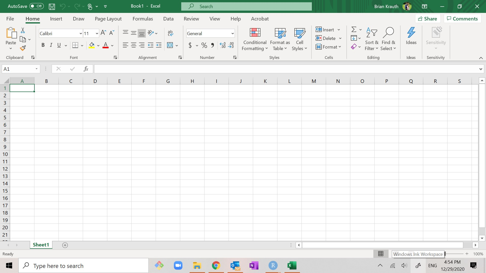

When giving instructions, it is necessary to refer to various elements of
Excel's user interface by name:
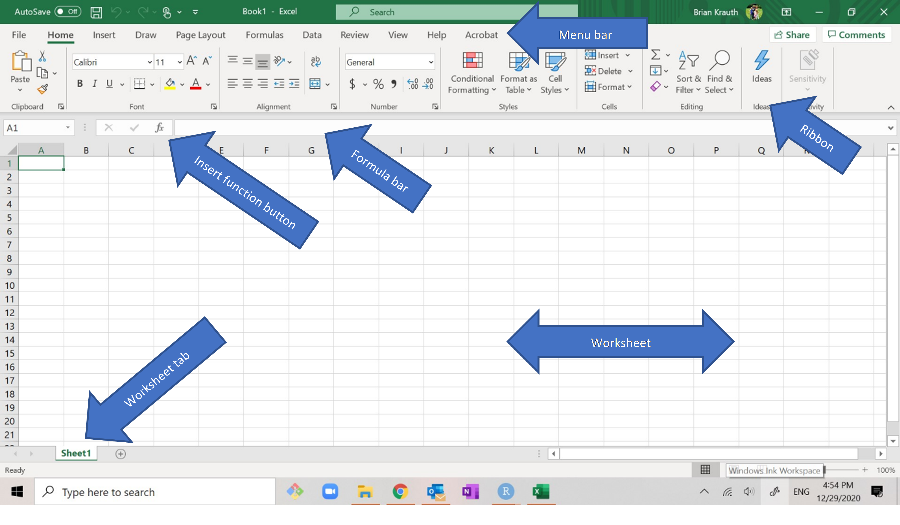

- The ***menu bar*** is at the top of the screen:  
   
- The ***ribbon*** is below the menu bar:  
   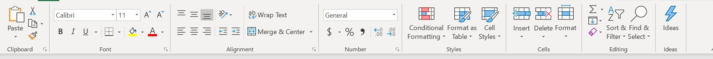
  - The ribbon has buttons for performing simple actions.
  - The buttons are grouped by function, for example the ribbon above depicts
    groups called `Clipboard`, `Font`, etc.
    - Within each function group, there is usually a little
      
      icon in the lower-right corner that you can click for additional
      options.
  - If the ribbon is not visible:
    - You can make it visible by selecting any option (like `Home`)
      on the menu bar.
    - Once you have made the ribbon visible, you can keep it visible by
      clicking on the little thumbtack
      
      icon in its lower right corner.
  - The contents of the ribbon depend on the currently-active menu bar option
    (usually but not always `Home`).
    - I will assume that `Home` is the currently-active option; if it isn't
      you can just select `Home` to make it the currently-active option.
- The ***formula bar*** is the long white box just below the ribbon:  
  
  and the ***insert function button*** is to the left of the formula bar:  
  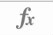{height=16pt}
- Most of the screen displays a ***spreadsheet*** or ***worksheet***,
  which is a rectangular grid of ***cells***:  
  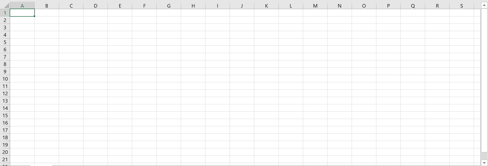
  - Columns are identified by letter.
  - Rows are identified by number.
  - Cells are identified by column and row.  For example, the cell in column A,
    row 2 is called cell A2.
- Below the worksheet is a row of ***worksheet tabs***:  
  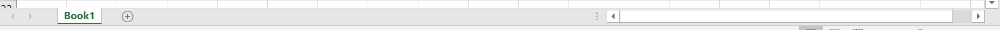
  - Each tab corresponds to a worksheet. In this example, there is a single
    worksheet named *Book1*.
  - Click on a tab to switch to that worksheet.
  - Double-click on a tab to change its name.
  - Right-click on a tab to access additional options.
  - Click on the "+" button to add a new worksheet.

Excel is used to modify and display ***workbooks***, which are collections
of one or more worksheets. Each Excel workbook is stored on your computer in a
single file. In Windows, these files normally have the `.xlsx` extension but
older files sometimes have the `.xls` extension instead.

### Application: Canadian employment data

We will demonstrate the key principles and tools in this chapter 
by cleaning the November 2020 employment data for Canadian provinces.

::: {.economics data-latex=""}
**Economics review: Canadian employment statistics**

Employment statistics are important macroeconomic indicators that are
typically covered in your Principles of Macroeconomics course.

- In Canada, these statistics are reported monthly by Statistics Canada and
  are based on the Labour Force Survey (LFS), a monthly survey of the
  **civilian, non-institutionalized, working-age population of Canada**.
  - "civilian" excludes those on active military duty.
  - "non-institutionalized" excludes people in prison, hospitals, 
    nursing homes, etc.
  - "working-age" excludes those under age 15.
  - People living on reserve are also not covered by the LFS.
- The LFS population is grouped into three categories:
  - **Employed**: worked for pay or profit in the previous week, or had
    a job and was absent (e.g. due to illness or vacation).
  - **Unemployed**: not employed in the previous week, but either looking
    for work, on temporary layoff, or had a job to start within the
    next four weeks.
  - **Not in the labour force**: everyone else.  This includes retirees,
    full-time students who aren't working for pay, and anyone else
    who is neither working nor looking for work.
- These basic counts are then used to calculate several other statistics
  - The **labour force** is the total count of those who are employed or
    unemployed.
  - The **labour force participation rate** is the proportion or percentage
    of the population that is in the labour force. The Canadian
    LFP rate is typically around 65%.
  - The **unemployment rate** is the proportion of the labour force that
    is unemployed. The Canadian unemployment rate is typically 5-10%.

Almost all countries collect and report employment statistics using
similar methodologies.  For example, U.S. employment statistics are 
constructed and reported by the U.S. Bureau of Labor Statistics based
on a survey called the *Current Population Survey*.

The unemployment rate and LFP rate are key indicators of labour market
conditions. A higher-than-usual unemployment rate means that workers
are having difficulty finding work, and a lower-than-usual LPF rate
means that some workers have stopped looking for work.
:::

The data can be found in the file
[https://bookdown.org/bkrauth/IS4E/sampledata/CanEmpNov20.xlsx](sampledata/CanEmpNov20.xlsx).

::: example
**Opening the employment data**

Open the file
[https://bookdown.org/bkrauth/IS4E/sampledata/CanEmpNov20.xlsx](sampledata/CanEmpNov20.xlsx)
in Excel.  The file should look something like this:
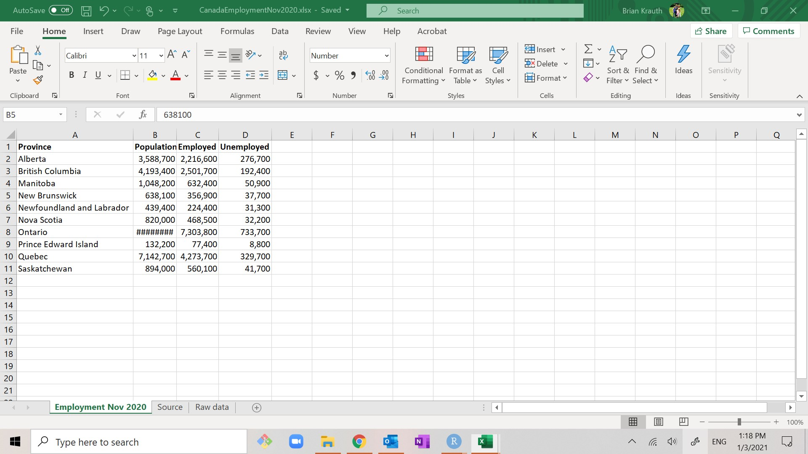

Note that three of the key employment variables (**Population**, **Employed**,
and **Unemployed**) are in the data set, but the other ones are not. We will
need to calculate them as part of our data cleaning project.
:::

## Data cleaning principles

Next, we describe some of the core principles we will follow 
in cleaning and managing our data. We will refer back to these principles as
we go through the application.

### Reproducibility {#data-management}

When analyzing data, it is important for the results of your analysis to be
***reproducible***. Reproducibility means that an interested reader should be
able to figure out exactly how you got your results, and should be able to
generate those results themselves.

The "interested reader" might be *you*, as it is common to return to an analysis
you did earlier.  Without reproducibility, you may not remember where you found
the data, what you have done with it, or what it means.  The interested reader
might also be your coworkers, your boss, or your clients.

Reproducibility requires that we treat our data with care.  In particular, we
treat the various things we do with our data as part of a repeated sequence
of steps called a ***workflow***.  Your data analysis workflow should have
three key features:

1. Document the ***provenance*** or original source for all data.
   - When downloading data files, document the original URL and date of access.
   - You can add a small text file (usually called `README.txt`) that
     explains the provenance and provides other relevant information.
   - Keep an unmodified copy of all original data files, and avoid changing
     their names.
   - More generally, avoid directly editing data. Data storage is cheap, and
     adding data is almost always preferable to changing or deleting it.
2. Keep your data and analysis ***portable***. Data is
   portable if it can be easily moved between operating systems, file formats,
   and applications.
   - Organize your work into clear projects, and keep all of the files for
     a given project in a single ***project folder***.
   - Give files and variables brief, informative, and portable names.
     - For example, stick to letters and numbers, and avoid using spaces,
       special characters, accents, etc.
     - Following a naming convention may help make your names more informative
       without making them too long.
4. Use ***version control*** to manage and track changes to your files as you
   work. Version control systems can be very elaborate and use specialized
   software, but I will teach you a simple workflow that requires no additional
   tools:
   - Create a ***working copy*** of each file you plan to edit.
     - There should be exactly one working copy of each file.
     - You can edit the working copy.
   - Each time you complete a step in your project, make your current
     working copy the ***master version*** of that file.
     - There should be exactly one master version of each file.
     - The master version represents the project at its most-advanced
       stage; i.e., the file you would send to your boss to show how your work
       is going. It should not include any half-finished work.
     - The master version should not be directly edited, but should regularly be
       replaced with the current working copy.
   - You can also have ***archived versions***.
     - There can be as many archived versions as you like.
     - An archived version is a previous master version or working copy that
       you want to keep for reference.
     - Use some file naming convention to distinguish between archived versions.
       - You could number them sequentially (e.g., "archive-01").
       - Or you could use dates (e.g., "archive-20dec2022").
     - Archived versions should not be directly edited.

The first step in implementing these principles is usually to set up a project
folder.

::: example
**Setting up a project folder**

To set up a project folder for the cleaning and analysis of the November 2020
Canadian employment data:

1. Create a project folder on your computer.
   - It will contain all of your data and analysis for this project.
   - Give it a brief, clear, and portable name (call it
      "employment-nov-2020").
2. Create two sub-folders inside your project folder.
   - One will contain the original data (call it "raw-data").
   - One will contain archived versions of the data. (call it "archive").
2. Obtain the source data.
   - Download the file
     [https://bookdown.org/bkrauth/IS4E/sampledata/CanEmpNov20.xlsx](sampledata/CanEmpNov20.xlsx)
   - Put it in the `raw-data` folder.
   - Do not change the file name.
3. Document the provenance of all data sources.
   - Create a text file called "readme.txt".
   - Put it in the `raw-data` folder.
   - Enter information in this file about the provenance of the
     `CanEmpNov20.xlsx` file.
4. Create a master version and working copy.
   - Make two copies of the `CanEmpNov20.xlsx` file.
   - Put them in the main project folder (`employment-nov-2020`).
   - One will be your original master version (call it "CanEmpNov20Clean.xlsx").
   - One will be your working copy (call it "CanEmpNov20-working.xlsx").
:::

We will return to these principles later as we complete our data cleaning
project.

::: {.fyi data-latex=""}
**Version control systems**

Software developers and professional data analysts use version control
systems like [Git](https://git-scm.com/) and [GitHub](https://github.com/).
These systems track every change ever made to a group of files, and can allow
multiple users to work together on a project. It is based on a model in which
each user has their own working copy, and can commit (or propose) changes to the
master version, along with an explanation of the changes.  

To see what Git and GitHub look like, you can see the GitHub page for this
textbook at https://github.com/bvkrauth/is4e. Git and GitHub take a little
time to set up and learn, but are extremely useful tools if you do a lot of
coding or data analysis.
:::

### Tidy data {#tidy-data}

To keep analysis easy and minimize errors, data should be organized as what data
scientists have come to call ***tidy*** data. Tidy data has the following seven
properties:

1. Data is arranged in one or more simple rectangular grids or ***tables***.
   - Excel tables should always start in cell A1.
2. Each column in a table represents a distinct ***variable*** or attribute.
3. Each row in a table (after the top row) represents a distinct
   ***observation***, ***data point*** or ***case***.
4. Each variable has an informative and unique ***variable name***.
   - Variable names are often displayed in the top row of the table.
5. Each observation has a unique value for some ***unique identifier*** or
   ***ID*** variable.
   - The ID variable is often displayed in the first column of the table.
6. All observations in a given table come from the same 
   ***unit of observation***.
   - For example, we might have a table of Canadian cities, or a table of
     Canadian provinces.
7. The order in which observations or variables are listed is irrelevant to 
   the analysis. 
   - That is, the interpretation of the table would not change if its rows 
     or columns were in a different order.

Data that is not tidy is sometimes called ***messy*** data. One of the first
steps in cleaning data is rearranging it from a messy format to a tidy format.

::: example
**Overview of the employment data**

Open your working copy of the employment data file in Excel.  As you can see,
this Excel workbook contains three worksheets:

- The worksheet *Employment Nov 2020* is our main data table:
    
   It is in tidy format:
  - There is a single rectangular table starting in cell A1.
  - Each row represents a Canadian province.
  - Canadian provinces are the unit of observation.
  - Each column represents a variable describing that province.
  - The top row shows brief but clear names for each variable.
  - The provinces are listed in alphabetical order, but the interpretation of
    the table would not change if they were listed in some other order.
- The worksheet *Raw data* is the original data table as I downloaded it from
  Statistics Canada:  
   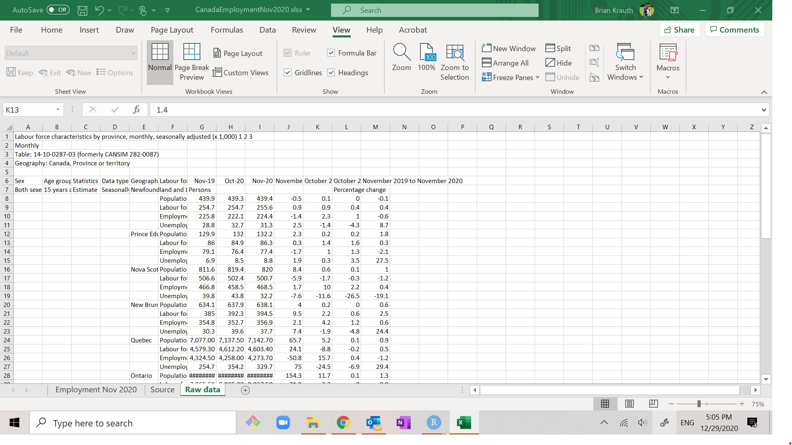
  It is messy in various ways:
  - The table starts in cell A6 rather than cell A1.
  - Variables (Population, Labour Force, etc.) are in rows rather than columns.
  - Observations (the unit of observation is the province-month) are in both
    rows and columns.
  - Cells are filled in "implicitly".  For example, there is nothing in row 17
    that says what province it describes, but we know that it describes Nova
    Scotia because it comes after row 16 (which does say it describes Nova
    Scotia).  As a result, the order of rows is very important.
- The worksheet *Source* describes the provenance of the data:  
   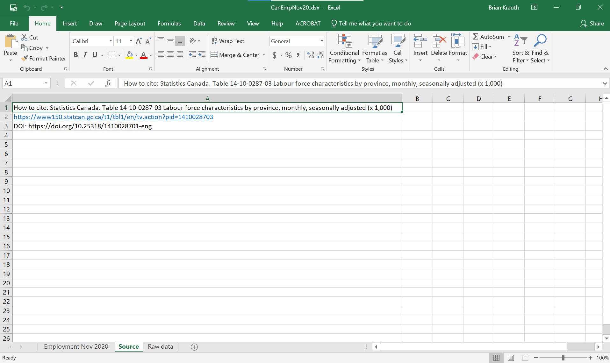
   It is not a data table, just a few lines of text.
   - There is a text description of the data, provided by Statistics Canada.
   - There are also two URLs linking to the original data source.  Copy and
     paste either of them into your browser to see what the original data
     source looks like.
   - There should also be some information on the date of access, but there
     currently isn't.

We will do all of our edits to the *Employment Nov 2020* worksheet, and will
leave both *Raw data* and *Source* alone.
:::

::: {.fyi data-latex=""}
**Link rot and the DOI**

One common barrier to reproducibility is "link rot" - the tendency of a given
URL to stop working over time as organizations make changes to their websites.
Most links only work for a few months or a few years, depending on the data
provider and how careful they are. To minimize the potential consequences of
link rot, you should always save an unmodified local copy of the original data.

Another strategy for addressing link rot is to use a
[digital object identifier](https://www.doi.org/)
or ***DOI*** if one is available. DOI is an international system that allows
participating organizations to provide persistent links to documents, files and
web pages. The *Sources* worksheet above provides both regular and DOI
addresses.

- The regular URL (https://www150.statcan.gc.ca/t1/tbl1/en/tv.action?pid=1410028703
) tells your browser where the file is located:
  - Go to the server www150.statcan.gc.ca.
  - Look in the folder t1/tbl1/en/tv.action.
  - Pass the server the parameter "pid=1410028703".
- The DOI URL (https://doi.org/10.25318/1410028701-eng) also tells the browser
  where a file is located, but the file at that location is not the actual data
  file. Instead, the file at that location is a link that (currently) redirects
  the user to the address
  https://www150.statcan.gc.ca/t1/tbl1/en/tv.action?pid=1410028703.

Statistics Canada will probably reorganize its website and move the original
document at some point in the future.  At that point, the original
URL will stop working. But the DOI will continue working because Statistics
Canada will (hopefully) update the DOI entry for that document with the new URL.
:::

### Observations and identifiers

Each tidy data set normally includes at least one unique identifier or ID
variable. By definition, an ID variable *must* take on a different value
for each observation.  With this property, we can use ID variables to
link and combine data from multiple sources.

Proper names of people, places or organizations are typically *not* used
as ID variables since they are not necessarily  unique. For example, there are
many people in Canada named "Doug Smith."  In addition, proper names are not
always written consistently.  For example, the same person might be called
"Doug Smith" in one data set and "Douglas Smith" in another.

::: example
**Is the province name a good ID variable?**

The province name in our employment data is an example of a proper name, and
we typically avoid using proper names as ID variables because they are not
necessarily unique or consistently written. Although province names *are*
unique within Canada, they are not always consistently written:

- Newfoundland and Labrador (as it is called in our employment data) is
  called "Newfoundland" in older data sets as that was the province's
  official name before December 6, 2001.
- Quebec (as it is called in our employment data) is called "Québec" in some
  data sets.

This inconsistency may cause problems when we try to link data sources, so
we should avoid using the province name as an ID variable.
:::

ID variables have several common characteristics:

1. They can be numbers or text strings.
2. They can be:
   - Assigned ***arbitrarily***, i.e. following no consistent rule.
   - Assigned ***sequentially*** according to some natural ordering.
   - Assigned by a ***standardized code*** that is listed in some published
     table.
   - ***Constructed by formula*** from other information.
3. They can be defined by an ***explicit combination***
   (a new ID variable is constructed) of other identifiers, or an
   ***implicit combination*** of those identifiers (no new variable is
   constructed).

It's OK for an ID variable to be nearly-but-not-exactly identical to some other
variable. For example a Canadian data set might have both a **Province**
variable that takes on values like "Québec" and "Nova Scotia" and a
**ProvinceID** variable that takes on values like "QUEBEC" and "NOVASCOTIA."

::: {.sfu data-latex=""}
**ID variables at SFU**

SFU is one of British Columbia's largest organizations. Like most large
organizations, it maintains large administrative records that are organized
and linked using various ID variables:

- Each person at SFU (faculty, staff or student) has a unique
  16-digit ID number that is arbitrarily/sequentially assigned.
- Each computing account at SFU has a unique (text) user name that is also
  used as an email address. Some user names are constructed according to rules,
  but those rules have not been applied consistently over the years so we can
  think of user names as arbitrarily assigned.
- Each academic program at SFU has a standardized 2-letter to 4-letter program
  code. For example, the program code for economics is ECON. The full list of
  program codes can be found at
  https://www.sfu.ca/students/calendar/2023/spring/academic-programs.html.
- Each program assigns (mostly) arbitrary numeric course codes. For example
  the economics department has assigned the numeric course code 233 to its
  introductory statistics course.
- Each semester at SFU has a 4-digit semester code constructed by a formula
  based on the year and term. For example, Fall 2021 is assigned the semester
  code 1217.  The first three digits represent the year (2021 -1900 = 121) and
  the last digit represents the term (Spring = 1, Summer = 4, Fall = 7).
- Each course at SFU is uniquely identified by the combination of its
  program code (e.g. ECON) its numeric course code (e.g. 233), its section
  number (e.g., D100), and its semester number (e.g., 1217). These can be
  explicitly combined into a unique course ID variable (e.g.,
  "ECON233-D100-1217").

Your library record, grades, financial records, and almost any other
information SFU has about you includes one or more of these IDs.
:::

Like file and variable names, ID variables are ideally portable across
applications and platforms. That is, our ID variable should still work if we
move data from a Windows PC to a Linux or Apple system, and should still work
if we move from Excel to R or Python.  Try to keep them short and simple.

::: {.fyi data-latex=""}
**Keeping ID variables portable**

To maximize portability of ID variables, keep in mind the following potential
issues and solutions for avoiding them:

| Issue |Description                           | Solution                            |
|-------|--------------------------------------|-------------------------------------|
| *Rounding* | Some applications will round non-integer values (changing 1.23 to 1) or drop leading zeros (changing 00045 to 45). | Numeric ID variables should always be integers without leading zeros, or converted to text variables.  | 
| *Special characters* | Some applications will reject or transform spaces or unusual characters. | Text ID variables should only use (Latin) letters and (Arabic) digits. |
| *Case* | Some applications are case-sensitive (so that "hello" and "Hello" are different values) and others are not. | Text ID variables should typically use either all upper-case or all lower-case. |
| *Length* | Some applications will have a maximum length for a text variable, and will cut off everything above that maximum length. | Text ID variables should not be extremely long. |

:::


::: example
**Choosing an ID variable**

Having decided that the province name is not a good ID variable for our
employment data, we need to choose another one. Although only one ID variable
is needed, I will choose two for demonstration purposes:

1. **ID**: an arbitrary/sequential number assigned to each observation.
2. **ProvAbb**: a standardized (text) code based on the two-letter postal
   abbreviation.

We will add these two variables while cleaning our data.
:::

::: {.fyi data-latex=""}
**Names, IDs, and probabilistic matching**

Occasionally a data set will not have a standardized ID variable, and our only
option is to match observations based on a proper name.  For example, each
student in BC grades K to 12 is assigned an ID number called a PEN while each
person in the healthcare system is assigned a different ID number called a PHN.
There is no direct way to match PEN and PHN, so we have to match education and
health records on a combination of proper names and other information such as
date of birth.  Matches made this way are called "probabilistic" matches,
meaning (roughly) that the records probably describe the same person but might
not.
:::

### Planning {#cleaning-plan}

Before diving into cleaning our data, it is often wise to look closely at the
data and construct a cleaning plan. Here is a simple template for such a plan:

1. Convert all data sources into tidy-format tables in the application(s) we
   intend to use.
2. Select or construct a unique ID variable for each table.
3. Find and address problems in existing variables.
4. Create new variables that may be useful.

The cleaning plan should be based around what we intend to do with the data, but
should preserve flexibility in case we want to use the data for other purposes.

::: example
**A plan for cleaning the employment data**

Following the template above, we can construct a simple data cleaning plan for
the employment data:

1. *Convert all data into tidy-format tables*

   Our employment data table is already in tidy format, so no action is
   required.

2. *Select or construct a unique ID variable for each table*

   As discussed earlier, the province name is not an ideal ID variable so we
   will construct two alternative ID variables: an arbitrary/sequential number
   and the two-letter postal abbreviation.

3. *Find and address problems in existing variables*

   The only problem I see in the current data is in cell B8, which is supposed
   to display the population of Ontario but instead shows "########". We will
   need to investigate and fix this.

   Remember the general principle to avoid editing data.  So if we do find
   problems, we would ideally fix them by creating new-and-improved versions of
   these variables rather than directly editing the existing variables.

4. *Create new variables that may be useful*

   We will want to construct new variables for:

   - the specific month these observations are describing (November 2020)
   - the two unique ID variables described in step 2
   - the labour force
   - the labour force participation rate
   - the unemployment rate

We will also add a few more variables, mostly to demonstrate various features
of Excel. It's OK to move beyond the initial cleaning plan as we learn more
about our data.
:::

## Cleaning data in Excel {#cleaning-data}

We are now ready to start using Excel to actively clean our data. We will also
introduce a set of important Excel tools and concepts that are useful in
cleaning data. 

::: example
**Getting started**

Open your working copy of the employment data and go to the 
*Employment Nov 2020* worksheet.

Each example in the rest of this chapter describes a task needed to clean
this data set. Remember to save this file after completing each example
task to ensure you don't lose your work due to a mistake.
:::

### Cell formatting {#cell-formatting}

Excel distinguishes between the *contents* of a cell and how those contents
are *displayed*. You can usually see the contents of a cell by selecting it
and looking at the formula bar.

We can change the appearance of our data without changing
its content by adjusting the ***cell formatting*** for one or more
cells.  Cell formatting characteristics include:

- Text font, size, style (bold/italics/underline) and color
- Text alignment (left/right/center as well as top/bottom/middle)
- Column width
- Row height
- Background color
- Cell borders
- Number format (will be discussed in a later section)

The procedure for modifying a cell's format is straightforward if you
regularly use Microsoft Word or similar applications.  You select
the cell(s) you are interested in modifying, then you go through the
menus to choose the modifications.

::: example
**Changing cell size**

As mentioned earlier, cell B8 (Ontario population) appears to contain "######"
rather than a number. If you select this cell and look in the formula bar
you will see it actually does contain the number 12378900.  The reason
that the cell displays "######" is that the cell is not wide enough to show
the correct number.

We can solve this problem by making column B wider.  There are three ways of 
doing this:

- *From the menu*: Select any cell in column B, and then select
  `Home > Format > Cell Width...`.  A dialog box will appear that allows you
  to enter your preferred width. Try a few numbers there until you get a column
  width that you like.
- *With the mouse*: Move your cursor to the line between column headers B
  and C until the cursor looks like this:
  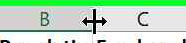{height=16pt}.
  Click on the mouse and drag the cursor to resize the column until you get a
  column width that you like.
- *Auto-fit* (this is what I usually do):  Move your cursor to the line between
  column headers B and C, and double-click.  The column width will automatically
  adjust to fit the data.

You can follow similar procedures to adjust the row height.
:::

### Inserting and deleting cells

Most of the time, we will add data to the end of the existing table, adding
new variables after the last column or new observations after the last row. But
occasionally we will want to insert a column or row into our table.

::: example
**Inserting a column**

We will want our first column to include a not-yet-constructed ID
variable, so we need to insert a column to the left.

1. Select any cell in column A.
2. Select `Home > Insert > Insert Sheet Columns` from the menu.

This will shift all columns to the right, and insert a new blank
column A.  We will enter data in this column later.
:::

We can also insert rows, delete rows or columns, and even insert or
delete individual cells.

### Data entry {#entering-new-data}

The simplest way to add a variable to an Excel table is by typing data
directly into the cells.  

::: example
**Entering data**

As we discussed earlier, we would like to add the two-letter postal abbreviation for each province:

| Province or Territory| ProvAbb |
|:---------------------|:-------:|
| Alberta                   | AB |
| British Columbia          | BC |
| Manitoba                  | MB |
| New Brunswick             | NB |
| Newfoundland and Labrador | NL | 
| Northwest Territories     | NT |
| Nova Scotia               | NS |
| Nunavut                   | NU |
| Ontario                   | ON |
| Prince Edward Island      | PE | 
| Quebec                    | QC |
| Saskatchewan              | SK |
| Yukon                     | YT |

The postal abbreviation is useful for at least three reasons

1. It is *standardized*, while the full province name may not be.
   - The postal abbreviations were originally created by Canada Post.
   - They are also internationally recognized through the
     [ISO 3166-2](https://www.iso.org/standard/72483.html) standard
     on "Codes for the representation of names of countries and
     their subdivisions."
2. It is *short*, which can be useful in charts.
3. It is *informative*. Postal abbreviations are widely used, and are familiar
   to many Canadians.

To add this variable:

1. Enter **ProvAbb** in cell F1 to name the variable.
2. Fill in cells F2:F11 with the correct postal abbreviation.
3. Save your working copy.
:::

::: {.fyi data-latex=""}
**Choosing variable names**

It takes a little bit of thought to choose brief and informative variable names
that work well, but you will be glad you did it.

1. Variable names need to be *unique*.
   - **Province** would have been a nice short and clear variable name,
     but it was already taken.
2. Variable names should be *informative*.
   -  **X** or **MyVariable** would have been bad variable names.
   - So would **Province2**.
3. Variable names should be *short*. 
   - In some older programs, variable names can be no longer than 8 characters
     long. Most modern programs allow much longer variable names, but long
     variable names are harder to remember, harder to type without errors,
     and less likely to display cleanly.
   - 8 characters is a good target, but it's OK to go a little over that.
   - Abbreviation is a good way to shorten names, so we use
     **ProvAbb** instead of **ProvinceAbbreviation**.
4. Variable names should *avoid spaces and special characters*:
   - Special characters are anything other than the Latin letters (a through z),
     Arabic digits (0 through 9), and the underscore `_`.
   - When constructing variable names from multiple words, there are several
     standard methods of distinguishing between the words:
     - Pascal case: **ProvAbb**
     - Camel case:  **provAbb**
     - Snake case: **prov_abb**
5. Variable names should be treated as *potentially case independent*.
   - Some programs like R treat variable names as ***case dependent***, and
     will consider **ProvAbb**, **provabb**, **provAbb** and **PROVABB** four
     different variables.
   - Other programs like SAS treat variable names as **case independent**,
     so these four names all refer to the same variable.
   - So once we create a variable called **ProvAbb** we should never
     create another variable called **provabb**, **provAbb**, or
     **PROVABB**, just in case we want to use this data set in SAS.
6. Variable naming conventions should be *consistent* within each data set.
   - We could have used camelCase or snake_case for our new variable, but
     the existing variables use PascalCase so we should use PascalCase
     for all new variables too.

Excel allows nearly anything in a variable name since it does not normally
use the variable names in its calculations.  But good naming practices are
still important since you may need to move data between programs.
:::

### Fill and series {#fill-and-series}

Excel also has several tools available to speed the process of entering
data.  First, you can ***copy-and-paste*** or ***cut-and-paste*** the contents
of any cell into any other cell.  I'll assume you know how to do this, though
there are a few special tricks we will cover later on.

Excel's ***fill*** tool allows you to quickly copy the contents
of a cell into a set of cells immediately, above, below or
to the left or right.

::: example
**Using fill**

Our data cleaning plan includes adding a variable indicating which month 
and year these particular observations describe (November 2020).

1. Enter **MonthYr** in cell G1 to name the variable.
2. Enter "11/2020" in cell G2.
   - You may notice that Excel displays the date differently from how you
     entered it - on my computer it displays as `Nov-20` but yours may look
     different. We will talk more later about how Excel handles dates.

Now we could enter the exact same date in cells G3:G11, but we can save
ourselves some time by using Excel's fill tool:

3. Select cells G2:G11.
4. Select `Home > Fill > Down`.
5. Save your working copy.
 
As you can see, Excel fills in all selected cells with the value in the 
top cell.
:::

Excel's ***series*** tool allows you to fill in a group of cells with an
ascending or descending sequence of numbers or dates.

::: example
**Using series**

Let's create a unique sequential ID variable in column A. We can enter 
these ID numbers by hand, but there is an easier way using
Excel's series tool:

1. Enter **ID** in cell A1 to name the variable.
2. Enter 1 in cell A2.
3. Select cells A2:A11.
4. Select `Fill > Series...`.  The Series dialog box will appear.
5. There are several options for constructing a series. Fortunately, the
   default is exactly what we want, so select `OK`.
6. Save your working copy.

As you can see, column A now contains a unique identifier that numbers provinces
from 1 to 10.
:::

::: {.fyi data-latex=""}
**Some useful Excel shortcuts**

Switching between your keyboard and mouse/touchpad/touchscreen can be annoying
and time-consuming.  You can speed up your work by learning a few handy
keyboard shortcuts.

The first set of shortcuts is that you can navigate around your spreadsheet by
using the arrow, `Home`, `End`, `PgUp` and `PgDn` keys. Try using them in
combination with the `Ctrl` key (which typically takes you to the end of the
spreadsheet) or the `Shift` key (which typically selects a group of cells).

In addition, most commonly used menu items have associated keyboard shortcuts.
These are the ones I find most useful:

| Action        | Shortcut         |
|:--------------|:----------------:|
| Cut           | `Ctrl-x`         |
| Copy          | `Ctrl-c`         |
| Paste         | `Ctrl-v`         |
| Fill Down     | `Ctrl-d`         |
| Fill Right    | `Ctrl-r`         |
| Undo          | `Ctrl-z`         |
| Cancel edit   | `Esc`            |
| Clear cell    | `Del`            |
| Save file     | `Ctrl-s`         |
| Bold          | `Ctrl-b`         |
| Italics       | `Ctrl-i`         |
| Underline     | `Ctrl-u`         |

Additional shortcuts and macOS information are available at
https://support.microsoft.com/en-us/office/keyboard-shortcuts-in-excel-1798d9d5-842a-42b8-9c99-9b7213f0040f.
:::

### Formulas {#formulas}

Most of our new variables will be calculated from existing variables
using ***formulas***. A formula is just a rule for calculating a value
from some other values.

Formulas always start with the equal sign `=` followed by a mathematical
expression that can include any combination of:

- Specific values, for example `=2` or `=TRUE`
- References to other cells, for example `=D2`
- Standard arithmetic operators, for example `=2+2` or `=D2/4`
- Functions, for example `=SQRT(D2)` or `=SUM(D2:D10)`

Formulas can be simple, or they can be quite complex.

::: example
**A simple formula**

Returning to our application, everyone who is either employed or unemployed
is in what economists call the "labour force." So let's add that variable.

1. Enter **LabourForce** in cell H1 to name the variable.
2. Enter `= D2 + E2` in cell H2.
3. Save your working copy.

Cell H2 now displays `2,493,300` which is in fact the value in cell D2 
plus the value in cell E2. 
:::

As discussed earlier, it is important to distinguish between the *contents* of a
cell and how those contents are *displayed*. For example, the true contents of
cell H2 in our example above are the formula `= D2 + E2` but the cell shows the
number  `2,493,300`. If you change the number in cell D2 or cell E2, the number
shown in cell H2 will adjust accordingly.

Formulas can use the results from other formulas, as shown in the example below.

::: example
**Formulas that use other formulas**

Let's add a column for the labour force participation rate. To remind you, this
is the proportion or percentage of the population (column C) that is in the
labour force (column H).

1. Enter **LFPRate** in cell I1 to name the variable.
2. Enter `=H2/C2` in cell I2 to calculate the variable.

Let's also add a column for the unemployment rate.  To remind you, this is the
proportion or percentage of the labour force (column H) that is unemployed
(column E).

3. Enter **UnempRate** in cell J1 to name the variable.
4. Enter `=E2/H2` in cell J2 to calculate the variable.
5. Save your working copy.

Notice that both of these formulas use cell H2, which itself contains a formula.
It is often useful to break up a complex formula into steps like this, as it is
easier to check your work and spot problems.
:::

### Functions {#built-in-functions}

Excel has about 500 built-in ***functions*** that we can use in formulas. Each
function has a ***function name*** and a set of ***arguments*** whose values you
can set.

To use a function, you simply include its name and its arguments as
part of the formula.  For example, the `SQRT()` function takes a single
numeric argument and returns the square root of that argument. So if
you enter `=SQRT(2)` in a cell, the cell will display `1.414`, the
square root of 2.

The first step in using a function is finding out the name and arguments
of the function that does what you need. 

::: example
**Finding a function**

Suppose we want to find the natural logarithm of a particular number. Excel
probably has a built-in function for that, but we may not know its name or
structure.

- *Google or other search engine*

  Go to your favorite search engine and enter "Excel natural log". When I do
  this, the top recommendation is for Microsoft's 
  [online documentation](https://support.microsoft.com/en-us/office/ln-function-81fe1ed7-dac9-4acd-ba1d-07a142c6118f) 
  for the `LN()` function. The documentation provides a description,
  list of arguments, and a few examples.

- *Built-in Excel tools*

  Excel's built-in tools for finding and using functions can be helpful in
  using more complex functions.

   1. Click on the insert function button
      {height=16pt} 
      to the left of the formula bar.
   2. The `Insert Function` dialog box will appear:  
      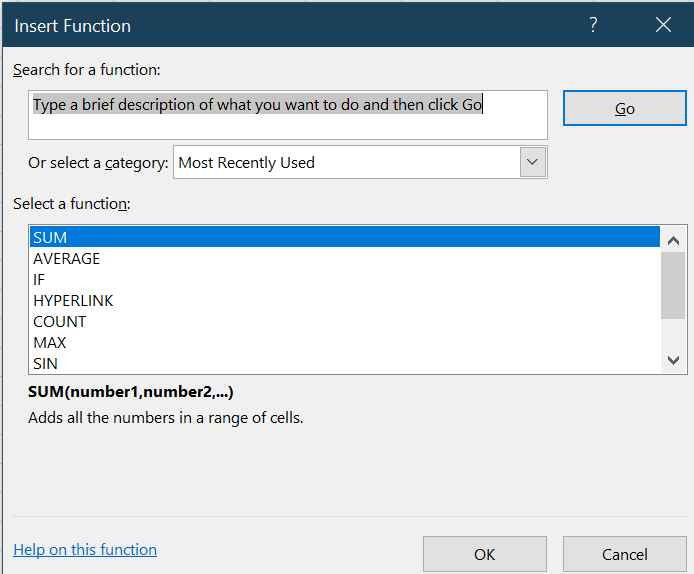
      It will show a long list of functions. You will want to narrow this list
      down, and you have several options for doing so:
      - Search: Enter `logarithm` in the `Search for a function` text box.
      - Browse: Select `Math & Trig` from the `Or select a category`
        drop-down box.
   3. Once you have narrowed the list down, it is easy to find the
      function you want (`LN`). Select `LN` from the `Select a function`
      list box, and then select `OK`.You will now see the `Function Arguments`
      dialog box for the `LN` function:  
      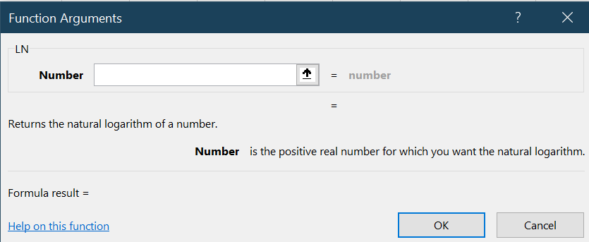
   4. As the dialog box shows, the `LN` function takes one argument
      (the number you want the log of).
:::

You can use the contents of other cells as arguments, or you can also
use the result of another function.

::: example
**A simple function**

Suppose we want to add a new variable for the (natural) log of population:

1. Enter **LogPop** in cell K1 to give the variable a name.
2. Select cell K2.
3. We have two options for calculating the natural log of cell C2 in this
   cell:

   *Direct entry:* Read the documentation, figure out that the correct formula
   is `=LN(C2)`and enter that formula in cell K2.

   *Built-in Excel tools* This is probably unnecessary for a function as simple
   as `LN()`, but can be very helpful with more complex functions.

   a. Follow the steps in the previous example to reach the `Function Arguments`
      dialog box for the `LN` function:  
      
   b. Click in the entry box labeled `Number`.
   c. Either enter the text `C2` here or click on cell C2. The dialog box
      will display the value in cell C2 (`3588700`) as well as the calculated
      value for the log of cell C2 (`15.0933058`).
   d. Select `OK`.

4. Save your working copy.

You will see that cell K2 now contains `=LN(C2)` which displays as `15.0933`. 
:::

::: {.fyi data-latex=""}
**Advanced functions**

In addition to its many built-in functions, Excel can be extended to include
additional functions as needed for more advanced users.

1. You can create your own custom functions using the JavaScript or Visual
   Basic for Applications (VBA) programming languages. You can also use
   these languages to modify the user interface, automate repetitive tasks,
   and perform various other advanced tasks.
2. You can install and use various add-in packages from Microsoft or other
   sources.  For example, Excel usually comes with an add-in called the
   *Analysis ToolPak* that provides additional functions and tools for use
   in statistical analysis.

These are relatively advanced Excel features, but are commonly used in a
business environment. They also have some security risks, and Microsoft has
substantially modified their functionality over the past few years to
address these risks. So we will not create custom functions or use add-in
packages in this course.
:::


### Cell ranges {#cell-ranges}

Some functions like `SUM()` and `AVERAGE()` operate on a ***range*** of cells
rather than a single cell. A range is just a rectangular grid of cells,
and is described by its upper-left and lower-right cells, separated 
by a colon (":"). For example:

- Range A2:A5 consists of cells A2, A3, A4 and A5.
- Range A2:C2 consists of cells A2, B2, and C2.
- Range A2:B3 consists of cells A2, B2, A3, and C3.

A single cell can also be thought of as a range of cells with one row and one
column.

::: example
**A formula using a cell range**

Suppose we want to create a new variable that reports the total population
across all observations in the data. The function to do that is `SUM()`. 

1. Enter **TotPop** in cell L1 to give the variable a name,
2. Enter `=SUM(C2:C11)` in cell L2.  
3. Save your working copy.

Cell L2 should display `31,275,600` which is indeed the sum of cells C2 to C11.
:::

### Copying formulas {#copying-pasting-and-relative-references}

In Excel, you can copy-and-paste the contents of a cell to any other cell. This
is particularly handy when a cell contains a formula, as it would be
inconvenient to type the same formula into each cell.

::: example
**Copying a formula**

To use copy-and-paste to copy the formula in cell H2 to the other cells in
column H:

1. Select cell H2 and copy it.
2. Select cells H3:H11 and paste.
3. Save your working copy.
:::

You can also use fill for this purpose, and it is usually quicker.

::: example
**Filling a formula**

To use fill to copy the formulas in cells I2:L2 to the other cells in columns I
through L:

3. Select cells I2:L11.
4. Select `Home > Fill > Down`.
5. Save your working copy.
:::

### Relative and absolute references 

Excel is smart and normally treats cell addresses in formulas as
***relative references*** when copying and pasting cells.  That is, when a
formula is copied to another cell $r$ columns to the right and $d$ rows down,
the column letters in the formula are increased by $r$ units, and the row
numbers are increased by $d$ units.

For example, suppose cell B5 contains the formula `=A1`.  If we copy the
contents of this cell to other cells, we get:

|  Cell  | Formula |
|:-------|:-------:|
|   B5   | =A1     |
|   B6   | =A2     |
|   B7   | =A3     |
|   C5   | =B1     |
|   D5   | =C1     |
|   C6   | =B2     |
|   D7   | =C3     |

This is usually exactly what we want Excel to do. 

::: example
**Relative references are usually what we want**

Select cell H3 and take a look at the formula bar to see its contents. Notice
that:

- the original cell H2 contains `=D2+E2`.
- cell H3 contains`=D3+E3`.

This is exactly what we would want; each cell in column H calculates the
province's labour force by adding the unemployed count (column D) and employed
count (column E) from the same province (same row).  So cell H2 should contain
`=D2+E2` and cell H3 should contain `=D3+E3`.

Similarly, the formulas in columns I (**LFPRate**), J (**UnempRate**), and 
K (**LogPop**) have all copied exactly as we would would want them to be.
:::

Sometimes we will want Excel to treat cell references as
***absolute references*** instead.  That is, we want to copy the cell reference
exactly as written. 

::: example
**Relative references are not always what we want**

Take a look at the **TotPop** variable in column L.  This variable is supposed
to represent the total Canadian population, but each cell in this column shows a
different number.

Because Excel treats cell references as relative, copying the cell L2 to the
rest of column L produces:

- Cell L2 contains `=SUM(C2:C11)`.
- Cell L3 contains `=SUM(C3:C12)`.
- Cell L4 contains `=SUM(C4:C13)`.
- etc.

In this case, that is not what we want.  We want  *all* of the cells to contain
the total population of all provinces, which means all of them should contain
the formula `=SUM(C2:C11)`.
:::

We can tell Excel to treat a given cell reference as absolute by adding the 
`$` character in front of the reference. For example, suppose that we copy the
formula in cell C2 to cell D3. Then:

|  If cell C2 contains  | Then cell D3 contains |
|:----------------------|:---------------------:|
|   `=A1`               | `=B2`                 |
|   `=$A1`              | `=$A2`                |
|   `=A$1`              | `=B$1`                |
|   `=$A$1`             | `=$A$1`               |
 
Note that the presence or absence of the `$` does not affect the calculation in
the cell, it only affects how the formula is copied over to other cells.

::: example
**Using absolute references in a formula**

To fix the **TotPop** variable, we can change the relative references to
absolute references:

1. Go back to cell L2.
2. Change `=SUM(C2:C11)` to `=SUM(C$2:C$11)`.
   - Notice that the value in *this* cell does not change.
3. Copy/paste or fill cell L2 into cells L3:L11.
   - Notice that all cells in this column now contain the same formula
      (`=SUM(C$2:C$11)`) and display the same value (`31,275,600`).
4. Save your working copy.

This is what we want.
:::

Sometimes we will want to combine absolute and relative references in the same
formula.  This typically will happen when we want to compare the current
observation to the other observations.

:::example
**Combining relative and absolute references**

Suppose we want to create a new variable that is the province's population
*rank*. That is, the province with the highest population has a rank of 1, 
second highest has a rank of 2, etc. The function to do that is `RANK.EQ()`,
which takes two arguments: the value to rank, and the range of values to use for
the ranking.  We want the first argument (the province's population) to vary
across observations, but we want the range of values (the populations of all of
the provinces) to stay the same.

1. Enter **PopRank** in cell M1 to give the variable a name.
2. Enter the formula `=RANK.EQ(C2,C$2:C$11)` in cell M2. Note that the first argument
   uses a relative reference, and the second uses absolute references.
3. Copy/paste or fill cell M2 into cells M3:M11.
4. Save your working copy.

As you can see, Excel displays the correct ranks. If you aren't sure how this
works, look at the contents of each cell of column M to see how the formula
copied from cell M2.
:::

::: {.fyi data-latex=""}
**Advanced options for ranking in Excel**

The `RANK.EQ()` function has several relatives with similar syntax:

- The `RANK()` and `RANK.AVG()` functions also return the rank, but use slightly
  different rules for handling ties.
- The `PERCENTRANK()`, `PERCENTRANK.EXC()` and `PERCENTRANK.INC()` functions
  return ranks in percentiles.
:::

## Excel data types {#excel-data-types}

Most of the data we work with is numeric. However, we also regularly encounter
text, logical (true/false) values, dates, and times. Each of these 
***data types*** need to be handled slightly differently in terms of
how they are entered, stored, displayed, and used in calculations.

### Numeric data {#numeric-data}

Most modern computer applications, including Excel, do numeric calculations in
double-precision (64-bit) binary floating point format.  Calculations in this
format are typically accurate up to the 15th decimal place. 

However, Excel displays the results of these calculations according to the
cell's ***numeric display format***, which typically rounds to much fewer
decimal places. Remember that We can always change the display format of a
cell or group of cells without changing the cell contents.

::: example
**Displaying a cell in percentage format**

**UnempRate** and **LFPRate** are both calculated in proportional units (a
number between 0 and 1). But we might prefer to display them in percentage units
(a number between 0 and 100).

We *could* do this by changing the formulas (for example, change the `LPFRate`
formula to `=100*H2/C2`).  An easier approach is to change the cells' numeric
display format:

1. Select cells I2:J11.
2. Select `Home > Number Format` (it is a little drop down box that 
   currently displays `General`), and then select `Percentage`.
3. Save your working copy.

You will see that the cell now displays the rates in percentage, to two decimal
places.  I think it would be more readable if we round to just one decimal
place.  To do that, select `Home > Decrease Decimal`.
:::

An important thing to understand here: all we have done is change how the
numbers are *displayed*.  If we do any calculations with these cells, the
calculation will use the original proportional value without rounding.

### Text data {#text-data}

***Text data*** is also called ***character data*** or ***string data***,
and consist of a sequence (string) of letters, numbers, spaces, and symbols
(collectively called "characters"). In Excel, text values can be entered
directly in a cell, can be used in a formula, and can be the result of a
formula.

Excel has many functions for working with text data.  A particularly useful one
is the `CONCAT()` function, which allows you to join or ***concatenate***
two or more strings. This is useful in building reports, in constructing ID
variables, and in many other applications.

::: example
**Concatenating strings**

To use the `CONCAT()` function to create a sentence that describes our data as
if it we were writing a written report:

1. Enter **Description** in cell N1 to name the variable.
2. Enter `=CONCAT(C2," people live in ",B2)` in cell N2. 
   - The cell should display `3588700 people live in Alberta`.
3. Copy/paste/fill in cells N3:N11.
4. Save your working copy.

As you can see, `CONCAT()` is useful for converting data into human-readable 
statements. It is also useful for constructing ID variables.
:::

As you can see from the example above, numeric and logical values in formulas
are automatically converted into text values as needed.

::: {.fyi data-latex=""}
**Advanced options for working with text data**

There are many useful functions to manipulate text strings in Excel:

- `LEN()` calculates the length (number of characters) of a string. 
   For example: 
   - `=LEN("Hello world!")` returns the value of 12. 
- `MID()` allows you to extract part of a string.  For example 
   - `=MID("Hello world!",2,3)` returns a value of "ell".  
- `UPPER()`, `LOWER()` and `PROPER()` allow you to change the case of a string.
   For example:
   - `=UPPER("Hello world!")` returns "HELLO WORLD!".
   - `=LOWER("Hello world!")` returns "hello world!".
   - `=PROPER("Hello world!")` returns "Hello World!".
- `FIND()` allows you to find a particular substring within a larger string.
   For example:
   - `=FIND("world!","Hello world!")` returns 7.
- `REPLACE()` allows you to replace part of a string. For example:
   - `=REPLACE("Hello world!",7,5,"mom")` returns "Hello mom!".
:::

### Logical data {#logical-data}

In addition to text and numbers, cells can also contain ***logical*** values 
(`TRUE` or `FALSE`). Logical values can be entered directly in a cell, can be
used in a formula, and can be the result of a formula.

Mathematical expressions using the ***comparison operators*** 
`=` (equal), `<>` (not equal),
`>` (greater than), `<` (less than), 
`>=` (greater than or equal),  and `<=` (less then or equal) 
can be used to create logical values.

::: example
**Creating a logical variable**

To create a logical variable that indicates whether a province has a labour
force participation rate below 64%.

1. Enter **LowLFP** in cell O1 to name the variable.
2. Enter `=(I2 < 0.64)` in cell O2.
   - Notice that `(I2 < 0.64)` is a *statement* that is either true or false,
     not a numeric expression.
   - Logical statements can use other comparison operators, including `=`, `<`,
     `>`, and `<=`.
3. Copy/paste or fill cell O2 into cells O3:O11.
4. Save your working copy.

As you can see, the cells display `TRUE` in the three provinces with LFP rates
below 64%, and `FALSE` in the other seven.
:::

Logical values are particularly powerful in combination with the `IF()`
function.  This function takes three arguments:

- a statement
- a value to return if the statement is true
- a value to return if the statement is false

::: example
**Using IF() to create an indicator variable**

An ***indicator*** variable is the numerical version of a logical variable: it
takes on the value 1 if a particular statement is true, and 0 if the statement
is false.  

To create an indicator variable for low labour force participation:

1. Enter **LowLFPInd** in cell P1 to name the variable.
2. Enter `=IF(I2 < 0.64,1,0)` in cell P2.
3. Copy/paste or fill cell P2 into cells P3:P11.
4. Save your working copy.

As you can see, the cells display `1` in the three provinces with LFP rates
below 64%, and `0` in the other seven. When cleaning data we will typically use
indicator variables rather than logical variables.
:::

Logical values in formulas automatically convert to numeric values as needed,
with `True` converting to one and `False` converting to zero.  For example,
the formula `=3+True` is equal to 4 and the formula `=3+False` is equal
to 3.

::: {.fyi data-latex=""}
**Advanced options for logical variables**

Some additional functions that work with logical variables:

- `NOT()` returns `TRUE` if its argument is `FALSE` and `FALSE` if its argument
  is `TRUE`.
- `AND()` returns `TRUE` if *all* of its arguments are `TRUE`.
- `OR()` returns `TRUE` if *any* of its arguments are `TRUE`.
- `SWITCH()` and `IFS()` are extensions of `IF()` that take multiple conditions.
:::

### Dates and times {#dates-and-times}

Excel can also handle ***dates*** and ***times***.  Dates and times are a
surprisingly complex subject that can create all sorts of problems on a
computer, for several reasons:

- There are many conventional ways of writing the same date:
   - November 1, 2020
   - 2020 November 1
   - 14 Heshvan 5781 (Hebrew calendar)
   - 11/1/2020
   - 11/1/20
   - 11-1-2020
   - 2020/11/1
   - etc.
- Conventions vary across cultures and organizations:
  - in some places 11/1 means November 1 and in others it means January 11.
- We want to be able to sort and rank in time order rather than alphabetical
  order:
  - January 10, 2020 should come before December 10, 2020.
- We want to be able to add and subtract dates and times:
  - January 4, 2021 comes 5 days after December 30, 2020.
  - 11:30 pm on December 31, 2020 is 45 minutes before 12:15 am on January 1,
    2021
- We want to handle time zones, daylight savings time, leap years, and
  even leap seconds.

Finally, we want to deal with these complexities in a way that is perfectly
accurate when needed, but is simple in normal usage. As you might imagine,
this is not easy. Each application has its own rules for
handling dates and times, but there are some standards that have developed.
Excel handles dates and times as follows:

1. Dates are *stored* as the number of days elapsed since some base date or
  "epoch." In Excel, the base date is January 0, 1900, which means that:
   - January 1, 1900 is day 1.
   - January 2, 1900 is day 2.
   - November 1, 2020 is day 44136.
2. Dates are *displayed* according to the cell's display formatting:
   - The default display formatting varies across regions.
   - So the same date in the same Excel file might display differently
     on two different computers.
3. When you enter text into a cell that looks like a date, Excel does
   several things behind the scenes:
   - Excel guesses the date format you are using.
   - Following that guess, Excel converts your text into its internal
     storage form (days since base date).
   - Excel changes the display format to what Excel thinks it should be.
     This format is based on your location settings, and may differ from
     what you have typed in.

Most of the time, this system works seamlessly and you don't even notice it.

::: example
**How dates are stored and displayed**

The **MonthYr** variable in column G is a date.  Remember that we created it
by typing in "11/2020". Let's see what Excel did with that:

1. Select cell G2, and compare the formula bar to what is displayed in the cell.
   On my computer:
   - The cell displays `Nov-20`
   - The formula bar displays `11/1/2020`.
2. To see how Excel sees this date, change the cell's number format to
   `General` or `Number`:
   - Now the cell displays the number `44136`, which is the date-time value that
     Excel uses to represent November 1, 2020.

Now while a date of 44136 is quite clear to Excel, we want to display dates in
a more human-readable way.  I don't like the `Nov-20` display format, since it
isn't obvious whether that means November 2020 or November 20. So let's change
the formatting:

3. Select cells G2:G11.
4. Select `Number Format > Short Date`.
5. Save your working copy.

You can see even more options if you select `More number formats`.
:::

We can also do calculations with dates, and there are various functions using
dates. 

::: example
**Some date calculations**

To calculate how long ago November 2020 was:

1. Enter **Today** in cell Q1 to name the variable.
2. Enter `=TODAY()` in cell Q2 to put in today's date.
   - This will display today's date.
   - Tomorrow, the cell will display tomorrow's date.
3. Enter **HowLongAgo** in cell R1.
4. Enter `=Q2-G2` in cell R2.
   - This will display the number of days that have passed between November 1,
     2020 and today.
5. Save your working copy.
:::

Unfortunately, Excel sometimes guesses wrong, and this can create all sorts of
problems. Understanding how Excel handles dates and times can help you avoid
or address these problems.

::: {.fyi data-latex=""}
**Excel dates and genetics**

Excel's handling of dates caused a significant unanticipated problem in the the
field of human genetics, where it is a widely used tool.

Each gene has a standard abbreviation like "TCEA1" or "CTCF" assigned by a
scientific body called the HUGO Gene Nomenclature Committee (HGNC).
Unfortunately, 27 of these genes have abbreviations that Excel misinterprets as
dates, for example "Membrane Associated Ring-CH-Type Finger 2," also known as
"MARCH2". If you enter the text "MARCH2" in an Excel cell, Excel will
automatically convert it to the date of March 2 in the current year. A 2016
research paper found that roughly 20% of published research articles in the
field used data that was affected by this problem.

Unfortunately, it is too late to "fix" Excel to keep this from happening. Any
change to its behavior would "break" Excel in thousands of other applications
that rely on its current behavior. 

When you can't fix a problem in a computer application, you need to find a
***workaround***: a modification to how you use the application that avoids or
minimizes the effects of the problem. So the HGNC changed the names of these 27
genes in  2020. For example, the gene MARCH2 is now called MARCHF2.
:::

In addition to dates, Excel can also handle date-time values such as 
`11/1/2020  12:00:00 PM`.  

::: {.fyi data-latex=""}
**How Excel handles times**

Excel treats times as partial days. For example, Excel will store 
`11/1/2020  12:00:00 PM` as day number `44136.5`and 
`11/1/2020  1:00:00 PM` as day number `44136.5416666667`. 

There are also functions that work with date-time values.  For example, we have
already seen the function `TODAY(.)` which returns the current date but there is
also a function `NOW(.)` that returns the current date and time.
:::

## Saving and exporting data {#saving-and-exporting-data}

Deep down, every file on your computer is just a long sequence of binary
numbers: zeros and ones.  In order to obtain any useful information from a file,
we need to know its ***file format***. A file format is just a list of rules
for interpreting the sequence of zeros and ones, much like a language is a set
of rules for interpreting the sounds that come out of people's mouths. You can
often infer a file's format from its extension (the part of the file name after
the ".").

Applications usually save data in the application's ***native format***: a file
format specifically designed for use with that application. Excel workbooks
are normally saved in Excel's native format, which is typically indicated by
the `.xlsx` extension.

Many applications can also ***import*** (open) or ***export*** (save)
information in other file formats, These other formats can be the native format
of some other application or they can be a standardized format that is designed
to be used by many applications.

File formats are like languages, and importing and exporting data in something
other than the application's native format is like translating to or from
a foreign language. If you have ever used Google Translate or similar tools,
you know that translations are never perfect.  Similarly, importing and
exporting data can result in the loss or unintentional modification of
information in the original data source.

### Text files and text editors

The most important file format is the ***text file***. A text file contains a
sequence of characters (letters, numbers, etc.). 

Text files can be read and modified using a simple program called a
***text editor***. Every computer has at least one simple built-in text editor:

  - Windows has a built in text editor called *Notepad*.
  - MacOS has a built in text editor called *TextEdit*.

In addition, there are numerous other text editors that are more powerful and
include useful features like color-coding, spell checking, and autocorrect:

  - I use *Notepad++* which is powerful, easy to use, and available at no charge
    from https://notepad-plus-plus.org/. Notepad++ is only available for
    Windows.
  - Microsoft's *VSCode* is popular with programmers, and is available at no
    charge from https://code.visualstudio.com/. VSCode is available for Windows,
    macOS, and many other platforms.

There are also many tools available for comparing, combining, or otherwise
processing text files.

Files that are not text files are usually called ***binary*** files. Binary
files are generally not human-readable.  If you try to open them with a
text editor you will mostly see a bunch of odd-looking symbols.

::: {.sfu data-latex=""}
**Text editors in SFU campus labs**

All general-purpose computer labs in the SFU Burnaby campus have the following
text editors installed:

- Windows: Notepad, Notepad++.
- macOS: TextEdit, VSCode, BBEdit.
:::

### CSV files {#csv-files}

The most commonly-used export format for Excel is called the
***comma-separated values*** or ***CSV*** file. CSV is a standardized format
that is very useful for representing tables of data. It is simple,
platform-independent, human-readable, compact, and secure. Every major
statistical analyisis application can read CSV files, as can many other
applcations.

You can save any worksheet in an Excel workbook as a CSV file.

::: example
**Creating a CSV file in Excel**

To export the *Employment Nov 2020* worksheet to a CSV file:

1. Select the *Employment Nov 2020* tab.
2. Select `File > Save As` from the menu, then select the button marked
   `Browse`.
3. This will produce the `Save As` dialog box which looks something like this:
   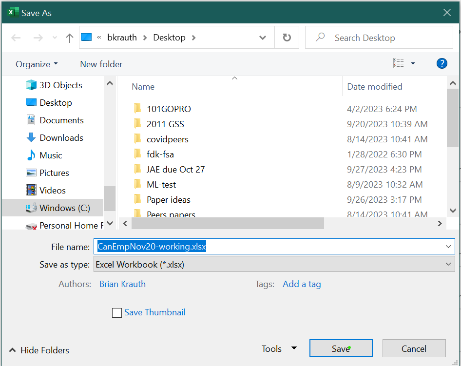
4. Click on the `Save as type` drop-down box, and select 
   "CSV (Comma delimited)(*.csv)". 
   - Note that this will change the file extension from `.xlsx` to `.csv`.
5. Adjust the destination folder if you want, then select `Save`.
6. You may get a warning that looks like this:
   
   Select `OK`.
8. Close Excel.

You now have a CSV file.
:::

So what is a CSV file? CSV files have the following features:

- CSV file names usually have the `.csv` extension.
- CSV files are text files.
- Each CSV file represents a table of data.
- Each line in the CSV file represents a row in the table.
- The cells in each row are separated or ***delimited*** by commas.

CSV files have a few other features, which are best understood by using a
text editor to view the exact contents of an actual CSV file.

::: example
**Viewing a CSV file as text**

To view the exact contents of the CSV file we have created, open it in a text
editor.

The file will look something like this:
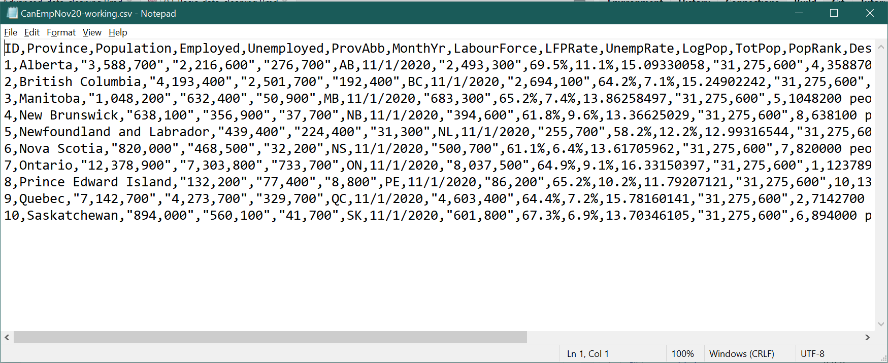

As you can see, the CSV file contains text based on the data in your
worksheet. Each line is a row in the worksheet, and cells are delimited by
commas.  A few other things to notice:

- There is no formatting information in the file.
- There are no formulas, only values.
- When the value in a cell contains a comma, the contents of the cell are
  surrounded by quotes (`"`) so that the comma is not interpreted as the end
  of the cell.

:::

You can also open any CSV file in Excel, and Excel will interpret the contents 
of the file as a worksheet.

::: example
**Viewing a CSV file in Excel**

Use Excel to open both your CSV file and your current working copy of the XLSX
workbook. You can do this either by double-clicking on both files, or you can
start Excel and use its menus to find and open the files.

Your CSV file will look something like this:
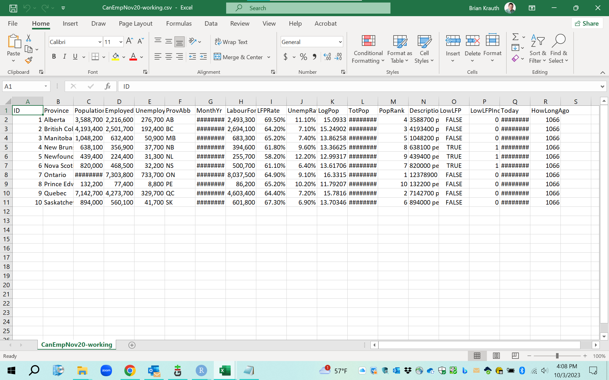

We can compare this worksheet to the original Excel workbook from which it was
exported. They are similar, but there are several important differences:

1. It *only* contains the *EmploymentData* worksheet.
   - CSV files can only contain a single table.
2. All cell formatting is gone: the columns are all the same width, and the top
   row is not in boldface.
   - CSV files do not include formatting information.
3. All formulas have been replaced with the corresponding values. For example,
   the cell H2 contains the formula `=D2 + E2` in the Excel file, and the value
   2493300 in the CSV file.
   - Excel does not include formulas when exporting to CSV files.
4. All values have been rounded. This may not be obvious, but to see an example:
   - Change the number format in cell I2 so that the value is displayed to 5
     decimal places.
   - Cell I2 will display as `69.47641%` in the original Excel file.
   - Cell I2 will display as `69.50000%` in the CSV file.
   
   Excel rounds according to the cell's current numeric display format when
   exporting to CSV files.
   
When importing and exporting CSV files, always check to make sure that important
information is not lost in the translation between formats.
:::

There are many commonly-used data file formats other than Excel and CSV. 
Section \@ref(more-on-data-file-formats) in Chapter \@ref(advanced-data-cleaning)
discusses some of these formats and how to work with them in Excel.

## Finishing up {#finishing-up}

At this point our data cleaning project is complete, and our data is ready for
analysis.  Returning to the version control concepts discussed in the section
on [reproducibility](#data-management), the next step is to archive and update
the master version.

::: example
**Finishing up**

To update your master version:

1. Check your working copy for mistakes and incomplete work.

   You can compare your working copy to my master version at
[https://bookdown.org/bkrauth/IS4E/sampledata/CanEmpNov20Clean.xlsx](sampledata/CanEmpNov20Clean.xlsx).

2. If you like, achive your current master version by renaming it and moving
   it to the `archives` sub-folder.

   - This is optional since your current master version is identical to the
     source data.

3. Copy the current working copy to the master version by either:

   - Selecting `File > Save As` in Excel to save the open file under another
     name.
   - Closing Excel and copying, pasting, and renaming the working copy file.

You should now have two identical cleaned data sets (one master file and one
working copy), one raw data set (in the `raw-data` subfolder), and possibly
one archived data set (in the `archives` subfolder).
:::

## Chapter review {-#review-basic-data-cleaning-with-excel}

Data cleaning is among the most important practical skills one can develop in 
applied statistical analysis. Simple statistical methods like averages
and frequencies are all most people will ever use, but everyone who works
with data regularly encounters complex and messy data in need of cleaning.

In this chapter, we have learned some important data cleaning concepts,
including reproducible research, tidy data, ID variables, and version control.
We have also learned how to implement these concepts in Excel using tools such
as fill/series, formatting, formulas, and functions.

Once we have clean data, we can use it to  do some
[basic statistical analysis and graphing](#basic-data-analysis-with-excel)
in Excel. Later on, we will learn more
[advanced data cleaning](#advanced-data-cleaning)
concepts such as linking, aggregating, error validation/handling, importing and
exporting, as well has how to to implement them in both Excel and R.

## Practice problems {-#problems-basic-data-cleaning-with-excel}

Each chapter includes a few simple practice problems to help you check your
knowledge.  They are organized by the specific skill or knowledge base you are
practicing.

Answers can be found in the [appendix](#answers-basic-data-cleaning-with-excel).

**GOAL #1: Identify and implement the principles of reproducible research**

1. Which of the following tables shows a tidy data set?
   a. 
      | PersonID   | 101  | 102    |
      |:-----------|:----:|:------:|
      | Name       | Bob  | Joe    |
      | Age        |  30  | 35     |
      | Occupation | Chef | Waiter |
   b. 
      |  Name      | Age  | Occupation |
      |:-----------|:----:|:----------:|
      | Bob        | 30   | Chef       |
      | Joe        | 35   | Waiter     |
   c. 
      | Variable   | Value  |
      |:-----------|:------:|
      | Name       |  Bob   |
      | Age        |   30   |
      | Occupation |  Chef  |
      | Name       |  Joe   |
      | Age        |  35    |
      | Occupation | Waiter |


2. A typical version control system includes three different version types. For
   each of these version types, indicate its purpose, whether you should
   edit it directly, and the maximum number of files of the type you should
   have.
   a. Master version/versions
   b. Working copy/copies
   c. Archive copy/copies


**GOAL #2: Identify and use ID variables**

3. Which of the following characteristics is necessary for a variable to
   function as an ID variable?
   a. It takes on a different value for each observation.
   b. Each value it can take on has an associated observation.
   c. It can take only one value.

**GOAL #3: Use basic Excel terminology and concepts**

4. Which tool (fill, series, insert, or copy/paste) would you use for each of
   the following tasks?
   a. Copy the contents of a cell to one or more adjacent cells.
   b. Copy the contents of a cell to a far-away range of cells.
   c. Fill a cell range with a sequence of ascending even numbers
      (e.g., 2, 4, 6).
   d. Add a row or column to the middle of your data set.

**GOAL #4: Use Excel formulas to construct new variables**

5. Construct an Excel formula to do each of the following:
   a. Find the square root of the number in cell A2.
   b. Find the lowest value in cells A2:A100.
   c. Find the absolute value of the difference between cells A2 and B2.

**GOAL #5: Use absolute and relative cell references in Excel formulas**

6. For each of the following Excel formulas, suppose we copy that from cell
   C12 to cell E15. What formula appears in cell E15?
   a. `=B2`
   b. `=$B$2`
   c. `=$B2`
   d. `=B$2`
   e. `=SUM(B2:B10)`
   f. `=SUM($B$2:$B$10)`
   g. `=SUM($B2,$B10)`
   h. `=SUM(B$2,B$10)`

If you aren't sure, try it out in Excel and see what happens.

**GOAL #6: Use logical and text data in Excel**

7. Construct an Excel formula to do each of the following.
   a. Display "Reject" if cell A2 contains a number less than 0.05, and display
      "Fail to reject" otherwise.
   b. Display the text "A2 = " followed by the value in cell A2.
   c. Display the first two letters of the text in cell A2.

**GOAL #7: Use dates in Excel**

8. Construct an Excel formula to do each of the following:
   a. Display the current month. 
   b. Display the date 100 days from today.
   c. Display the number of days since your birth.

**GOAL #8: Use Excel to import and export CSV files**

9. Suppose you import the following CSV file in Excel:
   ```
   Name,Year of birth,Year of death
   "Mary, Queen of Scots",1542,1547
   Mary I,1516,1558
   Elizabeth I,1533,1603
   ```
   a. How many rows and columns does the worksheet have?
   b. What are the contents of cell B1?
   c. What are the contents of cell C3?
