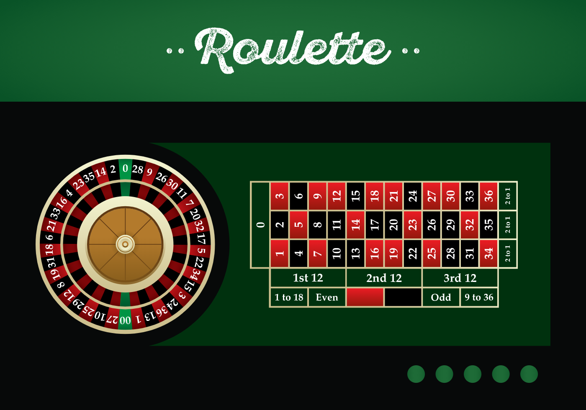

# Probability and random events {#probability-and-random-events}

***Probability*** is a mathematical system for modeling a random process.
Probability is an essential tool for casinos, as well as for banks, insurance
companies, and any other organization that manages risk and uncertainty. It also
provides the mathematical framework for the statistical analysis of data.

This chapter will introduce the terminology and rules of probability.

::: {.goals data-latex=""}
**Chapter goals**

In this chapter, we will learn how to:

1.  Define the outcome and sample space for a given random process.
2.  Use set theory to define and manipulate events for a given random process.
3.  Apply the axioms and derived rules of probability.
4.  Calculate event probabilities from elementary event probabilities.
5.  Calculate and interpret joint and conditional probabilities.
6.  Interpret and evaluate the claim that two events are independent.
7.  Use the law of total probability and Bayes' law.
:::

To prepare for this chapter, please review the sections on [Sets](#sets) and
[Functions](#sets) in the [Math Review](#math-review) appendix.

## Randomness and uncertainty

Economics studies choice behavior and its consequences, and nearly every choice
we make is affected by ***randomness*** and ***uncertainty***. That is, we often
cannot predict future conditions with certainty, and we do not even have full
information on current conditions.

As in other areas of economics, we can better understand random and uncertain
events by building a model. The first step in building a model is to describe
the situation of interest.

::: example
**Example application: Roulette**

We will develop ideas by considering the casino game of **Roulette**. The
picture below shows what a roulette wheel looks like.

Source: <a href="https://www.vecteezy.com/free-vector/roulette">Roulette Vectors by Vecteezy</a>

Here are the rules:

- The game features three physical objects:
  - a ball
  - a spinning wheel with numbered/colored slots
  - a table with a grid of numbers on which to place bets
- The slots on the wheel are numbered from 0 to 36:
  - Slot number 0 is green.
  - 18 slots are red.
  - 18 slots are black.
  - The picture above depicts an American roulette table, which has an
    additional green slot labeled "00",
  - I will assume we have a European roulette table, which does not include the
    "00" slot.
- Players can place various bets on the table including
  - Red 
    - This bet wins if the ball lands on any red number
    - Winning bets pay out \$1 per \$1 bet.
  - Black
    - This bet wins if the ball lands on any black number)
    - Winning bets pay out \$1 per \$1 bet.
  - A straight bet on any specific number
    - This bet wins if the ball lands on the chosen number
    - Winning bets pay out \$35 per \$1 bet.
  - Even
    - This bet wins if the ball lands on any even number *other* than zero.
    - Winning bets pay out \$1 per \$1 bet.

Like other casino games, a roulette game is an example of a random process:
something will happen, someone (the players and the casino) cares what will
happen, but no one knows in advance what will happen.
:::

::: {.economics data-latex=""}
**The house always wins: The economics of gambling**

The core economic principle of the gambling industry is that "the house always
wins."  The "house" is a general term in gambling referring to the organization
that is operating the game, including operators of casinos, lotteries, sports
betting, and online games of chance. The house generally exists for one purpose:
making money. As a result, every game and every bet the house offers is designed
to make nearly-certain profits for the house and nearly-certain losses for the
players. The house advantage is typically quite small - less than 5\% or in many
popular casino games -  but it is *always* positive.

Over the course of the semester, we will use the tools of probability and
statistics to calculate win probabilities, the house advantage, and related
numbers. But keep the economics in mind: if your calculation implies that
the house loses money, it is probably wrong.
:::

## Outcomes and events {#outcomes-and-events}

The first step in constructing our model is to define the ***outcome*** we are
interested in. The outcome is a variable, and is often represented by the
lower-case Greek letter omega ($\omega$).  But we can choose any variable name
we like.

An outcome can be a simple yes/no result, a number, a group of numbers, a
picture, a document, or a complete description of the history of the universe.
At minimum, the outcome should describe everything about the random process that
we care about.

::: example
**Outcomes in roulette**

All bets in roulette relate to the number the ball lands on.  So if we want to
model a single game of roulette, that number should be the outcome:
\begin{align}
  \omega &= \textrm{the number the ball lands on}
\end{align}
Alternatively, we could define a more limited outcome ("the color that the ball
lands on") or a more detailed outcome ("the color and number that the ball lands
on"). The outcome is a *choice* we make in setting up the model.
:::

The set of all possible outcomes is called the ***sample space***. The sample
space is usually represented by the Greek capital letter Omega ($\Omega$).
But we can choose any variable name we like. At minimum, the sample space needs
to include every possible value for the outcome.

::: example
**The sample space in roulette**

The sample space for a game of roulette can be defined as the set of all numbers
the ball can land on:
   $$\Omega = \{0,1,2,\ldots,36\}$$
This sample space has $|\Omega| = 37$ elements.

Alternatively, we could define the sample space for the game as the set of all
positive integers, all integers, or all real numbers.  As long as the sample
space includes the 37 specific numbers in $\{0,1,2,\ldots,36\}$, we will be
OK.
:::

Next, we define a set of ***events*** that we are interested in. We can think of
an event as either:

 - A factual statement about the outcome OR
 - A subset of the sample space 

These two concepts are equivalent, though the subset concept makes the math
clearer.  We often use upper-case letters to represent events, but we can choose
any variable name we like.

::: example
**Events in roulette**

These roulette events are well-defined for our sample space: 

- Ball lands on 14:
  $$\omega \in 14Wins = \{14\}$$
- Ball lands on a red number:
  \begin{align}
    \omega \in RedWins &= \left\{\begin{aligned}
      & 1,3,5,7,9,12,14,16,18, \\
      & 19,21,23,25,27,30,32,34,36 \\
      \end{aligned}\right\}
  \end{align}
- Ball lands on a black number:
  \begin{align}
    \omega \in BlackWins &= \left\{\begin{aligned}
      & 2,4,6,8,10,11,13,15,17, \\
      & 20,22,24,26,28,29,31,33,35 \\
      \end{aligned}\right\}
  \end{align}
- Ball lands on one of the first 12 numbers:
   $$\omega \in First12Wins = \{1,2,3,4,5,6,7,8,9,10,11,12\}$$

You can see many other bets on the table such as "Even", "Odd", "1 to 18" and so
on.  We can define an event for each of these bets, or for any other combination
of values for $\omega$.
:::

An event that contains exactly one outcome is called an ***elementary event***.

::: example
**Elementary events in roulette**

The sample space for roulette contains 37 elements, so there are 37 
outcomes: $0,1,2,\ldots,37$ and 37 elementary events: 
$\{0\}$, $\{1\}$, $\{2\}$, $\ldots$, $\{37\}$.
:::

Events are sets, so we can work with events using the same terminology and
mathematical tools we use for sets.

::: example
**Relationships among events**

In our roulette example:

- Two events are *identical* $(A = B)$ if they contain exactly the same outcomes:
  - Suppose that Al and Betty both bet on 23. The events "Al wins"
    $(AlWins = \{23\})$ and "Betty wins" $(BettyWins = \{23\})$ are identical.
  - Intuitively, identical means they are just two different ways of describing
    the same event.
- An event *implies* another event $(A \subset B)$ if all of its outcomes are
  also in the implied event:
  - The event $14Wins= \{14\}$  implies the event $RedWins$ since
    $14Wins \subset RedWins$.
  - When an event happens, any event it implies also happens.
- Two events are *disjoint* $(A \cap B) = \emptyset$ if they share no outcomes:
  - The events $RedWins$ and $BlackWins$ are disjoint since
    $RedWins \cap BlackWins = \emptyset$.
  - Two disjoint events cannot both happen because there is no possible outcome
    that makes them both true.
  - But two disjoint events can both fail to happen. For example, if the ball
    lands in the green zero slot ($\omega = 0$), neither red nor black wins.
- Any two elementary events are either identical or disjoint:
   - The events $14Wins$ and $25Wins$ are disjoint since
     $14Wins \cap 25Wins = \{14\} \cap \{25\} = \emptyset$.
:::

If terms like disjoint, subset, intersection, and union are unfamiliar to you,
you should review the section on [sets](#sets)  in the Math Appendix before
proceeding.

## Probabilities {#probabilities}

Our final step is to define a ***probability distribution*** for this random
process, which is a function $\Pr(\cdot)$ that assigns a number $\Pr(A)$ to each
possible event $A$.  The number is called the ***probability*** of event $A$.

Probabilities are normally between zero and one and can be interpreted as
describing how likely an event is:

- An event with probability one definitely *will* happen.
- An event with probability zero definitely *will not* happen.
- An event with probability between zero and one *might* happen.
- An event with a higher probability is more likely to happen than an event with
  lower probability.

Where does this probability distribution come from? That's a good question, but
we will take it as given for the moment.

### The axioms of probability {#the-axioms-of-probability}

All valid probability distributions must obey the following three conditions,
which are sometimes called the ***axioms of probability***:

1. ***Non-negativity***: The probability of an event cannot be negative:
   $$\Pr(A) \geq 0$$
2. ***Unit measure***: One of the outcomes in the sample space must happen:
   $$\Pr(\Omega) = 1$$
3. ***Additivity***: For any two *disjoint* events $A$ and $B$, the probability
   that either $A$ or $B$ happens is the sum of their individual probabilities:
   $$\Pr(A \cup B) = \Pr(A) + \Pr(B)$$

The first two axioms are straightforward.  The additivity axiom is a little
trickier because we need to confirm that the events are disjoint before we
apply it.  Remember that events are disjoint when they have no outcomes in
common.

::: example
**Disjoint outcomes in roulette**

The events "zero wins" and "14 wins" are disjoint:
  \begin{align}
    ZeroWins \cap 14Wins &= \{0\} \cap \{14\} \\
      &= \emptyset
  \end{align}
so the additivity axiom applies.  Therefore, the probability that either zero
or 14 wins is:
  \begin{align}
    \Pr(ZeroWins \cup 14Wins) &= \Pr(ZeroWins) + \Pr(14Wins)
  \end{align}
  
The events "red wins" and "14 wins" are not disjoint:
  \begin{align}
    RedWins \cap 14Wins &= \{14\}
  \end{align}
so the additivity axiom does *not* apply to $RedWins \cup 14Wins$.
:::

### Additional rules for probabilities {#some-rules-for-probabilities}

Probability distributions have many other properties, but they can all be
derived from the three axioms.

Let $A$ and $B$ be two (not necessarily disjoint) events.  Then our three axioms
of probability imply several additional rules:

- ***Upper bound rule***: The probability of an event cannot be greater than
   one:
   $$\Pr(A) \leq 1$$
- ***Complement rule***: The probability of an event *not* happening is:
   $$\Pr(A^C) = 1 - \Pr(A)$$
- ***Empty event rule***: The probability of nothing happening is zero:
   $$\Pr(\emptyset) = 0$$
- ***Implied event rule***: Implied events have higher probability:
   $$A \subset B \implies \Pr(A) \leq \Pr(B)$$
- ***Subadditivity rule***: The probability of either $A$ or $B$ happening is:
  \begin{align}
    \Pr(A \cup B) &= \Pr(A) + \Pr(B) - \Pr(A \cap B) \\
      &\leq \Pr(A) +\Pr(B)
  \end{align}

These results are not hard to prove, but I will not go through the proofs.
However, I will use these results so you should be familiar with them.

::: example
**Derived probability rules in roulette**

We can use our derived probability rules in various ways:

- The event "Red loses" is the complement of the event "Red wins." So if we know
  the probability that Red wins, we can use the complement rule to calculate the
  probability that Red loses:
  \begin{align}
    \Pr(RedLoses) &= \Pr(RedWins^c) \\
      &= 1 - \Pr(RedWins)
  \end{align}
- We know that 14 is a red number, so $14Wins$ implies $RedWins$.  We can use
  the implied event rule to determine that:
  $$\Pr(14Wins) \leq \Pr(RedWins)$$
- We earlier determined that the events $RedWins$ and $14Wins$ are not
  disjoint, and so we could not apply the additivity axiom directly to find
  $\Pr(RedWins \cup 14Wins)$. However, we can use
  the subadditivity rule to find an upper bound on the probability:
  $$\Pr(RedWins \cup 14Wins) \leq \Pr(RedWins) + \Pr(14Wins)$$
  or to calculate the exact probability:
  $$\Pr(RedWins \cup 14Wins) = \Pr(RedWins) + \Pr(14Wins) - \Pr(RedWins \cap 14Wins)$$
:::

### Calculating probabilities

To calculate probabilities, we use information or assumptions about the random
process, and then apply the axioms and derived rules.

Since this is an introductory course, our sample space will usually contain a
finite number of outcomes, as in our roulette example.  In that case,
probability calculations can be made in two simple steps:

1. Find the probability of each elementary event.
2. To find the probability of a specific event, just add up the probabilities
   of its elementary events.

Finding the probability of each elementary event usually requires us to
understand something about the random process itself.

::: example
**Elementary event probabilities for a fair roulette game**

Casinos are required by law to operate "fair" games, and are subject to heavy
penalties if they operate unfair ones.  In the context of roulette, a fair game
is one in which each number has the same probability.

Let's assume that the roulette wheel is "fair" in this sense. Note that fairness
is just an assumption, and may not actually be true. Later on, we will use data
and statistics to evaluate whether a roulette wheel is *actually* fair.

Assuming each elementary event has the same probability, let that probability
be:
   $$p = \Pr(\omega = 0) = \Pr(\omega = 1) = \cdots = \Pr(\omega = 36)$$
To find the correct value of $p$ we use the axioms of probability:

- By the unit measure axiom, one of the outcomes will happen:
   $$\Pr(\Omega) = 1$$
- Since the elementary events are disjoint, the additivity axiom implies that:
   $$\underbrace{\Pr(\Omega))}_{1} = \underbrace{\Pr(\{0\})}_{p} + \underbrace{\Pr(\{1\})}_{p} + \cdots + \underbrace{\Pr(\{36\})}_{p}$$
- Since there are 37 elementary events, we can rewrite this equation as:
   $$1 = 37p$$
- We can then solve for $p$ to get:
   $$p = 1/37 \approx 0.027$$
That is, each of the 37 elementary events have a probability of $1/37$ or about
2.7\%.
:::

::: {.warning data-latex=""}
**Equal probability is an assumption**

In our roulette example, all elementary events have the same probability. Do
all random processes have this property? No.

Equal probability makes the math easy, and applies to some specific cases like
roulette or dice games, so we often use those cases in examples when teaching
basic probability theory.  But equal probability does not apply to random
processes in general.  For example, suppose I run in a race against 11-time
world sprinting champion Usain Bolt. There are two possible outcomes - "I win"
and "Usain Bolt wins" - but it would be unreasonable to think that these two
outcomes have equal probability.
:::

Once we have the probabilities of each elementary event, calculating any other
probability is just a matter of adding up.

::: example
**Event probabilities for a fair roulette game**

In the roulette example, the probability of any event $A$ is just the number of
outcomes in $A$ times the probability of each outcome $1/37$:
   $$ \Pr(A) = |A|*1/37$$
The notation $|A|$ just means the size of (number of elements in) the set $A$.

For example:
$$\Pr(\omega = 25) = |\{25\}|*1/37 = 1/37 \approx 0.027$$
$$\Pr(RedWins) = |RedWins|*1/37 = 18/37 \approx 0.486$$
$$\Pr(EvenWins) = |EvenWins|*1/37 = 18/37 \approx 0.486$$
$$\Pr(First12Wins) = |First12Wins|*1/37 = 12/37 \approx 0.324$$
:::

This procedure works when our sample space contains a finite number of outcomes.
We will usually stick with examples where that is the case, but there are some
applications where it isn't.  For example, maybe we are interested in using
probability to model the unemployment rate, or a person's income.  Those are
real numbers, and can take on any of an infinite number of values. We will learn
more about those cases in Chapter \@ref(random-variables).

::: {.fyi data-latex=""}
**What do probabilities really mean?**

What does it really mean to say that the probability of the ball landing in a
red slot is about 0.486? That's actually a tough question. There are two
standard interpretations for probabilities:

- *Frequentist or classical interpretation*: we are thinking of the random
  process as something that could be repeated many times, and the probability of
  an event is the approximate fraction of times that the event will occur. That
  is, if you go to a casino and bet 1000 times on Red, you will win about 486
  times. 
- *Bayesian or subjectivist interpretation*: the random process is a one-time
  occurrence, but we have limited information about it and the probability of
  event represents the strength of our belief that the event will happen.

The frequentist interpretation of probability is well-suited for simple repeated
settings like casino games or car insurance, while the Bayesian interpretation
makes more sense for predicting one-time events like the results of a particular
election.
:::

## Joint and conditional probabilities {#related-events}

We are often interested in how one event is related to another. For example:

 - Poker or blackjack players can place bets after viewing their cards. So
   they may be interested in predicting the probability they will win the game
   based on the cards that they have.
 - Political analysts often want to predict the winner of an election based on
   partial results.
 - Financial analysts often want to forecast a company's earnings under
   different market scenarios.
 - Economists often want to predict future economic conditions based on data
   about current conditions.
 - Doctors often want to predict the effectiveness of a particular treatment
   based on test results and patient characteristics.

In all of these cases, we know that a particular event has happened and want
the probability of some other event. This section will develop some tools for
dealing with this scenario.

### Joint probabilities {#joint-probabilities}

The ***joint probability*** of two events $A$ *and* $B$ is the probability that
they *both* happen:
  $$\Pr(A \cap B)$$
Remember that the intersection ($\cap$) of $A$ and $B$ is the set of all
outcomes that are in both $A$ and $B$.

We can calculate joint probabilities by constructing a new event from the
intersection of the two original events, and then calculating the probability of
that new event.

::: example
**Joint probabilities for roulette bets**

Suppose that Al has bet on Red, and Betty has bet on Even. They agree to get
married tonight if they both win.  How likely is this to happen?

The events "Al wins" and "Betty wins" can be defined:
  \begin{align}
    AlWins = RedWins &= \left\{\begin{aligned}
      & 1,3,5,7,9,12,14,16,18, \\
      & 19,21,23,25,27,30,32,34,36 \\
      \end{aligned}\right\} \\
    BettyWins = EvenWins &= \left\{\begin{aligned}
      & 2,4,6,8,10,12,14,16,18, \\
      & 20,22,24,26,28,30,32,34,36 \\
      \end{aligned}\right\}
  \end{align}
Note that zero doesn't count as an even number in roulette (if it did, the
player would have an advantage over the house).

This event "Al and Betty both win" is just the intersection of $AlWins$ and
$BettyWins$ so this joint probability is:
  \begin{align}
    \Pr(AlWins \cap BettyWins) &= \Pr(\{12,14,16,18,30,32,34,36\}) \\
      &= 8/37 \\
      &\approx 0.216
  \end{align}
So there is a 21.6\% chance that Al and Betty will get married tonight (assuming
they follow through on their plan, of course).
:::

Joint probabilities are just probabilities, so they obey all of the axioms and
derived rules of probability described in Section \@ref(probabilities).

### Conditional probabilities {#conditional-probabilities}

The ***conditional probability*** of an event $A$ ***given*** another event $B$
is defined as:
   $$\Pr(A|B) = \frac{\Pr(A \cap B)}{\Pr(B)}$$
The conditional probability answers the question: if we already know that $B$ is
true, what are the chances that $A$ is true?

To calculate a conditional probability, just calculate the two components and
apply the formula above.

::: example
**Conditional probabilities in roulette**

Suppose that Betty has bet on even, and she excitedly yells out
"I won! Woo hoo!"  Al has bet on Red. Knowing that Betty has won, what are the
chances Al has also won?

This question can be answered using the conditional probability:
\begin{align}
  \Pr(AlWins|BettyWins) &= \Pr(RedWins | EvenWins) \\
    &= \frac{\Pr(RedWins \cap EvenWins)}{\Pr(EvenWins)} \\
    &= \frac{8/37}{18/37} \\
    &\approx 0.444
\end{align}
That is, Betty winning implies a reduced probability of Al winning (since
$0.444 < 0.486$).
:::

Conditional probabilities are not particularly useful in roulette, which is a
simple "one shot" game.  But they are very important when playing multi-step
games like poker or blackjack. At the beginning of a hand of poker, every player
has equal chance of having a winning hand. But that is no longer true after the
players see their cards - having "good" cards increases your chance of winning,
and having "bad" cards decreases that chance. Players get to make bets after
seeing their cards, so your bet should be based on the conditional probability 
$\Pr(YouWin|YourCards)$ rather than the unconditional probability $\Pr(YouWin)$.
Good poker players have detailed (but sometimes informal) knowledge of these
conditional probabilities.

Like joint probabilities, conditional probabilities are just probabilities, so
they obey all of the axioms and rules of probability described in
Section \@ref(probabilities).

### Independent events {#independent-events}

One common "trick" in modeling joint and conditional probabilities is to assume
that certain events are unrelated to each other. This can simplify the math
significantly.

We say that two events $A$ and $B$ are ***independent*** if their joint
probability is just the two individual probabilities multiplied together:
  $$\Pr(A \cap B) = \Pr(A)\Pr(B)$$
We sometimes express independence using the notation $A \bot B$.

The definition of independence is not very intuitive, but we can clarify it by
doing a little math.  Consider two independent events $A$ and $B$ that have
nonzero[^301] probability.  Then by the definition of independence:
  $$\Pr(A|B) = \frac{\Pr(A \cap B)}{\Pr(B)} = \frac{\Pr(A)\Pr(B)}{\Pr(B)} = \Pr(A)$$
By the same reasoning, independence of $A$ and $B$ implies that:
  $$\Pr(B|A) = \Pr(B)$$
In other words, knowing that one of these events are true tells you nothing
useful about whether the other the other event is true.

[^301]: You may wonder: if it makes more sense to describe independence 
      in terms of conditional probabilities, why do we define it in 
      terms of joint probabilities?  The key is the requirement that
      the events have nonzero probability. When $B$ has zero
      probability the conditional probability $\Pr(A|B)$ is not
      well defined since its denominator is zero.

When would it be reasonable to assume two events are independent? The typical
scenario would be where there is simply no physical or logical relationship
between them, usually due to a separation in time and space.

::: example
**Independence across roulette games**

We will show below that events related to a *single* roulette game are not
necessarily independent.  But the outcomes/events of *two different* roulette
games can be reasonably assumed to be independent of one another. We can use
that independence assumption in the following calculation.

Suppose that I bring \$100 to a casino this afternoon for a few games of
roulette. I bet all of my money on Red for the first game.

- If I lose, I am broke and stop playing.
- If I win, I keep all of my money (both my initial bet and my winnings)
  on Red for the next spin.  
- I keep playing until I run out of money.

After 3 games:

 - If Red wins all 3 games, I leave the casino with $y = \$800$.
 - Otherwise, I leave the casino with nothing $y = \$0$

What is the probability of each of these events?  Since we can assume that each
game's outcome is independent, this is an easy problem:
  \begin{align}
    \Pr(y = \$800) &= \Pr(RedWins_1 \cap RedWins_2 \cap RedWins_3) \\
      &= \Pr(RedWins_1) \times \Pr(RedWins_2) \times \Pr(RedWins_3) (\#eq:indep) \\
      &= (18/37) \times (18/37) \times (18/37) \approx 0.115 \\
    \Pr(y = \$0) &= 1 - \Pr(y = \$800) \\
      &\approx 0.885 \\
  \end{align}
So we have an 11.5\% chance of winning big, and an 88.5\% chance of going broke.

Very important: equation \@ref(eq:indep) only follows from the previous equation
because we have assumed that the events $RedWins_1$, $RedWins_2$, and
$RedWins_3$ are independent.
:::

When is it *not* reasonable to assume that events are independent? In almost any
other case.  Remember that different events are defined in terms of the same
underlying outcome, so they are typically related unless you have some very
specific reason to assume otherwise.

::: example
**Independence within the same roulette game?**

Consider the events "Red wins" and "Even wins" within a single roulette game.
We earlier showed that the unconditional probability that Red wins is:
  $$\Pr(RedWins) = 18/37 \approx 0.486$$
and that the conditional probability that Red wins given that Even wins is:
   $$\Pr(RedWins|EvenWins) = 8/18 \approx 0.444$$
Since $0.44 \neq 0.486$, these two events are *not* independent.
:::

::: {.warning data-latex=""}
**Independence is an assumption**

A common mistake by students who are new to probability and statistics is to
take results that *only* apply under independence and use them when there is no
reason to believe that independence holds.  Don't make this mistake:
independence is an assumption, and one that can easily be incorrect.
:::

### Law of total probability

In addition to the derived rules of probability that we have already discussed,
there are two important derived rules for conditional probabilities. The first
is called the ***law of total probability***, and is a rule for determining
unconditional probabilities from conditional probabilities:

  $$\Pr(A) = \Pr(A|B)\Pr(B) + \Pr(A|B^c)\Pr(B^c)$$

The law of total probability allows us to create a set of scenarios, calculate
probabilities under each scenario, and then add them up. It  is useful when we
are modeling random outcomes that occur in multiple stages, for example a poker
game or an energy company making a series of investments to develop an oil
field.

::: example
**The law of total probability in poker**

Suppose you are playing [Texas hold'em poker](https://en.wikipedia.org/wiki/Texas_hold_'em)
with a few friends, and the hand has one card left to deal (the "river"). If
the last card has a heart on it (event $Hearts$, 25\% probability) you will
have a flush and win the hand with a probability you estimate to be 90\%.
If the last card does not have a heart on it (event $Hearts^c$, 75\% probability),
you will not have a flush, but still have a win probability you estimate to be 30\%.
Given this information, what are your overall chances of winning?

The answer can be calculated using the law of total probability:
  \begin{align}
    \Pr(Win) &= \Pr(Win|Hearts)\Pr(Hearts) 
              + \Pr(Win|Hearts^c)\Pr(Hearts^c) \\
      &= 0.9*0.25 + 0.3*0.75 \\
      &= 0.45
  \end{align}
So you have a 45\% chance of winning. 
:::

### Bayes' law

The second is ***Bayes' law***, which is a rule for determining conditional
probabilities:
  $$\Pr(A|B) = \frac{\Pr(B|A)\Pr(A)}{\Pr(B)}$$
Bayes' law is particularly useful in evaluating evidence, because it allows us
to restate one conditional probability in terms of another. That is, we are
interested in whether a statement $A$ is true or false given our observation
$B$, and Bayes' law allows us to state this conditional probability in terms of
the probability of observing $B$ when $A$ is true.

::: example
**False positives in medical testing**

When someone is tested for a disease, the test comes back either "positive"
(the person has the disease) or "negative" (the person does not have the
disease). However, no test is perfect. Sometimes people who do not have the
disease test positive ("false positives") and sometimes people who do have the
disease test negative ("false negative").

Let the event $Positive$ mean a particular patient tests positive for a disease, and
let the event $Sick$ mean that this patient actually has the disease. 

The *sensitivity* of the test is a sick patient's probability of testing
positive:
   $$\Pr(Positive|Sick) = sens$$
the *specificity* of the test is a healthy patient's probability of testing
negative:
   $$\Pr(Positive^c|Sick^c) = spec$$
and the *prevalence* of the disease is the probability that a given patient has
it:
   $$\Pr(Sick) = prev$$
Suppose that a patient has tested positive.  Given this information, what is the
probability that he has the disease, i.e. what is the value of
$\Pr(Sick|Positive)$?

This is a classic probability question, as it makes use of Bayes' law and the
law of total probability, and it has obvious practical importance.

Since we want a conditional probability, we start by stating Bayes' law:
   $$\Pr(Sick|Positive) = \frac{\Pr(Positive|Sick)\Pr(Sick)}{\Pr(Positive)}$$
Bayes' law will allow us to calculate $\Pr(Sick|Positive)$ if we can find
the components of the right side of this equation. 

We already know that $\Pr(Positive|Sick)=sens$ and $\Pr(Sick)=prev$, so all we need is
to find $\Pr(Positive)$.

Since $\Pr(Positive)$ is an unconditional probability, we can use the law of total
probability:
   $$\Pr(Positive) = \underbrace{\Pr(Positive|Sick)}_{sens}
              \underbrace{\Pr(Sick)}_{prev} 
            + \underbrace{\Pr(Positive|Sick^c)}_{1-spec}
              \underbrace{\Pr(Sick^c)}_{1-prev}$$
Plugging these results into our formula we get:
   $$\Pr(Sick|Positive) = = \frac{sens*prev}{sens*prev + (1-spec)(1-prev)}$$
which is the result we need.

Now, let's try this out with some numbers.  Suppose that the test is quite good
in the sense that sick people always test positive $(sens=1)$ and healthy 
people almost always test negative $(spec = 0.99)$.

*Case #1*: Suppose the disease itself is fairly common ($d = 0.10$).  Then a patient
who tests positive is likely to have the disease:
  $$\Pr(Sick|Positive) = \frac{1*0.1}{1*0.1 + (1-0.99)*(1-0.1)} \approx 0.917$$
   
*Case #2*: Suppose the disease itself is quite rare ($d = 0.001$).  Then even a 
patient who tests positive is unlikely to have the disease:
   $$\Pr(Sick|Positive) = \frac{1*0.001}{1*0.001 + (1-0.99)*(1-0.001)} \approx 0.091$$

In other words, the exact same test has a very different interpretation
depending on the prevalence of the disease: when the disease is common, a
positive test result means a 91.7% chance of having the disease, and when the
disease is rare a positive test result means only a 9.1% chance of having the
disease.

This general issue (even a small false positive rate can have a big impact when
prevalence is low) appeared repeatedly in March and April of 2020. Several 
studies by well-known researchers[^302] dramatically overestimated the early
prevalence of the COVID-19 virus and thus dramatically underestimated its
fatality rate. These studies were regularly cited as support by those who 
wanted to substantially relax public health restrictions in April 2020,
and had substantial real world consequences.
:::

[^302]: If you are interested in learning more about this, an 
[article in Science](https://www.sciencemag.org/news/2020/04/antibody-surveys-suggesting-vast-undercount-coronavirus-infections-may-be-unreliable) 
provides an overview of the controversy, and a 
[blog post by statistician Andrew Gelman](https://statmodeling.stat.columbia.edu/2020/04/19/fatal-flaws-in-stanford-study-of-coronavirus-prevalence/) 
provides a thorough discussion of the statistical issues.

## Chapter review {-#review-probability}

Probability provides a rigorous mathematical language for describing and
managing uncertainty. It also provides the foundation for serious statistical
analysis.

In this chapter we have learned the basic terminology and concepts of
probability: events, outcomes, joint/conditional/marginal probabilities, and
independence.  We have also learned various tools for calculating probabilities,
including the axioms of probability, their associated rules, the law of total
probability, and Bayes' law.  You may have seen many of these terms and ideas in
high school, but we are approaching them at a higher level. Be sure to review
these terms and concepts in detail, and do the practice problems to test your
knowledge.

The next step is to take the general framework of outcomes and events developed
in this chapter, and apply them to [random variables](#random-variables):
random outcomes that take the form of a number.

## Practice problems {-#problems-probability}

Answers can be found in the [appendix](#answers-probability).

Most of these practice problems will be based on the casino game of *craps*.
Craps is played with a pair of 6-sided dice. 

Players take turns rolling the dice, and the player currently rolling the dice
is called the "shooter".  There are various bets - pass, don't pass, come, don't
come, field, place, buy - that can be placed on the results of multiple rolls of
the dice.  These bets and their probability calculations can be quite complex,
so we will focus on "single roll" bets.

- A bet on "Snake Eyes" wins if the total showing on the dice is 2.
- A bet on "Yo" wins if the total showing on the dice is 11.
- A bet on "Boxcars" wins if the total showing on the dice is 12.
- A bet on "Field" wins if the total showing on the dice is 2, 3, 4, 9, 10, 
  11, or 12.

For this example, assume that:

 - One die is red and the other is white. 
 - Both dice are fair, that is each side has equal probability.
 - The dice are independent of one another.
 
An outcome for a single roll of the dice is a pair of numbers $(r,w)$ where $r$
is the amount showing on the red die, and $w$ is the amount showing on the white
die. For example an outcome $(2,4)$ means that the red die is showing 2 and the
white die is showing 4.

**GOAL #1: Define outcomes and sample space for a simple example**

1. Let $\Omega$ be the sample space for the outcome of a single roll in craps.
   a. Define $\Omega$ by enumeration.
   b. Find the cardinality of $\Omega$.

2. Using enumeration, define the following events:
   a. Yo wins.
   b. Snake eyes wins.
   c. Boxcars wins.
   d. Field wins.

**GOAL #2: Use set theory to define and manipulate events**

3. Which of the following statements are true?
   a. The events "Yo wins" and "Boxcars wins" are identical.
   b. The events "Yo wins" and $(r,w) = (5,6)$ are identical.
   c. The events "Boxcars wins" and $(r,w) = (6,6)$ are identical.

4. Which of the following statements are true?
   a. The events "Yo wins" and "Boxcars wins" are disjoint.
   b. The events "Yo wins" and "Field wins" are disjoint.
   c. The events "Yo wins" and "Boxcars loses" are disjoint.
   d. The events "Yo wins" and "Field loses" are disjoint.

5. Which of the following statements are true?
   a. The event "Yo wins" implies the event "Boxcars wins."
   b. The event "Yo wins" implies the event "Boxcars loses."
   c. The event "Yo wins" implies the event "Field wins."
   d. The event "Yo wins" implies the event "Field loses."

6. Which of the following are elementary events?
   a. Yo wins.
   b. Yo loses.
   c. Boxcars wins.
   d. Boxcars loses.
   e. Field wins.
   f. Field loses.

**GOAL #3: Apply the axioms and derived rules of probability**

7. Let $A$ be an event.  Which of the following statements are true?
    a. $\Pr(A) \geq 0$.
    b. $\Pr(A) > 0$.
    c. $\Pr(A) \leq 1$.
    d. $\Pr(A) < 1$.
    e. $\Pr(A^c) \geq 0$.
    f. $\Pr(A^c) > 0$.
    g. $\Pr(A^c) \leq 1$.
    h. $\Pr(A^c) < 1$.
    i. $\Pr(A^c) = 1 - \Pr(A)$.

8. Let $A$ and $B$ be two events.  Which of the following statements are true?
    a. $\Pr(A \cup B) = \Pr(A) + \Pr(B)$.
    b. $\Pr(A \cup B) = \Pr(A) + \Pr(B) - \Pr(A \cap B)$.
    c. $\Pr(A \cup B) \leq \Pr(A) + \Pr(B)$.
    d. $\Pr(A \cap B) = \Pr(A)\Pr(B)$.

9. Let $A$ and $B$ be two disjoint events.  Which of the following statements
   are true?
    a. $\Pr(A \cap B) = 0$.
    b. $\Pr(A \cap B) = \Pr(A) + \Pr(B)$.
    c. $\Pr(A \cup B) = 0$.
    d. $\Pr(A \cup B) = \Pr(A) + \Pr(B)$.
    e. $\Pr(A \cup B) = \Pr(A) + \Pr(B) - \Pr(A \cap B)$.
    f. $\Pr(A \cup B) \leq \Pr(A) + \Pr(B)$.
    g. $\Pr(A \cap B) = \Pr(A)\Pr(B)$.
    h. $\Pr(A | B) = 0$.

10. Let $A$ and $B$ be two events such that $A \subset B$.  Which of the
    following statements are true?
    a. $\Pr(A) \leq \Pr(B)$.
    b. $\Pr(A \cap B) = \Pr(A)$.
    c. $\Pr(A | B) = 1$.

**GOAL #4: Calculate event probabilities from elementary event probabilities**

11. Calculate each of the following elementary event probabilities:
    a. $(r,w) = (1,1)$.
    b. $(r,w) = (3,4)$.
    c. $(r,w) = (6,6)$.

12. Find the probability of each of the following events:
    a. A bet on Yo wins.
    b. A bet on Snake eyes wins.
    c. A bet on Boxcars wins.
    d. A bet on Field wins.

**GOAL #5: Calculate joint and conditional probabilities**

13. Calculate each of the following joint probabilities:
    a. $\Pr(\textrm{Yo wins} \cap \textrm{Boxcars wins})$
    b. $\Pr(\textrm{Yo wins} \cap \textrm{Field wins})$
    c. $\Pr(\textrm{Yo wins} \cap \textrm{Boxcars loses})$

14. Calculate each of the following conditional probabilities:
    a. $\Pr(\textrm{Yo wins} | \textrm{Boxcars wins})$
    b. $\Pr(\textrm{Yo wins} | \textrm{Field wins})$
    c. $\Pr(\textrm{Yo wins} | \textrm{Boxcars loses})$
    d. $\Pr(\textrm{Field wins} | \textrm{Yo wins})$
    e. $\Pr(\textrm{Boxcars wins} | \textrm{Yo wins})$

15. Which of the following pairs of events are independent?
    a. Yo wins and Boxcars wins.
    b. Yo wins and Field wins.
    c. Yo wins and Yo wins.
    d. $r = 3$ and $r = 5$.
    e. $r = 3$ and $w =5$.

**GOAL #6: Interpret and evaluate the claim that two events are independent**

16. Let $A$ and $B$ be two independent events.  Which of the following
    statements are true?
    a. $\Pr(A \cap B) = 0$.
    b. $\Pr(A \cap B) = \Pr(A)\Pr(B)$.
    c. $\Pr(A|B) = \Pr(A)$.

**GOAL #7: - Use the law of total probability and Bayes' law**

17. The main bet in craps is a multi-roll bet called "pass."  The first roll is
    called the "come out" roll, and has the following rules:
    - Pass wins if the come out roll is 7 or 11.
    - Pass loses if the come out roll is 2, 3, or 12.
    Otherwise, the game continues and the value of the come out roll becomes the
    "point". The shooter keeps rolling the dice until one of the following two
    outcomes occur:
    - The shooter rolls the point value again $\Rightarrow$ Pass wins.
    - The shooter rolls 7  $\Rightarrow$ Pass loses.
    For example, if the shooter rolls a 5 on the come out roll, the point is 5
    and the game continues until the shooter rolls either a 5 (Pass wins) or a
    7 (Pass loses).

    Let $c$ be the value of the come out roll, and let the event $Pass$ include
    every outcome in which Pass wins.  The table below reports both the
    probability of each value of the come out roll, and the probability that
    pass wins for each value of the come out roll.

    |Come out ($c$) | Probability ($\Pr(c)$) | Win probability $\Pr(Pass|c)$ |
    |:--------------|:----------------------:|:-----------------------------:|
    |  2            |   1/36                 |      0                        |
    |  3            |   2/36                 |      0                        |
    |  4            |   3/36                 |    3/9                        |
    |  5            |   4/36                 |   4/10                        |
    |  6            |   5/36                 |   5/11                        |
    |  7            |   6/36                 |      1                        |
    |  8            |   5/36                 |   5/11                        |
    |  9            |   4/36                 |   4/10                        |
    | 10            |   3/36                 |    3/9                        |
    | 11            |   2/36                 |      1                        |
    | 12            |   1/36                 |      0                        |

    Use the Law of Total Probability to calculate $\Pr(Pass)$, the probability
    that a bet on Pass wins.

18. During World War II, the statistician Abraham Wald worked in a research
    group analyzing bullet damage on returning planes in order to assess risks.
    Suppose that planes can be hit on the engine (event $Engine$) or on the
    body (event $Body$)^[Note that it is possible for a plane to be hit in both
    places, or to not be hit at all.  So these two events are not necessarily
    disjoint, complements, or independent.] and that planes can either return
    safely (event $Return$) or crash. In addition, suppose that:

    - A plane is equally likely to be hit in the engine or on the body:
      $$\Pr(Engine) = \Pr(Body) = 0.6$$
    - Many of the returning planes show body damage:
      $$\Pr(Body|Return) = 0.7$$
    - Few of the returning planes show engine damage:
      $$\Pr(Engine|Return) = 0.1$$
    - Most of the planes return:
      $$\Pr(Return) = 0.8$$

    Calculate $\Pr(Return|Body)$ and $\Pr(Return|Engine)$.
