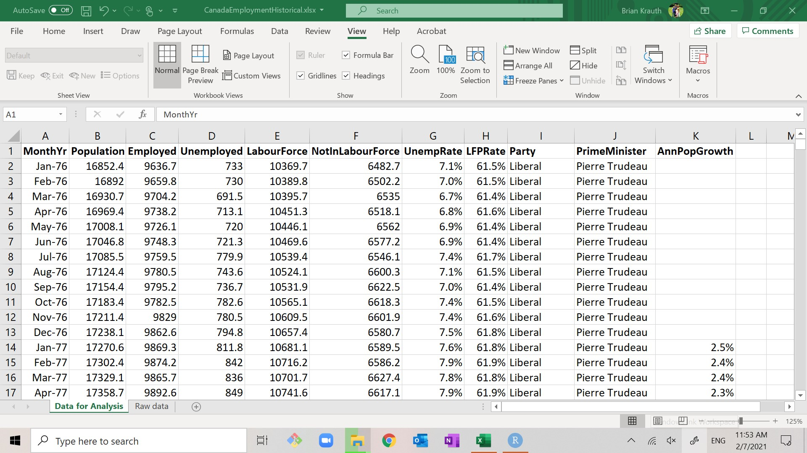
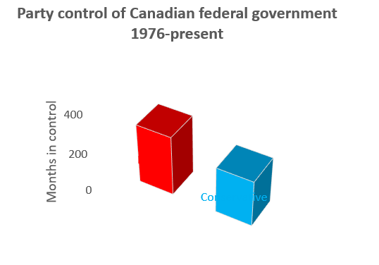

# Basic data analysis with Excel

In chapter \@ref(basic-data-cleaning-with-excel), we learned how to obtain and clean a
simple data set. The next step is to learn some tools for analyzing it. We
will start with ***univariate*** statistics, i.e., statistics that describe
a single variable.  Later in the term we will learn some ***multivariate*** 
statistics that describe the relationship between two or more variables.

::: goals
**Chapter goals**

In this chapter we will learn how to:

 - Calculate and interpret the main univariate summary statistics in Excel 
 - Construct and interpret frequency tables in Excel
 - Construct and interpret bar graphs, histograms and time series graphs in Excel
:::

In the next chapter, we will use the tools of probability and random
variables to understand these statistics more deeply.

## Exploratory data analysis

Our emphasis in this chapter, and in much of this course will be on 
performing ***exploratory*** data analysis. Exploratory data analysis
is the first step in any data analysis project: we use simple statistics
and graphs to identify and understand patterns in the data.  Our 
knowledge of these patterns can then inform our subsequent formal
or model-based analysis.

The audience for exploratory data analysis is the analyst themselves. But
we will often be interested in presenting the patterns we have discovered
to another audience: your teacher, your boss, or your client. So we will
also discuss how to effectively present your results.

### Looking at the data

The first step in any exploratory data analysis is to literally look at 
the data.

::: example
**Historical employment data for Canada**

Our analysis in this chapter will use historical employment data for
Canada from January 1976 through January 2021. Download the file
at https://bvkrauth.github.io/files/CanadaEmploymentHistorical.xlsx, 
make a working copy, and open it. 

Our main data set for analysis is the worksheet "Data for Analysis", 
which includes the following variables:

- **MonthYr**: the month and year of the observation.
- **Population**: the civilian, non-institutionalized working-age population
  of Canada at that time, in thousands.
- **Employed**: the total number employed in the population, in thousands.
- **Unemployed**: the total number employed in the population, in thousands.
- **LabourForce**: the sum of Employed and Unemployed.
- **NotInLabourForce**: the difference between Population and LabourForce.
- **UnempRate**: the percentage of the labour force that is unemployed. As
  before, it is calculated and stored as a decimal (ranging from 0.0 to 1.0)
  but displayed as a percentage (ranging from 0% to 100%).
- **LFPRate**: the percentage of the population that is in the labour force. As
  before, it is calculated and stored as a decimal (ranging from 0.0 to 1.0)
  but displayed as a percentage (ranging from 0% to 100%).
- **Party**: the political party in control of the Federal government. If the 
  party in control changed during the month, it is listed as "Transfer".
- **PrimeMinister**: the name of the Prime Minister.  If the prime minister
  changed during the month, it is listed as "Transfer".
- **AnnPopGrowth**: the rate of population growth over the previous 12 months,
  calculated as a proportion and displayed as a percentage.  Note that this
  variable is blank for the first 12 months of the data set.
  
In addition, there is a worksheet titled "Raw data" that contains the original
data as obtained from Statistics Canada.  Source information is also in that 
worksheet.
:::

Our historical employment data set covers more than 500 months. Other data
sets are often much larger: large surveys from Statistics Canada can have
hundreds of observations and hundreds of thousands of variables, and companies
and governments often work with transactions-level data that includes millions
of observations. 

As humans, our brains are not large enough to fully understand a large dataset
without some kind of simplification or "dimension reduction": instead of looking 
at millions of numbers and trying to identify patterns from that, we 
calculate and view a relatively small number of ***statistics*** based on the 
data.  A statistic is just a number calculated from data.

## Univariate statistics in Excel

We will start by calculating some commonly-used ***univariate*** statistics, 
which are statistics that describe a single variable in isolation. In Section
\@ref(charts-in-excel) we will construct some commonly-used univariate graphs.  

Multivariate statistics describe the relationships among multiple variables,
and will be coverd in Chapter \@ref(multivariate-data-analysis).

### Summary statistics

A table of ***summary statistics*** reports various univariate statistics 
for each variable in our data set.  For example, our table of summary statistics
might look like this:

| Statistic       | *(variable name 1)* | *(variable name 2)* | *(etc.)* |
|-----------------|---------------------|---------------------|----------|
| Count           | *(count of valid observations)*
| Average         | *(average)*
| StdDev          | *(standard deviation)*
| Min             | *(minimum value observed)*  
| 10th percentile |
| Median          |
| 90th percentile |
| Max             | *(maximum value observed)*  

You saw many of these words - standard deviation, percentile,
median, etc. - in Chapter \@ref(random-variables),
but I need to be clear on something: even though the names
are the same, the concepts are *not* exactly the same.

1. The ***count*** or ***sample size*** is the number of observations 
   with valid (numeric) values for the variable.
2. The sample ***average*** is a measure of central tendency in data,
   and is calculated:
     $$\bar{x} = \frac{1}{n} \sum_{i=1}^n x_i$$
3. The sample ***standard deviation*** is a measure of variation in the
   data and is calculated:
     $$s_x = \frac{1}{n-1} \sum_{i=1}^n (x_i - \bar{x})^2$$
4. The sample ***minimum*** is the lowest value observed in the data
5. The sample 10th ***percentile*** is a number that is above 10\% of
   observations and below the other 90\% of observations.
6. The sample ***median*** is a number that is above half of 
   observations and below the other half.
7. The sample 90th percentile is a number that is above 10\% of
   observations and below the other 90\% of observations.
8. The sample ***maximum*** is the highest value observed in the data.

Notice the difference here: the sample average/median/percentiles/etc. 
describes *the values observed in a set of data*, and are calculated from
that data set. The mean/median/percentiles we learned about in 
Chapter \@ref(random-variables) describes 
*the probability distribution of a random variable*
and is calculated from that probability distribution. 

As you might imagine, while these two sets of concepts are distinct,
they are related.  We will discuss how they are related in Chapter
\@ref(statistics).  For now, just keep in mind that they are 
distinct.

#### Constructing the table

We are going to create a nice table of summary statistics
for some of our variables.

::: example
**Table setup**

To set up the table:

1. Create a new blank worksheet
   - You can do this by clicking on the  button at the 
     bottom of the screen.
2. Rename the worksheet "Summary Statistics"
   - You can do this by double-clicking on the tab for your new worksheet. A
     dialog box will open for you to enter the new name.
3. Fill in the first column (cells A1:A9) as in the table above.
:::

The next step is to fill in the row of variable names.  We could type them
in, but let's do something more sophisticated and flexible: use a formula to 
pull the variable names in from the original data set.

::: example
**Getting variable names from the data**

To fill in the variable name for column B:

1. Go to cell B1. 
2. Type "=" but *don't* hit `<enter>` yet.
3. Click on the tab for the "Data for Analysis" worksheet, and 
   then click on cell G1 in the Data for Analysis worksheet.
   - The formula bar now says `='Data for Analysis'!G1`
4. Hit `<enter>`. 
   - You should now be back in cell B1 in the Summary statistics worksheet.
   - Cell B1 should display "UnempRate" (the contents of cell G1 in Data 
     for Analysis).

What have we done here? We have constructed a formula that successfully 
references a cell in another worksheet. Note that the relative references
are even copied over correctly. 
:::

Excel has many bulit-in functions to calculate summary statistics.

::: example
**Summary statistics for UnempRate**

To fill in the statistics for column B:

1. Use the `COUNT()` function to report the observation count 
   in cell B2.
   - We will want to use an absolute reference for the rows,
     and a relative reference for the columns, so the formula
     should be `=COUNT('Data for Analysis'!G$2:G$542)`.
2. Use the `AVERAGE()` function to report the average unemployment rate 
   in cell B3
3. Use the `STDEV.S()` function to report the standard deviation 
   of the unemployment rate in cell B4
   - There is another builit-in Excel function called `STDEV.P()` that
     uses a slightly different formula for the standard deviation:
     $$s_x^p = \frac{1}{n} \sum_{i=1}^n (x_i - \bar{x})^2$$
     We will discuss the difference between these two statistics later.
4. Use the `MIN()` function to report the minimum unemployment 
   rate in cell B5.
5. Use the `PERCENTILE.INC()` function to report the 10th 
   percentile of the unemployment rate in cell B6.
   - Warning: Despite its name, the `PERCENTILE.INC()` function 
     takes a quantile (between 0 and 1) rather than a percentile
     (between 0 and 100) as its argument.
6. Use the `MEDIAN()` function to report the median unemployment 
   rate in cell B7
7. Use the `PERCENTILE.INC()` function to report the 90th 
   percentile of the unemployment rate in cell B8.
8. Use the `MAX()` function to report the maximum unemployment
   rate in cell B9.

We now have a table that reports all of the major summary statistics
calculated for the unemployment rate. 
:::

We would also like to calculate summary statistics for other 
variables. Fortunately, we have set up our table in a way that makes
that easy.

::: example
**Summary statistics for other variables**

To fill in summary statistics for other variables:

1. Copy the contents of cells B1:B9 to cells C1:F9. 

Now column C contains summary statistics for the labour force participation
rate (**LFPRate**), and columns D through F contain summary statistics for
some of the other variables in our data set.
:::

If we wanted to, we could set up the table to calculate summary statistics 
for all of the variables.  But let's just stop with these, and move
on to making the table look a little nicer.

#### Cleaning up the table

Our table now has all of the information we need, but it is still
kind of ugly. Let's make it look nice and presentable.

::: example
**Cell size**

The first problem is that the columns may be too narrow
or too wide. If a column is too narrow, some of its values will display
as "####". If it is too wide, it will take up too much room.

There are many different ways to adjust row heights and column widths, 
but here is the simplest:

1. Select the whole sheet by clicking on the  
   button in its upper left corner.
2. Select `Home > Format > AutoFit Column Width` from the menu.

Not only will this make everything fit, it will automatically adjust
the width as necessary when anything changes.
:::

::: example
**Error codes**

The second problem is that the non-numeric 
variables report error codes like `#DIV/0!` or `#NUM!` for
several statistics, and nonsense values for others. 

It is usually better to leave something blank than have it display
meaningless, confusing or incorrect information.  So let's
just delete those columns:

1. Select columns D and E.
2. Select `Home > Delete > Delete Sheet Columns`.
:::

::: example
**Display formatting** 

To make the display formatting a little nicer.

1. Put the top row in **bold**.
2. Put the first column in *italics*.
3. Adjust the number display formats to look nice. Remember that 
   the number display format has no effect on the number itself.
   - Leave the counts as they are.
   - Display the unemployment rate, LFP rate and population
     growth rate in percentages, rounded to one decimal place.
4. Feel free to play around with colors, fonts, etc. to get a
   table that you like.

We now have a nice table of summary statistics 

that we could put into a Word or PowerPoint document, and share with an audience.
:::

### Simple frequency tables

Another way of looking at a single variable is to construct a 
***frequency table***.  A frequency table describes the distribution 
of values for a single variable. 

Frequency tables are at their simplest and most useful when the 
underlying variable is discrete, categorical, or even non-numeric.  The
frequency table for this kind of variable looks like this:

| (variablename)   | Count        | Percentage   |
|------------------|--------------|--------------|
| *(value1)*       | *(# value1)* | *(% value1)* |
| *(value2)*       | *(# value2)* | *(% value2)* |
| *(value3)*       | *(# value3)* | *(% value3)* |
| *etc.*           |              |              |

where:

- The **(variablename)** column lists all possible values of the variable.
- The **Count** column reports the number of observations in which the 
  variable matches that value or range of values.
- The **Percentage** column reports the count as a percentage of the 
  total number of observations.

The Excel functions `COUNTIF()` and `COUNTIFS()` can be used to construct
the counts.  I will use `COUNTIFS()` which has a pair of arguments:

- The first argument `criteria_range` gives the range containing the data
  we want to describe. 
- The second argument `criteria` gives the criteria we want to match. 

The kind of criteria you can use are most easily described by examples:

- The formula `=COUNTIFS(A1:A5,"Hello")` returns a count of the
  number of cells in the range A1:A5 that contain the string "Hello".  
- The formula `=COUNTIFS(A1:A5,5)` returns a count of the number of cells
  that contain the number 5.
- The formula `=COUNTIFS(A1:A5,">0")` returns a count of the number of cells
  in the range A1:A5 that contain a number greater than zero.
- The formula `=COUNTIFS(A1:A5,B1)` returns a count of the number of cells
  in the range A1:A5 that satisfy the criterion given in cell B1.

::: example
**A simple frequency table**

Let's create a frequency table for the **Party** variable in our
data set. It should look like this:

| Party          | Count              | Percentage         |
|----------------|--------------------|--------------------|
| *Liberal*      | *(# Liberal)*      | *(% Liberal)*      |
| *Conservative* | *(# Conservative)* | *(% Conservative)* |
| *NDP*          | *(# NDP)*          | *(% NDP)*          |
| *Transfer*     | *(# Transfer)*     | *(% Transfer)*     |

Note that I have included a political party (the NDP) that is not 
observed in our data set.  We start by setting up the table:

1. Create a new sheet named "Party control"
2. Fill in the top row and first column as in the table above.

Next we will fill in values for the **Count** column (B):

1. Fill in cell B2 using the Excel function `COUNTIFS()`. 
   - The `criteria_range` will be the data in our main data set
     (Data for Analysis workhseet) covering the Party variable 
     (cell range I2:I542), or `'Data for Analysis'!I2:I542`.
   - The `criteria` we want to match is the contents of the cell
     in the current row of column A, or `A2`.
   - So the formula to enter in cell B2 is 
     `=COUNTIFS('Data for Analysis'!I2:I542,A2)`.
   - The result displayed should be 302, the number of observations in 
     our data that have the Party identified as Liberal.
2. We will want to copy the formula in cell B2 to the other cells in 
   column B.  But before we do that, we need to make some of the relative
   references into absolute references.  In this case, our table
   will keep the same `criteria_range` but will want to change the
   `criteria`, so:
   - Change the formula in cell B2 to 
     `=COUNTIFS('Data for Analysis'!I$2:I$542,A2)`
3. Copy cell B2 to cells B3:B4.  
   - Check the formulas in those cells to make sure they look right.

Next, we need to fill in the **Percentage** column (C).  

1. To do that we just need to divide each cell in the Count column 
   by the sum of all the cells in that column. So the formula in cell C2 
   should be `=B2/SUM(B2:B5)`
2. Change relative references to absolute references as needed,
3. Copy the formula in cell C2 to cells C3:C5.
4. By default, the percentages are displayed as proportions. Change the
   display format to percentage, with one decimal place.

We now have a simple frequency table for the Party variable.

:::

### Binned frequency tables

We can also construct frequency tables for continuous variables or discrete variables
with many possible values, but doing so is a little more complicated. We cannot 
just construct a table with a row for each possible value, since there are many 
possible values.

Instead, we divide the data's range of possible or observed values into a set of 
sub-ranges or ***bins***.  Then we can calculate and report the number or 
percentage of observations that fall within each bin.  A binned frequency
table looks like this:

| From      | To       | Count | Percentage |
|-----------|----------|-------|------------|
| *(from1)* | *(to1)*  |       |            |
| *(from2)* | *(to2)*  |       |            | 
| etc.      |          |       |            |

In constructing bins, we need to apply some good judgement, and 
keep in mind a few requirements and considerations:

- We need the bins to cover the full range of the data.  In particular:
  - The lower bound of the lowest bin should be lower than the lowest 
    value in the data. 
  - The upper bound of the highest bin should be higher than the highest
    value in the data.
  - Each bin's upper bound should be the lower bound of the next bin.
  - Boundaries should be addressed in a consistent manner, so that each
    observation falls into exactly one bin.
- We often want the bins to be equally sized. 
  - But that isn't always the case. See the unemployment rate table in 
    the example below; if it used equally sized bins, most of the 
    bins would be empty.
- We often want the upper and lower bounds of the bins to be nice round 
  numbers.
- The number of bins is a matter for judgment, and depends on what kind 
  of patterns we are aiming to find in the data.
  - Too many bins and we miss broad patterns
  - Too few bins and we miss potentially interesting details.
  - The solution is to explore multiple options, and see what patterns 
    you can find out.

Again, we will use `COUNTIFS()` to construct the counts. But we will need
to take advantage of a feature of `COUNTIFS()` I have not yet mentioned: it
takes multiple `criteria_range` and `criteria` arguments, allowing it
to make multiple comparisons (that's the difference between `COUNTIF()` 
and `COUNTIFS()`).

::: example
**A binned frequency table**

Let's create the following table for the unemployment rate variable: 

| From  | To     | Count | Percentage |
|-------|--------|-------|------------|
|  0.0% |   5.0% |       |            |
|  5.0% |   7.5% |       |            |
|  7.5% |  10.0% |       |            |
| 10.0% |  15.0% |       |            |
| 15.0% | 100.0% |       |            |

where **Count** is the number of observations for UnempRate that 
are greater than that row's *From* value and less than or equal to
the row's *To* value, and *Percentage* is the count as a percentage
of the total.  We start by setting up the table:

1. Create a new sheet titled "Unemployment frequency"
2. Copy the first row and first two columns from the table above.
   - Enter the From and To values as decimals (0 to 1) and display 
     them as percentages (0% to 100%).
  
Next, we fill in the first count in cell C2.  This will be a somewhat
complex formula, so we will build it in stages:

1. Let's start by counting the observations with UnempRate greater than 
   zero:
   - The `criteria_range1` value should be the data range for the UnempRate
    variable, i.e, `'Data for Analysis'!G2:G542`.
   - The `criteria1` value should be is the string ">0".
   - So the formula should be `=COUNTIFS('Data for Analysis'!G2:G542, ">0")`
2. Next, let's add the criterion that UnempRate is less than or equal to
   5%.:
   - The `criteria_range2` value should be the same as `criteria_range1`.
   - The `criteria2` value should be is the string "<=0.05".
   - So the formula should be 
     `=COUNTIFS('Data for Analysis'!G2:G542, ">0", 'Data for Analysis'!G2:G542, "<=0.05")`
3. Finally, let's have the formula retrieve the `criteria1` and 
   `criteria2` values from cells A2 and B2.  
   - This enhancement is not strictly required but it has two big
     advantages: 
     (1) we will be able to copy this formula into other cells
     (2) we can change the bins in columns A and B, and the calculation 
         will automatically adjust.
   - We can use the `CONCAT()` function to construct the criteria:
     - `CONCAT(">",A2)` will return ">0"
     - `CONCAT("<=",B2)` will return "<=0.05"
   - So the formula is: 
     `=COUNTIFS('Data for Analysis'!G2:G542,CONCAT(">",A2),'Data for Analysis'!G2:G542,CONCAT("<=",B2))`

Cell C2 should now display the number of months  (zero) in which the
Canadian unemployment rate was between 0% and 5%. To finish up the 
table: 

1. Update the formula in cell C2 to use absolute references where
   appropriate.
2. Copy the contents of cell C2 to cells C3:C6.
3. Fill in the **Percentage** column (C) with the appropriate formula 
   and change its display format to Percent.

We now have our binned frequency table.

:::

::: fyi
The `FREQUENCY()` function is another way to ctreate a frequency
table.  However, this function is a tricky one to learn, 
and Microsoft recently changed how it works.  So we will skip it.
:::

## Univariate graphs in Excel 

Another way to explore our data is by ***visualizng*** it: 
constructing and viewing graphs. In this section, we will
construct and view three graphs that are useful for
understanding a single variable: the time series graph,
the bar/column graph, and the histogram. We will also
discuss some basic principles for producing presentation-quality
graphs.

### Charts in Excel

Excel calls graphs "charts."  Excel charts have three main
components:

1. The ***data source***.  This is the table containing the data
   used to construct the graph.
   - The individual columns in the data source are called ***series***.
2. The ***chart type***.  There are many chart types in Excel, but the
   ones we will work on are:
   - ***Line*** graphs have categories on the horizontal axis, and the
     value of a variable/series on the vertical axis.  Values
     are depicted by a line connecting the values of the series at each
     category.
   - ***Column*** charts have categories on the horizontal axis, and the
     value of a variable or series on the vertical axis.  Values
     are depicted by a vertical bar for each value of the series.
   - ***Bar*** charts are just column charts with the axes reversed.
   - ***Scatter*** or ***XY*** charts plot the value of one series against
     the value of another series.  Values can be depicted as a set of 
     points, as a connected line, or both.
3. The ***chart elements***, which are the different pieces of the
   chart
   - Chart elements can be added, removed, or modified.
   - The available elements vary across chart types, but can include
     axes, titles, legends, gridlines, and text labels.

The usual workflow here is to select the data, choose a chart type, and
then modify chart elements until the chart looks the way you want it.

### Time series (line) graphs

A ***time series graph*** plots one or more variables at multiple points in
time.  Conventionally, time is on the horizontal axis and the variable's
value is on the vertical axis. For example, we will generate a time series
graph that looks like this:

In Excel, time series graphs can be implemented using either the *Line*
chart type or the *Scatter* chart type.  Line graphs are simpler, so we
will start with that.  We will learn how to make scatter plots in
Chapter \@ref(using-r).

The first step in creating an Excel chart is to select the data 
source and graph type.

::: example
**Creating a time series graph for UnempRate**

We want to create a time series graph for our variable **UnempRate**.

1. Select any cell in the "Data for analysis" table.
2. Select `Insert > Recommended Charts` from the menu.
3. The dialog box will show a few recommended charts.  None of them are what
   we want, so select the `All Charts` tab at the top to see the full set
   of options.
4. Select `Line` to see the line graph options. 
5. The dialog box gives you several different types of line graph. Select
   the picture that looks like this:
    
   and select `OK`.

We have our time series graph (it looks like the picture above).  Unfortunately,
it has a line for *every* variable in our data source. We only want to plot
one variable, so let's get rid of the others:

1. Select `Design > Select Data` which will open the `Select Data Source`
   dialog box.
2. Unckeck the checkbox next to every series in the "Legend Entries (Series)"
   box except UnempRate.

 

This looks like the graph we want.
:::

### Creating presentation-quality graphs

The graph we have right now is perfectly fine for exploratory
data analysis - using graphs and other tools to better understand the
data.  However, if we want to convey our understanding to others
we need to fine-tune the ***presentation*** of our data.  Like other
elements of a presentation, graphs should be clear, informative, concise,
and professional in appearance.  

The field of ***data visualization*** was pioneered by the statistician Edward
Tufte and studies how best to visually convey information. A full 
discussion of data visualization is beyond the scope of this course,
but we can talk about and apply a few basic ideas:

1. The information provided should be clear.
2. All necessary information should be provided.
3. Repeated, irrelevant or misleading elements (what Tufte calls
   "chartjunk") should be removed.
4. Related information should be visually "close" and required eye
   movement should be minimized.
5. Color and formatting should be used to simplify intepretation 
   rather than to complicate it.
5. Accessibility should be taken into account.  For example:
   - Color is not always available to readers: Some readers are color
     blind, projectors often get colors "wrong", or your document 
     may get printed on a black-and-white printer.
     - Always include non-color visual cues (for example dashed lines
       or different points with varying shape) so that readers who 
       cannot distinguish color (for whatever reason) can tell 
       different series apart.
     - Consider using a color palette that is colorblind-friendly.
       - A simple way to do this is to avoid using red and green 
         or blue and yellow as contrasting colors, since these are the
         two most common forms of colorblindness.
       - The geographer Cynthia Brewer has developed a set of
         colorblind-friendly palettes known as ColorBrewer.  They
         are available at http://colorbrewer2.org/. 
   - Readers in their 50's and above often have difficulty reading small text
     - Avoid squeezing important text into a tight space.
     - Generate graphics that can be rescaled.
   - Readers may have more general and severe visual impairments.
     - Provide alt text for all images.   
     
::: example
**Preparing our graph for presentation**

Let's start by removing unnecessary chart elements.

1. Select the chart.  This will cause the `Chart Design` and `Format` 
   menu items to apper in the menu.
2. To remove the horizontal gridlines, select 
   `Chart Design > Add Chart Element > Gridlines > Primary Major Horizontal`
3. To remove the legend, select
   `Chart Design > Add Chart Element > Legend > None`

Next, let's modify the title to be more informative.  Right now,
it is not clear from the graph what country's unemployment rate
this is.

1. Select the title.
2. Type in the new title, and hit the `<enter>` key.
   - I went with the title "Canadian unemployment, 1976-present"
   - I also made it **boldface**.

Next, let's modify the horizontal axis to be a little less busy.

1. Double-click on the horizontal axis.  The `Format Axis` box
   should appear to the right.
   - It may take you more than one try to double-click on the 
     correct object.
2. Select `Axis Options`.
   - You can see all of the choices Excel made here based
     on what it sees in the data. 
   - Feel free to play around with these options.  You can
     return each option to its original/default state by
     clicking on that option's `Reset` button.
3. Change the major units to either 4 Years or 8 Years, 
   whichever one you like better.

Finally, let's add a text label for our time series.

1. Select the chart.
2. Select `Format > Insert Text Box` from the menu. The cursor will
   change into one that looks like this: 
3. Draw the text box at the desired location on the chart
   and enter the text "Unemployment rate"
4. Resize and move the box to just above the line for the time 
   series.
5. Change the color of the text to the same color as the line.
   
This isn't really necessary, and violates our principle of avoiding
repeated information. But it is useful when we are graphing multiple
time series in the same chart, as it is more direct than a legend.

Finally, we want to add alt text for the visually impaired.  

1. Select the chart.
2. Select `Format > Alt Text`. The Alt Text dialog box will open 
   to the right.
3. Enter the alt text in the box.
   - I used "Graph of Canadian unemployment rate from January 1976 to
     present."

The graph will now look like the one above. The graph here is visually clean
and simple, in part because I left out many elements that I could have included: 
axis labels (not needed because the units are obvious from context), a fancy 
background, etc.
:::

One consideration that often comes up when constructing graphs is whether
the vertical axis should start at zero when the range of data does not
reach zero.  In our time series graph of the unemployment rate, Excel included
0% by default even though the variable never went below 5%. I could have
changed the vertical axis to start at 5%, but decided not to.

There is no strict rule for whether to include zero, but we can consider the
general principle described earlier: our graph should be informative and
not misleading. 

:::fyi
**For further reading**

Data visualization skills are valuable in the academic world and in
the professional world.  If you are interested in developing your
skills further, you might consider our course
ECON 334: Data Visualization and Economic Analysis.

You might also get a book on data visualization, either Kieran 
Healy's *Data Vizualization* or Cole Nussbaumer Knaflic's 
*Storytelling with Data*.  Healy's book is aimed at a primarily
academic audience while Knaflic's is aimed at a business 
audience. Both of them are practical and easy reads, with many 
examples.
:::

### Frequency (bar/column) graphs

***Bar*** graphs are used to represent the frequency distribution of a 
categorical variable.  Bar graphs use bars of different length
to represent the value of some aggregate variable in each category.

Bar graphs are produced from a frequency table, as they are a visual
depiction of the information in such a table.

They can be produced in Excel using either the Bar chart type
or the Column chart type.  The difference between the two is
that the bars are horizontal in the Bar chart type and vertical
in the Column chart type.

::: example
**A bar graph of the Party variable**

To construct a bar graph of the Party variable:

1. Select any cell in the "Party control" worksheet.
2. Select `Insert > Recommended Charts` from the menu.
3. Select the "All Charts" tab to see the full list of options.
4. Select "Column" and then select `OK`.  

The graph will look something like this:

As you can see, basic bar graphs are quite simple.  There is a bar
for each category (the first column of the table) and variable
(the other columns), and the length of each bar corresponds to its 
value. 

As with our line graph, the current graph contains more information
than we actually want - it shows the count *and* the percentage, and we
really only need one of those.  

1. Select the chart.
2. Select `Chart Design > Select Data`
3. Uncheck the check boxes for Percentage, NDP and Transfer.

We now have a bar graph that looks like this

and shows the number of months in which the two
largest federal parties were in government over the time frame of
our data.
:::

As with line graphs, we can prepare a bar graph for presentation
by using Excel's tools with an eye towards the principles of
effective presentation graphics.

::: example
**Cleaning up our bar graph**

We can do a few easy things to simplify and clarify our bar
graph:

1. Change the title.
2. Remove the gridlines.
3. Remove the legend.
4. Add the vertical axis title "Months in control" to clarify the units.

Another thing we can do is use color and branding to convey
information: each major Canadian political party has a distinctive
color as part of its brand: red for the Liberals, blue for the 
Conservatives, and orange for the NDP.

1. Double-click on the "Liberal" bar.
2. Change its color to red.
3. Double-click on the "Conservative" bar
4. Change its color to blue.  The conservatives use two shades 
   of blue, so pick whichever one you like best.

Finally, the purpose of a bar graph is to enable the viewer to compare
magnitudes, which requires looking at the *top* of each bar.  But
you may notice that the category labels are at the *bottom* of each 
bar. Following the principle that we don't want to make the reader's
eye do any extra work, let's put those labels on top.

1. Select the chart.
2. Select `Chart Design > Add Chart Element > Data Labels > More data label options`.  
   You will notice the numbers 302 and 233 (the heights of the two bars) 
   appear above the bars, and the `Format Data Labels` box will appear
   to the right.
3. Select `Label options` from the dialog box.
4. Uncheck "Value" and check "Category Name". The category names
   "Liberal" and "Conservative" will now appear above the respective
   bar.
5. Select `Chart Design > Add Chart Element > Axes > Primary Horizontal`
   to eliminate the category names from the bottom of each bar.
6. You might also consider changing the color of the two labels to match
   the color of the corresponding bar.

Our final graph looks like this:

:::

One of the keys to effective bar graph design is to keep the graph
simple and clean, and to avoid "chartjunk."

First, bar graphs should *always* start at zero.  The size of the bar is
meant to visually represent the value of the variable it is 
depicting. Using any origin other than zero can cause relative sizes
to be misleading.

::: example
**Why bar graphs should always start at zero**

Suppose we start our Party bar graph at 200 rather than 
zero.  We will get this:

    
The relative size of these bars is very misleading. The bar for 
Liberal is three times as big as the bar for Conservative,
even though the number it represents is only 29% higher.
:::

Excel provides several popular alternatives to bar graphs.  Pie graphs
are another way of depicting relative frequencies:

However, most data visualization experts recommend against their 
use.  Research on how people process visual information usually 
find that they are *less* informative in practice. People are 
much better at evaluating the relative size of two lines or 
rectangles than they are at evaluating the relative size of two 
pie slices. 

Similar considerations apply to 3D pie charts 

and 3D bar charts. 

Again, research indicates people are much better at assessing relative
distances in two dimensions than they are in three dimensions.

### Histograms

A ***histogram*** is just a frequency bar/column graph for 
a continuous variable.  It is constructed by sorting the variable's values 
into some number of equally-sized bins and then plotting a bar for each
bin that represents counts or percentages.

The histogram is a built-in chart type in Excel.

::: example
**Constructing a histogram for UnempRate**

To construct a histogram of the **UnempRate** variable:

1. Select column G in the "Data for Analysis" worksheet.
   - Notice that for the other charts we could just select any
     cell in this worksheet.  For some reason, this won't work
     with the histogram chart type.
2. Select `Insert > Recommended Charts" from the menu bar.
3. Slect the `All Charts` tab to see the full set of options.
3. Select `Histogram` and then `OK`.

Our graph will appear:

:::

There are two main choices in histogram design:

- How many bins and how should they be determined?
- Should we depict frequencies as counts or percentages?

Excel allows us to customize the bins in various ways. Unfortunately, 
Excel histograms depict frequencies as counts, and do 
not easily allow for them to be displayed as percentages.  We will
use R to generate those histograms.

::: example
**Changing the bins for a histogram**

By default, Excel has chosen 12 equally-sized bins, and each covers 0.73
percentage points.  This is a reasonable starting point, but we may find
another choice will produce a more informative histogram.

First, let's try varying the *number* of bins.

1. Select or double-click on the horizontal axis to open the "Format Axis"
   box.
2. Select `Axis Options`.
3. Select `Number of bins` and change the number from 12 to something else.
   - Try a large number like 100 to see what a lot of small bins looks like.
   - Try a small number like 5 to see what a few large bins look like.

Looking at these graphs, a relatively large number of bins is needed to 
accurately convey the distribution of the unemployment rate. But using a 
lot of bins makes the horizontal axis very busy and difficult to read. One
alternative that will help is to fix the bin *size* at some nice
round number like 1% (0.01) or 0.5% (0.005).

1. Select or double-click on the horizontal axis to open the "Format Axis"
   box.
2. Select `Axis Options`.
3. Select `Bin width` and change the number to 0.01.

Now the bins are exactly one percentage point wide, which makes the horizontal axis a little easier to read and interpret. 

It would also be nice to modify the start and end points so that instead of 
the bins being 5.4-6.4%, 6.4-7.4%, etc. they were 5-6%, 6-7%, etc.  Unfortunately,
that does not seem to be possible in Excel. We can work around that
limitation by creating the frequency table, and making a column/bar chart of that
frequency table.
:::

Finally, as with other graphs we will want to add, delete and modify 
various elements to bring this histogram closer to presentation quality.

::: example
**Enhancing the quality of our histogram**

To enhance the quality of this histogram:

1. Add/modify the title to "Histogram of the Canadian unemployment rate, 
   1976-present"
2. Add the horizontal axis title "Unemployment rate"
3. Add the vertical axis title "# of months"

Our final histogram will look like this:

 
:::

You can download the complete Excel file with all analysis from
this chapter at https://bvkrauth.github.io/files/CanadaEmploymentHistoricalWithAnalysis.xlsx.
