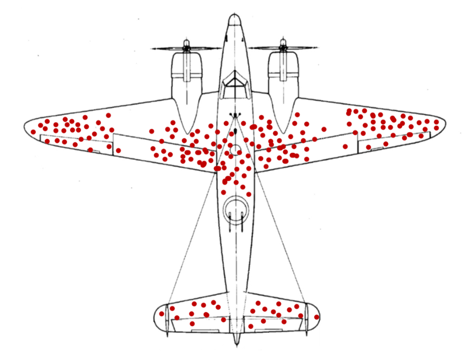

# Statistics {#statistics}

In earlier chapters, we learned some techniques for using Excel to
[clean data](#basic-data-cleaning-with-excel) and to construct common 
[statistics and charts](#basic-data-analysis-with-excel).  We 
also learned the basics of 
[probability theory](#probability-and-random-events), 
[simple random variables](#random-variables),
and [more complex random variables](#more-on-random-variables).

Our next step is to bring these two sets of concepts together.  In this chapter, 
we will develop a framework for talking about data
and the statistics calculated from that data as a random process that can be
described using the theory of probability and random variables. We will also 
explore one of the most important uses of statistics: to ***estimate*** or guess 
at the value at, some unknown parameter of the DGP.

::: goals
***Chapter goals***

In this chapter we will:

- Model the random process generating a data set.
- Apply and interpret the assumption of simple random sampling, and compare
  it to other sampling schemes.
- Use the theory of probability and random variables to model the statistics
  we have calculated from a data set.
- Calculate and interpret the mean and variance of a statistic from
  its sampling distribution.
- Calculate and interpret bias and mean squared error.
- Explain the law of large numbers, Slutsky's theorem, and the idea of a consistent
  estimator.
:::

## Data and the data generating process

Having invested in all of the probabilistic preliminaries, we can finally talk about
data.  Suppose for the rest of this chapter that we have a data set 
called $D_n$. 

In this chapter, we will assume that $D_n = (x_1,x_2,\ldots,x_n)$ 
is a data set with one variable and $n$ observations.  We use 
$x_i$ to refer to the value of our variable for an arbitrary 
observation $i$.

In real-world analysis, data tends to be more complex:

- In most applications, it will be a simple table of numbers with 
  $n$ observations (rows) and $K$ variables (columns). 
- However, it is occasionally something more abstract.  For example,
  the data set at https://www.kaggle.com/c/dogs-vs-cats is a big
  folder full of dog and cat photos.
  - A great deal of research in the statistical field of machine 
    learning has been focused on developing methods for determining 
    if a particular photo in this data set shows a dog or a cat.  

Although our examples will all be based on simple data sets, many
of our concepts and results can be applied to more complex data.

::: example
**Data from 3 roulette games**

Suppose we have a data set $D_3$ providing the result of $n=3$ independent games of roulette.  Let $b_i$ be the outcome in game $i$, and 
let $x_i$ be the result of a bet on red:
  $$x_i = I(b_i \in RED) = \begin{cases} 1 & b_i \in RED \\ 0 & b_i \notin RED \\ \end{cases}$$
Then $D_n = (x_1,x_2,x_3)$. For example, if red loses the first
two games and wins the third game we have $D_n = (0,0,1)$.
:::

Our data set $D_n$ is a set of $n$ *numbers*, but we can also think of 
it as a set of $n$ *random variables* with unknown joint distribution 
$P_D$. The distinction here is a hard one for students to make, so give 
it some thought before proceeding.

The joint distribution of $D_n$ is called its ***data generating process*** 
or DGP. The exact DGP is assumed to be unknown, but we usually have at 
least some information about it.

::: example
**The DGP for the roulette data**

The joint distribution of $D_n$ can be derived. Let 
  $$p = \Pr(b \in Red)$$
We showed in a previous chapter that $p \approx 0.486$ if the roulette
wheel is fair.  But rather than assuming it is fair, let's treat $p$
as an unknown parameter.

The PDF of $x_i$ is
  $$f_x(a) = \begin{cases}(1-p) & a = 0 \\ p & a = 1 \\ 0 & \textrm{otherwise} \\ \end{cases} $$
Since the random variables in $D_n$ are independent, their
joint PDF is:
  $$\Pr(D_n) = f_x(x_1)f_x(x_2)f_x(x_3) = p^{x_1+x_2+x_3}(1-p)^{3-x_1-x_2-x_3}$$
Note that even with a small data set of a simple random variable,
the joint PDF is not easy to calculate.  Once we get into larger
data sets and more complex random variables, it can get very 
difficult.  That's OK, we don't usually need to calculate it - we
just need to know that it *could* be calculated.
:::

### Simple random sampling

In order to model the data generating process, we need to model the entire 
joint distribution of $D_n$.  As mentioned earlier, this means we must
model both:

- The marginal probability distribution of each $x_i$
- The relationship between the $x_i$'s

Fortunately, we often can simplify this joint distribution quite a bit 
by assuming that $D_n$ 
is ***independent and identically distributed*** (IID) 
or a ***simple random sample*** from a large ***population***.

A simple random sample has two features:

1. **Independent**: Each $x_i$ is independent of the others.
2. **Identically distributed**: Each $x_i$ has the same (unknown)
   marginal distribution.

This implies that its joint PDF can be written:
  $$\Pr(D_n = (a_1,a_2,\ldots,a_n)) = f_x(a_1)f_x(a_2)\ldots f_x(a_n)$$
where $f_x(a) = \Pr(x_i = a)$ is just the marginal PDF of a single 
observation. Independence allows us to write the joint PDF as the 
product of the marginal PDFs for each observation, and identical 
distribution allows us to use the same marginal PDF for each 
observation.

The reason we call this "independent and identically distributed"
is hopefully obvious, but what does it mean to say we have a 
"random sample" from a "population"? Well, one simple way of 
generating an IID sample is to:

1. Define the population of interest, for example all Canadian residents.
2. Use some purely random mechanism[^602] to choose a small subset of cases
  from this population.
   - The subset is called our ***sample***
   - "Purely random" here means some mechanism like a computer's 
     random number generator, which can then be used to 
     dial random telephone numbers or select cases from a list.
3. Collect data from every case in our sample, usually by
   contacting them and asking them questions (survey).

It will turn out that a moderately-sized random sample provides 
surprisingly accurate information on the underlying population.

[^602]: As a technical matter, the assumption of independence requires
  that we sample *with replacement*. This means we allow
  for the possibility that we sample the same case more than once.
  In practice this doesn't matter as long as the sample is small 
  relative to the population.
  
::: example
**Our roulette data is a random sample**

Each observation $x_i$ in our roulette data is an independent
random draw from the $Bernouilli(p)$ distribution where 
$p = \Pr(b \in Red)$.

Therefore, this data set satisfies the criteria for a simple 
random sample.
:::

### Time series data

Our employment data set is an example of ***time series*** data; it is made of
observations of each variable at regularly-spaced points in time.
Most macroeconomic data - GDP, population, inflation, interest rates - are
time series.

Time series have several features that are inconsistent with the random 
sampling assumption:

- They usually have clear *time trends*.  
  - For example, Canada's real GDP has been steadily growing for as 
    long as we have data.
  - This violates "identically distributed" since 2010 GDP is drawn 
    from a distribution with a higher expected value than the
    distribution for 1910 GDP.
- They usually have clear recurring cyclical patterns or *seasonality*.  
  - For example, unemployment in Canada is usually lower from September 
    through December.
  - This also violates "identically distributed" since February 
    unemployment has a higher expected value than November 
    unemployment.
- They usually exhibit what is called *autocorrelation*. 
  - For example, shocks to the economy that affect GDP in one month or
    quarter (think of COVID or a financial crisis) are likely to have 
    a similar (if smaller) effect on GDP in the next month or quarter.  
  - This violates "independence" since nearby time periods are positively
    correlated.

We can calculate statistics for time series, and we already did in Chapter
\@ref(basic-data-analysis-with-excel).  However, time series data 
often requires more advanced techniques than we will learn in this 
class.  ECON 433 addresses time series data.

### Other sampling models

Not all useful data sets come from a simple random sample or a time series. For 
example:

- A ***stratified sample*** is collected by dividing the population into
  *strata* (subgroups) based on some observable characteristics, and then randomly
  sampling a predetermined number of cases within each strata. 
  - Most professional surveys are constructed from stratified samples 
    rather than random samples.
  - Stratified sampling is often combined with *oversampling* of 
    some smaller strata that are of particular interest. 
    - The LFS oversamples residents of Prince Edward Island (PEI) because a
      national random sample would not catch enough PEI residents to
      accurately measure PEI's unemployment rate.
    - Government surveys typically oversample disadvantaged groups.
  - Stratified samples can usually be handled as if they were from
    a random sample, with some adjustments.
- A ***cluster sample*** is gathered by dividing the population
  into ***clusters***, randomly selecting some of these clusters, and
  sampling cases within the cluster.  
  - Educational data sets are often gathered this way: we pick a random 
    sample of schools, and then collect data from each student 
    within those schools.
  - Cluster samples can usually be handled as if they were from
    a random sample, with some adjustments.
- A ***census*** gathers data on every case in the population. 
  - For example, we might have data on all 50 US states, or all 
    10 Canadian provinces, or all of the countries of the world. 
  - Data from administrative sources such as tax records or 
    school records often cover the entire population of interest as well. 
  - Censuses are often treated as random samples from some hypothetical
    population of "possible" cases.
- A ***convenience sample*** is gathered by whatever method is convenient.
  - For example, we might gather a survey from people who walk by,
    or we might recruit our friends to participate in the survey.
  - Convenience samples are the worst-case scenario; in many cases they
    simply aren't usable for accurate statistical analysis.
 
Many data sets combine several of these elements.  For example,
Canada's unemployment rate is calculated using data from the 
Labour Force Survey (LFS). The LFS is built from a stratified 
sample of the civilian non-institutionalized working-age population 
of Canada. There is also some clustering: the LFS will typically
interview whole households, and will do some geographic clustering
to save on travel costs. The LFS is gathered monthly, and the
resulting unemployment rate is a time series.

### Sample selection and representativeness

Random samples and their close relatives have the feature that they
are ***representative*** of the population from which they are 
drawn. In a sense that will be made more clear over the next few chapters,
any sufficiently large random sample "looks just like" the population.

Unfortunately, a simple random is quite difficult to collect from
humans. Even if we are able to randomly select cases, we often
run into the following problems:

- ***Nonresponse*** occurs when a sampled individual does not provide
  the information requested by the survey
  - ***Survey-level*** nonresponse occurs when the sampled individual does not
    answer any questions. 
      - This can occur if the sampled individual cannot be found, refuses 
        to answer, or cannot answer (for example, is incapacitated due to
        illness or disability).
      - Recent response rates to telephone surveys have been around 9\%,
        implying over 90\% of those contacted do not respond.
  - ***Item-level*** nonresponse occurs when the sampled individual does 
    not answer a particular question.  
    - This can occur if the respondent refuses to answer, or the 
      question is not applicable or has no valid answer.
    - Item-level nonresponse is particularly common on sensitive questions
      including income.
- ***Censoring*** occurs when a particular quantity of interest cannot be
  observed for a particular case.  Censored outcomes are extremely common
  in economics, for example:
    - In labour market analysis, we cannot observe the market wage for
      individuals who are not currently employed. 
    - In supply/demand analysis, we only observe quantity supplied and
      quantity demanded at the current market price.
      
When observations are subject to nonresponse or censoring, we must intepret
the data carefully.

::: example
**Wald's airplanes**

Abraham Wald was a Hungarian/American statistician and econometrician who made 
important contributions to both the theory of statistical inference and the development
of economic index numbers such as the Consumer Price Index. 

Like many scientists of his time, he advised the US government during
World War II. As part of his work, he was provided with data on combat damage 
received by airplanes, with the hopes that the data could be used to help make
the planes more robust to damage.  The data looked something like this (this 
isn't the real data, just a visualization constructed for the example):

Seeing this data, some military analysts concluded that planes were mostly
being shot in the wings and in the middle of the fuselage (body), and
that they should be reinforced with additional steel in these locations.

Wald quickly realized that this was wrong: the data were taken from
planes *that returned*, which is not a random sample of planes
that went out. Planes were probably shot in the nose, the engines,
and the back of the fuselage just as often as anywhere else, but 
they did not appear often in the data because they crashed. Wald's 
insight led to a counter-intuitive policy recommendation: reinforce the 
parts of the plane that rarely show damage.
:::

There are two basic solutions to nonresponse and censoring:

- ***Imputation***: we assume or ***impute*** values for all missing 
  quantities. For example, we might assume that the wage of each 
  non-employed worker is equal to the average wage among employed workers
  with similar characteristics.
- ***Redefinition***: we redefine the population so that our data
  can be correctly interpreted as a random sample from that population.
  For example, instead of having a random sample of *Canadians*, we can
  interpret our data as a random sample of 
  *Canadians who would answer these questions if asked*.

This is not an issue that has a purely technical solution, but requires
careful thought instead.  If we are imputing values, do we believe that
our imputation method is reasonable?  If we are redefining the population,
is the redefined population one we are interested in?  There is no right
or wrong answers to these questions, and sometimes our data are simply
not good enough to answer our questions.

:::fyi
**Nonresponse bias in recent US elections**

Going into both the 2016 and 2020 US presidential elections, polls
indicated that the Democratic candidate had a substantial lead over
the Republican candidate: 

- Hillary Clinton led Donald Trump by 4-6\% nationally in 2016 
- Joe Biden led Trump by 8\% nationally in 2020.  

The actual vote was much closer:

- Clinton won the popular vote (but lost the election) by 2\%
- Biden won the popular vote (and won the election) by about 4.5\%.  

The generally accepted explanation among pollsters for the clear 
disparity between polls and voting is systematic nonresponse: for
some reason, Trump voters are less likely to respond to
polls. Since most people do not respond to standard telephone polls
any more (response rates are typically around 9\%), it does not
take much difference in response rates to produce a large difference
in responses.  For example, suppose that:

- We call 1,000 voters
- These voters are equally split, with 500 supporting Biden and 500
  supporting trump.
- 10\% of Biden voters respond (50 voters)
- 8\% of Trump voters respond (40 voters)

The overall response rate is 9\% (similar to what we usually see in surveys),
Biden has the support of $50/90 = 56\%$ of the respondents
while Trump has the support of $40/90 = 44\%$.  Actual support is
even, but the polls show a 12 percentage point gap in support, entirely
because of the small difference in response rates.

Polling organizations employ statisticians who are well aware
of this problem, and they made various adjustments after 2016 to address
it. For example, most now weight their analysis by education, 
since more educated people tend to have a higher response rate.
Unfortunately, the 2020 results indicate that this adjustment was 
not enough.  Some pollsters have argued that it makes
more sense to just assume the nonresponse bias is 2-3\% and adjust 
the numbers by that amount directly.
:::

## Statistics and their properties

Suppose we have some ***statistic*** $s_n =s(D_n)$, i.e., a number 
that is calculated from the data.

  - Since the data is observed/known, the value of the statistic
    is observed/known.
  - Since the elements of $D_n$ are random variables, $s_n$ is also 
    a random variable with a well-defined (but unknown) probability
    distribution that depends on the unknown DGP.

::: example
**Roulette wins**

In our roulette example, the total number of wins is:
  $$R = x_1 + x_2 + x_3$$
Since this is a number calculated from our data, it is a statistic.

Since $x_i \sim Bernoulli(p)$, we can show that $R \sim Binomial(3,p)$. 
:::

### Some important statistics

I will use $s_n$ to represent an abstract statistic, but we will often
use other notation to talk about specific statistics.

The most important statistic is the ***sample average*** which is 
defined as: 
  $$\bar{x}_n = \frac{1}{n} \sum_{i=1}^n x_i$$
We will also consider several other commonly-used univariate 
statistics:

- The ***sample variance*** of $x_i$ is defined as: 
  $$s_x^2 = \frac{1}{n-1} \sum_{i=1}^n (x_i - \bar{x})^2$$
  A closely-related statistic is the ***sample standard deviation***
  $s_x = \sqrt{s_x^2}$ which is the square root of the sample variance.
- The ***sample frequency*** or ***relative sample frequency***
  of the event $x_i \in A$ is defined as the proportion of cases
  in which the event occurs:
  $$\hat{f}_A = \frac{1}{n} \sum_{i=1}^n I(x_i \in A)$$
  A closely-related statistic is the ***absolute sample frequency***
  $n\hat{f}_A$ which is the *number* of cases in which the event 
  occurs.
- The ***sample median*** of $x_i$ is defined as:
  $$\hat{m}_x = m: \begin{cases} \hat{f}_{x < m} \leq 0.5 \\ \hat{f}_{x > m} \leq 0.5 \\ \end{cases}$$

### The sampling distribution

Since the data itself is a collection of random variables, any statistic
calculated from that data is also a random variable, with a probability
distribution that can be derived from the DGP. 

::: example
**The sampling distribution of the sample frequency**

Calculating the exact probability distribution of most statistics is 
quite difficult, but it is easy to do for the sample frequency. Let 
$p =\Pr(x_i \in A)$.
Then:
  $$n\hat{f}_A \sim Binomial(n,p)$$
In other words, we can calculate the exact probability distribution of
the sample frequency using the formula for the binomial distribution.
:::

Unfortunately, most statistics typically have sampling distributions that
are quite difficult to calculate.  

::: fyi
To see why the sampling distribution of a statistic is so difficult
to calculate, suppose we have a discrete random variable $x_i$ whose 
support $S_x$ has five elements. Then we need to calculate the sampling
distribution of our statistic by adding its probability up across
the support of $D_n$.  The support has $5^n$ elements, a number that 
can quickly get very large.  

For example, a typical data set in 
microeconomics has at least a few hundred or a few thousand observations.
With 100 observations, $D_n$ can take on $5^{100} \approx 7.9 \times 10^{69}$
(that's 79 followed by 68 zeros!) distinct values.  With 
1,000 observations , $D_n$ can take on $5^{1000}$ distinct values,
a number too big for Excel to even calculate.
:::

### The mean and variance

If our statistic has a probability distribution, it (usually) has a mean
and variance as well. Under some circumstances, we can calculate them.

::: example
**The mean of the sample average**

Let $\mu_x = E(x_i)$ be the mean of $x_i$  Then the mean of $\bar{x}$ is:
$$E(\bar{x}_n) = E\left( \frac{1}{n} \sum_{i=1}^n x_i\right) = \frac{1}{n} \sum_{i=1}^n E\left( x_i\right) = \frac{1}{n} \sum_{i=1}^n \mu_x = \mu_x$$
:::

This is an important and general result in statistics. The mean of the 
sample average in a random sample is identical to the mean of the random 
variable being averaged.
  $$E(\bar{x}_n) = E(x_i)$$
We have shown this property specifically for a random sample, but it 
holds under many other sampling processes.

The variance of the sample average is not equal to the variance 
of the random variable being averaged, but they are closely related.

::: example
**The variance of the sample average**

To keep the math simple, suppose we only have $n = 2$ observations.  Then
the sample average is:
  $$\bar{x} = \frac{1}{2}(x_1 + x_2)$$
By our earlier formula for the variance:
  \begin{align}
    var(\bar{x}) &= var\left(\frac{1}{2}(x_1 + x_2)\right) \\
      &= \left(\frac{1}{2}\right)^2 var(x_1 + x_2) \\
      &= \frac{1}{4} \left( \underbrace{var(x_1)}_{\sigma_x^2} + 
          2 \underbrace{cov(x_1,x_2)}_{0 \textrm{(independence)}} + \underbrace{var(x_2)}_{\sigma_x^2} \right) \\
      &= \frac{1}{4} \left( 2 \sigma_x^2 \right) \\
      &= \frac{\sigma_x^2}{2} \\
  \end{align}
:::

More generally, the variance of the sample average in a random sample
of size $n$ is:
  $$var(\bar{x}_n) = \frac{\sigma_x^2}{n}$$
where $\sigma_x^2 = var(x_i)$.

Other commonly-used statistics also have a mean and variance.

::: example
**The mean and variance of the sample frequency**

Since the absolute sample frequency has the binomial distribution, 
we have already seen its mean and variance.  Let $p = \Pr(x_i \in A)$.
Then $n\hat{f}_A \sim Binomial(n,p)$ and:
  $$E(n\hat{f}_A) = np$$
  $$var(n\hat{f}_A) = np(1-p)$$

Applying the usual rules for expected values, the mean and variance of
the relative sample frequency is:
  $$E(\hat{f}_A) = \frac{E(n\hat{f}_A)}{n} = \frac{np}{n} = p$$ 
  $$var(\hat{f}_A) = \frac{var(n\hat{f}_A)}{n^2} = \frac{np(1-p)}{n^2} = \frac{p(1-p)}{n} $$
:::

## Estimation {#estimation}

Statistics are often used to estimate, or guess the value of, some unknown 
feature of the population or DGP.

### Parameters and estimators 

A ***parameter*** is an unknown number characterizing a DGP. 

::: example
**Examples of parameters**

Sometimes a single parameter completely describes the DGP:

- In our roulette data set, the joint distribution of the data
  depends only on the single parameter $p = \Pr(b \in Red)$.
  
Sometimes a group of parameters completely describe the DGP:

- If $x_i$ is a random sample from the $U(L,H)$ distribution,
  then $L$ and $H$ are both parameters.
  
And sometimes a parameter only partially describes the DGP

- If $x_i$ is a random sample from some unknown distribution
  with unknown mean $\mu_x = E(x_i)$, then $\mu_x$ is a parameter.
- If $x_i$ is a random sample from some unknown distribution
  with unknown median $m_x = q_{0.5}(x_i)$, then $m_x$ is a parameter.
:::

Typically there will be particular parameters whose value we wish
to know.  Such a parameter is called a ***parameter of interest***.
Our model may include other parameters, which are typically called
*auxiliary parameters* or *nuisance parameters*. 

An ***estimator*** is a statistic that is being used to ***estimate***
(guess at the value of) an unknown parameter of interest.  The distinction
between estimator and estimate is a subtle one: we use "estimate" when
talking about our statistic as a number calculated for a specific data set
and "estimator" when talking about it as a random variable.

::: example
**Commonly used estimators**

Our four example statistics are commonly used as estimators:

1. The relative sample frequency $\hat{f}_A$ is typically used as an
  estimator of the probability $p_A = \Pr(x_i \in A)$
2. The sample average $\bar{x}$ is typically used as an estimator
  of the population mean $\mu_x = E(x_i)$.
3. The sample variance $s_x^2$ is typically used as an estimator of
  the population variance $\sigma_x^2 = var(x_i)$.
4. The sample median $\hat{m}_x$ is typically used as an estimator of the
  population median $m_x = q_{0.5}(x_i)$. 

:::

Estimators are statistics, so they have all the usual characteristics of a 
statistic, including a sampling distribution, a mean, a variance, etc.

In addition estimators have properties specific to their purpose as
a statistic that is supposed to take on a value close to the unknown
parameter of interest.

### Sampling error

Let $s_n$ be a statistic we are using as an estimator of some parameter 
of interest $\theta$.  We can define its ***sampling error*** as:
  $$err(s_n) = s_n - \theta$$
In principle, we want $s_n$ to be a good estimator of $\theta$, i.e.,
we want the sampling error to be as close to zero as possible.  

There are several major complications to keep in mind:

1. Since $s_n$ is a random variable with a probability distribution, 
   $err(s_n)$ is also a random variable with a probability distribution. 
2. Since the value of $\theta$ is unknown, the value of $err(s_n)$ is also 
   unknown.

Always remember that $err(s_n)$ is not an inherent property of the
statistic - it depends on the relationship between the statistic
and the parameter of interest. A given statistic may be a good
estimator of one parameter, and a bad estimator of another parameter.

### Bias 

In choosing an estimator, we can consider several criteria.

The first is the ***bias*** of the estimator, which is defined as
its expected sampling error:
\begin{align}
  bias(s_n) &= E(err(s_n)) \\
    &= E(s_n - \theta) \\
    &= E(s_n) - \theta
\end{align}
Note that bias is always defined relative to the parameter we wish 
to estimate, and is not an inherent property of the statistic.

Ideally we would want $bias(s_n)$ to be zero, in which case
we would say that $s_n$ is an ***unbiased*** estimator of $\theta$.

::: example
**Two unbiased estimators of the mean**

Consider the sample average $\bar{x}_n$ in a random sample
as an estimator of the parameter $\mu_x = E(x_i)$. The bias is:
  $$bias(\bar{x}_n) = E(\bar{x}_n) - \mu_x = \mu_x - \mu_x = 0$$
That is, the sample average is an unbiased estimator of the population mean.

However, it is not the only unbiased estimator.  For example, suppose we 
simply take the value of $x_i$ in the first observation and throw
away the rest of the data.  This "first observation estimator" is 
easier to calculate than the sample average, and is also an unbiased 
estimator of $\mu_x$:
  $$bias(x_1) = E(x_1) - \mu_x = \mu_x - \mu_x = 0$$
This example illustrates a general principle: there is rarely exactly
one unbiased estimator.  There are either none, or many.
:::

::: example
**An unbiased estimator of the variance**

The sample variance is an unbiased estimator of the population 
variance:
  $$E(s_x^2) = \sigma_x^2 = var(x_i)$$
This is not hard to prove, but I will skip it for now.
:::

If there are multiple unbiased estimators available for a given 
parameter, we need to apply a second criterion to choose 
one.  A natural second criterion is the ***variance*** of 
the estimator:
  $$var(s_n) = E[(s_n-(E(s_n))^2]$$
If $s_n$ is unbiased, then a low variance means it is usually
close to $\theta$, while a high variance means that it is
often either much larger or much smaller than $\theta$. Clearly,
low variance is better than high variance.

The ***minimum variance unbiased estimator*** (MVUE) of a parameter is
the unbiased estimator with the lowest variance. 

::: example
**The variance of the sample average and and first observation estimators**

In our previous example, we found two unbiased estimators for the
mean, the sample average $\bar{x}_n$ and the first observation $x_1$.

The variance of the sample average is:
  $$var(\bar{x}_n) = \sigma^2/n$$
and the variance of the first observation estimator is:
  $$var(x_1) = \sigma^2$$
For any $n > 1$, the sample average $\bar{x}_n$ has lower variance than 
the first observation estimator $x_1$. Since they are both unbiased,
it is the preferred estimator of the two.

In fact, we can prove that $\bar{x}_n$ is the 
minimum variance unbiased estimator of $\mu_x$.
:::

### Mean squared error

Unfortunately, once we move beyond the simple case of estimating 
the population mean, we run into several complications:

The first complication is that an unbiased estimator may not 
exist for a particular parameter of interest. If there is
no unbiased estimator, there is no minimum variance unbiased 
estimator. So we need some other way of choosing an estimator.  

::: example
**The sample median**

There is no unbiased estimator of the median of a random variable 
with unknown distribution.  To see why, consider the simplest 
possible data set: a random sample of size $n=1$ on the random 
variable $x_i \sim Bernoulli(p)$, where $0 < p < 1$.  The median 
of $x_i$ in this case is:
  $$m_x = I(p > 0.5)$$

First we show that the sample median is a biased estimator
of $m_x$.  The sample median is:
  $$\hat{m}_x = x_1$$ 
and its expected value is:
  $$E(\hat{m}_x) = E(x_1) = p \neq I(p > 0.5)$$
So the sample median $\hat{m}_x$ is a biased estimator for 
the population median $m_x$.

More generally, any statistic calculated from this data set 
must take the form $s = a_0 + a_1x_1$, where $s = a_0$ when
$x_1 = 0$ and $s = a_0+a_1$ is its value when $x_1 = 1$. This
statistic has expected value $E(a_0 + a_1x_1) = a_0 + a_1p$, so
any unbiased estimator would need to solve the equation:
  $$a_0 + a_1 p = I(p > 0.5)$$
and there is no such solution.
:::

The second complication is that we often have access to an unbiased
estimator and a biased estimator with lower variance.

::: example
**The relationship between age and earnings**

One common question in labour economics is how earnings vary by 
various characteristics such as age.

Suppose we have a random sample of 800 Canadians, and we want to 
estimate the earnings of the average 35-year old Canadian. Assuming
for simplicity that ages are equally-spaced between 0 and 80, our
data set will have only 10 Canadians at each age.  So we have several 
options:

  - Average earnings of the 10 35-year-olds in our data.

This estimator will be unbiased, but 10 observations isn't
very much and so its variance will be high. We can reduce the 
variance by adding more observations from people who are *almost*
35 years old:
  
  - Average earnings of the  30 34-36 year olds in our data.
  - Average earnings of the 100 30-39 year olds in our data.
  - Average earnings of the 800  0-80 year olds in our data. 

By including more data, these estimators will have lower variance
but will introduce bias. My guess is introducing 34 and 36 year
olds is a good idea since they probably have similar earnings to 
35 year olds, but including children and the elderly is not such
a good idea.
:::

This suggests that we need a criterion that

  - Can be used to choose between biased estimators
  - Can choose slightly biased estimators with low variance
    over unbiased estimators with high variance.

The ***mean squared error*** of an estimator is defined as the
expected value of the squared sampling error:
\begin{align}
  MSE(s_n) &= E[err(s_n)^2] \\
    &= E[(s_n-\theta)^2] \\
    &= var(s_n) + [bias(s_n)]^2
\end{align}
The MSE criterion allows us to choose a biased estimator with low variance
over an unbiased estimator with high variance, and also allows us to choose
between biased estimators when no unbiased estimator exists.

::: example
**The MSE of the sample mean and first observation estimators**

The mean squared error of the sample average is:
  $$MSE(\bar{x}_n) = var(\bar{x}_n) + [bias(\bar{x}_n)]^2 = \frac{\sigma_x^2}{n} + 0^2 = \frac{\sigma_x^2}{n}$$
and the mean squared error of the first observation estimator is:
  $$MSE(x_1) = \sigma_x^2$$
The sample average is the preferred estimator by the MSE criterion,
so in this case we get the same result as applying the MVUE criterion.
:::

### Standard error

Parameter estimates are typically reported along with their
***standard errors***.  The standard error of a statistic is
an estimate of its standard deviation.

::: example
**The standard error of the average**

We have shown that the sample average provides a good estimate
of the population mean, and that its variance is:
  $$var(\bar{x}_n) = \frac{\sigma_x^2}{n} = \frac{var(x_i)}{n}$$
Since $s_x^2$ is an unbiased estimator of $var(x_i)$ we can use
it to construct an unbiased estimator of $var(\bar{x})$:
  $$E\left(\frac{s_x^2}{n}\right) = \frac{E(s_x^2)}{n} = \frac{var(x_i)}{n} = var(\bar{x}_n)$$

We might also want to estimate the standard deviation of $\bar{x}$. A natural
approach would be to take the square root of the estimator above, yielding:
  $$se(\bar{x}_n) = \frac{s_x}{\sqrt{n}}$$
This is the conventional formula for the standard error of the sample
average, and is typically reported next to the sample average.
:::

Standard errors are usually biased estimators of the statistic's true standard
deviation, but the bias is typically small.

## The law of large numbers

So far, we have described statistics and estimators in terms
of their probability distribution and the mean, variance
and mean squared error associated with that probability 
distribution. 

We are able to do this fairly easy with both sample averages 
and sample frequencies (which are also sample averages)
because they are sums. Unfortunately, this is not so easy 
with other statistics (e.g. standard errors, medians, 
percentiles, etc.) that are nonlinear functions of the data.

In order to deal with those statistics, we need to construct
approximations based on the ***asymptotic*** properties
of the statistics.  Asymptotic properties are properties 
that hold approximately, with the approximation getting 
closer and closer to the truth as the sample size gets 
larger.  

Properties that hold exactly for any sample size 
are sometimes called ***exact*** or ***finite sample***
properties. All of the results we have discussed
so far are finite sample results.

We will state two main asymptotic results in this chapter: the law of large
numbers and Slutsky's theorem.  A third asymptotic result called the central 
limit theorem will be stated in the next chapter. All three results rely on 
relatively sophisticated math, so I will not expect you to do much with 
them.  Please focus on the intuition and interpretation and don't worry 
too much about the math.

### Defining the LLN

The ***law of large numbers*** (LLN) says that for a large enough random
sample, the sample average is almost identical to the corresponding
population mean.  

In order to state the LLN, we need to introduce some concepts. Consider
a data set $D_n$ of size $n$, and let $s_n$ be some statistic
calculated from $D_n$. We say that $s_n$ ***converges in probability*** 
to some constant $c$ if:
  $$\lim_{n \rightarrow \infty} \Pr( |s_n - c| < \epsilon) = 1$$
for any positive number $\epsilon > 0$.

Intuitively, what this means is that for a sufficiently large $n$ 
(the $\lim_{n \rightarrow \infty}$ part), $s_n$ is almost certainly
(the $\Pr(\cdot) = 1$ part) very close to $c$
(the $|s_n-c| < \epsilon$ part).

We have a compact way of writing convergence in probability:
  $$w_n \rightarrow^p c$$
means that $w_n$ converges in probability to $c$. 

Having defined our terms we can now state the law of large numbers.

::: fyi
**LAW OF LARGE NUMBERS**: Let $\bar{x}_n$ be the sample average 
from a random sample of size $n$ on the random variable $x_i$ with
mean $E(x_i) = \mu_x$. Then
  $$\bar{x}_n \rightarrow^p \mu_x$$
:::

::: example
**The LLN in the economy**

The law of large numbers is extremely powerful and important, as it
is the basis for the gambling industry, the insurance industry,
and much of the banking industry. 

A casino works by taking in a *large* number of *independent* small
bets. As we have seen for the case of roulette, these bets
have a small house advantage, so their average benefit to 
the casino is positive. The casino can lose any bet, but the 
LLN virtually guarantees that the gains will outweigh the 
losses as long as the casino takes in a large enough number
of independent bets.

An insurance company works almost the same as a casino. Each of
us faces a small risk of a catastrophic cost: a house that
burns down, a car accident leading to serious injury, etc.
Insurance companies collect a little bit of money from each
of us, and pay out a lot of money to the small number of 
people who have claims. Although the context is quite different,
the underlying economics are identical to those of a casino:
the insurance company prices its products so that its revenues 
exceed its expected payout, and takes on a large number of
independent risks.

Sometimes insurance companies do lose money, and even go 
bankrupt. The usual cause of this is a big systemic 
event like a natural disaster, pandemic or financial crisis
that affects everyone.  Here the independence needed for the LLN
does not apply.
:::

### Consistent estimation

The law of large numbers applies to the sample mean, but we are interested 
in other estimators as well.

In general, we say that the statistic $s_n$ is a ***consistent*** 
estimator of a parameter $\theta$ if:
$$s_n \rightarrow^P \theta$$
It will turn out that most of the statistics we use are consistent 
estimators of the thing we typically use them to estimate. 

The key to this property is a result called ***Slutsky's theorem***.
Slutsky's theorem roughly says that if the law of large numbers
applies to a statistic $s_n$, it also applies to $g(s_n)$ for any continuous 
function $g(\cdot)$.

::: fyi
**SLUTSKY THEOREM**: Let $g(\cdot)$ be a continuous function. Then:
  $$s_n \rightarrow^p c \implies g(s_n) \rightarrow^p g(c)$$
:::

What is the importance of Slutsky's theorem?  Most commonly used statistics
can be written as continuous functions of a sample average (or several 
sample averages). Slutsky's theorem extends the LLN to these statistics, and
ensures that these commonly used statistics are consistent estimators of 
the corresponding population parameter.  For example:

- The sample variance is a consistent estimator of the population variance:
  $$s_x^2 \rightarrow^p var(x)$$
- The sample standard deviation is a consistent estimator of the population standard deviation:
  $$s_x \rightarrow^p sd(x)$$
- The relative sample frequency is a consistent estimator of the population probability:
  $$\hat{f}_A \rightarrow^p \Pr(A)$$
- The sample median is a consistent estimator of the population median, and all other sample
  quantiles are consistent estimators of the corresponding population quantile.

The math needed to make full use of Slutsky's theorem and prove these results is beyond the 
scope of this course, so all I am asking here is for you to know that it can be
used for this purpose.

## Chapter review {-#review-statistics}

In this chapter we have learned to model a data generating process,
describe the probability distribution of a statistic,
interpret a statistic as an estimator of some unknown parameter of 
the underlying data generating process.

Almost by definition, estimators are rarely identical to the parameter
of interest, so any conclusions based on estimators have a degree of
uncertainty.  To describe this uncertainty in a rigorous and quantitative
manner, we will next learn some principles of 
[statistical inference](#statistical-inference). 

## Practice problems {-#problems-statistics}

Answers can be found in the [appendix](#answers-statistics).

**SKILL #1: Identify whether a data set is a random sample**

1. Suppose we have a data set $D_n = (x_1,x_2)$ of size $n = 2$.  For
   each of the following conditions, identify whether it implies
   that $D_n$ is (i) definitely a random sample; (ii) definitely
   not a random sample; or (iii) possibly a random sample.
   a. The two observations are independent and have the same mean 
      $E(x_1) = E(x_2) = \mu_x$.
   b. The two observations are independent and have the same mean 
      $E(x_1) = E(x_2) = \mu_x$ and variance $var(x_1)=var(x_2)=\sigma_x^2$.
   c. The two observations are independent and have different means 
      $E(x_1) \neq E(x_2)$.
   d. The two observations have the same PDFs, and are independent.
   e. The two observations have the same PDFs, and have 
      $corr(x_1,x_2) = 0$
   f. The two observations have the same PDFs, and have $cov(x_1,x_2) > 0$

**SKILL #2: Classify data sets by sampling types**

2. Identify the sampling type (random sample, time series, stratified sample,
   cluster sample, census, convenience sample) for each of the following data 
   sets.
   a. A data set from a survey of 100 SFU students who I found waiting in line
      at Tim Horton's.
   b. A data set from a survey of 1,000 randomly selected SFU students.
   c. A data set from a survey of 100 randomly selected SFU students from each
      faculty.
   d. A data set that reports total SFU enrollment for each year from 2005-2020.
   e. A data set from administrative sources that describes demogrphic information
      and postal code of residence for all SFU students in 2020.

**SKILL #3: Describe the probability distribution of a very simple data set**

3. Suppose we have a data set $D_n = (x_1,x_2)$ that is a random sample
   of size $n = 2$ on the random variable $x_i$ which has discrete PDF:
    \begin{align}
      f_x(a) &= \begin{cases}
                  0.4 & a = 1 \\
                  0.6 & a = 2 \\
              \end{cases}
    \end{align}
   Let $f_{D_n}(a,b) = \Pr(x_1=a \cap x_2 = b)$ be the joint PDF of the data set
   a. Find the support $S_{D_n}$
   a. Find $f_{D_n}(1,1)$
   b. Find $f_{D_n}(2,1)$
   c. Find $f_{D_n}(1,2)$
   d. Find $f_{D_n}(2,2)$

**SKILL #4: Find the sampling distribution of a very simple statistic**

4. Suppose we have the data set described in question 3 above. Find the support 
   $S$ and sampling distribution $f(\cdot)$ for each of the following statistics:
    a. The sample frequency $\hat{f}_1 = \frac{I(x_1=1) + I(x_2=1)}{2}$.
    b. The sample average $\bar{x} = (x_1 + x_2)/2$.
    c. The sample variance $\hat{\sigma}_x^2 = (x_1-\bar{x})^2 + (x_2-\bar{x})^2$.
    d. The sample standard deviation $\hat{\sigma}_x = \sqrt{\hat{\sigma}_x^2}$.
    e. The sample minimum $xmin = \min(x_1, x_2)$.
    f. The sample maximum $xmax = \max(x_1, x_2)$.

**SKILL #5: Find the mean and variance of a statistic from its sampling distribution**

5. Suppose we have the data set described in question 3 above. Find the mean of each
   of the following statistics:
    a. The sample frequency $\hat{f}_1 = \frac{I(x_1=1) + I(x_2=1)}{2}$.
    b. The sample average $\bar{x} = (x_1 + x_2)/2$.
    c. The sample variance $\hat{\sigma}_x^2 = (x_1-\bar{x})^2 + (x_2-\bar{x})^2$.
    d. The sample standard deviation $\hat{\sigma}_x = \sqrt{\hat{\sigma}_x^2}$.
    e. The sample minimum $xmin = \min(x_1, x_2)$.
    f. The sample maximum $xmax = \max(x_1, x_2)$.

6. Suppose we have the data set described in question 3 above. Find the 
   variance of the following statistics:
    a. The sample frequency $\hat{f}_1 = \frac{I(x_1=1) + I(x_2=1)}{2}$.
    b. The sample average $\bar{x} = (x_1 + x_2)/2$.
    c. The sample minimum $xmin = \min(x_1, x_2)$.
    d. The sample maximum $xmax = \max(x_1, x_2)$.

**SKILL #6: Find the mean and variance of a linear statistic**

7. Suppose we have a data set $D_n = (x_1,x_2)$ that is a random sample
   of size $n = 2$ on the random variable $x_i$ which has mean $E(x_i) = 1.6$
   and variance $var(x_i) = 0.24$. Find the mean and variance of the 
   following statistics:
    a. The first observation $x_1$.
    b. The sample average $\bar{x} = (x_1 + x_2)/2$.
    c. The weighted average $w = 0.2*x_1 + 0.8*x_2$.

**SKILL #7: Distinguish between parameters and statistics**

8. Suppose $D_n$ is a random sample of size $n=100$ on a random variable
   $x_i$ which has the $N(\mu,\sigma^2)$ distribution.  Which of the following 
   are unknown parameters of the DGP? Which are statistics calculated from the 
   data?
   a. $D_n$
   b. $n$
   c. $x_i$
   d. $i$
   e. $N$
   f. $\mu$
   g. $\sigma^2$
   h. $E(x_i)$
   i. $E(x_i^3)$
   j. $var(x_i)$
   k. $sd(x_i)/\sqrt{n}$
   l. $\bar{x}$

9. Suppose we have the data set described in question 3 above. Find the 
   true value of each of the following parameters:
    a. The probability $\Pr(x_i=1)$.
    b. The population mean $E(x_i)$
    c. The population variance $var(x_i)$
    d. The population standard deviation $sd(x_i)$
    e. The population minimum $\min(S_x)$.
    f. The population maximum $\max(S_x)$.

**SKILL #8: Calculate sampling error**

10. Suppose we have the data set described in question 3 above. Suppose we use the sample maximum
      $xmax = \max(x_1,x_2)$ population maximum $\max(S_x)$.
     a. Find the support $S_{err}$ of the sampling error $err = \max(x_1,x_2) - max(S_x)$.
     b. Find the PDF $f_{err}(\cdot)$ for the sampling distribution of the 
        sampling error $err$.

**SKILL #9: Calculate bias and classify estimators as biased or unbiased**  

11. Suppose we have the data set described in question 3 above. Classify each of the 
    following estimators as biased or unbiased, and calculate the bias.
    a. The sample frequency $\hat{f}_1$ as an estimator of the probability $\Pr(x_i=1)$.
    b. The sample average $\bar{x}$ as an estiamtor of the population mean $E(x_i)$
    c. The sample variance $\hat{\sigma}_x^2$  as an estimator of the population variance $var(x_i)$
    d. The sample standard deviation $\hat{\sigma}_x$ as an estimator of the population standard deviation $sd(x_i)$
    e. The sample minimum $xmin$  as an estimator of the population minimum $\min(S_x)$.
    f. The sample maximum $xmax$  as an estimator of the population maximum $\max(S_x)$.

12. Suppose we are interested in the following parameters:  
    - The average earnings of Canadian men: $\mu_M$.
    - The average earnings of Canadian women: $\mu_W$.
    - The male-female earnings gap in Canada: $\mu_M - \mu_W$.
    - The male-famale earnings ratio in Canada: $\mu_M/\mu_W$. 
      
    and we have calculated the following statistics from a random sample of Canadians:
    - The average earnings of men in our sample $\bar{y}_{M}$
    - The average earnings of women in our sample $\bar{y}_{W}$
    - The male-female earnings gap in our sample $\bar{y}_{M} - \bar{y}_{W}$.
    - The male-female earnings ratio in our sample $\bar{y}_{M}/\bar{y}_{W}$.
      
    We already know that $\bar{y}_{M}$ is an unbiased estimator of
    $\mu_M$ and $\bar{y}_{W}$ is an unbiased estimator of $\mu_W$.
    a. Is the sample earnings gap $\bar{y}_M - \bar{y}_W$ a 
       biased or  unbiased estimator of the population gap 
       $\mu_M - \mu_W$? Explain.
    b. Is the sample earnings ratio $\bar{y}_M/\bar{y}_W$ a
       biased or unbiased estimator of the population earnings ratio 
       $\mu_M/\mu_W$? Explain.

**SKILL #10: Calculate mean squared error**  

13. Suppose we have the data set described in question 3 above. Calculate the mean squared error 
    for each of the following estimators.
    a. The sample frequency $\hat{f}_1$ as an estimator of the probability $\Pr(x_i=1)$.
    b. The sample average $\bar{x}$ as an estiamtor of the population mean $E(x_i)$
    c. The sample minimum $xmin$  as an estimator of the population minimum $\min(S_x)$.
    d. The sample maximum $xmax$  as an estimator of the population maximum $\max(S_x)$.

**SKILL #11: Apply MVUE and MSE criteria to select an estimator**  

14. Suppose you have a random sample of size $n=2$ on the random variable 
    $x$ with mean $E\left(x\right)=\mu$ and variance $var(x_i)=\sigma^2$. Two
    potential estimators of $\mu$ are the sample average
      $$\bar{x} = \frac{x_1 + x_2}{2}$$
    and the last observation
     $$x_2$$  
    a. Are these estimators biased or unbiased?
    b. Find $var(\bar{x})$
    c. Find $var(x_2)$
    d. Find $MSE(\bar{x})$
    e. Find $MSE(x_2)$
    f. Which estimator is preferred under the MVUE criterion?
    g. Which estimator is preferred under the MSE criterion?

**SKILL #12: Calculate the standard error for a sample average**  

15. Suppose that we have a random sample $D_n$ of size $n=100$ on the random
    variable $x_i$ with unknown mean $\mu$ and unknown variance $\sigma^2$. Suppose
    that the sample average is $\bar{x} = 12$ and the sample variance is 
    $\hat{\sigma}^2 = 4$.  Find the standard error of $\bar{x}$.

**SKILL #13: Explain and interpret the law of large numbers**

16. Suppose we have a random sample of size $n$ on the random variable $x_i$ with mean
    $E(x_i) = \mu$.  Which of the following statistics are consistent estimators of $\mu$?
    a. The sample average $\bar{x}$
    b. The sample median.
    c. The first observation $x_1$.
    d. The average of all even-numbered observations.
    e. The average of the first 100 observations.

