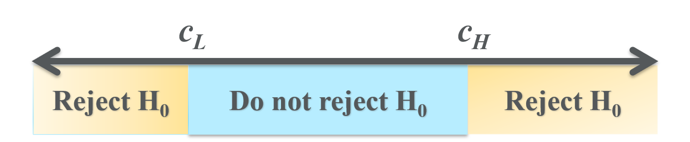

# Statistical inference {#statistical-inference}

```{r setup9, include=FALSE}
knitr::opts_chunk$set(echo = FALSE,
                      prompt = FALSE,
                      tidy = TRUE,
                      collapse = TRUE)
library("tidyverse")
```

We can use statistics to [describe a data set](#basic-data-analysis-with-excel)
and to [estimate the value of some unknown parameter](#estimation). But our
data typically provide limited evidence on the true value of any parameter
of interest: estimates are subject to sampling error of an unknown direction and
magnitude. We want to have a way of accounting for sampling error and assessing
how strong the evidence is in favor or opposition to a particular claim
about the true state of the world.

This chapter will develop a set of techniques for ***statistical inference***:
instead of providing a single best guess of a parameter's true value, we will
use data to classify particular parameter values as plausible (could be the true
value) or implausible (unlikely to be the true value).

::: {.goals data-latex=""}
**Chapter goals**

In this chapter, we will learn how to:

1. Select a parameter of interest, null hypothesis, and alternative hypothesis
   for a hypothesis test.
2. Identify the characteristics of a valid test statistic.
3. Describe the distribution of a simple test statistic under the null and
   alternative.
4. Find the size/significance of a simple test.
5. Find critical values for a test of a given size.
6. Implement and interpret a hypothesis test.
7. Construct and interpret a confidence interval.
:::

To prepare for this chapter, please review the chapter on
[statistics](#statistics).

## Questions and evidence

We often analyze data with a specific research question in mind.  That is, there
is some statement about the world whose truth we are interested in assessing.
For example, we might want to know:

- Do men earn more than women with similar skills?
- Does increasing the minimum wage reduce employment?
- Do poor economies grow faster or slower than rich ones?

Sometimes the data allow us to answer these questions decisively, sometimes not.
That is, the strength of our evidence can vary. The aim of statistical inference
is to give us a clear and rigorous way of thinking about the strength of
evidence, and a systematic way of setting a standard of evidence for reaching a
particular conclusion.

::: example
**Fair and unfair roulette games**

Suppose you work as a casino regulator for the BCLC (British Columbia Lottery
Corporation, the crown corporation that regulates all commercial gambling in
B.C.).  You have been given data with recent roulette results from a particular
casino and are tasked with determining whether the casino is running a fair
game.

Before getting caught up in math, let's think about how we might assess
evidence: 

1. A fair game implies a particular win probability for each bet.
   - For example, the win probability for a bet on red will be
     $18/37 \approx 0.486$ in a fair game.
2. The law of large numbers implies that the win rate over many games will be
   close to the win probability, but the win rate and win probability are
   unlikely to be identical in a finite sample.
   - In 100 games, we would expect red to win about 48 or 49 times in a fair
     game.
   - But these are games of chance; even in a fair game, red may win a little
     less than 48 times or a little more than 49 times.
3. In a given data set:
   - We might have results from many games, or only a few games.
   - Our results may have a win rate close to the expected rate for a fair
     game, or far from that rate.

We can put those possibilities into a table, and make an assessment of what we
might conclude from a given data set:

| Win rate                |  Many games     |    Few games            |
|:------------------------|:---------------:|:-----------------------:|
| Close to fair game rate | Probably fair   | Could be fair or unfair |
| Far from fair game rate | Probably unfair | Could be fair or unfair |

That is, we can make a fairly confident conclusion if we have a lot of evidence,
and our conclusion depends on what the evidence shows. But if we do not have a
lot of evidence, we cannot make a confident conclusion either way.

This chapter will formalize these basic ideas about evidence.
:::

## Hypothesis tests

We will start with hypothesis tests. The idea of a hypothesis test is to
determine whether the data rule out or ***reject*** a specific value of the
unknown parameter of interest $\theta$.

A hypothesis test consists of the following components:

1. A null hypothesis $H_0$ and alternative hypothesis $H_1$ about the parameter
   of interest $\theta$.
2. A test statistic $t_n$ that can be calculated from the data.
3. A pair of critical values $c_L$ and $c_H$, such that the null hypothesis will
   be rejected if $t_n$ is not between $c_L$ and $c_H$.

We will go through each of these components in detail.

### Data and DGP

For the remainder of this chapter, suppose we have a data set $D_n$ of size
$n$.  The data comes from an unknown data generating process $f_D$.

::: example
**Data and DGP for roulette**

Let $D_n = (x_1,\ldots,x_n)$ be a data set of results from $n = 100$ games of
roulette at a local casino. More specifically,let:
  $$x_i = I(\textrm{Red wins})$$
We will consider two cases:

| Case number | Wins by red (out of 100) | $\bar{x}$ |  $s_x$  |
|:------------|:------------------------:|:---------:|:-------:|
| $1$         | $35$                     |  $0.35$   | $0.479$ |
| $2$         | $40$                     |  $0.40$   | $0.492$ |

:::

### The null and alternative hypotheses

The first step in a hypothesis test is to identify the parameter of interest
and define the ***null hypothesis***.  The null hypothesis is a statement about
the parameter of interest $\theta$ that takes the form:
  $$H_0: \theta = \theta_0$$
where $\theta = \theta(f_D)$ is the parameter of interest and $\theta_0$ is a
specific value we are interested in ruling out.

The next step is to define the ***alternative hypothesis***, which is every
other value of $\theta$ we are willing to consider. In this course, the
alternative hypothesis will always be:
  $$H_1: \theta \neq \theta_0$$
where $\theta_0$ is the same number as used in the null.

::: example
**Null and alternative for roulette**

In our roulette example, the parameter of interest is the win probability for
red:
  $$p_{red} = \Pr(x_i = 1)$$
The null hypothesis is that the game is fair:
  $$H_0: p_{red} = 18/37$$
and the alternative hypothesis is that it is not fair:
  $$H_1: p_{red} \neq 18/37$$
I am expressing the fair win probability as a fraction to minimize rounding
error in subsequent calculations.
:::

::: {.fyi data-latex=""}
**What null hypothesis to choose?**

Our framework here assumes that you already know what null hypothesis you wish
to test, but we might briefly consider how we might choose a null hypothesis to
test.

In some applications, the research question leads to a natural null hypothesis:

- The natural null in our roulette example is to test is whether the win
  probability matches that of a fair game ($p = 18/37$).
- When measuring the effect of one variable on another, the natural null to test
  is "no effect at all" ($\theta = 0$).
- In epidemiology, a contagious disease will tend to spread if its reproduction
  rate $R$ is greater than one, and decline if it is less than one, so the
  natural null to test is $R = 1$.

If there is no obvious null hypothesis, it may make sense to test many null
hypotheses and report all of the results.
:::

### The test statistic

Our next step is to construct a ***test statistic*** that can be calculated from
our data. A valid test statistic for a given null hypothesis is a statistic
$t_n$ that has the following two properties:

1. The probability distribution of $t_n$ ***under the null***  (i.e., when $H_0$
   is true) is *known*.
2. The probability distribution of $t_n$ ***under the alternative*** (i.e., when
   $H_1$ is true) is *different* from its probability distribution under the
   null.

It is not easy to come up with a valid test statistic, so that is typically a
job for a professional statistician. But I want you to understand the basic idea
of what a test statistic is, and to be able to tell whether a proposed test
statistic is valid or not.

::: example
***A test statistic for roulette***

Since a fair game has win probability $18/37 \approx 0.486$ we would expect
about 48 or 49 wins in 100 fair games.  So a natural test statistic for
determining whether the game is fair is the number of wins:
  $$t_n = n\hat{f}_{red} = n\bar{x}_n =\sum_{i=1}^n x_i$$
Next we need to find the probability distribution of $t_n$ under the null, and
under the alternative.

We earlier learned about the binomial distribution, which is the distribution
of the number of times an event with probability $p$ happens in $n$ independent
trials. Since each $x_i$ in our data is an independent $Bernoulli(p_{red})$
random variable, the number of wins is binomial:
  $$t_n \sim Binomial(100,p_{red})$$

Under the null (when $H_0$ is true), $p_{red} = 18/37$ and so:
  $$H_0 \quad \implies \qquad t_n \sim Binomial(100,18/37)$$
Since this distribution does not involve any unknown parameters, our test
statistic satisfies the requirement of having a *known* distribution under the
null.

Under the alternative (when $H_1$ is true), $p_{red}$ can take on any value
*other* than $18/37$.  The sample size is still $n=100$, so the distribution of
the test statistic is:
  $$H_1 \quad \implies \qquad t_n \sim Binomial(100,p_{red}) \textrm{ where $p_{red} \neq 18/37$ }$$
Notice that the distribution of our test statistic under the alternative is not
known, since $p_{red}$ is not known.  But the distribution is *different* under
the alternative, and that is what we require from our test statistic.
:::

### Critical values

After choosing a test statistic $t_n$ and determining its distribution under the
null, the next step is to choose ***critical values***.  The critical values of
a test are two numbers $c_L$ and $c_H$ (where $c_L < c_H$) such that:

1. $t_n$ has a *high* probability of being between $c_L$ and $c_H$ when the null
   is true.
2. $t_n$ has a *lower* probability of being between $c_L$ and $c_H$ when the
   alternative is true.
  
The range of values from $c_L$ to $c_H$ is called the ***critical range*** of
our test.

Given the test statistic and critical values:

- We ***reject the null*** if $t_n$ is outside of  the critical range.
  - This means we have clear evidence that $H_0$ is false.
  - The reason we reject here is that we know we would be unlikely to observe
    such a value of $t_n$ if $H_0$ were true.
- We ***fail to reject the null*** or ***accept the null*** if $t_n$ is inside
  of the critical range.
  - This means we do not have clear evidence that $H_0$ is false.
  - This does not mean we have clear evidence that $H_0$ is true. We may just
    not have enough evidence to tell whether it is true or false.

I usually avoid saying "accept the null" because it can be misleading.



How do we choose critical values? You can think of critical values as setting a
standard of evidence, so we need to balance two considerations:

- The probability of rejecting a false null is called the ***power*** of the
  test.
  - We want to reject false nulls, so power is good.
- The probability of rejecting a true null is called the ***size*** or 
  ***significance*** of a test.
  - We do not want to reject true nulls, so size is bad.
- There is always a trade off between power and size 
  - A *narrower* critical range (higher $c_L$ or lower $c_H$) produces more
    rejections, increasing both power (good) and size (bad).
  - A *wider* critical range (lower $c_L$ or higher $c_H$) produces fewer
    rejections, reducing both power (bad) and size (good).
  
Given this trade off between power and size, we could construct some criterion
that accounts for both (just like MSE includes both variance and bias) and
choose critical values to maximize that criterion. But we don't do that.

Instead, we follow a simple convention:

1. Set the size to a fixed value $\alpha$.
   - The convention in economics and most other social sciences is to use a size
     of 5\% ($\alpha = 0.05$).
   - Economists may use 1\% ($\alpha = 0.01$) when working with larger data sets
     or 10\% ($\alpha = 0.10$) when working with smaller data sets.
   - The data sets in physics or genetics are much larger, and they use a much
     lower conventional size.
2. Calculate critical values that imply the desired size.  
   - With a size of 5\% $(\alpha = 0.05)$, we would:
     - Set $c_L$ to the 2.5 percentile (0.025 quantile) of the null
       distribution.
     - Set $c_H$ to the 97.5 percentile (0.975 quantile) of the null
       distribution.
   - With a size of 10\% $(\alpha = 0.10)$, we would:
     - Set $c_L$ to the 5 percentile (0.05 quantile) of the null distribution.
     - Set $c_H$ to the 95 percentile (0.95 quantile) of the null distribution.
   - More generally, with a size of $\alpha$, we would:
     - Set $c_L$ to the $\alpha/2$ quantile of the null distribution.
     - Set $c_H$ to the $1-\alpha/2$ quantile of the null distribution.

Note that we are dividing the size by two so we can put half on the lower tail
of the null distribution and half on the upper table.

::: example
**Critical values for roulette**

We earlier showed that the distribution of $t_n$ under the null is:
  $$t_n \sim Binomial(100,18/37)$$
We can get a size of 5\% by choosing:
  $$c_L = 2.5 \textrm{ percentile of } Binomial(100,18/37)$$
  $$c_H = 97.5 \textrm{ percentile of } Binomial(100,18/37)$$
We can then use Excel or R to calculate these critical values. In Excel, the
function you would use is `BINOM.INV()`

- The formula to calculate $c_L$ is `=BINOM.INV(100,18/37,0.025)`
- The formula to calculate $c_H$ is `=BINOM.INV(100,18/37,0.975)`

The calculations below were done in R:
```{r BinomialCriticalValues}
cat("2.5 percentile of binomial(100,18/37) =",
    qbinom(0.025,100,18/37),
    "\n")
cat("97.5 percentile of binomial(100,18/37) =",
    qbinom(0.975,100,18/37),
    "\n")
```
In other words we reject the null (at 5\% significance) that the roulette wheel
is fair if red wins fewer than 39 games or more than 58 games.
:::

::: {.fyi data-latex=""}
**A general test for a single probability**

We can generalize the test we have constructed so far to the case of the
probability of any event:

| Test component         |  Roulette example                    |General case               |
|:-----------------------|:------------------------------------:|:-------------------------:|
| Parameter              | $p_{red} = \Pr(\textrm{Red wins})$   | $p = \Pr(\textrm{event})$ |
| Null hypothesis        | $H_0:p_{red} = 18/37$                | $H_0:p = p_0$             | 
| Alternative hypothesis | $H_1: p_{red} \neq 18/37$            |$H_1: p \neq p_0$          | 
| Test statistic         | $t = n\hat{f}_{RED}$           | $t = n\hat{f}_{\textrm{event}}$ | 
| Null distribution      | $Binomial(100,18/37)$                |$Binomial(n,p_0)$          | 
| Critical value $c_L$   | 39                        | 2.5 percentile of $Binomial(n,p_0)$  |
| Critical value $c_H$   | 58                        | 97.5 percentile of $Binomial(n,p_0)$ |
| Decision               | Reject if $t \notin [39,58]$    | Reject if $t \notin [c_L,c_H]$ |
:::

### Size and power

As mentioned above, the size of a test is the probability of rejecting a true
null.  It is a single number, since the distribution of the test statistic
is known when the null is true. It is determined by our choice of critical
values, or more precisely we choose critical values to achieve a particular
size.

The power of a test is defined as the probability of rejecting the null when it
is false, and is also determined by our choice of critical values. However,
it is a *function* of the true parameter value $\theta$ rather than a single
number:
  $$power(\theta) = \Pr(\textrm{reject $H_0$})$$
The reason for this is that there is only one $\theta$ value that is consistent
with the null, but there are many that are consistent with the alternative.

In some cases we can actually calculate the power function and plot it as a
***power curve***. The details of power calculations are beyond the scope of
this course, but we can at least view and interpret a power curve.

::: example
**The power curve for roulette**

Power curves can be tricky to calculate, and I will not ask you to calculate
them for this course.  But they can be calculated, and it is useful to see what
they look like.

Figure \@ref(fig:PowerCurves) below depicts the power curve for the roulette
test we have just constructed; that is, we are testing the null that
$p_{red} = 18/37$ at a 5\% size.  The blue line depicts the power curve for
$n=100$ as in our example, while the orange line depicts the power curve for
$n=20$.

```{r PowerCurves, fig.cap = "*Power curves for the roulette example*"}
PowerCurveData <- tibble(theta = seq(0,1,length.out=380),
                         power20 = pbinom(qbinom(0.025,
                                                 20,
                                                 18/37),
                                          20,
                                          theta) +
                             (1 - pbinom(qbinom(0.975,
                                              20,
                                              18/37),
                                       20,
                                       theta)),
                         power100 = pbinom(qbinom(0.025,
                                                  100,
                                                  18/37),
                                           100,
                                           theta) +
                           (1 - pbinom(qbinom(0.975,
                                              100,
                                              18/37),
                                       100,
                                       theta)))
ggplot(data = PowerCurveData, 
       mapping = aes(x = theta,y = power20)) +
  geom_line(col="#EB6E1F") +
  geom_line(aes(y = power100), col="#002D62") +
  xlab("true probability of winning") +
  ylab("power") +
  geom_text(label="n=100",x=0.7,y=0.8,col="#002D62") +
  geom_text(label="n=20",x=0.9,y=0.8,col="#EB6E1F") +
  geom_hline(yintercept = 0.05,col="gray") +
  geom_vline(xintercept = 18/37,col="gray") +
  labs(title = "Power curve for fair roulette wheel", 
       subtitle = "", 
       caption = "H0: Pr(red wins) = 18/37, significance = 0.05", 
       tag = "")
```

There are a few features I would like you to notice, all of which are common to
most regularly used tests:

- Power reaches its lowest value near the point $(18/37,0.05)$.
  Note that $18/37$ is the parameter value under the null, and $0.05$ is the
  size of the test. In other words:
  - The power of this test is typically greater than its size.
  - We are more likely to reject the null when it is false than when it is true.
  - A test has this desirable property is called an ***unbiased*** test.
- Power increases as the true $p_{red}$ gets further from the null.
  - We are more likely to detect unfairness in a game that is *very* unfair than
    when in one that is *a little* unfair.
- Power also increases with the sample size;
  - The blue line ($n = 100$) is above the orange line ($n = 20$).
  - As $n \rightarrow \infty$, power goes to one for every value in the
    alternative.  A test with this desirable property is called a
    ***consistent*** test.

Power analysis is often used by researchers to determine how much data to
collect.  Each additional observation collected increases power but costs money.
With limited resources, it is important to spend enough to get clear results,
but not much more than that.
:::

::: {.fyi data-latex=""}
**P values**

The convention of always using a 5\% significance level for hypothesis tests is
somewhat arbitrary and has some negative unintended consequences:

  1. Sometimes a test statistic falls just below or just above the critical
     value, and small changes in the analysis can change a result from reject
     to cannot-reject.
  2. In many fields, unsophisticated researchers and journal editors
     misinterpret "cannot reject the null" as "the null is true."
    
One common response to these issues is to report what is called the 
***p-value*** of a test.  The p-value of a test is defined as the significance
level at which one would switch from rejecting to not-rejecting the null. For
example:

- If the p-value is 0.43 (43\%) we would not reject the null at 10\%, 5\%, or
  1\%.
- If the p-value is 0.06 (6\%) we would reject the null at 10\% but not at 5\%
  or 1\%.
- If the p-value is 0.02 (2\%) we would reject the null at 10\% and 5\% but not
  at 1\%.
- If the p-value is 0.001 (0.1\%) we would reject the null at 10\%, 5\%, and
  1\%.
  
The p-value of a test is simple to calculate from the test statistic and its
distribution under the null.  I won't go through that calculation here.
:::

### Implementing and interpreting

So far, we have discussed how to construct a hypothesis test from scratch. But
most of the time statisticians use off-the-shelf test statistics and critical
values, so the main task of a person working with data is implementing the test.
Here are the steps:

1. Choose the null and alternative hypothesis.
   - These depend on your research question, so you must choose them yourself.
2. Choose the size of your test.
   - In economics, it is usually 5\%.
3. Construct or look up an appropriate test. A test consists of:
   - A test statistic
   - Critical values (for the chosen size)
4. Calculate the test statistic.
5. Compare the test statistic to the critical values and make an accept/reject
   decision.

Always remember that failing to reject the null does not mean the null is true.

::: example
***Implementing our roulette test***

To review the roulette example, the null hypothesis is that $p_{red} = 18/37$
The test statistic is the absolute win frequency $t_n = n\bar{x}$. We want
the test to have 5\% significance, which implies critical values of
$c_L = 39$ and $c_H = 58$.

Suppose that red wins in 35 of the 100 games. Do we have a fair game?

- The test statistic is $t_n = 35$, which is *outside* of the critical range
  of $[39,58]$.
- We therefore *reject* the null hypothesis of a fair game.
- That means we have clear evidence that the game is unfair.

Alternatively, suppose that red wins in 40 of the 100 games.  Do we have a
fair game?

- The test statistic is $t_n = 40$, which is *inside* the critical range of
  $[39,58]$.
- We therefore *fail to reject* the null hypothesis of a fair game.
- That means we do not have clear evidence that the game is unfair.

Remember that failing to reject the null does not mean the null is true.  It
is still possible that the game is unfair, we just don't have clear evidence
that it is.
:::

## The central limit theorem

In order for a test statistic to work, its exact probability distribution must
be known under the null hypothesis.  The example test in the previous section
worked because it was based on a sample frequency, a statistic whose
probability distribution is relatively easy to calculate.  Unfortunately, most
statistics do not have a probability distribution that is easy to calculate.

Fortunately, we have a very powerful asymptotic result called the 
***Central Limit Theorem (CLT)***.  The CLT roughly says that we can approximate 
the entire probability distribution of the sample average $\bar{x}_n$ by a
normal distribution if the sample size is sufficiently large.

::: {.fyi data-latex=""}
**The Central Limit Theorem**

As with the LLN, we need to invest in some terminology before we can state the
CLT.

Let $s_n$ be a statistic calculated from $D_n$ and let $F_n(\cdot)$ be its CDF.
We say that $s_n$ ***converges in distribution*** to a random variable $s$ with
CDF $F(\cdot)$, or:
  $$s_n \rightarrow^D s$$
if:
  $$\lim_{n \rightarrow \infty} |F_n(a) - F(a)| = 0$$
for every $a \in \mathbb{R}$.

Convergence in distribution means we can approximate the actual CDF $F_n(\cdot)$
of $s_n$ with its limit $F(\cdot)$.  As with most approximations, this is useful
whenever $F_n(\cdot)$ is difficult to calculate and $F(\cdot)$ is easy to
calculate. 

We can now state the theorem:

**CENTRAL LIMIT THEOREM**: Let $\bar{x}_n$ be the sample average from a random
sample of size $n$ on the random variable $x_i$ with mean $E(x_i) = \mu_x$ and
variance $var(x_i) = \sigma_x^2$. Let $z_n$ be a standardization of $\bar{x}$:
\begin{align}
  z_n = \sqrt{n} \frac{\bar{x} - \mu_x}{\sigma_x}
\end{align}
Then $z_n \rightarrow^D z \sim N(0,1)$.
:::

What does the central limit theorem mean?

  - Fundamentally, it means that if $n$ is big enough then the probability
    distribution of $\bar{x}_n$ is approximately normal 
    *no matter what the original distribution of $x_i$ looks like*.
  - In order for the CLT to apply, we need to re-scale $\bar{x}_n$ so that it
    has zero mean (by subtracting $E(\bar{x}_n) = \mu_x$) and constant variance
    as $n$ increases (by dividing by $sd(\bar{x}_n) = \sigma_x/\sqrt{n}$)). That
    re-scaled sample average is $z_n$.  
  - In practice, we don't usually know $\mu_x$ or $\sigma_x$ so we can't
    calculate $z_n$ from data. Fortunately, there are some tricks for getting
    around this problem that we will talk about later.

What about statistics other than the sample average?  Well it turns out that 
Slutsky's theorem also extends to convergence in distribution, which means
that the central limit theorem applies more broadly, and most statistics are
asymptotically normal just like the sample average.

::: {.fyi data-latex=""}
**Slutsky's theorem for probability distributions**

We earlier stated Slutsky's theorem for convergence in probability, which
allowed us to extend the law of large numbers to most statistics. There is also
a version of Slutsky's theorem for convergence in distribution:

**SLUTSKY THEOREM**: Let $g(\cdot)$ be a continuous function. Then:
  $$s_n \rightarrow^D s \implies g(s_n) \rightarrow^D g(s)$$

This version of Slutsky's theorem will allow us to extend the central limit
theorem to most statistics.
:::

## Inference on the mean

Having described the general framework and a single example, we now move on to
the most common application: constructing hypothesis tests and confidence
intervals on the mean in a random sample.

Let $D = (x_1,\ldots,x_n)$ be a random sample of size $n$ on some random
variable $x_i$ with unknown mean $E(x_i) = \mu_x$ and variance
$var(x_i) = \sigma_x^2$.  Let the sample average be
$\bar{x}_n = \frac{1}{n} \sum_{i=1}^n x_i$, let the sample variance be
$sd_x^2 = \frac{1}{n-1} \sum_{i=1}^n (x_i - \bar{x})^2$ and let the sample
standard deviation be $sd_x = \sqrt{sd_x^2}$.

::: example
**The mean and sample average in the roulette data**

Previously, we developed an exact frequency-based test for the fairness of a
roulette table.  We can also fit that research question into the mean-based
framework of this section.

In our roulette data, the expected value of $x_i$ is also the win probability:
\begin{align}
  \mu_x &= E(x_i) = p_{red}
\end{align}
so any hypothesis about $p_{red}$ can also be expressed equivalently in terms of
$\mu_x$. Similarly, the sample average is also the win frequency.
:::

### The null and alternative hypotheses

Suppose that you want to test the null hypothesis:
  $$H_0: \mu_x = \mu_0$$
against the alternative hypothesis:
  $$H_1: \mu_x \neq \mu_0$$
where $\mu_0$ is a number that has been chosen to reflect the research question.

::: example
**Null and alternative hypotheses for the mean in roulette**

The null hypothesis of a fair table can be expressed in terms of $\mu_x$:
  $$H_0: \mu_x = 18/37$$
against the alternative hypothesis:
  $$H_1: \mu_x \neq 18/37$$
i.e., $\mu_0 = 18/37$.
:::

### The T statistic

Having stated our null and alternative hypotheses, we need to construct a test
statistic.

The typical test statistic we use in this setting is called the
***T statistic***, and takes the form:
  $$t_n = \frac{\bar{x}_n - \mu_0}{sd_x/\sqrt{n}}$$
The idea here is that we take our estimate of the parameter ($\bar{x}_n$),
subtract its expected value under the null ($\mu_0$), and divide by an estimate
of its standard deviation ($s_x/\sqrt{n}$).

::: example
***The T statistic in roulette***

If red wins in 35 of the 100 games, then $\bar{x} = 0.35$ and
$sd_x \approx 0.479$. So the T statistic for our test is:
\begin{align}
  t_n &= \frac{\bar{x}-\mu_0}{sd_x/\sqrt{n}} \\
    &\approx \frac{0.35 - 18/37}{0.479/\sqrt{100}} \\
    &\approx -2.84
\end{align}
If red wins in 40 of the 100 games, then $\bar{x} = 0.40$ and
$sd_x \approx 0.492$. So the T statistic for our test is:
\begin{align}
  t_n &= \frac{\bar{x}-\mu_0}{sd_x/\sqrt{n}} \\
    &\approx \frac{0.40 - 18/37}{0.492/\sqrt{100}} \\
    &\approx -1.75
\end{align}
Note that the value of $\mu_x$ under the null is $\mu_0=18/37$.
:::

### Exact and approximate tests

Next we need to show that this test statistic has a known distribution under
the null and a different distribution under the alternative.  We can do some
algebra to get:
  \begin{align}
    t_n &= \frac{\bar{x}_n + (\mu_x - \mu_x) - \mu_0}{sd_x/\sqrt{n}} \\
      &= \frac{\bar{x}_n - \mu_x}{sd_x/\sqrt{n}} + \frac{\mu_x - \mu_0}{sd_x/\sqrt{n}} \\
      &= \frac{\bar{x}_n - \mu_x}{sd_x/\sqrt{n}} \frac{\sigma_x}{\sigma_x}
        + \frac{\mu_x - \mu_0}{sd_x/\sqrt{n}} \\
      &= \underbrace{\frac{\bar{x}_n - \mu_x}{\sigma_x/\sqrt{n}}}_{z_n}
        \underbrace{\frac{\sigma_x}{sd_x}}_{\textrm{?}}
        + \underbrace{\sqrt{n} \frac{\mu_x - \mu_0}{sd_x}}_{\textrm{$=0$ if $H_0$ is true}}
  \end{align}
Let's take a look at the components of this expression:

1. The first term $z_n = \frac{\bar{x}_n - \mu_x}{\sigma_x/\sqrt{n}}$ is a standardization
   of $\bar{x}_n$.  By construction it has the following properties:
   - Mean zero: $E(z_n) = 0$.
   - Unit variance: $var(z_n) = sd(z_n) = 1$.
   - The central limit theorem applies: $z_n \rightarrow^D N(0,1)$.
2. The second term $\frac{\sigma_x}{sd_x}$ features the standard deviation
   ($\sigma_x$) divided by a consistent estimator of the standard deviation
   ($sd_x$).
   - In a given sample, this will be almost but not quite equal to one.
3. The third term $\sqrt{n} \frac{\mu_x - \mu_0}{s_x}$ features a positive
   number that is growing to infinity as the sample size increases
   ($\sqrt{n}$) times a number that is zero if the null is true and nonzero
   if the null is false ($\mu_x - \mu_0$), divided by a positive random
   variable ($s_x$).
   - When the null is true, this term is zero.
   - When the null is false, this term is nonzero and will be large if the
     sample is large.

Recall that we need the probability distribution of $t_n$ to be known when $H_0$
is true, and different when it is false.  The second criterion is clearly met,
and the first criterion is met if we can find the probability distribution of
$\frac{\bar{x}_n - \mu_x}{s_x/\sqrt{n}}$.

The frequency-based test we derived in Section \@ref(hypothesis-tests) is what
statisticians call an ***exact test***: critical values are based on the actual
distribution of the test statistic under the null.  An exact test was possible
in this case because the structure of the problem implied that the win count
must have a binomial distribution.

Unfortunately, an exact test based on the T statistic is only possible if we
know the exact probability distribution of $x_i$, and can then use that
probability distribution to derive the exact probability distribution of $t_n$.

There are two standard solutions to this problem, both of which are based on
approximating an exact test:

  1. ***Parametric test***: Assume a specific probability distribution (usually
     a normal distribution) for $x_i$. We can (or at least a professional
     statistician can) then mathematically derive the distribution of any test
     statistic from this distribution.
  2. ***Asymptotic test***: Use the central limit theorem to get an approximate
     probability distribution for the test statistic.

We will explore both of those options.

### Asymptotic critical values

We will start with the asymptotic solution to the problem. The Central Limit
Theorem tells us that:
  $$\frac{\bar{x}_n - \mu_x}{\sigma_x/\sqrt{n}} \rightarrow^D N(0,1)$$
Under the null our test statistic looks just like this, but with the sample
standard deviation $s_x$ in place of the population standard deviation 
$\sigma_x$.  It turns out that Slutsky's theorem allows us to make this
substitution, and it can be proved that:
  $$\frac{\bar{x}_n - \mu_x}{s_x/\sqrt{n}} \rightarrow^D N(0,1)$$

Therefore, the null implies that $t_n$ is asymptotically normal:
  $$(H_0:\mu_x = \mu_0) \qquad \implies \qquad t_n \rightarrow^D N(0,1)$$
In other words, we do not know the exact (finite-sample) distribution of $t_n$
under the null, but we know that $N(0,1)$ provides a useful asymptotic
approximation to that distribution.

```{r NormalDistribution, fig.cap = "*Asymptotic distribution of t_n under the null*"}
simdata <- tibble(x = seq(-3,3,length.out = 100),
                  tinf = dnorm(x))
ggplot(data=simdata,
       mapping = aes(x= x,
                     y= tinf)) +
  geom_line() +
  xlab("value") +
  ylab("PDF of t_n") +
  labs(title = "Asymptotic distribution of t_n under null", 
       subtitle = "", 
       caption = "", 
       tag = "")
```

Therefore, if we want a test that has the ***asymptotic size*** of 5\%, we can
use Excel or R to calculate critical values based on the standard normal
distribution. In Excel, the function would be `NORM.INV()` or `NORM.S.INV()`,
and the formulas would be:

- $c_L$: `=NORM.S.INV(0.025)` or `=NORM.INV(0.025,0,1)`.
- $c_H$: `=NORM.S.INV(0.975)` or `=NORM.INV(0.975,0,1)`.

The calculations below were done in R:
```{r AsymptoticCriticalValues}
  cat("cL = 2.5 percentile of N(0,1) = ",
      round(qnorm(0.025),3),
      "\n")
  cat("cH = 97.5 percentile of N(0,1) = ",
      round(qnorm(0.975),3),
      "\n")
```
These particular critical values are so commonly used that I want you to
remember them.

::: example
***The asymptotic test for roulette***

We have calculated above that the 5\% asymptotic critical values for our
roulette test are $c_L = -1.96$ and $c_H = 1.96$.

If red wins in 35 of the 100 games, the test statistic is $t_n = -2.84$. This is
*outside* of the critical range, so we reject the null of a fair game.

If red wins in 40 of the 100 games, the test statistic is $t_n = -1.75$. This is
*inside* of the critical range, so we fail to reject the null of a fair game.
:::

### Parametric critical values

Most economic data comes in sufficiently large samples that the asymptotic
distribution of $t_n$ is a reasonable approximation and the asymptotic test
works well. But occasionally we have samples that are small enough that it
doesn't.  

Another option is to assume that the $x_i$ variables are normally distributed:
  $$x_i \sim N(\mu_x,\sigma_x^2)$$
where $\mu_x$ and $\sigma_x^2$ are unknown parameters.  Keep in mind that many
interesting variables are *not* normally distributed, so the assumption that
$x_i$ is normally distributed is not necessarily appropriate in every setting.

::: example
**Normality in the roulette data?**

In our roulette data, $x_i$ has a Bernoulli distribution and could not possibly
be normally distributed.
:::

The null distribution of the test statistic
$t_n = \frac{\bar{x}-\mu_0}{s_x/\sqrt{n}}$ under these particular assumptions
was derived in the 1920's by William Sealy Gosset, a statistician working at the
Guinness brewery.  To avoid getting in trouble at work (Guinness did not want to
give away trade secrets) Gosset published under the pseudonym "Student".  As a
result, the family of distributions he derived is called
"Student's T distribution". Gosset's calculations are beyond the scope of this
course.  But you should understand that the distribution of this particular
test statistic *can* be derived once we assume normality of the $x_i$, and to
know how to calculate its quantiles or critical values using Excel.

When the null is true, the test statistic
$t_n = \frac{\bar{x}-\mu_0}{s_x/\sqrt{n}}$ has the Student's T distribution with
$n-1$ degrees of freedom:
  $$t_n \sim T_{n-1}$$
and when the null is false, it has a different distribution which is sometimes
called the "noncentral T distribution."

The $T_{n-1}$ distribution looks a lot like the $N(0,1)$ distribution, but has
slightly higher probability of extreme positive or negative values (a
statistician would say the distribution has "fatter tails").  As $n$ increases,
the extreme values become less common and the $T_{n-1}$ distribution converges
to the $N(0,1)$ distribution as predicted by the central limit theorem.

```{r TDistribution, fig.cap = "*Exact distribution of t_n under the null*"}
simdata <- tibble(x = seq(-3,3,length.out = 100),
                  t5 = dt(x,df=4),
                  t10 = dt(x,df=9),
                  t30 = dt(x,df=29),
                  tinf = dnorm(x))
ggplot(data = simdata,
       mapping = aes(x = x)) +
  geom_line(aes(y = t5), col = "orange") +
  geom_line(aes(y = t10), col = "blue") +
  geom_line(aes(y = t30), col = "maroon") +
  geom_line(aes(y = tinf), col = "black") +
  geom_text(label="n = infinity (N(0,1) distribution)",x=1.2,y=0.4,col="black") +
  geom_text(label="n = 5 (T_4 distribution)",x=2.5,y=0.1,col="orange") +
  geom_text(label="n = 10 (T_9 distribution)",x=2.1,y=0.2,col="blue") +
  geom_text(label="n = 30 (T_29 distribution)",x=1.7,y=0.3,col="maroon") +
  xlab("value") +
  ylab("PDF") +
  labs(title = "Exact distribution of t_n under null", 
       subtitle = "", 
       caption = "(x assumed to be normally distributed)", 
       tag = "")
```

Having found our test statistic and its distribution under the null,  we can
calculate our critical values:
  $$c_L = 2.5 \textrm{ percentile of } T_{n-1}$$
  $$c_H = 97.5 \textrm{ percentile of } T_{n-1}$$
We can obtain these percentiles using Excel or R. In Excel, the relevant
function is `T.INV`.

::: example
**Calculating critical values for the $T$ distribution**

If we have $n = 5$ observations, then:

- We would calculate $c_L$ by the formula `=T.INV(0.025,5-1)`.
- We would calculate $c_H$ by the formula `=T.INV(0.975,5-1)`.

The results (calculated below using R) would be:
```{r T4CriticalValues}
  cat("cL = 2.5 percentile of T_4 = ",
      round(qt(0.025,df=4),3),
      "\n")
  cat("cH = 97.5 percentile of T_4 = ",
      round(qt(0.975,df=4),3),
      "\n")
```
In contrast, if we have 30 observations, then:

- We would calculate $c_L$ by the formula `=T.INV(0.025,30-1)`.
- We would calculate $c_H$ by the formula `=T.INV(0.975,30-1)`.

The results (calculated below using R) would be:
```{r T29CriticalValues}
  cat("cL = 2.5 percentile of T_29 = ",
      round(qt(0.025,df=29),3),
      "\n")
  cat("cH = 97.5 percentile of T_29 = ",
      round(qt(0.975,df=29),3),
      "\n")
```
and if we have 1,000 observations:

- We would calculate $c_L$ by the formula `=T.INV(0.025,1000-1)`.
- We would calculate $c_H$ by the formula `=T.INV(0.975,1000-1)`.

The results (calculated below using R) would be:
```{r T999CriticalValues}
  cat("cL = 2.5 percentile of T_999 = ",
      round(qt(0.025,df=999),3),
      "\n")
  cat("cH = 97.5 percentile of T_999 = ",
      round(qt(0.975,df=999),3),
      "\n")
```
Notice that with 1,000 observations the finite-sample critical values are nearly
identical to the asymptotic critical values.
:::

Once we have calculated critical values, all that remains is to implement the
test.

::: example
**A parametric test for roulette**

As mentioned earlier, our roulette data are definitely *not* normally
distributed.  But suppose we do not realize this, and assume normality anyway.
Since we have 100 observations, this normality assumption implies that our test
statistic $t_n = \frac{\bar{x}-\mu_0}{s_x/\sqrt{n}}$ has a Student's T
distribution with 99 degrees of freedom:
\begin{equation}
  H_0 \qquad \implies \qquad t_n  \sim T_{99}
\end{equation}
We can then calculate critical values for a 5\% test:
```{r T99CriticalValues}
  cat("cL = 2.5 percentile of T_99 = ",
      round(qt(0.025,df=99),3),
      "\n")
  cat("cH = 97.5 percentile of T_99 = ",
      round(qt(0.975,df=99),3),
      "\n")
```

If red wins in 35 of the 100 games, the test statistic is $t_n = -2.84$. This is
*outside* of the critical range, so we reject the null of a fair game.

If red wins in 40 of the 100 games, the test statistic is $t_n = -1.75$. This is
*inside* of the critical range, so we fail to reject the null of a fair game.
:::

### Choosing a test

Statisticians often call the parametric test for the mean the ***T test***
and the asymptotic test the ***Z test***, as a result of the notation typically
used to represent the test statistic.  The two tests have the same underlying
test statistic, but different critical values. So which test should we use in
practice?

- For any finite value of $n$, the T test is the more ***conservative*** test.
  - It has larger critical values than the Z test.
  - It is less likely to reject the null.
  - It has lower power and lower size.
- At some point (around $n = 30$) the difference between the two tests becomes
  too small to make much of a difference.
- In the limit (as $n \rightarrow \infty$) the two tests are equivalent.

As a result, statisticians typically recommend using the T test for smaller
samples (less than 30 or so), and then using whichever test is more convenient
with larger samples.  Most data sets in economics have well over 30
observations, so economists tend to use asymptotic tests unless they have a very
small sample.

::: example
**Choosing a test for roulette**

We have developed three tests for the fairness of a roulette game:

1. An exact test based on the win count and the binomial distribution.
2. A parametric test based on the T statistic and the Student's T distribution.
3. An asymptotic test based on the T statistic and the standard normal
   distribution.

In a purely technical sense, the exact test is preferable: it is based on the
true distribution of the test statistic under the null, while the other two
tests are based on approximations. But it is more difficult to implement.

In the end, all three tests produced the same results: we reject the null of a
fair game if red wins 35 times out of 100, and fail to reject that null if red
wins 40 times out of 100. This should make sense, as the three tests are just
slightly different ways of assessing the same evidence.  If all three tests are
reasonable ways of assessing the evidence, they should reach the same conclusion
in all but a few borderline cases.
:::

## Confidence intervals

Hypothesis tests have one very important limitation: although they allow us to
rule out $\theta = \theta_0$ for a single value of $\theta_0$, they say nothing
about other values very close to $\theta_0$.

For example, suppose you are a medical researcher trying to measure the effect
of a particular treatment, let $\theta$ be the true effect, and suppose that you
have tested the null hypothesis that the treatment has no effect ($\theta = 0$).

- If you reject this null, you have concluded that the effect has *some* effect.
  However, that does not rule out the possibility that the effect is
  *very small*.
- If you fail to reject this null, you cannot rule out the possibility that the
  treatment has *no* effect.  However, this does not rule out the possibility
  that the effect is *very large*.

The solution to this would be to do a hypothesis test for every possible value
of $\theta$, and classify them into values that were rejected and not rejected.
This is the idea of a ***confidence interval***.

A confidence interval for the parameter $\theta$ with coverage rate $CP$ is an
interval with lower bound $CI_L$ and upper bound $CI_H$ constructed from the
data in such a way that:
  $$\Pr(CI_L < \theta < CI_H) = CP$$
In economics and most other social sciences, the convention is to report
confidence intervals with a coverage probability of 95\%.
  $$\Pr(CI_L < \theta < CI_H) = 0.95$$
We might choose to report a 99\% confidence interval when we have a lot of data,
or a 90\% confidence interval when we have very little data.

How do we calculate confidence intervals? It turns out to be entirely
straightforward: confidence intervals can be constructed by inverting hypothesis
tests: 

- The 95\% confidence interval includes all values that cannot be rejected at a
  5\% level of significance.
- The 90\% confidence interval includes all values that cannot be rejected at a
  10\% level of significance.
  - It is *narrower* than the 95\% confidence interval.
- The 99\% confidence interval includes all values that cannot be rejected at a
  1\% level of significance.
  - It is *wider* than the 95\% confidence interval.

::: example
**An exact confidence interval for the win probability**

Calculating an exact confidence interval for $p_{red}$ is somewhat tricky to do
by hand, but easy to do on a computer:

1. Construct a grid of many values between 0 and 1.
2. For each value $p_0$ in the grid, test the null hypothesis
   $H_0: p_{red} = p_0$ against the alternative hypothesis
   $H_1: p_{red} \neq p_0$.
3. The confidence interval is the range of values for $p_0$
   that are not rejected.

Just to give you an idea how this might be implemented, here is the R code and
its results:
```{r RouletteCI, echo=TRUE}
# Construct a grid of many values between 0 and 1
theta <- seq(0,1,length.out=101)
# For each value in the grid, test the null hypothesis
cL <- qbinom(0.025,100,theta)
cH <- qbinom(0.975,100,theta)
accept35 <- (cL < 35 & cH > 35)
accept40 <- (cL < 40 & cH > 40)
# The confidence interval is the range of values that are not rejected
thetaCI35 <- range(theta[accept35])
thetaCI40 <- range(theta[accept40])
# If red wins 35 games:
cat("95% CI for win probability: ",thetaCI35[1]," to ",thetaCI35[2],"\n")
# If red wins 40 games:
cat("95% CI for win probability: ",thetaCI40[1]," to ",thetaCI40[2],"\n")
```
Notice that the confidence interval for 40 wins includes the fair value of
0.486 but it also includes some very unfair values.  In other words, while we
are unable to rule out the possibility that we have a fair game, the evidence
that we have a fair game is not very strong.
:::

### Confidence intervals for the mean

Confidence intervals for the mean are very easy to calculate. Again, we
construct them by inverting the hypothesis test.

Pick any $\mu_0$.  We would fail to reject the null hypothesis
$H_0: \mu_x = \mu_0$ if our test statistic
$t_n = \sqrt{n}\frac{\bar{x}-\mu_0}{sd_x}$ is inside the critical range
$[c_L,c_H]$

To summarize, we fail to reject the null if:
  $$c_L < \sqrt{n}\frac{\bar{x}-\mu_0}{sd_x} < c_H$$
The next step is to solve for $\mu_0$, which produces:
  $$\left(\bar{x} - c_H \frac{sd_x}{\sqrt{n}}\right) < \mu_0 < \left(\bar{x} - c_L \frac{sd_x}{\sqrt{n}}\right)$$
All that remains is to choose a confidence/size level, and decide whether to use
a parametric or asymptotic test.

If we are using the asymptotic approximation to construct a 95\% confidence
interval, then the 5\% asymptotic critical values are $c_L = -1.96$ and
$c_H \approx 1.96$. So the 95\% confidence interval consists of all
$\mu_0$ such that:
  $$\left(\bar{x} - 1.96 \frac{sd_x}{\sqrt{n}}\right) < \mu_0 < \left(\bar{x} - (-1.96) \frac{sd_x}{\sqrt{n}}\right)$$
A more compact way of stating this result is:
  $$CI^{95} = \bar{x} \pm 1.96 \frac{sd_x}{\sqrt{n}}$$
In other words, the 95\% confidence interval for $\mu_x$ is just the point
estimate plus or minus roughly 2 standard errors.

::: example
**An asymptotic confidence interval for the win probability**

When red wins 35 out of 100 games ($\bar{x} = 0.35$ and $s_x \approx 0.479$),
the asymptotic confidence interval for the win probability is:
  \begin{align}
    CI &= \bar{x} \pm 1.96 \frac{s_x}{\sqrt{n}} \\
      &\approx 0.35 \pm 1.96 \frac{0.479}{\sqrt{100}} \\
      &\approx [0.256, 0.443]
  \end{align}
When red wins 40 out of 100 games ($\bar{x} = 0.40$ and $s_x \approx 0.492$),
the asymptotic confidence interval for the win probability is:
  \begin{align}
    CI &= \bar{x} \pm 1.96 \frac{s_x}{\sqrt{n}} \\
      &\approx 0.40 \pm 1.96 \frac{0.492}{\sqrt{100}} \\
      &\approx [0.304, 0.496]
  \end{align}
These asymptotic confidence intervals are sightly wider than the exact
confidence intervals derived earlier in this section.
:::

If we have a small sample, and choose to assume normality rather than using the
asymptotic approximation, then we need to use the slightly larger critical
values from the $T_{n-1}$ distribution.

::: example
**A parametric confidence interval for the win probability**

The 5\% critical values for the $T_{99}$ distribution are $c_L = -1.98$ and
$c_H = 1.98$.

When red wins 35 out of 100 games  ($\bar{x} = 0.35$ and $s_x \approx 0.479$),
the parametric 95\% confidence interval for the win probability is:
  \begin{align}
    CI &= \bar{x} \pm 1.98 \frac{s_x}{\sqrt{n}} \\
      &\approx 0.35 \pm 1.98 \frac{0.479}{\sqrt{100}} \\
      &\approx [0.255, 0.445]
  \end{align}
When red wins 40 out of 100 games  ($\bar{x} = 0.40$ and $s_x \approx 0.492$),
the parametric 95\% confidence interval for the win probability is:
  \begin{align}
    CI &= \bar{x} \pm 1.98 \frac{s_x}{\sqrt{n}} \\
      &\approx 0.40 \pm 1.98 \frac{0.492}{\sqrt{100}} \\
      &\approx [0.303, 0.497]
  \end{align}
These parametric confidence intervals are slightly wider than the asymptotic
confidence intervals derived earlier in this section.
:::

In the end, it doesn't matter much whether you base your confidence intervals
on an exact, parametric or asymptotic test.

## Chapter review {-#review-inference}

Hypothesis tests and confidence intervals are important tools for addressing
uncertainty in our statistical analysis.

In this chapter, we have learned to formulate and test hypotheses, and to
construct confidence intervals. The mechanics are complicated, but do not let
the various formulas distract you from the more basic idea of evidence:
hypothesis testing is about how strong the evidence is in favor of (or against)
a particular true/false statement about the data generating process, and
confidence intervals are about finding a range of values for a parameter that
are consistent with the observed data. Modern statistical packages automatically
calculate and report confidence intervals for most estimates, and report the
result of some basic hypothesis tests as well. When you need something more
complicated, it is usually just a matter of looking up the command. The most
important skill is to correctly interpret the results.

This is the last primarily theoretical chapter in this book, so congratulations
for making it this far. The remaining chapters will be data-oriented and will
help you build your computer skills.

## Practice problems {-#problems-inference}

Answers can be found in the [appendix](#answers-inference).

**GOAL #1: Select a parameter of interest, null hypothesis, and alternative hypothesis**

1. Suppose we have a research study of the effect of the minimum wage on
   employment.  Let $\beta$ be the parameter defining that effect. Formally
   state a null hypothesis corresponding to the idea that the minimum wage has
   no effect on employment, and state the alternative hypothesis as well.

**GOAL #2: Identify the properties of a valid test statistic**

2. Which of the following characteristics do test statistics need to possess?
   a. The distribution of the test statistic is known under the null.
   b. The distribution of the test statistic is known under the alternative.
   c. The test statistic has the same distribution whether the null is true or
      false.
   d. The test statistic has a different distribution when the null is true
      versus when the null is false.
   e. The test statistic needs to be a number that can be calculated from the
      data.
   f. The test statistic needs to have a normal distribution.
   g. The test statistic's value depends on the true value of the parameter.

**GOAL #3: Find distribution of a simple test statistic under the null and alternative**

3. Suppose we have a random sample of size $n$ on the random variable $x_i$
   with unknown mean $\mu$ and unknown variance $\sigma^2$. The conventional
   T-statistic for the mean is defined as:
    $$t = \frac{\bar{x}-\mu_0}{sd_x/\sqrt{n}}$$
   where $\bar{x}$ is the sample average, $\mu_0$ is the value of $\mu$ under
   the null, and $sd_x$ is the sample standard deviation.
   a. What needs to be true in order for $t$ to have the $T_{n-1}$ distribution
      under the null?
   b. What is the asymptotic distribution of $t$?

4. Consider the setting from problem 3 above, and suppose that the true value of 
   $\mu$ is some number $\mu_1 \neq \mu_0$.  Write an expression describing $t$ 
   as the sum of (a) a random variable that has the $T_{n-1}$ distribution
   and (b) a random variable that is proportional to $\mu_1-\mu_0$.

**GOAL #4: Find the size/significance of a simple test**

5. Suppose that we have a random sample of size $n=14$ on the random variable
   $x_i \sim N(\mu,\sigma^2)$.  We wish to test the null hypothesis 
   $H_0: \mu = 0$.  Suppose we use the standard t-statistic:
    $$t = \frac{\bar{x}-\mu_0}{sd_x/\sqrt{n}}$$
   a. Suppose we use critical values $c_L = -1.96$ and $c_H = 1.96$.  Use Excel
      to calculate the exact size of this test.
   b. Suppose we use critical values $c_L = -1.96$ and $c_H = 1.96$.  Use Excel
      to calculate the asymptotic size of this test.
   c. Suppose we use critical values $c_L = -3$ and $c_H = 2$.  Use Excel to
      calculate the exact size of this test.
   d. Suppose we use critical values $c_L = -3$ and $c_H = 2$.  Use Excel to
      calculate the asymptotic size of this test.
   e. Suppose we use critical values $c_L = -\infty$ and $c_H = 1.96$.  Use
      Excel to calculate the exact size of this test.
   f. Suppose we use critical values $c_L = -\infty$ and $c_H = 1.96$.  Use
      Excel to calculate the asymptotic size of this test.

**GOAL #5: Find critical values for a test of given size**

6. Suppose that we have a random sample of size $n=18$ on the random variable
   $x_i \sim N(\mu,\sigma^2)$.  We wish to test the null hypothesis 
   $H_0: \mu = 0$.  Suppose we use the standard t-statistic:
    $$t = \frac{\bar{x}-\mu_0}{sd_x/\sqrt{n}}$$
   a. Use Excel to calculate the (two-tailed) critical values that produce an
      exact size of 1\%.
   b. Use Excel to calculate the (two-tailed) critical values that produce an
      exact size of 5\%.
   c. Use Excel to calculate the (two-tailed) critical values that produce an
      exact size of 10\%.
   d. Use Excel to calculate the (two-tailed) critical values that produce an
      asymptotic size of 1\%.
   e. Use Excel to calculate the (two-tailed) critical values that produce an
      asymptotic size of 5\%.
   f. Use Excel to calculate the (two-tailed) critical values that produce an
      asymptotic size of 10\%.

**GOAL #6: Implement and interpret a hypothesis test**

7. Suppose you estimate the effect of a university degree on earnings at age 30,
   and you test the null hypothesis that this effect is zero.  You conduct a
   test at the 5\% level of significance, and reject the null.  Based on this
   information, classify each of these statements as "probably true",
   "possibly true", or "probably false":
   a. A university degree has no effect on earnings.
   b. A university degree has some effect on earnings.
   c. A university degree has a large effect on earnings.
8. Suppose you estimate the effect of a university degree on earnings at age 30,
   and you test the null hypothesis that this effect is zero.  You conduct a
   test at the 5\% level of significance, and fail to reject the null.  Based on
   this information, classify each of these statements as "probably true",
   "possibly true", or "probably false":
   a. A university degree has no effect on earnings.
   b. A university degree has some effect on earnings.
   c. A university degree has a large effect on earnings.

**GOAL #7: Construct and interpret a confidence interval**

9. Suppose we have a random sample of size $n = 16$ on the random variable
   $x_i \sim N(\mu,\sigma^2)$, and we calculate the sample average $\bar{x} = 4$
   and the sample standard deviation $\hat{\sigma} = 0.3$.
   a. Use Excel to calculate the 95\% (exact) confidence interval for $\mu$.
   b. Use Excel to calculate the 90\% (exact) confidence interval for $\mu$.
   c. Use Excel to calculate the 99\% (exact) confidence interval for $\mu$.
   d. Use Excel to calculate the 95\% asymptotic confidence interval for $\mu$.
   e. Use Excel to calculate the 90\% asymptotic confidence interval for $\mu$.
   f. Use Excel to calculate the 99\% asymptotic confidence interval for $\mu$.

10. Suppose you estimate the effect of a university degree on earnings at age
    30, and your 95\% confidence interval for the effect is $(0.10,0.40)$, where
    an effect of 0.10 means a degree increases earnings by 10\% and an effect of
    0.40 means that a degree increases earnings by 40\%. Based on this
    information, classify each of these statements as "probably true",
    "possibly true", or "probably false":
    a. A university degree has no effect on earnings.
    b. A university degree has some effect on earnings.
    c. A university degree has a large effect on earnings, where "large" means
       at least 10\%.
    d. A university degree has a very large effect on earnings, where
       "very large" means at least 50\%.
