# (PART\*) Working with Data {-}

# Advanced Excel {#advanced-data-cleaning}

```{r setup10, include=FALSE}
knitr::opts_chunk$set(echo = TRUE,
                      prompt = FALSE,
                      tidy = TRUE,
                      collapse = TRUE)
library("tidyverse")
```

In previous chapters, we have used Excel to
[clean data](#basic-data-cleaning-with-excel) and
[calculate univariate statistics and graphs](#basic-data-analysis-with-excel).
The next few chapters will further develop our data skills.

This chapter will develop additional concepts and Excel skills that are useful
in cleaning and managing complex data sets, and in analyzing the relationships
between two or more variables.

::: {.goals data-latex=""}
**Chapter goals**

In this chapter, we will learn how to:

1. Identify and work with multiple data files and formats:
   - Excel native (.xlsx) format
   - Text format (CSV, tab/space delimited, fixed width)
2. Match/merge observations using the VLOOKUP function.
3. Use crosswalk tables
4. Aggregate observations by groups using the "IFS" functions.
5. Describe and use Excel data-management tools:
   - Error codes
   - Data validation and error handling
   - Data protection
6. Construct and interpret frequency tables, cross-tabulations, and conditional
   averages using Excel pivot tables.
:::

To prepare for this chapter, please review the chapter on 
[basic data cleaning with Excel](#basic-data-cleaning-with-excel)
and [basic data analysis with Excel](#basic-data-analysis-with-excel).
Then create a project folder and download the following four data files:

- [https://bookdown.org/bkrauth/IS4E/sampledata/pwt100.xlsx](sampledata/pwt100.xlsx)
- [https://bookdown.org/bkrauth/IS4E/sampledata/TaxRates.xlsx](sampledata/TaxRates.xlsx)
- [https://bookdown.org/bkrauth/IS4E/sampledata/EmploymentData.xlsx](sampledata/EmploymentData.xlsx).
- [https://bookdown.org/bkrauth/IS4E/sampledata/CountryCodes.txt](sampledata/CountryCodes.txt)  

Depending on your browser settings, the last file may display in your browser
rather than downloading like the other  files.  If that happens, you can
right-click on the link above and select  `Save link as` to save the file on
your computer.

::: {.economics data-latex=""}
**Data on long-run economic growth**

One of the most important questions in macroeconomics is why some countries have
consistently experienced much more rapid economic growth (in per capita real
GDP) than others. One useful if limited tool for addressing this question is
long run cross-country comparisons: are there some country characteristics that
are useful in predicting long run growth rates?

The first three data files listed above relate to this question.
Our main data source `pwt100.xlsx` is the ***Penn World Table*** (PWT), a
cross-country data set covering real GDP, population, and other macroeconomic
variables. It has been used extensively by macroeconomists seeking to
understand why some countries have more rapid economic growth than others.

The current version of the PWT is available at https://doi.org/10.34894/QT5BCC
and is built from two distinct data sources:

- National income data from each country's national statistical agency.
- Systematic data comparing prices across countries, constructed by the
  World Bank's International Comparison Program (ICP).

The ICP data is needed to account for a simple economic reality: each country's
GDP is calculated using local prices, but prices of key goods and services vary
dramatically across countries: housing is much more expensive in Vancouver than
in Houston, and a haircut is much cheaper in Mumbai than in London.  The PWT
research team use the results of the ICP to convert each country's GDP data to
comparable (PPP) units.

We also have a secondary data source `TaxRates.xlsx` with cross-country data on
top marginal tax rates.  Most countries have *progressive* tax systems - that
means that residents with high income pay a higher tax rate than residents with
low income - but these higher rates only apply to *marginal* income.  For
example, if the marginal tax rate is 30\% on taxable income below \$100,000 and 
40\% on taxable income above \$100,000, a taxpayer with \$150,000 in taxable 
income would pay 30\% on the first \$100,000 and 40\% on the remaining \$50,000
for a total tax bill of \$50,000, or an average tax rate of 33\%.

The data on the top marginal tax rate is obtained from the Tax Foundation[^901],
a US-based policy and research organization. Our data set comes from Table 1 in
their report "Taxing High Incomes: A Comparison of 41 Countries", available
online at  https://taxfoundation.org/taxing-high-income-2019/. 

Finally, we have a "crosswalk" data file `CountryCodes.txt`that I have
constructed to help with linking the GDP and tax data (more about this below). 
:::

[^901]: I should mention that the Tax Foundation is not an entirely neutral
organization - it generally advocates lower taxes - and so my use of their
data here should not be taken as expressing any particular opinion on their
policy views. It is not unusual for useful data to come from
non-neutral sources; for many years the best data on tobacco prices
and taxes came from the Tobacco Institute, a tobacco industry lobbying group
(https://en.wikipedia.org/wiki/Tobacco_Institute).    

## More on data files {#more-on-data-file-formats}

Section \@ref(saving-and-exporting-data) in Chapter
\@ref(basic-data-cleaning-with-excel) discussed Excel's native file format as
well as another format called CSV. 

CSV is an example of an ***open*** file format - one that is based on some
publicly-defined standard that can be used freely by anyone.  There are many
other open formats. Like CSV, most open file formats are based on text files.

::: {.economics data-latex=""}
**The economics of file formats**

What determines the file format used by a given program? Technical
considerations play an important role, but so do economic considerations.

As a technical matter, binary files can be more efficient for storage and
processing. To a computer, everything is a number, and so the number 123 can in
principle be stored and handled more efficiently than the text string "123".
The primary technical advantage of text files is interoperability: sharing data
across different users, applications, and devices.

In a market economy, a business can increase profits by more efficiently using
*scarce* resources. Many well-known applications have changed their native file
formats from binary to text as computers have become more powerful (so reducing
storage and processing requirements becomes less valuable) and more networked
(so increasing interoperability becomes more valuable).

A business can also increase profits by establishing monopoly power and
exploiting it to charge higher prices. A software company can control use of
its native binary file format through some combination of intellectual
property rights (e.g. patents) and simply limiting access to information
about the format (trade secrets). Controlling a *proprietary* file format in
this manner can provide a competitive advantage to a software company. However,
this advantage has become less valuable over time as customers demand the
interoperability and customization potential associated with open file formats
and standards.

For example, Excel's original `.xls` files were binary files in a proprietary
format whose details were only known only by Microsoft. Its current `.xlsx`
files are (zipped) text files in an open format whose details are published
[here](https://docs.microsoft.com/en-us/openspecs/office_file_formats/ms-offfflp/885c7947-17de-490b-840d-91231a031383). Microsoft did not move from proprietary
to open formats just to be nice; technological progress changed their economic
incentives, and they responded by changing their behavior.

If you are interested in learning more about the economics of strategic
interaction among business, you should consider taking a course in what
economists call "industrial organization" (e.g., SFU's third-year elective
ECON 325).
:::

### Text files and text editors

The most important open file format is the ***text file***. A text file
contains a sequence of characters (letters, numbers, etc.). Almost all other open file formats are
built around text files.

::: fyi
**Text file encoding**

Deep down, everything on a computer is binary. So text files are actually binary
files that are "encoded" according to a published standard that translates
between sequences of binary numbers and sequences of characters. The modern
standard is called UTF-8 (or sometimes Unicode), which itself is built on an
older standard called ASCII. Most existing files on your computer are either
ASCII or UTF-8. UTF-8 was designed to be backwards-compatible with
ASCII, so most programs can handle either encoding seamlessly. You may
occasionally run into problems if your file has non-Western or unusual
characters; in that case, knowing there are two standards can help you figure
out what is going on.
:::

Text files can be read and modified using a simple program called a
***text editor***. Every computer has at least one simple built-in text editor:

  - Windows has a built in text editor called *Notepad*.
  - MacOS has a built in text editor called *TextEdit*.

In addition, there are numerous other text editors that are more powerful and
include useful features like color-coding, spell checking, and autocorrect.
Many of them are free:

  - I use *Notepad++* which is powerful, easy to use, and available at no charge
    from https://notepad-plus-plus.org/. Notepad++ is only available for
    Windows.
  - Microsoft's *VSCode* is popular with programmers, and is available at no
    charge from https://code.visualstudio.com/. VSCode is available for Windows,
    macOS, and many other platforms.

There are also many tools available for comparing, combining, or otherwise
processing text files.

Files that are not text files are usually called ***binary*** files. Binary
files are generally not human-readable.  If you try to open them with a
text editor you will mostly see a bunch of odd-looking symbols.

::: {.sfu data-latex=""}
**Text editors in SFU campus labs**

All general-purpose computer labs in the SFU Burnaby campus have the following
text editors installed:

- Windows: Notepad, Notepad++.
- macOS: TextEdit, VSCode, BBEdit.
:::

### CSV files {#csv-files}

In [Chapter 2](#saving-and-exporting-data), we exported an Excel worksheet to a
CSV file, and then imported it back into Excel.

So what is a CSV file? CSV files have the following features:

- CSV file names usually have the `.csv` extension.
- CSV files are text files.
- Each CSV file represents a table of data.
- Each line in the CSV file represents a row in the table.
- The cells in each row are separated or ***delimited*** by commas.

CSV files have a few other features, which are best understood by using a
text editor to view the exact contents of an actual CSV file.


::: example
**Viewing a CSV file as text**

Follow the instructions in Example \@ref(exm:exporting-a-csv-file) to export
a CSV file using Excel, or download the file from
[https://bookdown.org/bkrauth/IS4E/sampledata/CanEmpNov20.csv](sampledata/CanEmpNov20.csv).

Open the file in a text editor of your choice. It will look something like this:

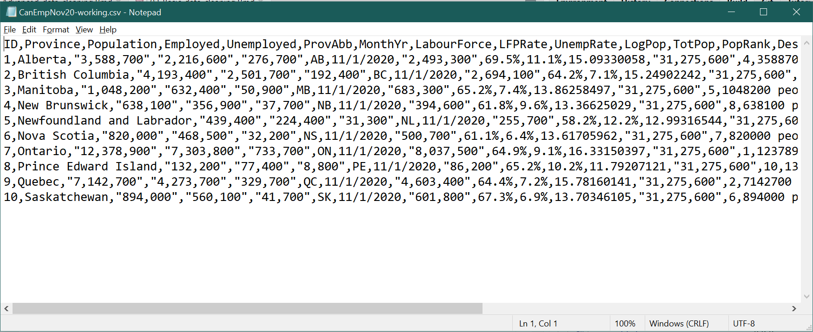
As you can see, the CSV file contains text based on the data in your
worksheet. Each line is a row in the worksheet, and cells are delimited by
commas.  A few other things to notice:

- There is no formatting information in the file.
- There are no formulas, only values.
- When the value in a cell contains a comma, the contents of the cell are
  surrounded by quotes (`"`) so that the comma is not interpreted as the end
  of the cell.

:::

You can also open any CSV file in Excel, and Excel will interpret the contents 
of the file as a worksheet.


### Fixed-width files

***Fixed-width*** text files represent a table of data by allocating the same
number of characters to each cell in the same column.  They can be formatted to
be readable to humans like this:
```
Name                   Year of birth   Year of death
Mary, Queen of Scots   1542            1547
Mary I                 1516            1558
Elizabeth I            1533            1603
```
or they may be in a more compact but less readable format like this:
```
Mary, Queen of Scots15421547
Mary I              15161558
Elizabeth I         15331603
```
The key feature of a fixed-width file is that each column begins at the same
point in each line.  For example:

- In the first file, the year of birth always starts on the 24th character of
  each line, and the year of death always starts on the 40th character.
- In the second file, the year of birth always starts on the 21st character of
  each line, and the year of death always starts on the 25th character.

Fixed with files can usually store data more efficiently than CSV files, but
this efficiency comes at a cost: you need to know where the columns begin
and end. You often see fixed-width files in large data sets like major surveys,
and they often come with a "dictionary" file that describes where each column
begins and ends.

You can open fixed-width text files in Excel using the *Text Import Wizard*.

::: example
**Opening a fixed-width file**

Open the file [CountryCodes.txt](sampledata/CountryCodes.txt) in a text editor.
It will look like this:

{width=50%}  
This is a fixed format file in which the CountryName variable starts on the 1st
character of each line and the CountryCode variable starts on the 36th
character.

To open this file in Excel, use the Text Import Wizard:

1. Select `File > Open >` from the menu.
2. Select `Browse` to get to the usual `OpenFile` dialog box.
3. Find and select the file `CountryCodes.txt`.  You may need to move to the
   correct folder, and to change the file type to "All files (*.*)"
4. The first dialog box of the Text Import Wizard allows you to specify the
   overall structure of your data file:  
   {width=50%}  
   Excel guesses about the structure of your data, but you may need to correct
   its guesses. In this case, you should change the file type from `Delimited`
   to `Fixed width`, and select `Next>`.
   - Excel made a few other wrong guesses (it thinks that the file is written in
     Japanese!) but you can ignore them.
5. The second dialog box of the Text Import Wizard allows you to specify where
   each column starts:  
   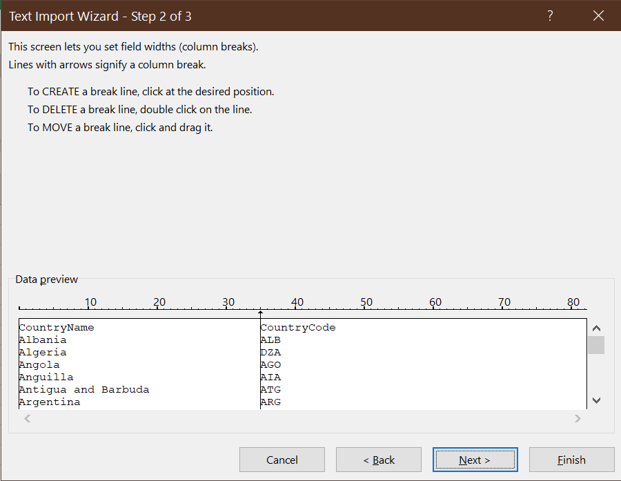{width=50%}  
   Excel seems to have guessed correctly in this case, so go ahead and select
   `Next>`.
6. The final dialog box of the Text Import Wizard provides some options for
   changing the data format for each individual column:  
   {width=50%}  
   We do not need to worry about any of these options, so select `Finish`.
7. Save the file under the new name `CountryCodes_WC.xlsx` to create a
   working copy of this data set.

Our worksheet now contains the imported data, correctly arranged into cells.
:::

### Delimited formats

CSV is an example of a delimited format in which cells are separated or
*delimited* by a particular character. There are other delimited formats
that are just like CSV but use some character other than the comma as the
delimiter:

- ***Space-delimited*** text files use spaces as the delimiter. For example,
  a space-delimited version of our table might look like this:

  ```
  Name "Year of birth" "Year of death"
  "Mary, Queen of Scots" 1542 1547
  "Mary I" 1516 1558
  "Elizabeth I" 1533 1603
   ```

- ***Tab-delimited*** text files use a tab character as the delimiter. It is
  hard to distinguish space-delimited and tab-delimited files unless your
  text editor is set to display tabs and spaces differently.

- ***Whitespace-delimited*** text files use some combination of tabs and spaces
   as the delimiter.
   
- CSV files sometimes use the semicolon (`;`) as the delimiter instead of the
  comma. This is to accommodate users in countries that use the comma as a
  decimal separator.
   
Like fixed-width and CSV files, space-delimited and tab-delimited files can be
imported into Excel using the Text Import Wizard.

### Other formats

CSV and similar formats are useful for representing a single table. Text files
can also be used to represent more complex data structures using newer open
formats like JSON (JavaScript Object Notation) or XML (Extensible Markup
Language).

::: example
**JSON and XML files**

This is what our employment data looks like in JSON format (on left) and XML
format (on right):

{width=80%}  
Both JSON and XML are used extensively for computers and applications to
transmit data to one another. They allow for more complex data structures
than CSV, at a cost of being less readable for humans.
:::

Excel has a wide variety of tools for working with data in JSON, XML,
commercial database formats, online services, etc. We do not have time to
explore all of these tools, but you can select `Data` from the menu bar and look
around to see what is available.

### Text to columns

Sometimes you will run into an Excel sheet that looks like this:  
  {width=50%} 

This can happen if a text file has been incorrectly imported, or if you have
copied-and-pasted data from a PDF file or web page.  Fortunately, Excel has a
way of fixing that: the ***Text to Columns*** tool.

::: example
**Using the text-to-columns tool**

Open the file [TaxRates.xlsx](sampledata/TaxRates.xlsx).  As you can see, it
looks like the picture above. To use the Text to Columns tool:

1. Select the column with the data (column A).
   - Be sure to select the whole column, not just a single cell.
2. Select `Data > Text to Columns` from the menu.
3. The Text to Columns Wizard will appear.
   - It is very similar to the Text Import Wizard
   - Excel is usually smart enough to guess the structure of your data and to
     offer the correct default options here.
   - Assuming the default options are correct (you can see what happens if you
     change the options), select `Next>`, then `Next>` again, then `Finish`.

Your worksheet should now look like this:  
  {width=50%}

Save this file as `TaxRates_WC.xlsx`.
:::

### Combining Excel files

Data tables often come in multiple files, especially if they are from different
sources.  It is possible for one Excel file to use data from another Excel file
(or even a non-Excel file or online data source), but doing so can lead to
problems if not done very carefully. For example, if one file has a formula that
references another file, that formula may stop working if either file is moved
to another folder.

An easier approach in most situations is to just combine everything into a
single Excel workbook.

::: example
**Combining worksheets in a single file**

We currently have three data files: *pwt100.xlsx*, *CountryCodes_WC.xlsx*,
and  *TaxRates_WC.xlsx*. To combine them in a single file:

1. Open all three files.
2. Go to *CountryCodes_WC.xlsx*, and right-click on the *CountryCodes* tab
   at the bottom of the page.  A menu will appear; select `Move or Copy...`
   and the `Move or Copy` dialog box will appear:  
   {width=30%}  
3. Select *pwt100.xslx* from the `To book:` drop-down box. Your worksheet will
   now move to that workbook.
4. Repeat the same process with both worksheets in the *TaxRates_WC.xlsx*
   workbook.
5. At this point all of our worksheets are in a single workbook. Save the 
   workbook with name *GrowthData_WC.xlsx*, and close all other files.
   
We are done with the working copies *TaxRates_WC.xlsx* and
*CountryCodes_WC.xlsx*, so you can delete those files if you like.
:::

Before proceeding, it's a good idea to make sure our data is tidy.

::: example
**Making the our workbook tidy**

1. Take a look at each of our three main worksheets in `GrowthData_WC.xlsx` and
   identify if they need to be adjusted in any way to meet our criteria for
   tidy data:
   - *CountryCodes* is tidy and does not need alteration.
   - *TaxRates* is tidy and does not need alteration.
   - *Data* has one issue: each observation (row) appears to describe a
     particular country in a particular year.  There is an identifier 
     for country and an identifier for year, but no combined identifier
     that takes on a unique value for each individual observation. We will
     need to create one.
2. Add a unique ID variable to the *Data* worksheet:
   a. Insert a new column to the left of the current column A.
   b. Enter **CountryYear** in cell A1 to name the variable.
   c. Use the `CONCAT()` function to create the identifier in cell A2. 
      - The formula would be `=CONCAT(B2,E2)`
      - For example, if row 2 depicts Aruba (ABW) in 1950, cell A2 should
        display "ABW1950".
   d. Copy/paste or fill this formula to the rest of column A.
3. Save your working copy (as *GrowthData_WC.xlsx*).

Our data set is now tidy and ready to work with.
:::

## Linking observations

One of the most common tasks in cleaning data is to combine variables from two
or more data sets.  In order to do this, we need to ***link*** observations in
the two tables on the basis of one or more ID variables or ***keys***. For
example, we may have a table of data on data on children, and want to add
information about their parents from another table. Or we may have data on
the financial performance of a business, and want to link it to data on
macroeconomic conditions. Linking goes by many other names, including
***matching*** and ***merging***.

::: example
**Linking tax and GDP data**

Suppose we are interested in exploring the relationship across countries
between economic (GDP) growth and tax rates.  Do countries with lower taxes grow
faster or slower than countries with higher taxes?

The economic growth rates of any country in the Penn World Tables can be
calculated using the the *Data* worksheet, and the tax rate of any country
in the Tax Foundation data can be found in the *Tax Rates* worksheet. We
would like to combine this information so that we have a table with each
country's tax rate and economic growth rate.
:::

In order to link observations across two tables, the tables need to share a
common key variable that can be used for matching. Usually both tables share
some unique ID variable that can be used as the key.  Sometimes there is no
such variable, but you can construct one using a third table called 
a ***crosswalk table***.

::: example
**Using a crosswalk table**

Our *Data* and *TaxRates* tables do not yet have a common key variable: 

- *Data* provides two ways of identifying a country in each observation:
   - The country name
   - The three-letter [ISO country code](https://www.iso.org/iso-3166-country-codes.html)
- *TaxRates* only provides the country name. 
 
We could try to match on country name, but the country names are not exactly the
same in the two tables. For example, the same country is called "South Korea" in
*TaxRates* and "Republic of Korea" in *Data*. This is a common problem with
proper names, so people who work with data usually prefer standardized codes.

One option is to simply change the country names in one of our tables, but
that goes against our general principle that we avoid changing data.

A better solution is to use a crosswalk table. The *CountryCodes* worksheet is a crosswalk table I have created for exactly this purpose: it gives the ISO
country code for each country name, including name variations like "Republic of
Korea" and "South Korea."
:::

All statistics packages have tools to link observations.  In Excel, the table
you are obtaining data from is called a ***lookup table*** and the key tool is
the `VLOOKUP()` function.

The `VLOOKUP()` function takes three required arguments and one optional
argument:

  1. `Lookup_value` is the value or cell in the current table to look up.
  2. `Table_array` is the range containing the table of data.
  3. `Col_index_num` is a number indicating which column of values in
     `Table_array` to return.
  4. `Range_lookup` sets the rules for matching. For our purposes, this should
     always be set to `FALSE`.

It returns the value in column `Col_index_num` and the row in the first column
of `Table_array` that maches `Lookup_value`.

For example, the formula `=VLOOKUP("California",A1:G10,3,FALSE)` looks for a
row/observation with the value "California" in column A (cells A1:A10), then
returns the value in column C (cells C1:C10) for that row/observation.

::: example
**Linking with VLOOKUP**

Our first step is to use our crosswalk table and the `VLOOKUP()` function to
add a country code to the tax data.

1. Open your working copy of `GrowthData_WC.xlsx` if it is not already open.
2. Make a copy of the *TaxRates* worksheet, and name it *GrowthData*.
3. Insert a new column in *GrowthData* to the left of the current column A.
   - You can do that by selecting any cell in column A, and then selecting
     `Home > Insert > Insert Sheet Columns`
4. Enter **CountryCode** in cell A1 to name the variable.
5. Use `VLOOKUP()` to construct the appropriate formula in cell A2:
   - `Lookup_value` should be the country name of the current observation
     (`B2`).
   - `Table_array` should be the full table of country names and codes
     (`CountryCodes!A2:B185`).
   - `Col_index_num` should refer to the second column in `Table_array` since
     that column contains the ISO codes (`2`).
   - `Range_lookup` should be `FALSE`.
6. Change references in the formula from relative to absolute as appropriate.
   The resulting formula will be 
   `=VLOOKUP(GrowthData!B2,CountryCodes!A$2:B$185,2,FALSE)`.
7. Copy/paste or fill the formula in cell A2 to the remaining cells in column A.
8. Check your work: Column A should now display the ISO country code for each
   observation.
9. Save your working copy of `GrowthData_WC.xlsx`.
:::

`VLOOKUP()` can also be used in combination with the `CONCAT()` function to
link observations on multiple criteria.

::: example
**Linking on multiple criteria**

Now suppose we want to create a variable in the *GrowthData* worksheet that
contains each country's population (**pop** in the *Data* worksheet) in 2019
and another that contains each country's population in 1990. This will allow
us to calculate population growth for each country over the time 1990-2019
time period.

Since we need to match both country and year, we will need to use the
`CONCAT()` function to put the country and year together in a single criterion.

1. Open your working copy of `GrowthData_WC.xlsx` if it is not already open.
2. Enter **Pop2019** in cell K1 of *GrowthData* to name the variable.
3. Use `VLOOKUP()` to enter the correct formula in cell K2:
   - `Lookup_value` should combine the country code (cell A2) with the year
     (2019), so it should be `CONCAT(A2,"2019")`.
   - `Table_array` should be the table in the *Data* worksheet containing the
     **pop** variable. You could use the entire table (`Data!A2:BA12811`) or
     just the part of the table containing the variables we need
     (`Data!A2:H12811`).
   - `Col_index_num` should refer to the eighth column in `Table_array` since
     that column contains the **pop** variable (`8`).
   - `Range_lookup` should be `FALSE`.
4. Make the cell references absolute where needed, which will result in the
   formula:  
   `=VLOOKUP(CONCAT($A2,"2019"),Data!$A$2:$H$12811,8,FALSE)`.
5. Copy/paste or fill the formula to the remaining cells in column K.

We can also create another variable whose variable is the country's population
in 1990:

6. Enter **Pop1990** in cell L1 of *GrowthData* to name the variable.
7. Enter the correct formula in cell L2. It will be nearly identical to the
   formula in cell K2, but with "2019" replaced by "1990":
   `=VLOOKUP(CONCAT($A2,"1990"),Data!$A$2:$H$12811,8,FALSE)`
8. Copy/paste or fill the formula to the remaining cells in column K.
9. Save your working copy of `GrowthData_WC.xlsx`.

You may note that the PWT goes all the way back to 1950, and may wonder why I
picked 1990 as my starting point.  The reason for this is many countries do not
have PWT data going back to 1950, especially those countries that were part of or
allied with the Soviet Union. By 1990, the PWT has data for almost all
countries.
:::

Note that in all of the examples, I have said to set the optional argument
`Range_lookup` to `FALSE`. This argument sets the rules for matching:

- If `Range_lookup` is left blank or set to `TRUE`:
  -  `VLOOKUP()` will look for the *closest*  match.
  - This option requires `Table_array` to be sorted.
- If `Range_lookup` is set to `FALSE`:
  - `VLOOKUP()` will look for an *exact* match.
  - This option does not require `Table_array` to be sorted.

Since one of the principles of tidy data is that the order of observations
should not matter, the exact match option is preferable.

::: {.fyi data-latex=""}
**Related functions**

`VLOOKUP()` only works if you have a table with observations in rows and
variables in columns. However, there is also a function called `HLOOKUP()`
for use when you have a table with variables in rows and observations in
columns.

Some versions of Excel have a new and improved lookup function called
`XLOOKUP()`. It has better defaults, is more flexible, and is easier to use.
Unfortunately, it is not available in all versions of Excel.
:::

## Aggregating observations

Sometimes we will want to create a new variable that is the sum or average of
another variable within some group, or the count of the number of observations
in that group. This kind of variable is called an ***aggregate*** variable.

::: example
**Average investment shares**

Suppose we are interested in whether high-tax countries tend to have higher
or lower investment rates than low-tax countries. The PWT data include 
the investment share of GDP in the variable **csh_i**. But investment shares
are highly sensitive to the business cycle, so the average investment share
over time might be a more informative measure of a country's general investment
climate than the investment share in any particular year.

So we want a single variable for each country that represents the country's
average investment share over the period covered by the data. This is an
example of a group-level aggregate, with the group being the country and the
aggregation method being the sample average.
:::


We can construct group-level averages variables using the `AVERAGEIFS()`
function.  It takes three arguments:

- `average_range` is the range of cells containing the variable that should be
  averaged.
- `criteria_range` is the range of cells containing the group identifier
  variable.
- `criteria` is the cell containing the group identifier of the current
  observation.
  
For example `=AVERAGEIFS(C1:C100,A1:A100,"California")` returns the average
value in column C of all of the observations whose value in column A is
"California".

::: example
**Constructing an aggregate variable**

Suppose we are interested in whether high-tax countries tend to have higher
or lower investment rates than low-tax countries.  In order to do this, we might
add a variable to our *GrowthData* worksheet that describes the average
investment share of GDP (the variable **csh_i**) in each country over the full
period of the data.

We can do this using the `AVERAGEIFS()` function:

1. Open your working copy of `GrowthData_WC.xlsx` if it is not already open.
2. Enter **AvgIShare** in cell M1 of *GrowthData* to name the variable.
3. Construct the correct formula in cell M2 using the function `AVERAGEIFS()`:
   - `average_range` should be the full range of investment shares
     (`Data!AP2:AP12811`)
   - `criteria_range` should be the full range of country codes
     (`Data!B2:B12811`)
   - `criteria` should be the cell containing the country code of the current
     observation (`A2`)
4. Adjust the formula to have the correct absolute references. The resulting
   formula should be `=AVERAGEIFS(Data!AP$2:AP$12811,Data!B$2:B$12811,A2)`.
5. Copy/paste or fill this formula into the remaining cells in column M.
6. Save your working copy of `GrowthData_WC.xlsx`.

The average investment share should range from a minimum of 0.13 for Bulgaria
to a maximum of 0.44 for Cyprus.
:::

The `AVERAGEIFS()` function is part of a family of functions that calculate a
statistic for a subset of observations that satisfy a set of criteria:

- `COUNTIFS()` calculates the *number* of observations meeting the criteria.
  - We used `COUNTIFS()` to construct a frequency table in Chapter
    \@ref(basic-data-analysis-with-excel).
- `AVERAGEIFS()` calculates the *average* of a variable for those observations
  that meet the criteria.
- `SUMIFS()` calculates the *sum* of a variable for those observations that meet
  the criteria.
- `MINIFS()` calculates the *minimum* of a variable for those observations that
  meet the criteria.
- `MAXIFS()` calculates the *maximum* of a variable for those observations that
  meet the criteria.

These functions can all be used to construct summary statistics (as in Chapter
\@ref(basic-data-analysis-with-excel)) or to construct group aggregate variables
within our data set (as in this chapter).

::: {.fyi data-latex=""}
**Related functions**

The `COUNTIFS()`, `AVERAGEIFS()`, `SUMIFS()`, `MINIFS()` and `MAXIFS()`
functions all allow for multiple criteria to be used.

Excel also includes a set of older functions `COUNTIF()`, `AVERAGEIF()`,
`SUMIF()`, `MINIF()` and `MAXIF()` that allow only a single criterion.
You may see these functions in older worksheets.
:::

## Managing data problems

Real-world data analysis regularly encounters mistakes and unexpected events,
so Excel includes various tools for avoiding, detecting, and addressing
problems.

### Error codes

Sometimes an Excel formula does not produce a valid result. When that happens,
Excel will return an ***error code*** to indicate what has gone wrong. The
table below lists Excel's most commonly-used error codes.  There are many
others, but you can always Google an unfamilar error code to find out what
it means.

|  Code     | Explanation                             | Example               |
|:----------|:---------------------------------------:|:---------------------:|
| `#VALUE!` | Wrong argument type for function        |`=SQRT("HELLO")`       |
| `#NAME?`  | Function does not exist                 | `=NOTAREALFUNCTION(1)`|
| `DIV/0!`  | Division by zero                        | `=1/0`                |
| `#REF!`   | Formula references a deleted cell       |                       |
| `#NUM!`   | Result is not a number                  | `=SQRT(-1)`           |
| `#NA`     | Lookup function unable to find match    |                       |

Error codes typically propagate through calculations.  For example, suppose
cell  A1 contains the formula `=1/0` (which returns the error code
`DIV/0!`).  Then almost any formula that refers to cell A1 will return the
same error code.

In some cases, you may want to rewrite your formulas to catch and handle error
conditions.

::: example
**Catching and handling an error condition**

Suppose you want the variable in column B to be the square root of the variable
in column A, but the variable in column A is sometimes negative.  As a result,
the simple formula 

`=SQRT(A1)` 

displays the square root of A1 in some cases and the error code `#NUM!` in
others.

We can use the `IF()` function to catch this error, and handle it in whatever
way we want.  For example, the formula:

  `=IF(A1>=0,SQRT(A1),"")`

will return the square root of A1 if A1 is positive or zero, and a blank cell if
A1 is negative.
::::

### Data validation

One potential source of errors is the entry of ***invalid*** data. Invalid data
means that a particular cell in our data takes on a value that is not in the set
of possible values for that variable. For example:

- A numeric variable has a non-numeric value.
- A logical variable has a value other than TRUE or FALSE.
- A date variable is in the wrong format.
- A text variable is the wrong length.
- A numeric variable is outside of its expected range, for example an
  unemployment rate of 200\% or a negative value of GDP.

Invalid data can result from typos or other human error, or it can result from
imperfect translation of data between different data sources.

Excel has a set of ***data validation*** tools to help prevent and fix invalid
data. Data validation can be accessed by selecting `Data` from the menu and then
clicking on the Data Validation button, which looks like this:
{height=16pt}. 

::: example
**Adding data validation**

The **Pop2019** variable (column K in the *GrowthData* table) is a country's
population in 2019.  Population cannot be negative, so let's add this as a data
validation requirement:

1. Open your working copy of `GrowthData_WC.xlsx` if it is not already open.
2. Select column K in *GrowthData*.
3. Select `Data > Data Validation`.  The Data Validation dialog box will 
   appear:  
   {width=50%}  
   By default, it allows "Any value", which means no restriction at all.
4. To add a restriction that negative values are not allowed:
   a. Select `Decimal` from the `Allow` drop-down box.
   b. Select `greater than or equal to` from the `Data` drop-down box
   c. Enter `0` in the `Minimum` drop-down box.
5. Select `OK`.

Although nothing appears to have changed, column K is now subject to data
validation. To test it:

6. Go to cell K43, and (try to) enter `-1`.  You will see this dialog box
   telling you that this is an invalid value:  
   {width=50%}

7. Select `Cancel`.
8. Save your working copy of `GrowthData_WC.xlsx`.
:::

Excel will not allow you to enter invalid data into a cell with validation
turned on. This feature will help avoid problems in the first place, if you
enable it *before* entering data.  In addition, the Data Validation tool allows
you to identify previously-entered observations with invalid data.

::: example
**Finding invalid data**

All of our **Pop2019** data is valid, so in order to "find" invalid data we will
need to cheat a little.

1. Select column K again.
2. Select `Data > Data Validation` again.
3. Change the Minimum value from "0" to "10".
   - This will cause all values of **Pop2019** below 10 to be (incorrectly)
     considered invalid.
4. To identify invalid observations, select
   `Data > Data Validation > Circle Invalid Data`. You will now see red circles
    around all values that violate the validation criteria (there may be a
    slight delay):
   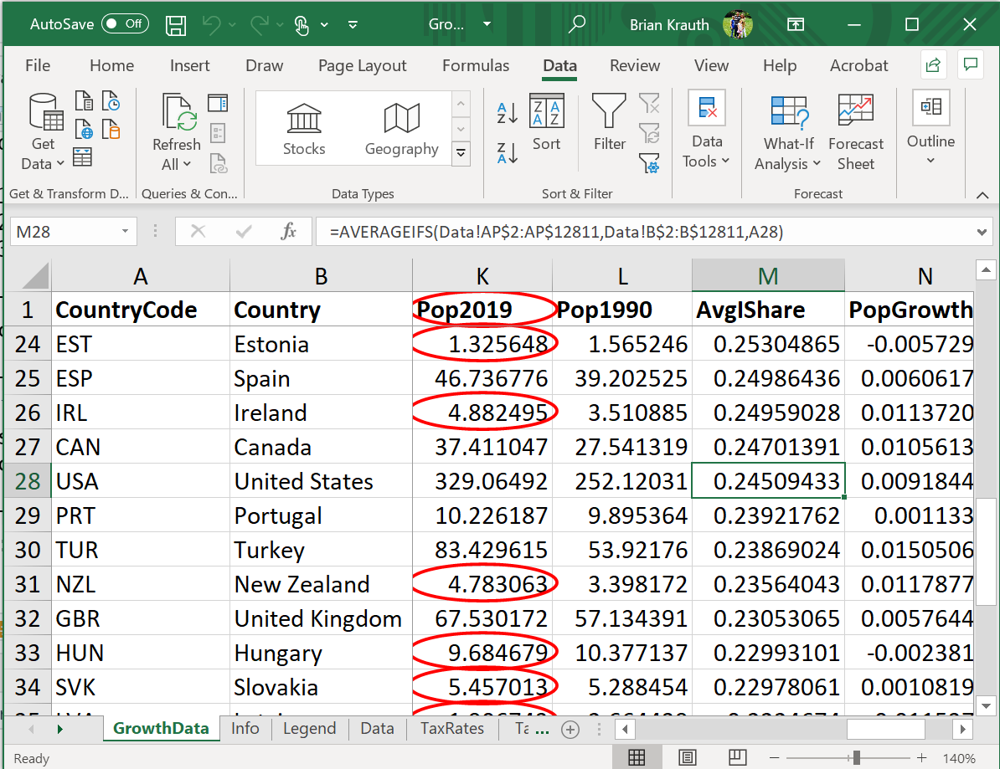{width=50%}

5. To remove the circles, select 
   `Data > Data Validation > Clear Validation Circles`.
   
You do not need to save your work here, since we have not made any changes.
:::

Finally, we can remove all data validation from a cell.

::: example
**Removing data validation**

To remove data validation from the **Pop2019** variable:

1. Select column K in *GrowthData*.
2. Select `Data > Data Validation`.  The Data Validation dialog box will appear.
3. Select `Clear All` and then `OK`.

You can confirm that data validation has been removed by entering an invalid
value (Excel will now let you do this) or by adding validation circles (Excel
will no longer show any).
:::

### Protecting data

One of the most common Excel problems occurs when someone unintentionally
changes the data in a file. For example:

- Your cat walks over your keyboard and overwrites the contents of a cell.
- You break the rule about keeping the original data untouched, and make a
  change that you later wish you hadn't made.

The risk of unintentional changes is an unavoidable consequence of Excel's
fundamental design: there is no separation between data and analysis.  This
design feature has the positive implication that your data is always visible
and accessible, but it comes at a cost.

One way of avoiding this cost is to make a practice of making your original data
"read only." Excel does this through the combined mechanisms of ***protecting***
sheets and ***locking*** cells.  Protecting and locking work according to three
rules:

1. Each worksheet is either protected or unprotected.
   - By default, all worksheets are unprotected.
2. Each cell is either locked or unlocked.
   - By default, all cells are locked.
3. Any locked cell in any protected sheet cannot be edited. All other cells can
   be edited.

   | Cell/sheet status    | Sheet is protected | Sheet is unprotected    |
   |----------------------|--------------------|-------------------------|
   | **Cell is locked**   | Cannot edit cell   | Can edit cell (default) |
   | **Cell is unlocked** | Can edit cell      | Can edit cell           |

By default, you can edit any cell in any worksheet. But you can change this
behavior by changing the cell and/or sheet status.

::: example
**Protecting an entire worksheet**

The PWT data table *Data* contains original raw that we do not want changed. To
prevent changes to that worksheet, we will want the worksheet to be *protected*
and for all of its cells to be *locked*.  By default the worksheet is
unprotected and all cells are locked, so all we need to do is protect the sheet:

1. Open your working copy of `GrowthData_WC.xlsx` if it is not already open.
2. Right-click on the *Data* tab at the bottom of the page.  A menu will appear.
3. Select `Protect Sheet`.  The Protect Sheet dialog box will provide several
   options:  
  {width=30%}  
4. The default options are fine, so select `OK`.
5. Save your working copy of `GrowthData_WC.xlsx`.
   
Now that you have protected the *Data* worksheet, try to edit any cell. You will
get an error message.
:::

In many cases, you will only want to protect certain cells in a given sheet. To
do this, remember the rules: all cells are initially locked and all worksheets
are unprotected.  So we will need to unlock all cells except the ones we want
locked, and then protect the sheet.

::: example
**Protecting part of a worksheet**

Our working data in *GrowthData* includes a mix of raw data in columns A through
J, and calculated data in the other columns.  To prevent changes to the raw
data but not the calculated data, we will need the worksheet to be *protected*,
columns A through J to be *locked*, and all other columns to be *unlocked*.
By default, the sheet is unprotected and all cells are locked.  So we will need
to unlock all of the columns after N, and then protect the sheet:

1. Open your working copy of `GrowthData_WC.xlsx` if it is not already open.
2. Select all of the cells in the *GrowthData* worksheet by clicking on the 
   {height=16pt} button.
3. Unlock all of the cells by selecting `Home > Format > Lock Cell`.
4. Lock columns A through J by selecting them, and then selecting 
   `Home > Format > Lock Cell`.
5. Protect the worksheet by selecting `Home > Format > Protect Sheet`
6. The `Protect Sheet` dialog box will appear; select `OK`.
6. Save your working copy of `GrowthData_WC.xlsx`.

Note that you have to do it in this order since Excel will not let you unlock
locked cells in a protected sheet.

You will now get an error message if you try to edit any of the locked cells,
but you can edit the unlocked cells in any way you like.
:::

You can remove protection from any worksheet by simply selecting 
`Home > Format > Unprotect Sheet`.

We are done with the growth data for now.  As always, be sure to save your
working copy and update/create the master version of your cleaned data file.

::: example
**Finishing up**

1. Save your working copy, and save again as the master version.
   - I chose the file name `GrowthData.xlsx`.

You can compare your work to my Excel file at
[https://bookdown.org/bkrauth/IS4E/sampledata/GrowthData.xlsx](sampledata/GrowthData.xlsx)
:::

##  Pivot tables {#pivot-tables}

Excel's ***Pivot Tables*** are a powerful tool for the analysis of frequencies,
conditional averages, and various other aspects of the data. They are somewhat
tricky to use, and we will only scratch the surface here. But the more
comfortable you can get with them, the better.

The first step is to create a blank Pivot Table that is tied to a particular
data table.  We can create as many Pivot Tables as we want.

::: example
**Creating a blank Pivot Table**

To create a blank Pivot Table based on the employment data:

1. Open the [EmploymentData.xlsx](sampledata/EmploymentData.xlsx) data file,
   and save a working copy as `EmploymentData_WC.xlsx`.
2. Select any cell in the data table in the *Data for Analysis* worksheet.
3. Select `Insert > PivotTable` from the menu.
4. Excel will display the `Create PivotTable` dialog box:  
   {width=50%}  
   The default settings are fine, so select `OK`.
  
   Excel will open a new worksheet that looks like this:  
   {width=90%}  
   The Pivot Table itself is on the left side of the new worksheet.

Since the Pivot Table is initially blank, we will need to add elements to make
it useful.
:::

There are various tools available to add or modify Pivot Table elements:

- The `Pivot Table Fields` box on the right side of the screen
- The `PivotTable Analyze` menu
- The `Design` menu.  

These tools only appear in context.  You can make them appear by selecting
any cell in the Pivot Table, and can make them disappear by secting any cell
outside of the Pivot Table.

### Simple frequencies

The simplest application of a Pivot Table is to automatically construct a table
of frequencies. By default, Pivot Tables report ***absolute frequencies***:
the *number* of times we observe a particular value in the data.

::: example
**A simple frequency table**

To create a simple frequency table showing the number of months in office for
each Canadian prime minister:

1. Check the box next to **PrimeMinister**. The Pivot Table will look like this:  
   {width=13%}  
2. Drag **MonthYr** into the box marked "$\Sigma$ values". The Pivot Table will
   now look like this:  
   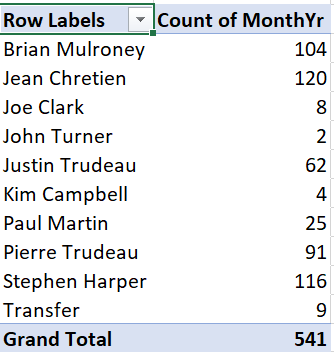{width=30%}
3. Save your working copy `EmploymentData_WC.xlsx`.

As we can see, the table shows the number of observations for each value of the
**PrimeMinister** variable, which also happens to be the number of months in
office for each prime minister. It also shows a grand total.
:::

In many applications, we are also interested in ***relative frequencies***: the
*fraction* or *percentage* of observations that take on a particular value. When
data are constructed from a random sample, the relative frequency can be
interpreted as an estimate of the corresponding probability.

::: example
**Reporting relative frequencies**

To add a relative frequency column, we first need to add a second absolute
frequency column:

1. In the PivotTable Fields box, drag **MonthYr** to the "$\Sigma$ values" box.  
   {width=30%}  

Then we convert it to a relative frequency column:

2. Right-click on the "Count of MonthYr2" column, and select 
   `Value Field Settings...`  
   {width=30%}   
3. Click on the `Show Values As` tab and select "% of Column Total" from
   the `Show Values As` drop-down box.
4. Select `OK`.
5. Save your working copy `EmploymentData_WC.xlsx`.

The third column will now show the number of observations as a percentage of
the total:  
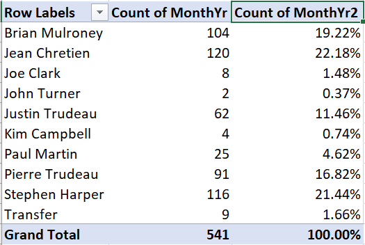{width=30%} 
:::

### Cross tabulations

We can also construct frequency tables for pairs of variables. There are various
ways of laying out such a table, but the simplest is to have one variable in
rows and the other variable in columns.  When the table is set up this way, we
often call it a ***cross tabulation*** or crosstab. Crosstabs can be expressed
in terms of absolute frequency, relative frequency, or both.

::: example
**An absolute frequency crosstab**

Starting with a blank Pivot Table:

1. Drag **PrimeMinister** into the Rows box.
2. Drag **Party** into the Columns box.
3. Drag **MonthYr** into the $\Sigma$ values box.

You will now have this table of absolute frequencies:  
{width=40%}

For example, this crosstab tells us Brian Mulroney served 104 months as
prime minister, with all of those months as a member of the (Progressive) 
Conservative party.
:::

We can also construct crosstabs using relative frequencies, but there is 
more than one kind of relative frequency we can use here. A 
***joint frequency crosstab*** shows the count in each cell 
as a percentage of all observations. If the data come from a random sample,
joint frequencies can be interpreted as estimates of joint probabilities.

::: example
**A joint frequency crosstab**

To convert our absolute frequency crosstab into a joint frequency crosstab:

1. Right click on "Count of MonthYr" and select `Value Field Settings...`
2. Select the `Show Values As` tab, and select "% of Grand Total"
   from the Show Values As drop-down box.

Your table will now look like this:  
{width=50%}

For example, the table tells us that Brian Mulroney's 104 months as prime
minister represent 19.22% of all months in our data.
:::

A ***conditional frequency crosstab*** shows the count in each cell as a 
percentage in that row or column. If the data come from a random sample,
conditional frequencies can be interpreted as estimates of conditional
probabilities.

::: example
**A conditional frequency crosstab**

To convert our crosstab into a conditional frequency crosstab:

1. Right click on "Count of MonthYr" and select `Value Field Settings`.
2. Select the `Show Values As` tab, and select "% of column total."
   from the Show Values As drop-down box.

Your table will now look like this:  
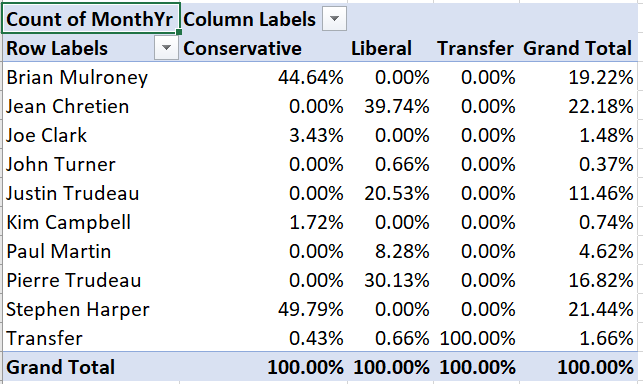{width=50%} 

For example, Brian Mulroney's 104 months as prime minister represent 44.64% of
all months served by a Conservative prime minister in our data.
:::

### Conditional averages

We can also use Pivot Tables to report ***conditional averages***. A
conditional average is just the average of one variable, taken within a
sub-population defined by another variable.  If the data come from a random
sample, the conditional average can be interpreted as an estimate of the
corresponding conditional average in the population.

For example, we might calculate average earnings for men and for women in a
random sample of Canadians.  They can be interpreted as measuring average
earnings for all Canadian men and women.

::: example
**Adding a conditional average**

Suppose we want to add the average unemployment rate during each prime
minister's time in office to this Pivot Table:  
{width=30%}

1. Drag **UnempRate** into the box marked "$\Sigma$ values".  The table will 
   now look like this:  
   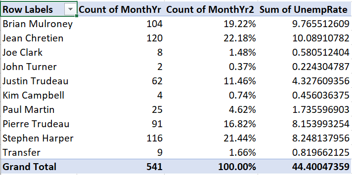{width=40%} 

Unfortunately, we wanted to see the *average* unemployment rate for 
each prime minister, but instead we see the *sum* of unemployment
rates for each prime minister.  To change this:

3. Right-click "Sum of UnempRate", then select `Value Field Settings...`.
4. Select `Average`.

The table now looks like this:  
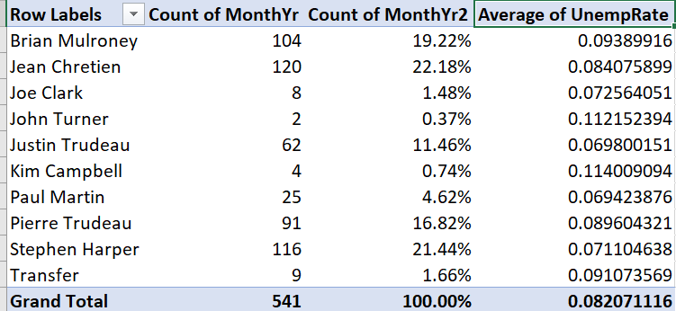{width=40%} 

We now have the average unemployment rate for each prime minister. It
is not very easy to read, so we will want to change the formatting
later.
:::

In addition to conditional averages, we can report other conditional statistics 
including variances, standard deviations, minimum, and maximum.

### Modifying a Pivot Table

As you might expect, we can modify Pivot Tables in various ways to make them 
clearer, more informative, and more visually appealing.

As with other tables in Excel, we can filter and sort them.  Filtering is
particularly useful with Pivot Tables since there are often categories we want
to exclude.

::: example
**Filtering a Pivot Table**

There is no Canadian prime minister named "Transfer." If you recall, we used
that value to represent months in the data where the prime minister changed.
To exclude those months from our main table:

1. Click on the {height=16pt}. The 
   sort and filter menu will appear:  
   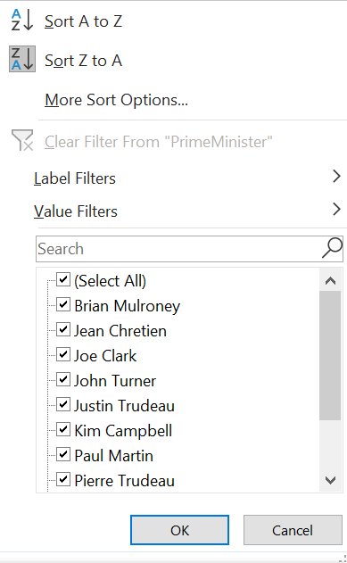{width=30%}   

2. Uncheck the check box next to "Transfer", and select `OK`:
  
The table no longer includes the Transfer value:  
{width=50%}

Note that the grand total has also gone down from 541 to 532 to reflect the
filtered observations.
:::

By default, the table is sorted on the row labels, but we can sort on any
column.

::: example
**Sorting a Pivot Table**

To sort our table by months in office:

1. Click on {height=16pt} and the 
   sort and filter menu will appear.
2. Select `More sort options`; the Pivot Table sort dialog box will appear:  
   {width=30%} 
3. Select the `Descending (Z to A)` radio button and "Count of MonthYr" from
   the drop-down box.

The table is now sorted by number of months in office:  
{width=40%}
:::

We can change number formatting, column and row titles, and various other
aspects of the table's appearance.

::: example
**Cleaning up a table's appearance**

Our table can be improved by making the column headers more informative and
reporting the unemployment rate in percentage terms and fewer decimal places:

1. Right-click on "Average of UnempRate", and then select
   `Value Field Settings...`
2. Enter "Average Unemployment" in the `Custom Name` text box.
3. Select `Number Format`, then change the number format to Percentage with 1
   decimal place.
4. Select `OK` and then `OK` again. The table will now look like this:  
   {width=50%}

5. Change the other three headers.  You can do this through
   `Value Field Settings...` but you can also just edit the text directly.
   - Change "Row Labels" to "Prime Minister".
   - Change "Count of MonthYr" to "Months in office".
   - Change "Count of MonthYr2" to "% in office".

Our final table looks like this:  
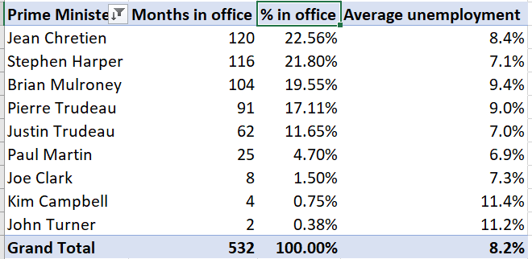{width=50%}  
:::

Finally, we can use Pivot Tables to create graphs.

::: example
**A Pivot Table graph**

To create a simple bar graph depicting months in office, we start by cleaning up
the Pivot Table so that it shows the data we want to represent:

1. Select any cell in this table:  
  {width=50%}
2. Use filtering to remove "Transfer" from the list of prime ministers.
3. Use sorting to sort by (grand total) number of months in office.

   The table should now look like this:  
   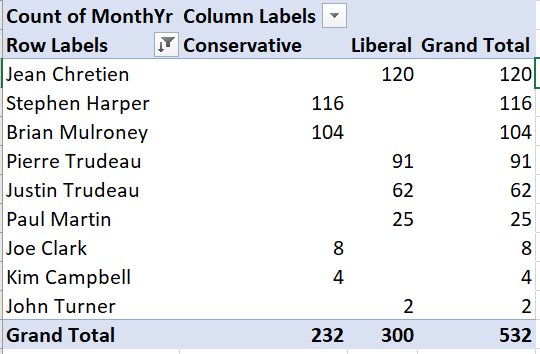{width=50%}

Then we can generate the graph:

4. Select any cell in the table, then select `Insert > Recommended Charts` 
   from the menu.
   
5. Select `Column`, and then `Stacked Column` from the dialog box, and then
   select `OK`.
   
Your graph will look like this:  
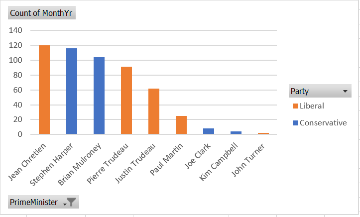{width=50%}

As always, there are various ways we could customize this graph to be more
attractive and informative.
:::

You can download the full set of Pivot Tables and associated charts  generated
in this chapter at
[https://bookdown.org/bkrauth/IS4E/sampledata/EmploymentDataPT.xlsx](sampledata/EmploymentDataPT.xlsx) 

## Chapter review {-#review-advanced-data-cleaning}

The theme that connects the various topics of this chapter is that real data is
often complicated. We will usually obtain data from multiple sources and in
varying formats, the data will usually be complex in structure, and mistakes are
all too easy to make. So we need to be disciplined in handling our data, and
flexible in finding solutions to problems that pop up.

In the next few chapters, we will shift from Excel to R. Chapter 
\@ref(an-introduction-to-r) will introduce the R language and a few basic tools,
while Chapter \@ref(using-r) will show how to use R for some of the same data
cleaning and analysis tasks we have learned for Excel, along with some advanced 
new techniques.

## Practice problems {-#problems-advanced-data-cleaning}

Answers can be found in the [appendix](#answers-advanced-data-cleaning).

**GOAL #1: Identify and work with common data file formats**

1. Identify each of these text files as fixed-width, tab/space separated, or CSV
   format.
   a. 
      ```
      Name   Age
      Al     25
      Betty  32
      ```
   b. 
      ```
      Name     Age
      Al    25
      Betty    32
      ```
   c. 
      ```
      Name,Age
      Al,25
      Betty,32
      ```

2. Suppose you import the following CSV file in Excel:
   ```
   Name,Year of birth,Year of death
   "Mary, Queen of Scots",1542,1547
   Mary I,1516,1558
   Elizabeth I,1533,1603
   ```
   a. How many rows and columns does the worksheet have?
   b. What are the contents of cell B1?
   c. What are the contents of cell C3?

**GOAL #2: Describe and implement common data cleaning tasks**

3. What is the purpose of each of the following?
   a. A crosswalk table
   b. Matching observations by keys
   c. Aggregating data by groups

**GOAL #3: Describe and use Excel data management tools**

4. Under which of these scenarios can you edit cell A1?
   a. You open a blank sheet.
   b. You open a blank sheet, and protect the sheet.
   c. You open a blank sheet, unlock cells A1:C9 and protect the sheet.
   d. You open a blank sheet, lock cells A1:C9 and protect the sheet.

5. What will happen if you:
   a. Add data validation to a column that contains invalid data?
   b. Add data validation to a column, and then try to enter invalid data?

**GOAL #4: Construct and interpret frequency tables, cross-tabulations and conditional averages using Excel pivot tables**

6. The following tables are based on 2019 data for Canadians aged 25-34.
   Classify each of these tables as simple frequency tables, crosstabs, or
   conditional averages:
   a. 
      | Educational attainment     |  Percent   |
      |:---------------------------|:----------:|
      | Below high school          |     6      |
      | High school                |    31      |
      | Tertiary (e.g. university) |    63      |
   b.
      | Gender | Years of schooling |
      |:-------|:------------------:|
      | Male   |   14.06            |
      | Female |   14.74            |
   c.
      | Educational attainment | Male | Female |
      |:-----------------------|:----:|:------:|
      | Below high school      |  7   |    5   |
      | High school            | 38   |   24   |
      | Tertiary               | 55   |   71   |

