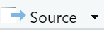
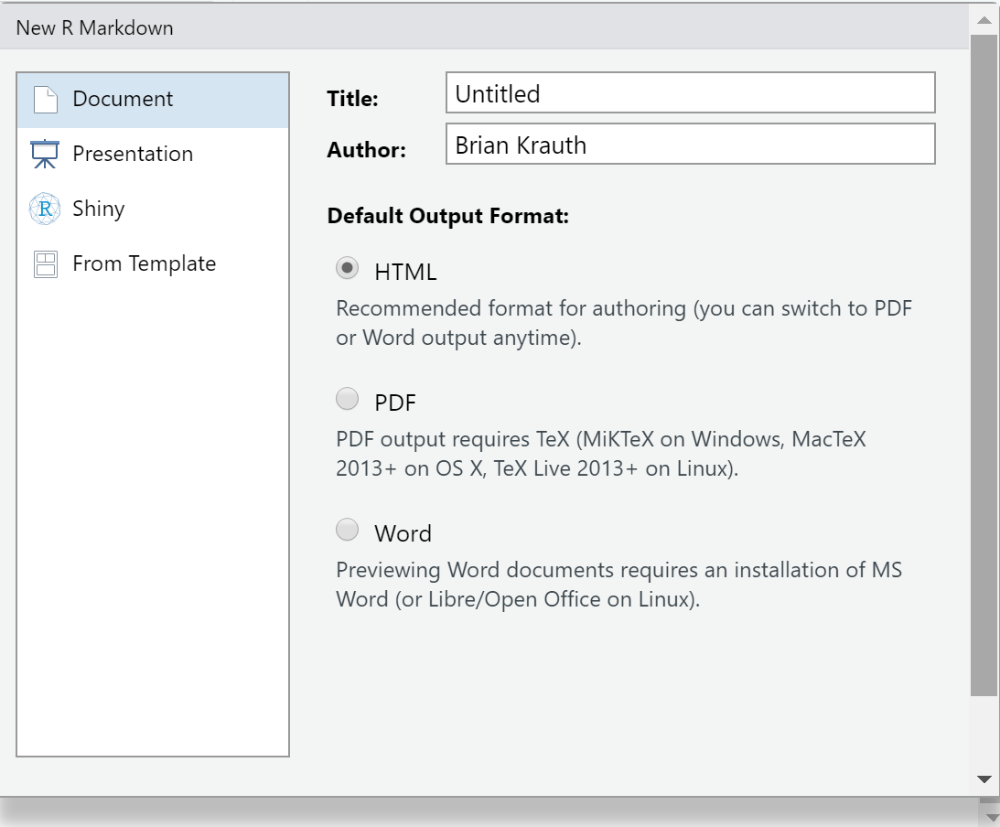
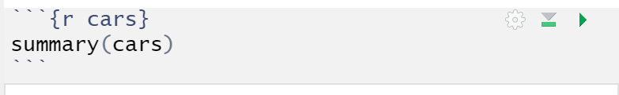
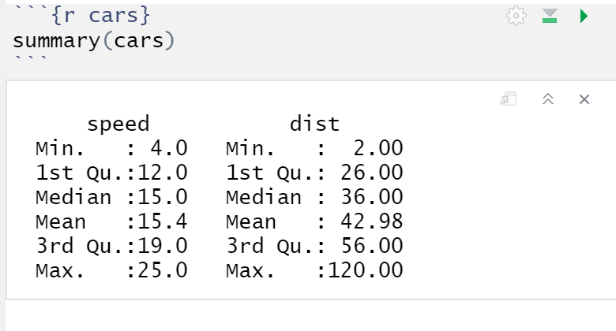
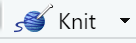
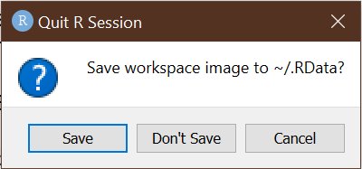

```{r setup09, include=FALSE}
knitr::opts_chunk$set(echo = TRUE,
                      prompt = FALSE,
                      tidy = TRUE,
                      collapse = TRUE)
library("tidyverse")
```

# An introduction to R {#an-introduction-to-r}

As we have seen, Excel is a useful tool for both
[cleaning](#advanced-data-cleaning) and 
[analyzing](#basic-data-analysis-with-excel) data. R is an application
that has many of the same features as Excel, but is specially 
designed for statistical analysis. It is a little more complex, 
but more powerful in many important ways. This chapter will introduce
you to some of the basic concepts of R and associated tools such as R
Markdown, RStudio, and the Tidyverse.  We will later use these tools
to [read](#reading-and-viewing-data-in-r) and 
[analyze](#using-r) 
data, and to create 
[publication-quality graphs](#multivariate-data-analysis)
that are well beyond what can be done in Excel.

:::goals
**Chapter goals**

In this chapter we will learn how to:

- Write and execute some simple R commands in the console window
  a script, and an R Markdown document.
- Perform simple calculations in R.
- Manage R by installing and loading libraries, and opening and closing
  files.
:::

In this course, we will only have time to learn a little bit about
R, so my goal is not to give a comprehensive treatment. My goal here 
is primarily to introduce you to the terminology and concepts of R, 
and to show you a few applications where R outshines Excel.  You will
learn much more about R in ECON 333 and (if you take it) ECON 334. 

## A brief tour of RStudio

Start the program RStudio. You should see something that looks like
this:


You may wonder what the difference is between R and RStudio.

- R is a programming language designed for statistical analysis.
- R is also the computer program that runs R commands.
  - It can also run R  ***scripts***, which are just a series of
    R commands written in a text file.
- RStudio is an *integrated development environment* (IDE) for 
  R. It combines R with a set of additional useful tools: 
  - an interactive session of R (running in the "Console" window).
  - a text editor for writing R scripts and R Markdown documents.
  - tools for managing files and packages used by R
  - tools for comparing and combining scripts and other files
  - help and documentation
  -  many other features

You can run commands and scripts in R itself, but without RStudio
you won't have all these handy extra features.  So most people 
these days use RStudio or another IDE.

RStudio normally displays three or four open windows, each of which has tabs 
you can select to access different features. We will not use most of them, 
but some of them will be very handy indeed.

### The console window

Like most programming languages, R is designed to execute a series
of commands provided by the user.  The simplest way to have R execute
a command is by entering it into the ***Console*** window in the 
lower left corner.

::: example
**Using the console window**

Move your cursor into the console window, type the command 
`print("Hello world!")` and press the `Enter` key to execute the command.  
```{r HelloWorld}
print("Hello world!")
```
As you type your command in, you may notice that RStudio showed various
pop-ups with helpful information about the command.  It will also
autocomplete your command for you.
:::

R maintains a ***command history*** that remembers commands you
have previously entered.  This is useful when you did something a while
ago, but either don't remember exactly how you did it, or don't want to type
it all in from the beginning.

The simplest way of accessing recent commands is to press the up-arrow
key while in the console window.

:::example
**Accessing the command history**

Suppose you decide you want to say "Hello [your name]!" instead of 
"Hello world", and you don't want to type in the whole command. Then
you can:

1. Press the up-arrow key in the *Console* window to show the most recently 
  executed command. If you press it a second time it gives you the 
  command before that, and so on.
2. Look at the to the *History* window in the upper right corner to see
   a full list of recently executed commands.  You can double-click on 
   any command in the window to copy it to the Console window.

Once you have copied the previous command, you can edit it before
pressing `<enter>`.
:::

### Scripts

The Console window is ideal for simple tasks and experimentation, and 
we will continue using it regularly.  But in order to create reproducible
research and take full advantage of R's capabilities, we will need 
to write and execute ***scripts***. 

An script is just a text file containing a sequence of R commands.  By 
convention, an R script should have the `.R` extension but any text file will 
work. 

::: example
**Creating an R script**

To create an R script  

1. Select `File > New File > R Script` from the menu.
2. Enter a valid command in the first line of the file, for example 
  `print("Hello world!")`
3. Enter another valid command in the second line of the file,
   for example `print("Goodbye world?")`
4. Select `File > Save` to save your file.
   - Name it *Chapter10Example.R*

To run your script:

1. Press the {width=10%} button.

You will see the results of your commands in the Console window.
:::

### R Markdown

RStudio can also run text files written in the ***R Markdown*** format. R
Markdown files have the `.Rmd` extension. 

R Markdown is a language for producing documents - HTML files (web pages), 
Microsoft Word documents, PDF files, etc. - that have R code and analysis
embedded in them. In fact, this book is written in R Markdown.

R Markdown is an implementation of the Markdown markup language in R. 

::: fyi
**What is Markdown?**

Markdown is a markup language just like HTML, which means that it is 
a way of writing documents in text files whose content is
readable directly but can also be formatted and displayed (rendered)
in a visually appealing way. 

The original idea of HTML was that content creators could write 
their content in text files (pages), with a few HTML tags sprinkled
around to give the browser information about structure, and then 
the browser would display the page.  However, as web users demanded
fancy graphics, custom colors, interactivity, and mobile-friendly
display, HTML became much more complicated.

Markdown was created as radically simplified markup language. The basic
idea is to use common conventions for how to indicate structure in
a text file.

- Adjacent lines of text are interpreted as part of the same paragraph.
- A line of text following a blank line starts a new paragraph.
- A line of text that begins with "#" is a header, with "#" for level 
  one headers, "##" for level two, etc.
- A line of text that begins with "-" is a bullet point.
- A line of text that begins with a number is part of a numbered list.
- Text written like `*this*` is rendered like *this*. 
- Text written like `**this**` is rendered like **this**. 
- Text written like `***this***` is rendered like ***this***. 

Markdown documents can also include links and pictures (by simply
providing the URL or file name), tables, and all sorts of 
other things.
:::

In addition to ordinary text and Markdown information, R Markdown
documents can include pieces of executable R code.  R code needs to be 
surrounded by a ***code fence*** that identifies the text inside 
the fence as R code, and in some cases provides additional information
about how it should be executed.  This sounds complicated, but is
easy to see in a real R Markdown file.

:::example
**Creating an R Markdown file**

To create our first R Markdown file:

1. Select `File > New File > R Markdown` from the menu.
   - You will see a dialog box that looks like this:
      
2. The default options are fine, so select `OK`.
3. Save the file.

RStudio has taken the liberty of creating an example R Markdown file that
you can use as a template.  
:::

You can run the R code in an R Markdown document in one of two ways:

You can run and display results for individual ***chunks*** of code. A 
chunk is a few lines of R code surrounded by a code fence.

::: example
**Running code chunks**

To run a code chunk in our R Markdown file:

1. Go to the code chunk that looks like this:
   
2. Press the  button.

As you can see, the code in the chunk will run and the results
will be displayed below.
   
:::

You can also ***knit*** the entire R Markdown file into an HTML/word/PDF
document that includes both the text and the R results by pressing 
the Knit button.

::: example
**Knitting an R Markdown document**

To knit an entire document:

1. Press the {width=15%} button.

It will take a few moments to process the file, and then the HTML
file will open in a browser.
:::

By default, R Markdown files usually knit to HTML, but we can knit
to other file formats including Word and PDF.  We will stick to 
HTML in this course.

:::fyi
**R Markdown resources**

R Markdown is as simple or as complicated as you want to make it. A plain
text file with a few lines of content is a valid R Markdown file, and
like HTML, Markdown is designed so it still "works" if you do something
unexpected.

If you want to try something new in R Markdown, or have forgotten how to do 
something, the most useful resource is the one-page *R Markdown Cheatsheet*.  It 
is available directly in RStudio, or at 
https://github.com/rstudio/cheatsheets/raw/master/rmarkdown-2.0.pdf.
You can also just search for "r markdown cheatsheet".
:::

### Other RStudio features

RStudio has many other features, most of which we will not use. But I
would like to highlight a few that may seem useful.

In the lower right window:

- The *Files* tab gives you easy access to files in the current 
  active folder.
- The *Plots* tab will display plots, when you create them.
- The *Packages* tab is useful for managing packages (more
  on them later)
- The *Help* tab allows you to access R's help system.
  
In the upper right window

- The *Environment* tab allows you to view all currently-defined
  variables and their values.
- The *History* tab shows the command history.

In the menu:

- You can select `Session > Restart R` to clear the memory and 
  restart the current R session.

We are done for now, so close RStudio. You may get a warning message that 
looks something like this:
  

Never click on the `Save` button here, as it would cause R to
save the current state of its memory and re-load it next time you start R.
In the interest of reproducibility, you should start R "clean" every time.
Click on the `Don't Save` button, and you will exit RStudio.

## The R language

Next, we will learn some basic features of the R language.  Open RStudio
and go to the console window so we can enter commands and see what they
do.

### Expressions 

An ***expression*** is any piece of R code that can be evaluated on its
own. For example:

- Any text, numerical or logical constant: `"Hello world"`, `105`, `1.34`, or `TRUE`. 
- Any complete formula built from functions and arithmetic
  operators: `log(10)` or `2+2`

An expression needs to be complete, for example `ln(` is not an
expression, nor is `2+`.  

Every valid R expression ***returns*** a value, also called an 
***object***.  

  - An object can be a number, a text string, a date, or a logical value,
    just like in Excel.
  - Objects can also be much more complex

You can execute any valid R expression as a command, and have it display
the value it returns.  
```{r ExpressionExample}
# This is a comment. R ignores everything in a line after the "#"
4+5
```

You can also use any valid R expression within a larger expression.
```{r ExpressionInExpression}
sqrt(4+5)
```

In addition, some expressions have a ***side effect***.  That is, they make
something happen: they cause something to appear on your computer screen, or
change a file, or change something in R's memory. 

```{r SideEffectExample}
# This expression has a side effect
# It causes R to plot a histogram of 100 N(0,1) random numbers
hist(rnorm(100))
```

Although we call it a "side effect", the side effect is often the 
main purpose of the expression.

### Assignment

We can use the `<-` or ***assignment*** operator to assign the results
of an expression to a named variable.  We can then use that
variable in later expressions.

For example, the R command `x <- 2` assigns the value `2`
(i.e., the number 4) to the variable `x`.  Any subsequent code
can then refer to the variable `x` in its own calculations or 
actions.

:::example
**Using the assignment operator**

```{r AssignmentOperatorExample}
# This will cause the variable x to take on the value 2
x <- 2
# We can then use x in any expression
y <- x + 1
print(y)
# We can change the value of x at any time
x <- 0
# But this will not change the result of any previous calculations
print(y)
```

:::

We can display the contents of an object using the `print()` 
function, or by simply giving its name:
```{r PrintExample}
x <- 5
print(x) 
x
```

### Vectors

The primary data structure in R is a ***vector***, which is just 
an ordered list of elements.  

The simplest type of vector is called an ***atomic vector*** - its 
elements are normally from one of R's basic or ***atomic*** data
types: 

- text strings 
- numbers 
- logical values (either `TRUE`  or `FALSE`)
  
The elements of an atomic vector need to be all part of the same 
atomic type; a single vector cannot contain both strings and numbers,
for example. 
  
We can construct a vector by enumeration using the `c()` function:
```{r EnumerationExample}
fruits <- c("Avocado", "Banana", "Cantaloupe")
print(fruits)
```
There are many other functions that can be used to construct vectors. Two
particularly useful ones are `rep` which repeats something a particular
number of times, and `seq` which creates a sequence:
```{r RepExample}
# REP repeats something (like Excel's Fill tool)
ones <- rep(1, times = 10)
print(ones)
# SEQ creates a sequence (like Excel's Series tool)
evens <- seq(from = 2, to = 20, by = 2)
print(evens)
# You can also create a sequence with the : operator:
print(1:10)
```

Mathematical functions in R operate directly on vectors, and automatically
expand scalars (single numbers) to vectors as needed:
```{r VectorExpansionExample}
# This command subtracts 1 from every element in evens
odds <- evens - ones
print(odds)
# This command does the same
odds <- evens - 1
print(odds)
```

The ***subscript operator*** `[]` can be used to select part of a 
vector. You can enumerate the indexes of the elements you want:
```{r SubscriptOperatorExample}
# You can give a single index
# evens[2] is the 2nd element in evens
x <- evens[2]
print(x)
# You can give a vector of indices
# evens[c(2,5)] is a vector containing the 2nd and 5th element in evens 
x <- evens[ c(2, 5) ]
print(x)
# You can give a range of indices
# evens[2:5] is a vector containing the 2nd, 3rd, 4th and 5th element in evens 
x <- evens[2:5]
print(x)
```

You can also provide logical values instead of numeric indices. R will then 
operate on those elements whose corresponding item has the value `TRUE`:
```{r LogicalSelectionExample}
print(evens)
# This creates a vector of the same length as evens, that contains TRUE
# for all values less than 10, and FALSE for all other values
lessthan10 <- (evens < 10)
print(lessthan10)
# This creates a vector that includes only those elements of evens
# for which forexample is TRUE
x <- evens[lessthan10]
print(x)
# This is a quicker way of accomplishing the same result
x <- evens[evens < 10]
print(x)
```

Vector subscripting can be used on either side of the assignment operator:
```{r LeftSideSubscriptingExample}
x <- evens
print(x)
# This assigns the number 1000 to the 2nd element in x
x[2] <- 1000
print(x)
```

### Lists 

The other type of vector is a ***list***.  A list is a vector whose
elements are themselves other vectors. These vectors can be any 
type, so we can use lists inside lists to build very complex 
objects.  

Lists can be built using the `list()` function:
```{r ListExample}
everything <- list(fruits, evens, odds)
print(everything)
```
You can (and should) assign names to the elements of a list:
```{r NamedListExample}
everything <- list(fruits=fruits,
                   evens=evens,
                   odds=odds)
print(everything)
```
You can access part of a list by specifying its numerical index inside of the 
`[[]]` operator:
```{r ListSubscriptExample}
print( everything[[2]] )
```
If the items in a list are named, you can also access 
them by name using either `[[]]` or `$` notation
```{r ListDollarsignExample}
print( everything[["evens"]] )
print( everything$fruits )
```

You can also use the `$` notation to add new items to an existing list:
```{r AddToListExample}
# There is no element in everything called "allnumbers" 
everything$allnumbers <- c(evens, odds)
# But now there is...
print(everything)
```

### Attributes

Any object can also have ***attributes***.  This attributes of an
object are a list associated with the object that provides additional 
information.

Let's see if any of the objects we have created have 
attributes:
```{r AttributesExample}
print(attributes(fruits))
print(attributes(evens))
print(attributes(everything))
```
Note that:

- our two atomic vectors have attributes NULL. That's
  R's way of saying they have no attributes
- our list stores the names of its three elements in 
  the `$names` attribute.  

R has hundreds of standard object types that are built from atomic vectors,
lists, and attributes.  These object types include matrices, arrays,
data sets, objects structured as the output of a particular statistical analysis,
descriptions of graphs, and so on.  Users can also define their own object
types, and there is an extensive system for generic functions and
object-based programming (if you know what that is). 

### Functions and operators

There are hundreds of built-in mathematical and statistical ***functions*** 
in R, and users can easily define their own functions. As you have seen, 
their format and usage is quite similar to Excel though there are a few important 
differences.

Let's get to know the main features of functions in R by considering the
`seq()` function.  We have already seen this function: it is used to
create a vector with a sequence of numbers, much like Excel's *Series*
tool.

1. Every function has a name.
   - In our example, the function's name is `seq`.
2. You can obtain help on any function by entering `?` and its name
   in the console window
   - Try `? seq`.
3. Most functions accept one or more ***arguments***. 
   - The `seq` function's arguments include `from`, 
    `to`, `by` and `length.out`
   - Every argument has a *name* and a *position*.  For example,
     the `from` argument is in position one, the `to` argument
     is in position two, etc.
   - Arguments can be passed to the function by *name* or by *position*.
     - Passing by name looks like this:`seq(from=1,to=5)`
     - Passing by position looks like this: `seq(1,5)`
     - You can mix both methods: `seq(1,5,length.out=10)`
     - I recommend passing by position for simple functions, 
       and passing by name for more complex functions, but it
       is really just a matter of what works for you.
   - Some arguments are required. They must be provided every time the
     function is called, or else the function will return an error. 
   - Some arguments are optional. They *can* be provided, but have
     a default value if not provided. 
     - All arguments to `seq()` are optional; execute the command `seq()` 
       to see what happens.
4. Every function returns a value.  This is even true for functions 
   like `print()`.  To see this: 
   ```{r}
   y <- print("Hello world")
   print(y)
   ```
   As you can see, `print("Hello world")` returns "Hello world" as its
   value.
5. Some functions also produce ***side effects***, as we have described
   earlier.

In addition to functions, R has the usual binary mathematical 
***operators*** such as `+`, `-`, `*` and `/`.  Operators are
just another way of expressing functions.  For example
the `+` operator is really just another way of calling 
the `sum()` function:
```{r OperatorExample}
# These two statements are equivalent
2 + 2
sum(2, 2)
```
There are several other commonly used operators:
```{r OtherOperators}
# Basic arithmetic operators
2 + 3
2 - 3
2 * 3
2 / 3
2 ^ 3
# Comparison operators
2 < 3
2 == 3
2 > 3
# Logical operators
2 == 3 & 2 < 3 # this is logical AND
2 == 3 | 2 < 3 # this is logical OR
```
The assignment operator is also an operator. It is equivalent to the 
`assign()` function:
```{r AssignmentIsAnOperator}
# These two statements are equivalent:
x <- 2
assign(y, 2)
print(x)
print(y)
# The assign function returns its own value, so you can do this:
x <- y <- 3
print(x)
print(y)
```

## Packages and the Tidyverse

R has many useful built-in functions and features.  But one of its 
most useful features is how easy it can be extended by users, and the 
fact that it has a large user community who have 
provided ***packages*** of useful new functions and data.  
There are thousands of packages available online.  We will use a particularly
useful package called the ***Tidyverse***. 

:::fyi
**What is the Tidyverse?**

The Tidyverse was created by the data scientist Hadley Wickham (also one of 
the key people behind RStudio) as a way of solving some long-standing problems
with R.  The Tidyverse is both an R package containing a set of new functions 
and data structures as well as a philosophy about *how* to analyze data.

The basic structure of R dates back to 1976 (R itself was created in the early
1990s but is closely based on an earlier program called S). Computer science
has advanced a lot since 1976, so some design aspects of R seemed like a good
idea at the time but would be designed differently today.  

- Too many different ways of doing the same thing
- Too many rarely-used functions,
- Some functions that don't do what they should. 

Unfortunately, we can't change any of the original functions without 
causing thousands of existing programs to stop working.

The Tidyverse addresses this problem by replacing many Base R 
functions with alternative versions that are easier to use, 
better-designed, and usually faster. It does this in part by 
being "opinionated" - for example, most data analysis tools 
in the Tidyverse expect data to be in a tidy format.  This
reflects a philosophy that data cleaning should precede and be
separate from data analysis.
:::

Most commonly-used packages including the Tidyverse are open-source,
and are available online from the [Comprehensive R Archive Network (CRAN)](https://cran.r-project.org/). 

Before you can use any package, two steps must be followed:

1. The package needs to be ***installed*** on your computer using 
   the `install.packages()` function. 
   - This only needs to be done *once* for each package.
2. The package needs to be ***loaded*** into memory using the `library()` 
   function.
   - This needs to be done in *every* R session.

Once the package is installed and loaded, you can use its functions
and other features.

:::example
**Loading the Tidyverse**

You can get a list of all available CRAN packages by simply executing
the `install.packages()` function with no arguments:
```{r ListPackages, eval = FALSE}
install.packages()
```
If you know the name of the CRAN package you want to install, 
you can provide it as the argument:
```{r InstallTidyverse, eval = FALSE}
install.packages("tidyverse")
```
You only need to install each package once.

However, installing a package only puts the files on your computer. In order
to actually use the features of a package you need to load it into 
memory during your current R session using the `library()` function:
```{r LibraryTidyverse, eval = FALSE}
library("tidyverse")
```
You can then use the Tidyverse functions and other tools.
:::

## Some examples

I have explained some of the basic structure of R, but the best 
way to learn a tool is by using it.

::: example
**Plotting a PDF**

Suppose we want to plot the $N(0,1)$ PDF. We can start by describing 
step-by-step what we need to do:

1. Construct a vector $x$ of values at which to plot the PDF.
2. Calculate a vector $p = \phi(x)$, where $\phi(\cdot)$ is the
  $N(0,1)$ PDF.
3. Plot $p$ against $x$.

Then we need to figure out how to accomplish each step using R:

1. Our first step can be accomplished using the `seq()` function, 
   which we have already used. If you know the name of the function 
   you want to use, you can access its help page by executing the 
   command `? [function name here]`:
   ```{r}
   # ? seq
   ```
   As you can see, the `seq()` function takes arguments `from=` (for the 
   starting point), `to=` (for the end point), and `length.out=` (for the
   total number of points).  Let's plot the function at 10 points between -4 
   and 4:
   ```{r}
   x <- seq(from=-4,to=4,length.out=10)
   print(x)
   ```
   Note that I've picked only 10 points here so that our code is easy
   to check.
2. The next step is to calculate the standard normal PDF at each of these 
   points. R is a program for statisticians, so it presumably has that PDF
   available as a built-in function. But what if we don't know its name? 
   We can just Google "normal pdf in r" and click on a page or two to find 
   out that the function we need is called `dnorm()`. 
   ```{r DnormExample}
   p <- dnorm(x)
   print(p)
   ```
3. Our last step is to plot $p$ against $x$. We could Google, or we
   could guess that the function for creating plots is called `plot()`
   and try something out. Don't be scared to try things out, nothing
   bad could possibly happen here.
   ```{r PlotExample}
   plot(x,p)
   ```
   You will see this plot in the *Plots* tab in the lower right corner
   of your screen.

Well, that's not too bad, but we might want to make some improvements:

1. Plot it at more points (1000 rather than 10, for example)
2. Connect the points with a line
3. Add a title

So we can read through the documentation for the `plot()` function,
try a few things out, and we can produce a much prettier graph
by just adding a few options:
```{r FancyPlotExample}
x <- seq(from = -4, to = 4, length.out = 1000)
p <- dnorm(x)
plot(x, p, 
     type = "l", 
     ylab = expression(phi(x)),
     main = "PDF of N(0,1) distribution")
```

As you can see, we have a much nicer and clearer looking plot.
:::

## Chapter review {#review-introduction-to-r}

In this chapter, we learned how to run R programs whether in the console, in
a script, or in an R Markdown document.  We also learned some basics of
the R language. We haven't learned how to do much of anything useful
yet with data, but we will over the next few chapters.  In particular, 
we will learn how to move data from Excel to R, how to view data in R,
and how to clean and analyze data in R.  We will also learn a sophisticated
R graphing package called ggplot.

Although you will be tested on specific knowledge, you should also 
keep in mind the bigger picture: my real goal here is for you to develop
some long-lasting skills that you will find useful in the future.  This
should be your goal as well. 

A year from now, or five years from now, you will probably not be able 
to remember exactly what the format of the `seq` function is, nor will
you need to. Instead I want you to focus on learning how to think about 
a coding task, how to find information, and how to design and implement 
your plans. 

::: fyi
**For more information on R**

There are many free sources of useful information about R. 

- A good short introduction is available at 
  https://cran.r-project.org/doc/contrib/Torfs+Brauer-Short-R-Intro.pdf.
- A good longer book that focuses on the Tidyverse is Wickham and Grolemund's
  *R for Data Science*.  It can be purchased as an actual book from Amazon
  or your local book shop, and is also available as a free e-book at 
  https://r4ds.had.co.nz/index.html.
:::


### Practice problems {#problems-introduction-to-r}

**SKILL #1: Perform basic tasks in RStudio**

1. Open RStudio and do the following:
   a. Execute a command in the console window.
   b. Write and execute (source) a brief script.
   c. Write and knit a brief R Markdown document.
   
**SKILL #2: Use R expressions and vectors**

2. Which of the following are valid R expressions?
   a. `"Hello world"`
   b. `Hello`
   c. `Hello"`
   d. `2+2`
   e. `x <- 2 + 2`
   f. `x <- 2 +`
3. Write the R code to perform the following actions:
   a. Create a vector named `cookies` that contains the elements "oatmeal", 
      "chocolate chip", and "shortbread".
   b. Create a vector named ``threes` that contains all of the integers between
      1 and 100 that are divisible by 3.
   c. Use the vector `threes` to find the 5th-lowest integer between 1 and 100
      that is divisible by 3.
   d. Create a list named `threecookies` that contains `cookies` and 
      `threes`.

**SKILL #3: Use R packages**

4. Load the tidyverse package (you will need to install it if you have not already
   done so), and execute the R code below:
   ```
   data("mtcars")  # load data
   ggplot(mtcars, aes(wt, mpg)) + geom_point(aes(colour=factor(cyl), size = qsec))
   ```


### Practice problem answers {#answers-introduction-to-r}

1. The chapter describes how to do each of these.
2. Items (a), (b), (d), and (e) are valid R expressions.
3. Write the R code to perform the following actions:
   a. `cookies <- c("oatmeal", "chocolate chip", "shortbread")`
   b. `threes <- seq(3,100,by=3)`
   c. `threes[5]`
   d. `threecookies <- list(cookies = cookies, threes = threes)`.
4. This code will load a built-in data set of automobile gas mileage, and 
   produce a graph that depicts the relationship between weight and miles per
   gallon:
``` {r pp_09_04}
   data("mtcars")  # load data
   ggplot(mtcars, aes(wt, mpg)) + geom_point(aes(colour=factor(cyl), size = qsec))
```
