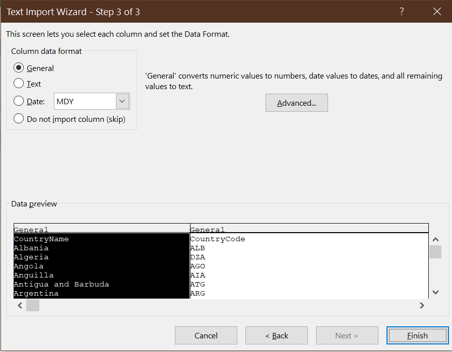
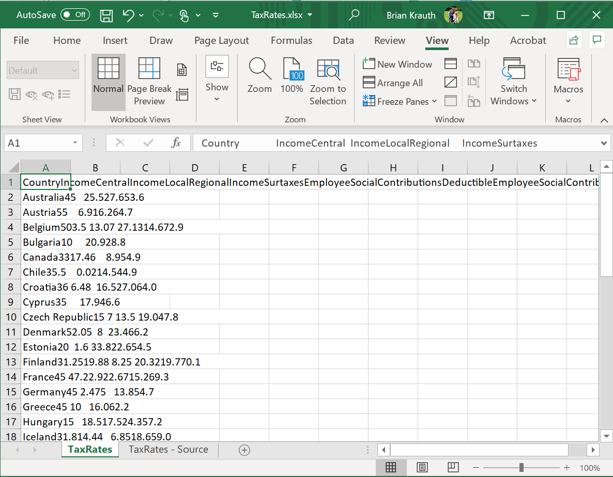
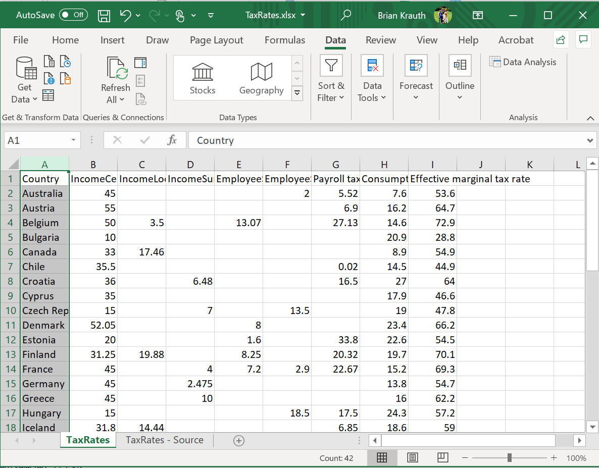
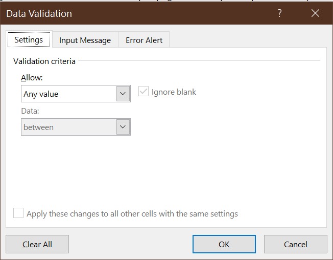

# Advanced data cleaning {#advanced-data-cleaning}

```{r setup10, include=FALSE}
knitr::opts_chunk$set(echo = TRUE,
                      prompt = FALSE,
                      tidy = TRUE,
                      collapse = TRUE)
library("tidyverse")
```

In an earlier chapter, we learned some 
[basic data cleaning](#basic-data-cleaning-with-excel) 
skills using Excel, and some [introductory R skills](#an-introduction-to-r).  This 
chapter will build on these skills by teaching some more advanced tools and concepts.

::: goals
**Chapter goals**

In this chapter we will learn how to:

- Move data files across multiple file formats.
- Combine multiple data files into a single workbook.
- Link observations in Excel using XLOOKUP.
- Construct group-level aggregate variables in Excel.
- Avoid, detect and handle errors in Excel.
- Protect Excel data from unintentional modification.
- Read CSV files in R.
- View data tables ("tibbles") in R.
:::

We will do this while building a data set describing long-run economic
growth in a wide cross-section of countries. 


::: economics
**Data on long-run economic growth**

Our main data source will be the ***Penn World Table*** (PWT), a cross-country
data set covering real GDP, population, and other macroeconomic variables. The
PWT is built from two distinct data sources:

- National income data from each country's national statistical agency.
- Systematic data comparing prices across countries, constructed by the
  World Bank's International Comparison Program (ICP).

The ICP data is needed to account for a simple economic reality: each 
country's GDP is calculated using local prices, but prices of key goods and
services vary dramatically across countries: housing is much more expensive
in Vancouver than in Houston, and a haircut is much cheaper in Mumbai
than in London.  The PWT research team use the results of the ICP to convert
each country's GDP data to comparable (PPP) units.  The current version 
of the PWT is available online at http://www.ggdc.net/pwt. 

> Download the required file pwt100.xlsx from   
> [https://bookdown.org/bkrauth/BOOK/sampledata/pwt100.xlsx](sampledata/pwt100.xlsx)  

We also have a secondary data source with cross-country data on top marginal
tax rates.  Most countries have *progressive* tax systems - that means that
residents with high income pay a higher tax rate than residents with low
income - but these higher rates only apply to *marginal* income.  For
example if the marginal tax rate is 30\% on taxable income below \$100,000 and 
40\% on taxable income above \$100,000, a taxpayer with \$150,000 in taxable 
income would pay 30\% on the first \$100,000 and 40\% on the remaining \$50,000
for a total tax bill of \$50,000, or an average tax rate of 33\%.

The data on the top marginal tax rate is obtained from the Tax Foundation[^801], 
a US-based policy and research organization. Our data set comes from Table 1 in the report "Taxing High Incomes: A Comparison of 41 Countries", available online at  https://taxfoundation.org/taxing-high-income-2019/. 

> Download the required file TaxRates.xlsx from 
> [https://bookdown.org/bkrauth/BOOK/sampledata/TaxRates.xlsx](sampledata/TaxRates.xlsx)  

Finally, we have a "crosswalk" data file I have constructed to help with
linking the GDP and tax data (more about this below). 

> Download the required file CountryCodes.txt from 
> [https://bookdown.org/bkrauth/BOOK/sampledata/CountryCodes.txt](sampledata/CountryCodes.txt)  
> This file may display in your browser rather than downloading like the other 
> files.  If that happens, you can right-click on the link above and select 
> "Save link as" to save the file on your computer.

The rest of the chapter will use these three data files.
:::

[^801]: I should mention that the Tax Foundation is not an entirely neutral 
organization - it generally supports lower taxes - and so my use of their
data here should not be taken as expressing an opinion on their policy 
views. It is not unusual for useful data to come from politically-motivated 
sources; for many years the best data on tobacco prices and taxes came from
the Tobacco Institute, a tobacco industry lobbying group (https://en.wikipedia.org/wiki/Tobacco_Institute).    

## Data file formats

Nearly every software application we might use for data analysis has a 
***native***  file format specifically designed for saving and reading data 
in that application.  For example, Excel's native format is the `.xlsx` file 
format.

Applications work most seamlessly with their native format.  However, most 
modern applications can also ***import*** (read) and ***export*** (save) files in
other formats including native formats of other popular programs.

There are also several standard or open file formats that are commonly
used to share data across applications.  Most of these open file formats
are built from ***text files***. 

- A text file is just a sequence of lines of ***plain text*** characters
  with no formatting, graphics, or complex structure.
  - Most plain text characters are standard visible letters, numbers, 
    spaces, and symbols.
  - There may also be some non-display characters, including the end-of-line 
    character(s), the end-of-file character, and tab characters.
- You can view and edit text files using a simple application called a 
  ***text editor***.
  - Windows has a simple built-in text editor called *Notepad*
  - MacOS has a built-in text editor called *TextEdit*. 
  - There are more advanced text editors available for free online; 
    I use one called [*Notepad++*](https://notepad-plus-plus.org/). 
- Text files can be read by humans as well as computer programs.

Files that are not text files are usually called ***binary*** files. Binary
files are generally not human-readable.

:::economics
**The economics of file formats**

What determines the file format used by a given program? Technical
considerations play an important role, but so does economics.

As a technical matter, binary files can be more efficient for
storage and processing. To a computer, everything is a number,
and so the number 123 can in principle be stored and handled more
efficiently than the text string "123".  The primary technical
advantage of text files is interoperability: sharing data across
different users, applications, and devices.

In a market economy, companies can increase profits by efficiently
using *scarce* resources. Many well-known applications have moved
from binary to text file formats as computers have become more 
powerful (so reducing storage and processing requirements becomes less 
valuable) and more networked (so increasing interoperability 
becomes more valuable).

Another economically important difference is that a company can
control use of its binary file format through some combination
of intellectual property rights (e.g. patents) and simply limiting
access to information about the format (trade secrets). Controlling
a *proprietary* file format in this manner can provide a 
competitive advantage to a software company. However, this advantage
has become less valuable over time as big companies demand the 
interoperability and customization potential associated with open 
file formats and standards.

For example, Excel's original `.xls` files were binary files in a 
proprietary format whose details were only known only by 
Microsoft. Its current `.xlsx` files are (zipped) text files in an open
format whose details are published
[here](https://docs.microsoft.com/en-us/openspecs/office_file_formats/ms-offfflp/885c7947-17de-490b-840d-91231a031383). 

If you are interested in learning more about the economics of 
strategic interaction among firms, you should consider taking
our third-year elective ECON 325.
:::

### Fixed-width files

***Fixed-width*** text files represent a table of data by allocating
the same number of characters to each cell in the same column.  They 
can be formatted to be readable to humans like this:
```
Name                   Year of birth   Year of death
Mary, Queen of Scots   1542            1547
Mary I                 1516            1558
Elizabeth I            1533            1603
```
or they may be in a less-readable format like this:
```
Mary, Queen of Scots15421547
Mary I              15161558
Elizabeth I         15331603
```
The key feature of a fixed-width file is that each column begins
at the same point in each line.  For example, 

- In the first file, the year of birth always starts 
  on the 24th character of each line, and the year of death
  always starts on the 40th character.
- In the second file, the year of birth always starts 
  on the 21st character of each line, and the year of death
  always starts on the 25th character.

You can open fixed-width text files in Excel using the 
*Text Import Wizard*.

::: example
**Opening a fixed-width file**

Open the file [CountryCodes.txt](sampledata/CountryCodes.txt) in a text 
editor. It will look like this:
    
This is a fixed format file in which the CountryName variable
starts on the 1st character of each line and the CountryCode
variable starts on the 36th character.

To open this file in Excel, use the Text Import Wizard:

1. Select `File > Open >` from the menu.
2. Select `Browse` to get to the usual `OpenFile` dialog box.
3. Find and select the file `CountryCodes.txt`.  You may need to move 
   to the correct folder, and to change the file type to "All files (*.*)"
4. The first dialog box of the Text Import Wizard allows you to specify
   the overall structure of your data file:
    
   Excel guesses about the structure of your data, but you may need to
   correct its guesses. In this case, you should change the file
   type from `Delimited` to `Fixed width`, and select `Next>`.
   - Excel made a few other wrong guesses (it thinks that the file is 
     written in Japanese!) but you can ignore them.
5. The second dialog box of the Text Import Wizard allows you to 
   specify where each column starts:
    
   Excel seems to have guessed correctly in this case, so go ahead
   and select `Next>`.
6. The final dialog box of the Text Import Wizard provides some
   options for changing the data format for each individual column:
    
   We do not need to worry about any of these options, so go ahead and 
   select `Finish`.
   
Our worksheet now contains the imported data, correctly arranged into
cells. Keep this worksheet open.
:::

### CSV files

The most common and useful general-purpose format for tabular data
is called the ***comma separated values*** or ***CSV*** file format. A 
CSV file is just a text file with the following features:

- Each line in the file represents a row in the table
- Within each row, cell values are separated or ***delimited*** by commas.
- Where necessary, text values are enclosed in quotes.

For example, this CSV file:
```
Name,Year of birth,Year of death
"Mary, Queen of Scots",1542,1547
Mary I,1516,1558
Elizabeth I,1533,1603
```
will appear in Excel as the table:

| Name                 | Year of birth | Year of death
|----------------------|---------------|---------------
| Mary, Queen of Scots |    1542       |    1547
| Mary I               |    1516       |    1558
| Elizabeth I          |    1533       |    1603

Notice that the quotes around "Mary, Queen of Scots" are needed
in order for the comma to be interpreted as an actual comma
rather than a delimiter between cells. 

::: example
**Exporting a CSV file from Excel**

To save the Excel worksheet we created in the previous
section as a CSV file:

1. Select `File >  Save As`. You will see:
   - a text box giving the file name (`CountryCodes.txt`) 
   - a drop-down box giving the file format (`Text (Tab delimited) (*.txt)`
3. Select `CSV (Comma delimited) (*.csv)` from the drop-down box and 
4. Enter a file name (I suggest *CountryCodes.csv*) in the text box.
5. Select `Save`.
   - You may get the warning message: *The selected file type does
     not support workbooks that contain multiple sheets. To save only
     the active sheet click OK....* If so, select `OK`.
6. Close Excel.
   - You may get another warning message: 
     `Want to save your changes to CountryCodes.csv?` If so, 
     select `Don't save`.
     
You have created a CSV file.
:::

You can see the exact contents of a CSV file by opening it in a text 
editor.  

:::example
**Opening a CSV file as text**

Use your preferred text editor to open the file CountryCodes.csv. It
will look something like this:
 
:::

If a CSV file has `.csv` at the end of its file name, you can open it
in Excel by just double-clicking on it. Otherwise, you can use the
Text Import Wizard.

CSV files (and text files in general) have several important limitations
relative to regular Excel (`.xlsx`) files:

1. A CSV file can only contain one table, while an Excel file
   can contain multiple tables.
2. A CSV file can only contain cell values, and cannot contain:
   - Formulas
   - Formatting
   - Graphs
   - Any other fancy Excel features
   
These limitations are also the main advantage of the CSV file: they are simple
ways of reporting tabular data and can be read by virtually any program, or
even by a human.

### Other file formats

In addition to CSV files, we will run into files that use characters
other than the comma to delimit cells. 

 - ***Space-delimited*** text files are just like CSV files, but 
   use spaces as the delimiter.  For example, a space-delimited
   version of our table might look like this:
   ```
   Name "Year of birth" "Year of death"
   "Mary, Queen of Scots" 1542 1547
   "Mary I" 1516 1558
   "Elizabeth I" 1533 1603
    ```
 - ***Tab-delimited*** text files are just like CSV files, but use a tab character
   as the delimiter.

Like fixed-width and CSV files, space-delimited and tab-delimited files
can be imported into Excel using the Text Import Wizard.

Excel also has a wide variety of tools for obtaining data from various
databases, online services, etc. We do not have time to explore all of
these tools, but you can select `Data` from the menu bar and look 
around to see what is available.

### Text to columns

Sometimes you will run into an Excel sheet that looks like this:
   
This can happen if a text file has been incorrectly imported,
or if you have copied-and-pasted data from a PDF file or web 
page.  Fortunately, Excel has a way of fixing that: the 
***Text to Columns*** tool.

:::example
**Using the text-to-columns tool**

Open the file [TaxRates.xlsx](sampledata/TaxRates.xlsx).  As you can see, it looks
like the picture above. To use the Text to Columns tool:

1. Select the column with the data (column A).
   - Be sure to select the whole column, not just a single cell.
2. Select `Data > Text to Columns` from the menu.
3. The Text to Columns Wizard will appear.
   - It is very similar to the Text Import Wizard
   - Excel is usually smart enough to guess the structure
     of your data and to offer the correct default options
     here.
   - Assuming the default options are correct (you can see what
     happens if you change the options), select `Next>`, then
     `Next>` again, then `Finish`.

Your worksheet should now look like this:
  
Save this file and exit Excel.
:::

## Combining data

The data that we wish to analyze often comes in multiple tables
from multiple sources.  In order to proceed with the analysis, we
often need to combine information in various ways:

1. We will want to combine multiple data files into a single 
   Excel file.
2. We will want to link observations in one table with observations
   in another table.
3. We will want to construct new variables that are group-level aggregates
   (counts, averages, or sums) of existing variables.

This section will go through the most important tools and techniques
of combining data in these ways.

### Combining Excel files

Data tables often come in multiple files, especially if they are from
different sources.  It is possible for one Excel file to use data from
another Excel file (or even a non-Excel file or online data source),
but doing so can lead to problems if not done very carefully. For example,
if one file has a formula that references another file, that formula
may stop working if either file is moved to another folder.

An easier approach in most situations is to just combine everything into
a single Excel workbook.

:::example
**Combining our cross-country data files**

We currently have three data files: *pwt100.xlsx*, *CountryCodes.csv*,
and *TaxRates.xlsx*. To combine them in a single file:

1. Open all three files.
2. Go to *CountryCodes.csv*, and right-click on the *CountryCodes* tab
   at the bottom of the page.  A menu will appear; select `Move or Copy...`
   and the `Move or Copy` dialog box will appear:
    
3. Select *pwt100.xslx* from the `To book:` drop-down box. Your worksheet 
   will now move to that workbook.
4. Repeat the same process with both worksheets in the *TaxRates.xlsx*
   workbook.
5. At this point all of our worksheets are in a single workbook. Save the 
   workbook with name *GrowthData.xlsx*.
:::

Before proceeding, it's a good idea to make sure our data is tidy.


:::example
**Making the our workbook tidy**

1. Take a look at each of our three main worksheets and identify 
   if they need to be adjusted in any way to meet our criteria for
   tidy data:
   - *CountryCodes* is tidy and does not need alteration.
   - *TaxRates* is tidy and does not need alteration.
   - *Data* has one issue: each observation (row) appears to describe a
     particular country in a particular year.  There is an identifier 
     for country and an identifier for year, but no combined identifier
     that takes on a unique value for each individual observation. We will
     need to create one.
2. Add a unique ID variable to the *Data* worksheet:
   a. Insert a new column to the left of the current column A.
   b. Enter **CountryYear** in cell A1 to name the variable.
   c. Use the `CONCAT()` function to create the identifier in cell A2. 
      - The formula would be `=CONCAT(B2,E2)`
      - For example, if row 2 depicts Aruba (ABW) in 1950, cell A2 
        should display "ABW1950".
   d. Copy/paste or fill this formula to the rest of column A.
3. Make a copy of the *TaxRates* worksheet, and name it *GrowthData*. This
   sheet will be the starting point for the linked data that we
   will construct in the next two sections.

Our data set is now tidy and ready to link.
:::

### Linking observations

One of the most common tasks in cleaning data is to combine variables 
from two or more data sets.  In order to do this, we need to ***match*** or
***link*** observations in the two tables on the basis of one or more ID
variables or ***keys***. 

All statistics packages have tools to link observations.  In Excel, 
the table you are obtaining data from is called a ***lookup table***
and the key tool is the `XLOOKUP()` function:

- The `XLOOKUP()` function takes three main/required arguments:
  1. The `lookup_value` is the value in the current table to look up.
  2. The `lookup_array` is the range containing the column of IDs.
  3. The `return_array` is the range containing the column of values
     to return.

For example, the formula `=XLOOKUP("California",A1:A10,C1:C10)` looks
for a row/observation with the value "California" in column A (cells A1:A10),
and then returns the value in column C (cells C1:C10) for that row/observation.

:::example
**Adding country codes to the tax rate data**

The *TaxRates* worksheet from the Tax Foundation and the *Data* worksheet from 
the Penn World Table both provide information at the country level. But 
they do not yet have a common key variable: 

- *Data* provides two ways of identifying a country in each observation:
   - The country name
   - The three-letter [ISO country code](https://www.iso.org/iso-3166-country-codes.html).
- *TaxRates* only provides the country name. 
 
We could try to match on country name, but the country names are not exactly 
the same in the two tables. For example, the same country is called 
"South Korea" in *TaxRates* and "Republic of Korea" in *Data*. This is a 
common problem with names, so people who work with data usually prefer 
standardized codes.

One option is to simply change the country names in one of our tables, but
that goes against our general principle that we avoid changing data. A 
better solution is to use a ***crosswalk table*** that gives the country
code for each country name, including name variations like "Republic of Korea"
and "South Korea."  The *CountryCodes* worksheet is a crosswalk table 
I have created for this purpose. If you take a look at it, you will notice
that there are observations for both "Republic of Korea" and "South Korea."

Let's use our crosswalk table and the `XLOOKUP()` function to add a country
code to the *GrowthData* worksheet.

1. Insert a new column to the left of the current column A.
   - You can do that by selecting any cell in column A, and then selecting
     `Home > Insert > Insert Sheet Columns`
2. Enter **CountryCode** in cell A1 to name the variable.
3. Construct the appropriate formula in cell A2.
   - `lookup_value` should be the country name of the current observation (`B2`)
   - `lookup_array` should be the full list of country names (`CountryCodes!A2:A185`)
   - `return_array` should be the full list of country codes (`CountryCodes!B2:B185`)
4. Change references in the formula from relative to absolute as appropriate. The
   resulting formula will be 
   `=XLOOKUP(B2,CountryCodes!A$2:A$185,CountryCodes!B$2:B$185)`
5. Copy/paste or fill the formula to the remaining cells in column A.

Column A should now display the ISO country code for each observation.
:::

`XLOOKUP()` can also be used to match on multiple criteria.

:::example
**Matching on multiple criteria**

Now suppose we want to create a variable that is each country's
population (**pop** in the *Data* worksheet) in 2019.  Since
we need to match both country and year, we will need to use
the `CONCAT()` function to put the country and year together
in a single criterion.

1. Enter **Pop2019** in cell K1 of *GrowthData* to name the variable.
2. Enter the correct formula in cell K2:
   - `lookup_value` should combine the country code (cell A2) with 
     the year (2019), so it should be `CONCAT(A2,"2019")`.
   - `lookup_array` should be the full range of the **CountryYear** 
     variable in the *Data* worksheet (`Data!A2:A12811`).
   - `return_array` should be the full range of the **pop**
     variable in the *Data* worksheet (`Data!H2:H12811`).
3. Make the cell references absolute where needed, which will result
   in the formula 
   `=XLOOKUP(CONCAT(A2,"2019"),Data!A$2:A$12811,Data!H$2:H$12811)`
4. Copy/paste or fill the formula to the remaining cells in column
   K.

We can also create another variable whose variable is the country's
population in 1990.

1. Enter **Pop1990** in cell L1 of *GrowthData* to name the variable.
2. Enter the correct formula in cell L2. It will be nearly identical 
   to the formula in cell K2, but with "2019" replaced by "1990":
   `=XLOOKUP(CONCAT(A2,"1990"),Data!A$2:A$12811,Data!H$2:H$12811)`
4. Copy/paste or fill the formula to the remaining cells in column
   K.
   
YOu may note that the PWT goes all the way back to 1950, and may wonder why
I picked 1990 as my starting point.  The reason for this is many countries
do not have data going back to 1950, especially those countries 
that were part of or allied with the Soviet Union. By 1990, the PWT has 
data for almost all countries.
:::

Normally, `XLOOKUP()` looks for an exact match and returns an error 
if no match is found.  This is a good default, but the optional
arguments `if_not_found` and `match_mode` can be used if you want 
to do something other than that.

::: fyi
**Related functions**

`XLOOKUP()` is a relatively new addition to Excel, so you may see files that
use the older functions `VLOOKUP()` and `HLOOKUP()`.  The syntax of these 
functions is somewhat different, but the underlying idea is the same.
:::

### Aggregating by group

Sometimes we will want to create a new variable that is the sum or average
of another variable within some group, or the count of the number
of observations in that group.

We can construct group-level averages variables using the `AVERAGEIFS()` 
function.  It takes three arguments:

- `average_range` is the range of cells containing the variable that should be
   averaged.
- `criteria_range` is the range of cells containing the group identifier variable
- `criteria` is the cell containing the group identifier of the 
   current observation.
  
For example `=AVERAGEIFS(C1:C100,A1:A100,"California")` returns the average
value in column C of all of the observations whose value in 
column A is "California".

:::example
**Average investment share by country**

Suppose we are interested in whether high-tax countries tend to have higher
or lower investment rates than low-tax countries.  In order to do this,
we might add a variable to our *GrowthData* worksheet that describes the 
average investment share of GDP (the variable **csh_i**) in each country 
over the full period of the data.

We can do this using the `AVERAGEIFS()` function:

1. Enter **AvgIShare** in cell M1 to name the variable.
2. Construct the correct formula in cell M2 using the function `AVERAGEIFS()`:
   - `average_range` should be the full range of investment shares (`Data!AO2:AO12811`)
   - `criteria_range` should be the full range of country codes (`Data!A2:A12811`)
   - `criteria` should be the cell containing the country code of the current
      observation (`A2`)
3. Adjust the formula to have the correct absolute references. The
   resulting formula should be `=AVERAGEIFS(Data!AO$2:AO$12811,Data!A$2:A$12811,A2)`
4. Copy/paste or fill this formula into the remaining cells in column M.

The average investment share should range from a minimum of 
0.13 for Bulgaria to a maximum of 0.44 for Cyprus.
:::

The `AVERAGEIFS()` function is part of a family of functions that 
calculate a statistic for a subset of observations that satisfy a 
set of criteria:

- `COUNTIFS()` calculates the *number* of observations 
  meeting the criteria.
  - We used `COUNTIFS()` to construct a frequency table in 
    Chapter \@ref(basic-data-analysis-with-excel).
- `AVERAGEIFS()` calculate the *average* of a variable
  for those observations that meet the criteria.
- `SUMIFS()` calculate the *sum* of a variable
  for those observations that meet the criteria.
- `MINIFS()` calculate the *minimum* of a variable
  for those observations that meet the criteria.
- `MAXIFS()` calculate the *maximum* of a variable
  for those observations that meet the criteria.

These functions can all be used to construct summary statistics
(as in Chapter \@ref(basic-data-analysis-with-excel))
or to construct group aggregate variables within our data set
(as in this chapter).

:::fyi
**Related functions**

The `COUNTIFS()`, `AVERAGEIFS()`, `SUMIFS()`, `MINIFS()` and `MAXIFS()` 
functions all allow for multiple criteria to be used.  Excel also includes
a set of older functions `COUNTIF()`, `AVERAGEIF()`, `SUMIF()`, 
`MINIF()` and `MAXIF()` that allow only a single criterion.  You may
see these in older worksheets.
:::

## Advanced data management

### Error codes

Sometimes an Excel formula does not produce a valid result. When that
happens, Excel will return an ***error code***
to indicate what has gone wrong.  Excel's most commonly-used error 
codes are:

- `#VALUE!` means you have given a function the wrong type of argument
  - Example: `=LN("THIS IS A STRING AND NOT A NUMBER")`
- `#NAME?` means you have referenced a function that does not exist.
  - Example: `=NOTAREALFUNCTION(1)`
- `DIV/0!` means you have divided by zero.  
  - Example: `=1/0`
  - This error also appears when you take the `AVERAGE()` of a range of 
    cells that does no include any numbers.
- `#REF!` means you have referenced a cell that does not exist.  
   - This usually happens when you delete a row or column that
     the formula refers to.
- `#NUM!` means that the result of your numeric calculation is not a 
  real number.  
  - Example: `=SQRT(-1)`
- `#NA` means that a lookup function such as `XLOOKUP()` was unable to
  find a match.  

If you aren't sure what an error code means, Google it.

Although error codes are helpful in figuring out what has gone wrong with
a calculation, they should not be part of your final work product. Instead,
you should rewrite your formulas to catch and handle error conditions. 

:::example
**Catching and handling an error condition**

Suppose you want the variable in column B to be the square root
of the variable in column A, but the variable in column A is sometimes
negative.  As a result the simple formula `=SQRT(A1)` displays the
square root in some cases and the error code `#NUM!` in others.

We can use the `IF()` function to catch this error, and handle
it in whatever way we want.  For example, the formula:
  `=IF(A1>=0,SQRT(A1),"")`
will return the square root of A1 if A1 is positive or zero, and a 
blank cell if A1 is negative.
::::

### Data validation

One potential source of errors is the entry of ***invalid*** data. Invalid
data means that a particular cell in our data takes on a value that is
not in the set of possible values for that variable. For example:

- A numeric variable has a non-numeric value.
- A logical variable has a value other than TRUE or FALSE.
- A date variable is in the wrong format.
- A text variable is the wrong length.
- A numeric variable is outside of its expected range, for
  example an unemployment rate of 200\% or a negative value of GDP.

Invalid data can result from typos or other human error, or it can 
result from imperfect translation of data between different data sources.

Excel has a set of ***data validation*** tools to help prevent and fix
invalid data. Data validation can be accessed by selecting `Data` from
the menu and then clicking on the Data Validation button, which
looks like this: . 

:::example
**Adding data validation**

The **Pop2019** variable (column K in the *GrowthData* table) is a 
country's population in 2019.  Population cannot be negative, so
let's add this as a data validation requirement:

1. Select column K in *GrowthData*.
2. Select `Data > Data Validation`.  The Data Validation dialog box will 
   appear:
    
   By default, it allows "Any value", which means no restriction
   at all.
3. To add a restriction that negative values are not allowed:
   a. Select `Decimal` from the `Allow` drop-down box.
   b. Select `greater than or equal to` from the `Data` drop-down box
   c. Enter `0` in the `Minimum` drop-down box.
4. Select `OK`.

Although nothing appears to have changed, column K is now subject to 
data validation.
:::

Once we have added data validation to a range of cells, several things
will happen.  First, Excel will not allow you to enter invalid data into 
a cell with validation turned on. This feature will help avoid problems
in the first place.

:::example
**Entering invalid data**

Go to cell K43, and (try to) enter `-1`.  You will see this dialog
box telling you that this is an invalid value:
   . 
Select `Cancel`.
:::

The Data Validation tool also allows you to identify previously-entered
observations with invalid data.

:::example
**Finding invalid data**

All of our **Pop2019** data is valid, so in order to "find" invalid 
data we will need to cheat a little.

1. Select column K again.
2. Select `Data > Data Validation` again.
3. Change the Minimum value from "0" to "10". 

This will cause all values of **Pop2019** below 10 to be (incorrectly)
considered invalid. 

To identify invalid observations, select 
`Data > Data Validation > Circle Invalid Data`. You will now
see red circles around all values that violate the validation
criteria (there may be a slight delay):
  

To remove the circles, select `Data > Data Validation > Clear Validation Circles`. 
:::

Finally, we can remove all data validation from a cell.

:::example
**Removing data validation**

To remove data validation from the **Pop2019** variable:

1. Select column K in *GrowthData*.
2. Select `Data > Data Validation`.  The Data Validation dialog box will 
   appear.
3. Select `Clear All` and then `OK`.

You can confirm that data validation has been removed by entering
an invalid value (Excel will now let you do this) or by adding
validation circles (there will not be any).
:::

### Protecting data

One of the most common Excel problems occurs when someone who
is analyzing a data set unintentionally changes the data. 

- This can happen because you accidentally touch your keyboard
  and overwrite the contents of a cell.
- It can also happens when an inexperienced analyst breaks the
  rule about keeping the original data untouched, and makes
  a mistake.

This is to some extent an unavoidable consequence of Excel's
fundamental design: there is no separation between data and 
analysis.  This design feature has the positive implication
that your data is always visible and accessible, but it comes
at a cost.

One way of avoiding this cost is to make a practice of making
your original data "read only." Excel does this through the
combined mechanisms of ***protecting*** sheets and ***locking***
cells.

- Each worksheet is either protected or unprotected.
  - By default, all worksheets are unprotected.
  - You can change the status of any worksheet.
- Each cell is either locked or unlocked.
  - By default, all cells are locked.
  - You can change the status of a cell or cell range.
- Any locked cell in any protected sheet cannot be edited.

::: example
**Protecting an entire worksheet**

The PWT data table *Data* contains original raw that we do not want
changed.  To prevent changes to that worksheet:

1. Right-click on the *Data* tab at the bottom of the page.  A menu
   will appear.
2. Select `Protect Sheet`.  The Protect Sheet dialog box will provide several
   options:
   
  . 

3. Select `OK`.
   
Now that you have protected the *Data* worksheet, try to edit any cell. You
will get an error message.
:::

In many cases, you will only want to protect certain cells in a given
sheet.  To do this, remember the rules: all cells are initially locked
and all worksheets are unprotected.  So we will need to unlock all
cells except the ones we want locked, and then protect the sheet.

::: example
**Protecting part of a worksheet**

To protect and lock columns A through N in *GrowthData* but
keep the other columns unlocked:

1. Select all of the cells in the worksheet by clicking on the 
    button.
2. Unlock all of the cells by selecting `Home > Format > Lock Cell`.
3. Lock columns A through N by selecting them, and then
   selecting `Home > Format > Lock Cell`.
4. Protect the worksheet by selecting `Home > Format > Protect Sheet`
5. The `Protect Sheet` dialog box will appear; select `OK`.

Note that you have to do it in this order - Excel will not let you 
unlock locked cells after you have protected the sheet.

You will now get an error message if you try to edit any of the
locked cells, but you can edit the unlocked cells in any way you 
like.
:::

Finally, you can remove protection from any worksheet by simply
selecting `Home > Format > Unprotect Sheet`.

> You can download the complete Excel file with all data cleaning 
> from this chapter at 
> [https://bookdown.org/bkrauth/BOOK/sampledata/GrowthData.xlsx](sampledata/GrowthData.xlsx)

## Reading and viewing data in R {#reading-and-viewing-data-in-r}

Before doing any statistical or graphical analysis, we need to 
get the data into R.  We will also want to look at our data 
before diving into the analysis, and we may want to do some data
cleaning as well.

We will use numerous Tidyverse functions, so we need to load the 
Tidyverse package:
```{r LoadTidyverseAgain}
# Load the tidyverse
library("tidyverse")
```

We will work with the employment data.

### Reading a CSV file

Our first step will be reading the data in from the CSV file. The Tidyverse 
function to do this is called `read_csv()`.  It has one required argument: 
the name of the CSV file.

- Ye can access the online data set directly in R.
- If you have a slow connection or want to work offline, you can download
  the data set from 
  [https://bookdown.org/bkrauth/BOOK/sampledata/EmploymentData.csv](sampledata/EmploymentData.csv) and then access the local data set.

```{r ReadEmpDataFromCSV}
# The code below accesses the online data.  You can also download the 
# file "EmploymentData.csv" and change the argument to read_csv() 
# to the local file location
EmpData <- read_csv("https://bookdown.org/bkrauth/BOOK/sampledata/EmploymentData.csv")
```
As you can see, R guesses each variable's data type, and reports its 
guess.  It is always a good idea to read this output and make sure
that everything is the way that we want it:

- The numeric variables are all stored as `col_double()`.  
  - This means double-precision (64 bit) real number
  - This is what we want.
- The two text variables are both stored as `col_character()`.  
  - This means character or text string
  - This is what we want.
- The **MonthYr** variable is also stored as `col_character()`.  
  - This is *not* what we want.  
  - We will want **MonthYr** to be stored explicitly as a date 
    variable, so we make a note of that issue here and will 
    fix it later.

We have assigned the data in the CSV file to the variable `EmpData`.

:::fyi
**Additional options**

Our data file happens to be a nice and tidy one, so `read_csv()` worked 
just fine with its default options.  Not all data files are so
tidy, so `read_csv()` has many optional arguments.  There are
also functions for other delimited file types:

- `read_csv2()` for files delimited by semicolons rather than commas
- `read_tsv()` for tab-delimited files
- `read_delim()` for files delimited using any other character

Base R function has a similar function called `read.csv()`, 
but `read_csv()` is preferable for various reasons.
:::

### Viewing a data table

The `read_csv()` function creates an object called a ***tibble***. A 
tibble is a Tidyverse object type that describes a tidy data table. 

- Each row in the tibble represents an observation
- Each column represents a variable, and has a name. 

The base R equivalent of a tibble is called a ***data frame***. Tibbles  
and data frames are interchangeable in most applications, but 
tibbles have some additional features that make them work better 
with the Tidyverse.

We have several ways of viewing the contents of a tibble. We can
start with the ***print*** function, which we have already seen in
other contexts:
```{r PrintEmpData}
print(EmpData)
```
Tibbles can be quite large, so the `print()` function will usually
show an abbreviated version of the table.

We can also see the whole table by executing the command `View(EmpData)` or
through RStudio:

1. Go to the *Environment* tab in the upper right window.
   - You will see a list of all variables currently in memory,
     including **EmpData**.
2. Double-click on `EmpData`.

You will see a spreadsheet-like display of `EmpData`. As in Excel, you can sort
and filter this table.  Unlike Excel, you cannot edit it here.

### Data table properties

There are several R functions available for exploring the properties 
of a data table.

We can obtain the column names of a tibble using the `names()` function:
```{r NamesEmpData}
names(EmpData)
```
and we can count the rows and columns with `nrow()` and `ncol()` respectively:
```{r NrowNcolEmpData}
nrow(EmpData)
ncol(EmpData)
```
We can access any variable by name using the `$` notation:
```{r LengthExample}
length(EmpData$UnempRate)
```
As you can see, the `length()` function returns the length of a vector.

## Chapter review {-#review-advanced-data-cleaning}

In this chapter, we learned about many loosely-related topics.  The underlying
theme that connects them all is that real data can be complicated. We will 
often need to get data from multiple sources and in varying formats, and we 
cannot trust either ourselves or others not to make mistakes. So we need
to be both disciplined in handling our data, and flexible in finding solutions
to the problems that pop up.

In the next two chapters, we will develop more advanced methods for data 
analysis in both Excel and R.

## Practice problems {-#problems-advanced-data-cleaning}

Answers can be found in the [appendix](#answers-advanced-data-cleaning).

**SKILL #1: Identify common data file formats**

1. Identify each of these text files as fixed-width, tab/space separated, or CSV
   format.
   a. 
      ```
      Name   Age
      Al     25
      Betty  32
      ```
   b. 
      ```
      Name     Age
      Al    25
      Betty    32
      ```
   c. 
      ```
      Name,Age
      Al,25
      Betty,32
      ```

**SKILL #2: Explain and implement common data cleaning tasks**

2. What is the purpose of each of the following:
   a. A crosswalk table
   b. Matching observations by keys
   c. Aggregating data by groups

**SKILL #3: Describe and use Excel data management tools**

3. Under which of these scenarios can you edit cell A1?
   a. You open a blank sheet.
   b. You open a blank sheet, and protect the sheet.
   c. You open a blank sheet, unlock cells A1:C9 and protect the sheet.
   d. You open a blank sheet, lock cells A1:C9 and protect the sheet.
4. What will happen if you:
   a. Add data validation to a column that contains invalid data.
   b. Add data validation to a column, and then try to enter invalid data

**SKILL #4: Import and view data in R**

5. Use R (with the Tidyverse loaded) to open the data file 
   https://people.sc.fsu.edu/~jburkardt/data/csv/deniro.csv 
   and count the number of observations and variables in it.

