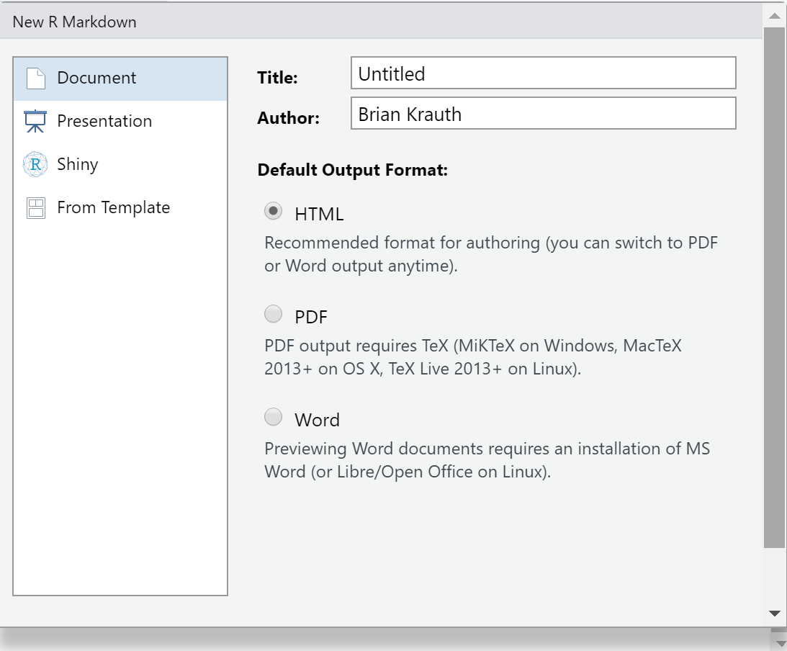
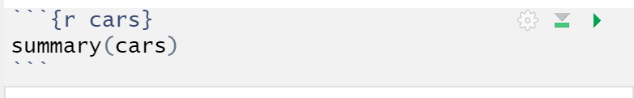
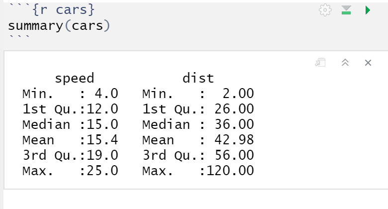
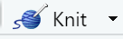

```{r setup09, include=FALSE}
knitr::opts_chunk$set(echo = TRUE,
                      prompt = FALSE,
                      tidy = FALSE,
                      collapse = TRUE)
library("tidyverse")
```

# An introduction to R {#an-introduction-to-r}

As we have seen, Excel is a useful tool for both
[cleaning](#basic-data-cleaning-with-excel) and 
[analyzing](#basic-data-analysis-with-excel) data. R is an application that has
many of the same features as Excel, but is specially designed for statistical
analysis. It is a little more complex, but more powerful in many important ways.

This chapter will introduce you to some of the basic concepts of R and
associated tools such as R Markdown, RStudio, and the Tidyverse.

::: {.goals data-latex=""}
**Chapter goals**

In this chapter, we will learn how to:

1.  Perform basic tasks in RStudio, including:
    - Executing commands in the console window.
    - Creating, opening, closing and executing scripts.
    - Creating and kitting R Markdown documents.
2.  Describe and use R language elements, including:
    - Expressions
    - Variables
    - Vectors
    - Lists
    - Attributes
    - Functions and operators
3.  Install and load R packages.
4.  Import and view data in R.
:::

To prepare for this chapter, please ensure that you have R and RStudio available
on your computer. Refer to the 
[installation instructions](#installing-r-and-rstudio) as needed.

::: {.sfu data-latex=""}

In this course, we will only have time to learn a little bit about R, so my goal
is not to give a comprehensive treatment. My goal here is primarily to introduce
you to the terminology and concepts of R, and to show you a few applications
where R outshines Excel.  You will learn much more about R in ECON 333 and (if
you take it) ECON 334. 
:::

## A brief tour of RStudio

Start the program RStudio. You should see something that looks like this:


You may wonder what the difference is between R and RStudio.

R is a programming language designed for statistical analysis along with the
computer program that runs R commands.  RStudio is an
*integrated development environment* (IDE) for R. It combines a set of useful
tools for writing and running R code:

  - An interactive session of R (running in the "Console" window).
  - A text editor for writing R code, with features like syntax highlighting,
    spell check, and command auto-complete.
  - Tools for managing files and packages used by R
  - Tools for comparing and combining scripts and other files
  - Help and documentation
  - many other features

and puts them in a single user-friendly interface.

You can run commands and scripts in R itself, but without RStudio you won't have
all these handy extra features. Most people these days use RStudio or another
IDE.

RStudio normally displays three or four open windows, each of which has tabs you
can select to access different features. We will not use most of them, but some
of them will be very handy indeed.

### The console window

Like most programming languages, R is designed to execute a series of commands
provided by the user.  The simplest way to have R execute a command is by
entering it into the ***Console*** window in the lower left corner.

::: example
**Using the console window**

Move your cursor into the console window, type this command:
```{r HelloWorld1, eval = FALSE}
print("Hello world!")
```
and press the `<Enter>` key. R will respond with something like:
```{r HelloWorld2, echo = FALSE}
print("Hello world!")
```
You have just executed your first R command.

The rest of this chapter will show you various R commands, and will display the
expected results. Note that:

- Commands and results will be displayed in a single block.
- Lines with results will start with `##`.

You can copy any block of R code from the web page version of this textbook by
clicking in the upper right-hand corner of the block. You can then paste the
block into the console window, and hit the `<Enter>` key. Give this trick a try
with the block above; you will find it handy whens the commands are longer and
more complex.
:::

RStudio has various features to make your work in the console window more
efficient:

- RStudio will offer to auto-complete your command.
- RStudio shows pop-ups with helpful information about your command as you type
  it.
- RStudio maintains a ***command history*** that remembers commands you have
  previously entered.  
  
The command history can be quite useful when you did something a while ago, but
either don't remember exactly how you did it, or don't want to type it all in
from the beginning.

:::example
**Using the command history**

Suppose you decide you want to say "Hello Canada!" instead of "Hello
world", and you don't want to type in the whole command. Then you can:

1. Press the `<Up-arrow>` key in the *Console* window to show the most recently 
   executed command. If you press it a second time it gives you the command
   before that, and so on.
2. Look at the to the *History* window in the upper right corner to see a full
   list of recently executed commands.  You can double-click on any command in
   the window to copy it to the Console window.

Once you have found the command you want, you can edit it before pressing the
`<Enter>` key.
:::

### Scripts

The Console window is ideal for simple tasks and experimentation, and we will
continue using it regularly.  But in order to create reproducible research and
take full advantage of R's capabilities, we will need to write and execute
***scripts***. A script is just a text file containing a sequence of R commands.
By convention, R scripts have file names ending in the `.R` extension.

::: example
**Using an R script**

To create an R script  

1. Select `File > New File > R Script` from the menu.
2. Enter a valid R command in the first line of the file, for example
   ```{r, eval = FALSE}
   print("Hello world!")
   ```
3. Enter another valid R command in the second line of the file, for example
   ```{r, eval = FALSE}
   print("Goodbye world?")
   ```
4. Select `File > Save` to save your file with the name `Chapter10Example.R`.

To run your script:

1. Press the {width=10%} button.

The Console window will show the results of your script:
```{r, eval = TRUE, echo=FALSE}
print("Hello world!")
print("Goodbye world?")
```
In addition to the `Source` button, there is another button marked `Run`. 
Pressing this button will also run the script, but the results will not be
displayed.
:::

### R Markdown

RStudio can also run text files written in the ***R Markdown*** format. R
Markdown files have the `.Rmd` extension. R Markdown is a language for
producing documents - web pages, Microsoft Word documents,
PDF files, etc. - that have R code and analysis embedded in them. In fact, this
book is written in R Markdown - you can see the R Markdown document for this
chapter at https://raw.githubusercontent.com/bvkrauth/is4e/master/10-Introduction-to-R.Rmd. 

::: {.fyi data-latex=""}
**R Markdown, Markdown, and other markup languages**

R Markdown is an implementation of the Markdown markup language in R. A markup
language is a way of writing documents in text files whose content is directly
readable but also can be formatted and displayed (rendered) in a visually
appealing way. The best-known markup language is HTML, which is the language web
pages are written in.

The original idea of HTML was that content creators could write their content in
text files (pages), with a few HTML tags sprinkled around to give the browser
information about structure, and then the browser would display the page.
However, as web users demanded fancy graphics, custom colors, interactivity,
and mobile-friendly display, HTML became much more complicated.

Markdown was created as radically simplified markup language. The basic idea is
to use common conventions for how to indicate structure in a text file.

- Adjacent lines of text are interpreted as part of the same paragraph.
- A line of text following a blank line starts a new paragraph.
- A line of text that begins with "#" is a header, with "#" for level one
  headers, "##" for level two, etc.
- A line of text that begins with "-" is a bullet point.
- A line of text that begins with a number is part of a numbered list.
- Text written like `*this*` is rendered like *this*. 
- Text written like `**this**` is rendered like **this**. 
- Text written like `***this***` is rendered like ***this***. 

Markdown documents can also include links and pictures (by simply providing the
URL or file name), tables, and all sorts of other things.
:::

In addition to ordinary text and Markdown information, R Markdown documents can
include pieces of executable R code.  R code needs to be surrounded by a
***code fence*** that identifies the text inside the fence as R code, and in
some cases provides additional information about how it should be executed.
This might sound complicated, but is easy to see in a real R Markdown file.

:::example
**Creating an R Markdown file**

To create our first R Markdown file:

1. Select `File > New File > R Markdown` from the menu.
   - You will see a dialog box that looks like this:  
     {width=50%}
2. The default options are fine, so select `OK`. RStudio will create an example
   R Markdown file that you can use as a template. It will look something like
   this:  
   {width=70%}
3. Save the file.

You can see that the R Markdown document is a mix of text, formatting
information, and small pieces of R code.
:::

You can run the R code in an R Markdown document in one of two ways. First, you
can run and display results for individual ***chunks*** of code. A chunk is a
few lines of R code surrounded by a "code fence" that serves to distinguish R
code from ordinary text.

::: example
**Running code chunks**

To run a code chunk in our R Markdown file:

1. Go to the code chunk that looks like this:  
   {width=50%}
2. Press the {height=16pt} button.

As you can see, the code in the chunk will run and the results will be displayed
below:  
   {width=50%}
:::

You can also press the Knit button to ***knit*** the entire R Markdown file into
an HTML, Word, or PDF document that includes both the text and the R results.

::: example
**Knitting an R Markdown document**

To knit the entire document into a web page:

1. Press the {height=16pt} button.

It will take a few moments to process the file, and then the web page (HTML
file) will open in a browser.  Read the document and compare it to the original
R Markdown file to get an idea of the capabilities of R Markdown.
:::

By default, R Markdown files usually knit to HTML, but we can knit to other file
formats including Word and PDF.  We will stick to HTML in this course.

::: {.fyi data-latex=""}
**R Markdown resources**

R Markdown is as simple or as complicated as you want to make it. A plain text
file with a few lines of content is a valid R Markdown file even if it contains
no R code. You can knit it, and R will produce a valid web page or other
document for you.

If you want to try something new in R Markdown, or have forgotten how to do 
something, the most useful resource is the one-page *R Markdown Cheat sheet*. It 
is available directly in RStudio, or at 
https://github.com/rstudio/cheatsheets/raw/main/rmarkdown-2.0.pdf. You can also
just search for "r markdown cheatsheet".
:::

### Other RStudio features

RStudio has many other features, most of which we will not use. But I would like
to highlight a few that may seem useful.

In the lower right window:

- The *Files* tab gives you easy access to files in the current active folder.
- The *Plots* tab will display plots, when you create them.
- The *Packages* tab is useful for managing packages (more on them later)
- The *Help* tab allows you to access R's help system.
  
In the upper right window:

- The *Environment* tab allows you to view all currently-defined variables and
  their values.
- The *History* tab shows the command history.

In the menu:

- You can select `Session > Restart R` to clear the memory and restart the
  current R session.

I would also like to highlight a "feature" that is not at all useful and should
be avoided. When you close R or RStudio, you will often get a warning message
that looks something like this:
   {width=30%}

If you choose "Save", R will save the current state of its memory and re-load
it next time you start R. This may seem like it would be helpful, but it is
actually bad. We care about reproducibility, so we want R to do exactly the same
thing every time we use it. We do not want R's actions to depend on something
we did a few days ago. So *NEVER CHOOSE "Save" HERE*.

## The R language

Next, we will learn some basic features of the R language.  Open RStudio and go
to the console window so we can enter commands and see what they do.

### Comments

In programming, a ***comment*** is a piece of code that is ignored by the 
program that interprets the code.  Comments in R are marked by the `#`
character.  

:::example
**Comments**

If you run the following code:
```{r CommentExample, eval=FALSE}
# This is a comment. R ignores everything on this line
# print("This is also a comment. R will not print this.")
print("R will print this, including the #") # but it won't print this
```
You will get the result:
```{r, echo=FALSE}
# This is a comment. R ignores everything on this line
# print("This is also a comment. R will not print this.")
print("R will print this, including the #") # but it won't print this
```

Note that R treats the `#` *inside* of the quotes as a normal character.
:::

Programmers use comments to explain to future users (including themselves) what
the code is supposed to be doing.

### Expressions

An ***expression*** is any piece of R code that can be evaluated on its own. For
example:

- Any text, numerical or logical constant: `"Hello world"`, `105`, `1.34`, or
  `TRUE`. 
- Any complete formula built from functions and arithmetic operators: `log(10)`
  or `2+2`

An expression needs to be complete, for example `ln(` is not an expression, nor
is `2+`.  

Every valid R expression ***returns*** a value, also called an ***object***.
For example:

- The expression `"Hello world"` returns the text string "Hello world"
- The expression `2+2`returns the number 4.

An object can be a number, a text string, a date, or a logical value, just
like in Excel.  Objects can also be much more complex.

In addition, some expressions cause a ***side effect***. For example, executing
an expression may cause R to:

- Display something on your screen.
- Create or modify a file on your computer.
- Create or modify an object in R's memory.

For example, the expression `print("Hello world")` returns the value 
"Hello world" and (as a side effect) causes "Hello world" to be displayed on
your screen.

Any valid R expression can be entered in the console window, in an R script, or
in an R Markdown document.

:::example
**Expressions**

When you enter an expression in the console window, R will usually display the value it
returns.
```{r ExpressionExample}
# The line below is an expression, and the line below that is its value.
4+5
```

You can also use any valid R expression within a larger expression.
```{r ExpressionInExpression}
sqrt(4+5)
```

This expression has a side effect.  It causes R to plot a histogram of 100
random numbers from the $N(0,1)$ distribution.

```{r SideEffectExample}
hist(rnorm(100))
```

Although we call it a "side effect", the side effect is often the main purpose
of the expression.
:::

### Variables and assignment

We can use the `<-` or ***assignment*** operator to assign the result of an
expression to a named variable.  We can then use that variable in later
expressions.

For example, the R command `x <- 2` assigns the value `2` to the variable `x`.
Any subsequent code can then refer to the variable `x` in its own calculations
or actions.

:::example
**Using the assignment operator**

```{r AssignmentOperatorExample}
# This will cause the variable x to take on the value 2
x <- 2
# We can then use x in any expression
y <- x + 1
print(y)
# We can change the value of x at any time
x <- 0
# But this will not change the result of any previous calculations
print(y)
```

:::

We can display the contents of a variable or other object by using the `print()`
function, or by simply giving its name

:::example
**Displaying the contents of a variable**

```{r PrintExample}
# Create a variable called x - note that its value is not displayed
x <- 5
# Use the print() function to display its contents
print(x) 
# Or just give its name
x
```
:::

### Vectors

The primary data structure in R is a ***vector***, which is just an ordered list
of elements.  

The simplest type of vector is called an ***atomic vector*** - its elements are
normally from one of R's basic or ***atomic*** data types: 

- Numbers 
- Text strings 
- Logical values (`TRUE`  or `FALSE`)
  
The elements of an atomic vector need to be all part of the same atomic type; a
single vector cannot contain both strings and numbers, for example. 
  
We can construct a vector by enumeration using the `c()` function.

:::example
**Constructing a vector with the `c()` function**

```{r EnumerationExample}
fruits <- c("Avocado", "Banana", "Cantaloupe")
print(fruits)
morefruits <- c(fruits, "Durian")
print(morefruits)
```
:::

There are many other functions that can be used to construct vectors. Two
particularly useful ones are `rep` which repeats something a particular number
of times, and `seq` which creates a sequence.

:::example
**Constructing vectors with `rep()` and `seq()`**

```{r RepExample}
# REP repeats something (like Excel's Fill tool)
ones <- rep(1, times = 10)
print(ones)
# SEQ creates a sequence (like Excel's Series tool)
evens <- seq(from = 2, to = 20, by = 2)
print(evens)
# You can also create a sequence with the : operator:
print(1:10)
```
:::

Mathematical functions in R operate directly on vectors, and automatically
expand scalars (single numbers) to vectors as needed.

:::example
**Using vectors in expressions**

```{r VectorExpansionExample}
ones <- rep(1, times = 10)
evens <- seq(from = 2, to = 20, by = 2)
# This command subtracts 1 from every element in evens
odds <- evens - ones
print(odds)
# This command does the same
odds <- evens - 1
print(odds)
```
:::

The ***subscript operator*** `[]` can be used to select part of a vector.

:::example
**Using subscripts**

```{r SubscriptOperatorExample}
evens <- seq(from = 2, to = 20, by = 2)
print(evens)
# You can give a single index: evens[2] is the 2nd element in evens
x <- evens[2]
print(x)
# Or a vector of indices: evens[c(2,5)] contains the 2nd and 5th element in evens
x <- evens[ c(2, 5) ]
print(x)
# Or a range of indices: evens[2:5] contains 2nd, 3rd, 4th and 5th element in evens
x <- evens[2:5]
print(x)
# You can use the subscript operator on either side of the assignment operator
x <- evens
print(x)
# This assigns the number 1000 to the 2nd element in x
x[2] <- 1000
print(x)
```
:::

You can also provide logical values as subscripts. R will then operate on those
elements whose corresponding item has the value `TRUE`.

:::example
**Using logical subscripts**

```{r LogicalSelectionExample}
print(evens)
# This creates a vector of the same length as evens, that contains TRUE
# for all values less than 10, and FALSE for all other values
lessthan10 <- (evens < 10)
print(lessthan10)
# This creates a vector that includes only those elements of evens
# for which forexample is TRUE
x <- evens[lessthan10]
print(x)
# This is a quicker way of accomplishing the same result
x <- evens[evens < 10]
print(x)
```
:::

### Lists 

The other type of vector is a ***list***.  A list is a vector whose elements are
themselves other vectors. These vectors can be any type, so we can use lists
inside lists to build very complex objects.  

Lists can be built using the `list()` function.

:::example
**Constructing a list**

```{r ListExample}
everything <- list(fruits, evens, odds)
print(everything)
```
:::

You can (and should) assign names to the elements of a list.

:::example
**Constructing a named list**

```{r NamedListExample}
everything <- list(fruits=fruits,
                   evens=evens,
                   odds=odds)
print(everything)
```
:::

You can access part of a list by specifying its numerical index inside of the 
`[[]]` operator.


:::example
**Selecting parts of a list**

```{r ListSubscriptExample}
print( everything[[2]] )
```
:::

If the items in a list are named, you can also access them by name using either
`[[]]` or `$` notation. You can also use the `$` notation to add new items to
an existing list.

:::example
**Selecting parts of a named list**

We can access the elements of a list by name:
```{r ListDollarsignExample}
print( everything[["evens"]] )
print( everything$fruits )
```

And we can add named elements:
```{r AddToListExample}
# There is no element in everything called "allnumbers" 
everything$allnumbers <- c(evens, odds)
# But now there is...
print(everything)
```
:::

### Functions and operators

R has hundreds of built-in mathematical and statistical ***functions***, and
users can define their own functions. You have already seen a few. Their format
and usage is quite similar to Excel, but there are some important differences.

::: example
**The `seq()` function**

Let's get to know the main features of functions in R by considering the
`seq()` function.  We have already seen this function: it is used to create a
vector with a sequence of numbers, much like Excel's *Series* tool.

1. Every function has a ***name***.
   - In this case, the function's name is `seq`.
2. You can obtain help on any function by entering `?` and its name in the
   console window
   - Enter `? seq` in the console window, and look in the Help window (you can
     find it in the lower-right panel).
3. Most functions accept one or more ***arguments***.
   - The arguments are described in the function's help page.
   - The `seq` function's arguments include `from`, `to`, `by`, `length.out`,
     and `along.with`.
   - Every argument has a *name* and a *position*.  For example, the `from` 
     argument is in position one, the `to` argument is in position two, etc.
   - Arguments can be passed to the function by *name* or by *position*.
     - Passing by name looks like this:`seq(from=1,to=5)`.
     - Passing by position looks like this: `seq(1,5)`.
     - You can mix both methods: `seq(1,5,length.out=10)`.
     - I recommend passing by position for simple functions, and passing by name
       for more complex functions, but it is really just a matter of what works
       for you.
   - Some arguments are *required*. They must be provided every time the
     function is called, or else the function will return an error. 
   - Some arguments are *optional*. They *can* be provided, but have a *default*
     value if not provided.
     - All arguments to `seq()` are optional; execute the command `seq()` to see
       what happens.
4. Every function returns a value.  This is even true for functions like
   `print()`. To see this: 
   ```{r}
   y <- print("Hello world")
   print(y)
   ```
   As you can see, `print("Hello world")` returns "Hello world" as its value.
5. Some functions also produce ***side effects***, as we have described earlier.
:::

In addition to functions, R has the usual binary mathematical ***operators***
such as `+`, `-`, `*` and `/`.  Operators are just another way of expressing
functions.  For example the `+` operator is really just another way of calling 
the `sum()` function:
```{r OperatorExample}
# These two statements are equivalent
2 + 2
sum(2, 2)
```

There are several other commonly used operators including comparison operators,
logical operators, and the assignment operator.

:::example
**A few useful operators**

```{r OtherOperators}
# Basic arithmetic operators
2 + 3 # plus
2 - 3 # minus
2 * 3 # times
2 / 3 # division
2 ^ 3 # power
# Comparison operators
2 < 3  # less than
2 <= 3 # less than or equal
2 == 3 # equal
2 > 3  # greater than
2 >= 3 # greater than or equal
# Logical operators
2 == 3 & 2 < 3 # logical AND
2 == 3 | 2 < 3 # logical OR
# Assignment
x <- 2
print(x)
# The assign() function returns its own value, so you can also do this:
x <- y <- 3
print(x)
print(y)
```
:::

### Classes and attributes

Classes and attributes are something of an advanced topic, but we will briefly
mention them here.

Every object in R has a ***class***, which is just a text string identifying
what kind of thing it is.  The class of any object can be accessed using
the `class()` function

:::example
**Classes**

```{r ClassesExample}
print(class(fruits))
print(class(evens))
print(class(everything))
print(class(print))
```
:::

The class of an object tells R how to handle it - how to display or summarize
its contents, how to use it in functions, etc.  R has hundreds of built-in
classes, including:

- Matrices.
- Arrays.
- Data sets.
- Statistical results from various commands.
- Plots.

These object types are all built from basic components like atomic vectors
and lists. Users can also define their own classes.

::: {.fyi data-latex=""}
**Classes and object oriented programming** 

Classes appear in most modern programming languages, and are a key component of
the "object-oriented" programming model. OOP allows programmers to design very
complicated data structures that are also easy to use.

For example, a novice user like yourself can display the contents of any object
using the `print()` function and can get a brief summary of those contents using
the `summary()` function. This works with simple objects like "Hello world"
or more complex objects like a large data set, a graph of results, or a machine
learning model.

Underlying this simple user interface, `print()` is a *generic* function that
takes any object, determines its class, and then calls a specific print
function that is specially designed for its class. Programmers create both
the class design and the associated specialized functions.  Normal users only
need to know the `print()` function.
:::

Objects can also have ***attributes***. The attributes of an object are a
list that provides additional information about the object.

:::example
**Attributes**

Let's see if any of the objects we have created have attributes:
```{r AttributesExample}
print(attributes(fruits))
print(attributes(evens))
print(attributes(everything))
```
Note that:

- our two atomic vectors (`fruits` and `evens`) have no attributes (`NULL`).
- our list (`everything`) stores the names of its three elements in the
  `$names` attribute.  
:::

## Packages and the Tidyverse

R has many useful built-in functions and features.  But one of its most useful
features is how easy it can be extended by users, and the fact that it has a
large user community who have provided ***packages*** of useful new functions
and data.

There are thousands of packages available online.  We will use a particularly
useful package called the ***Tidyverse***.

::: {.fyi data-latex=""}
**What is the Tidyverse?**

The Tidyverse was created by the data scientist Hadley Wickham (also one of the
key people behind RStudio) as a way of solving some long-standing problems with
R.  The Tidyverse is both an R package containing a set of new functions and
data structures as well as a philosophy about *how* to analyze data.

The main language elements of R date back to 1976 (R itself was created in the
early 1990s but is closely based on an earlier program called S). Computer
science has advanced a lot since 1976, so some design aspects of R seemed like a
good idea at the time but would be designed differently today:

- Too many different ways of doing the same thing.
- Too many rarely-used functions.
- Some functions that don't do what they should.

Unfortunately, it is not possible to make significant changes to the existing
R language (sometimes called "Base R") without causing thousands of existing
programs to stop working.

The Tidyverse addresses this problem by replacing many Base R functions with
alternative versions that are easier to use, better-designed, and usually
faster. It does this in part by being "opinionated" - taking a clear position
on the right way to do things and building the language around this position.
For example, most data analysis tools in the Tidyverse expect data to be in a
tidy format.  This reflects a philosophy that data cleaning should precede and
be separate from data analysis.
:::

Most commonly-used packages including the Tidyverse are open-source, and are
available online from the
[Comprehensive R Archive Network (CRAN)](https://cran.r-project.org/). 

Before you can use any package, two steps must be followed:

1. The package needs to be ***installed*** on your computer using the 
   `install.packages()` function. 
   - This only needs to be done *once* for each package.
2. The package needs to be ***loaded*** into memory using the `library()` 
   function.
   - This needs to be done in *every* R session.

Once the package is installed and loaded, you can use its functions and other
features.

:::example
**Installing and loading the Tidyverse**

You can get a list of all available CRAN packages by simply executing the 
`install.packages()` function with no arguments:
```{r ListPackages, eval = FALSE}
install.packages()
```
If you know the name of the CRAN package you want to install, you can provide it
as the argument:
```{r InstallTidyverse, eval = FALSE}
install.packages("tidyverse")
```
You only need to install each package once.

However, installing a package only puts the files on your computer. In order to
actually use the features of a package you need to load it into memory during
your current R session using the `library()` function:
```{r LibraryTidyverse, eval = FALSE}
library("tidyverse")
```
You can then use the Tidyverse functions and other tools.
:::

## Reading and viewing data in R {#reading-and-viewing-data-in-r}

Having skimmed the basic features of R, it is time to use it for some real work.
As with Excel, we start  any data analysis project in R by opening the data
file, viewing it, and constructing a plan to clean it.

We will work with the employment data.

### Reading CSV files

Our first step will be reading the data.  The most commonly used data format is
CSV, and the Tidyverse function to read in CSV files is called `read_csv()`.
It has one required argument: the name of the CSV file, either as a local file
address or a URL.

:::example
**Reading a CSV file in R**

The code below reads in the CSV file, and stores it in the object `EmpData`.

```{r ReadEmpDataFromCSV, eval=FALSE}
# Load the Tidyverse if you have not already done so
library("tidyverse")
# You can directly read online data by giving read_csv() the URL.
EmpData <- read_csv("https://bookdown.org/bkrauth/IS4E/sampledata/EmploymentData.csv")
# You can also download the file and give read_csv() the local location
# EmpData <- read_csv("sampledata/EmploymentData.csv")
```

```{r ReadEmpDataFromCSV2, echo=FALSE}
library("tidyverse")
EmpData <- read_csv("sampledata/EmploymentData.csv")
```
As you can see, R guesses each variable's data type, and reports its guess. It
is always a good idea to review this output and make sure that everything is the
way that we want it:

- The numeric variables are all stored as `col_double()`.
  - This means double-precision (64 bit) real number
  - This is what we want.
- The text variables **Party** and **PrimeMinister** are both stored as
  `col_character()`.
  - This means character or text string
  - This is what we want.
- The **MonthYr** variable is also stored as `col_character()`.
  - This is *not* what we want.
  - We will want **MonthYr** to be stored explicitly as a date variable.

We make a note of the issue with the **MonthYr** variable so we can fix it 
later.
:::

::: {.fyi data-latex=""}
**Additional options**

Our data file happens to be a nice and tidy one, so `read_csv()` worked just
fine with its default options.  Not all data files are so tidy, so `read_csv()`
has many optional arguments.  There are also functions for other delimited file
types:

- `read_csv2()` for files delimited by semicolons rather than commas.
- `read_tsv()` for tab-delimited files.
- `read_delim()` for files delimited using any other character.

Base R function has a similar function called `read.csv()`, but `read_csv()` is
preferable for various reasons.
:::

### Viewing a data table

The `read_csv()` function creates an object called a data table or ***tibble***.
A tibble is a Tidyverse object type that describes a table of tidy data.

- Each row in the tibble represents an observation.
- Each column represents a variable, and has a name.

The base R equivalent of a tibble is called a ***data frame***. Tibbles
and data frames are interchangeable in most applications (in the language of
object-oriented programming, the tibble class "inherits" from the data frame
class), but tibbles have some additional features that make them work better
with the Tidyverse.

We have several ways of viewing the contents of a tibble. As with other objects,
we can use the `print()` function.

:::example
**Printing a tibble**

The code below prints the contents of our data table:

```{r PrintEmpData}
print(EmpData)
```
:::

Tibbles can be quite large, so the `print()` function usually shows an
abbreviated version of the table. We can also see the whole table by using
the `View()` command or through RStudio.

:::example
**Viewing a tibble**

You can view the full tibble by executing the command:
```
View(EmpData)
```
or through RStudio by following these steps:

1. Go to the *Environment* tab in the upper right window.
   - You will see a list of all variables currently in memory, including
     **EmpData**.
2. Double-click on `EmpData`.

You will see a spreadsheet-like display of `EmpData`. As in Excel, you can sort
and filter this table.  Unlike Excel, you cannot edit it here.
:::


### Data table properties

There are several R functions available for exploring the properties of a data
table.

- We can obtain the column names of a tibble using the `names()` function.
- We can access any individual column using the `$` notation.
- We can count the rows and columns with `nrow()` and `ncol()`, or we can use
  the `length()` function.

:::example
**Viewing properties of a tibble**

```{r NamesEmpData}
# Column names
names(EmpData)
# Number of rows - either of these will work
nrow(EmpData)
length(EmpData$UnempRate)
# Number of columns
ncol(EmpData)
length(EmpData)
```
:::

In a later chapter, we will learn how to view other table properties such as
summary statistics.

## Basic statistics in R


### The summary function

The `summary()`function can be used to produce a set of summary statistics for
each variable in a tibble.

::: example
**Summarizing a data table**

```{r SummaryEmpData}
summary(EmpData)
```
:::

Like `print()`, `summary()` is an example of a generic function. You can give it
almost any R object as an argument, and it will return a summary of the object's
contents. The exact information returned will depend on the object type.

### Introduction to ggplot

Although R has a built in plotting command called `plot()`, the Tidyverse also
contains a much more powerful graphics package called[^1101]
***ggplot***. The ggplot package has capabilities well beyond what R's built-in
commands can do, or what Excel can do.

[^1101]: The package is technically called `ggplot2` since it is the second
       version of `ggplot`.  But everyone calls it "ggplot" anyway.

The `ggplot` function can be used to create a graph.  It has a non-standard
syntax.

::: example
**Two ggplot graphs**

We will use ggplot to create two univariate graphs for the unemployment rate: 
a time series (line) graph and a histogram.

Before getting started, run the following code to clean the employment data:
```{r CleanEmpData}
# Clean EmpData
EmpData <- EmpData %>%
  mutate(MonthYr = as.Date(MonthYr, "%m/%d/%Y")) %>% 
  mutate(UnempPct = 100*UnempRate) %>% 
  mutate(LFPPct = 100*LFPRate)
```
The variable representing the unemployment rate is called **UnempPct** and the
variable representing the month/year is called **MonthYr**.

To make the time series (line) graph, execute the following code:
```{r ggplotTimeSeries}
ggplot(data = EmpData,
       mapping = aes(x = MonthYr, 
                     y = UnempPct)) + 
  geom_line() 
```


To make the histograph, excute the following code:
```{r ggplotHistogram}
ggplot(data = EmpData,
       mapping = aes(x = UnempPct)) + 
  geom_histogram()
```

:::

Section ????


## Chapter review {-#review-introduction-to-r}

R has capabilities well beyond what you can do in Excel, in part because it is
a full-featured language and not just an application.  These capabilities come
at a cost, which is that it takes more time and effort to learn how to do
basic tasks. If you have little to no experience coding, this will take some
extra effort but will be worth it.  All languages commonly used for statistical
analysis - R, Stata, SAS, Python, etc. - have more similarities than
differences, and your experience using R will be useful regardless of what
language you end up coding in later.

In this chapter, we learned how to run R programs whether in the console, in
a script, or in an R Markdown document.  We also learned the main elements of
the R language. We haven't learned how to do much of anything useful yet with
data, but we will over the next few chapters.

In the next chapter, we will learn to use R to [clean](#data-cleaning-in-r)
and [analyze](#data-analysis-in-r) data.  We will also learn a sophisticated R
graphing package called[ggplot](#graphs-with-ggplot).

::: {.fyi data-latex=""}
**For more information on R**

There are many free sources of useful information about R. 

- A good short introduction is available at 
  https://cran.r-project.org/doc/contrib/Torfs+Brauer-Short-R-Intro.pdf.
- A good longer book that focuses on the Tidyverse is Wickham and Grolemund's
  *R for Data Science*.  It can be purchased as an actual book from Amazon
  or your local book shop, and is also available as a free e-book at 
  https://r4ds.hadley.nz/.
:::

## Practice problems {-#problems-introduction-to-r}

Answers can be found in the [appendix](#answers-introduction-to-r).

**GOAL #1: Perform basic tasks in RStudio**

1. Open RStudio and do the following:
   a. Execute a command in the console window.
   b. Write and execute (source) a brief script.
   c. Write and knit a brief R Markdown document.
   
**GOAL #2: Describe and use R language elements**

2. Which of the following are valid R expressions?
   a. `"Hello world"`
   b. `Hello`
   c. `Hello"`
   d. `2+2`
   e. `x <- 2 + 2`
   f. `x <- 2 +`

3. Write the R code to perform the following actions:
   a. Create a vector named `cookies` that contains the elements "oatmeal", 
      "chocolate chip", and "shortbread".
   b. Create a vector named ``threes` that contains all of the integers between
      1 and 100 that are divisible by 3.
   c. Use the vector `threes` to find the 5th-lowest integer between 1 and 100
      that is divisible by 3.
   d. Create a list named `threecookies` that contains `cookies` and 
      `threes`.

**GOAL #3: Install and load R packages**

4. Load the tidyverse package (you will need to install it if you have not already
   done so), and execute the R code below:
   ```
   data("mtcars")  # load data
   ggplot(mtcars, aes(wt, mpg)) + geom_point(aes(colour=factor(cyl), size = qsec))
   ```

**GOAL #4: Import and view data in R**

5. Use R (with the Tidyverse loaded) to open the data file
   https://people.sc.fsu.edu/~jburkardt/data/csv/deniro.csv
   and count the number of observations and variables in it.
