# Multivariate data analysis {#multivariate-data-analysis}

```{r setup12, include=FALSE}
knitr::opts_chunk$set(echo = TRUE,
                      prompt = FALSE,
                      tidy = TRUE,
                      collapse = TRUE)
library("tidyverse")
EmpData <- read_csv("sampledata/EmploymentData.csv")
# Make permanent changes to EmpData
EmpData <- EmpData %>%
  mutate(MonthYr = as.Date(MonthYr, "%m/%d/%Y")) %>% 
  mutate(UnempPct = 100*UnempRate) %>% 
  mutate(LFPPct = 100*LFPRate)
```

So far most of our emphasis has been on univariate analysis: understanding
the behavior of one variable at a time.  However, we are often interested
in the relationship among multiple variables.  This will be the primary
subject of your next course in statistics (most likely ECON 333), but we
will touch on a few of the basics here.

:::goals
**Chapter goals**

In this chapter, we will learn how to:

- Calculate and interpret the sample covariance and correlation.
- Interpret frequency tables, cross-tabulations and conditional 
  averages
- Construct Excel Pivot Tables, including frequency tables,
  cross-tabulations, and conditional averages.
- Interpret scatter plots, binned-mean plots, smoothed-mean
  plots, and linear regression plots.
- Construct scatter plots, smoothed-mean plots and linear
  regression plots in R.
:::

For the most part, we will focus on the case of a random sample of size $n$
on two random variables $x_i$ and $y_i$.  

::: example
**Obtaining the data**

The primary application in this chapter will use our Canadian employment
data.  We will be using both Excel and R in our examples.

The Excel worksheet can be downloaded at 
[EmploymentData.xlsx](https://canvas.sfu.ca/files/15624202/).

The R data set is the same as the one we used in Chapter 
\@ref(using-r). Execute the following R code to get started:
```{r SetupCodeForStudents, eval = FALSE}
library(tidyverse)
# If you do not have this data set, you can download it at
# https://canvas.sfu.ca/files/15539454/
EmpData <- read_csv("sampledata/EmploymentData.csv")
# Make permanent changes to EmpData
EmpData <- EmpData %>%
  mutate(MonthYr = as.Date(MonthYr, "%m/%d/%Y")) %>% 
  mutate(UnempPct = 100*UnempRate) %>% 
  mutate(LFPPct = 100*LFPRate)
```
:::

## Covariance and correlation {#sample-covariance-and-correlation}

When both variables are numeric, we can summarize their relationship
using the ***sample covariance***:
  $$s_{x,y} = \frac{1}{n-1} \sum_{i=1}^n (x_i-\bar{x})(y_i-\bar{y})$$
and the ***sample correlation***
  $$\rho_{x,y} = \frac{s_{x,y}}{s_x s_y}$$
where $\bar{x}$ and $\bar{y}$ are the sample averages and 
$s_{x}$ and $s_{y}$ are the the sample standard deviations. These
univariate statistics are defined in Chapter \@ref(statistics).

The sample covariance and sample correlation can be interpreted
as estimates of the corresponding population covariance and
correlation as defined in Chapter \@ref(data-and-sampling).

### Covariance and correlation in R

The sample covariance and correlation can be calculated in R using 
the `cov()` and `cor()` functions. 

These functions can be applied to any two columns of data:
```{r CovCor}
# For two specific columns of data
cov(EmpData$UnempPct, EmpData$LFPPct)
cor(EmpData$UnempPct, EmpData$LFPPct)
```
As you can see, unemployment and labour force participation are 
*negatively* correlated: when unemployment is high, LFP tends to be
low. This makes sense given the economics: if it is hard to find
a job, people will move into other activities that take one out
of the labour force: education, childcare, retirement, etc.

Both `cov()` and `cor()` can also be applied to (the numeric variables in)
an entire data set.  The result is what is called a 
***covariance matrix*** or ***correlation matrix***:
```{r CorMatrix}
# Correlation matrix for the whole data set (at least the numerical parts)
EmpData %>%
  select(where(is.numeric)) %>%
  cor()
```
Each element in the matrix reports the covariance or correlation
of a pair of variables.  As you can see, the matrix is symmetric
since $cov(x,y) = cov(y,x)$.  In addition, the diagonal elements
of the covariance matrix are $cov(x,x) = var(x)$ and the diagonal
elements of the correlation matrix are $cor(x,x) = 1$.

Every variable's correlation with **AnnPopGrowth** is `NA`, so we will
want to exclude `NA` values from the calculation.  Excluding missing
values is more complicated for covariance and correlation matrices because
there are two different ways to exclude them:

1. ***Pairwise deletion***: when calculating the covariance or correlation 
   of two variables, exclude observations with a missing values for either 
   of *those two* variables.
2. ***Casewise*** or ***listwise deletion***: when calculating the 
   covariance or correlation of two variables, exclude observations with 
   a missing value for *any* variable.

The `use` argument allows you to specify which approach you want to use:
```{r PairwiseOrListwise}
# EmpData has missing data in 1976 for the variable AnnPopGrowth
# Pairwise will only exclude 1976 from calculations involving AnnPopGrowth
EmpData %>%
  select(where(is.numeric)) %>%
  cor(use = "pairwise.complete.obs")
# Casewise will exclude 1976 from all calculations
EmpData %>%
  select(where(is.numeric)) %>%
  cor(use = "complete.obs")
```
In most applications, pairwise deletion makes the most sense because it
avoids throwing out data. But it is occasionally important to use the
same data for all calculations, in which case we would use 
listwise deletion.

::: fyi
**Covariance and correlation in Excel**

The sample covariance and correlation between two variables (data ranges) 
can be calculated in Excel using the `COVARIANCE.S()` and `CORREL()` 
functions.  
:::

##  Pivot tables

Excel's ***Pivot Tables*** are a powerful tool for the analysis of
frequencies, conditional averages, and various other aspects of the 
data.  They are somewhat tricky to use, and we will only scratch
the surface here. But the more comfortable you can get with them,
the better.

The first step is to create a blank Pivot Table that is tied to a 
particular data table.  We can create as many Pivot Tables as we
want.

::: example
**Creating a blank Pivot Table**

To create a blank Pivot Table based on the employment data:

1. Open the *Data for Analysis* worksheet in 
   [EmploymentData.xlsx](https://canvas.sfu.ca/files/15624202/)
   and select any cell in the data table.
2. Select `Insert > PivotTable` from the menu.
3. Excel will display the `Create PivotTable` dialog box:.  

   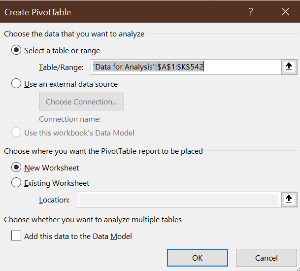
   The default settings are fine, so select `OK`.
  
Excel will open a new worksheet that looks like this:

  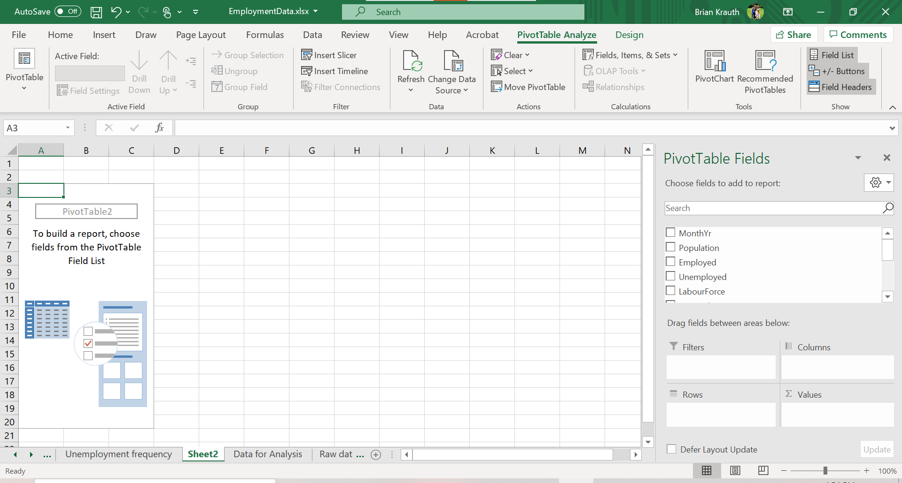
The Pivot Table itself is on the left side of the new worksheet.
:::

The next step is to add elements to the table.  There are various tools 
available to do that: 

- the `Pivot Table Fields` box on the right side of the screen
- the `PivotTable Analyze` menu
- the `Design` menu.  

These tools only appear in context, so they will disappear if you click a cell 
outside of the Pivot Table. You can fix this by just clicking any cell in the 
Pivot Table.

### Simple frequencies

The simplest application of a Pivot Table is to construct a table of 
frequencies. By default, Pivot Tables report ***absolute frequencies*** - 
a count of the *number* of times we observe a particular value in the data.

:::example
**A simple frequency table**

To create a simple frequency table showing the number of months in
office for each Canadian prime minister:

1. Check the box next to **PrimeMinister**. The Pivot Table will look 
   like this:

   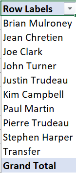

2. Drag **MonthYr** into the box marked "$\Sigma$ values". The Pivot Table 
   will now look like this:

   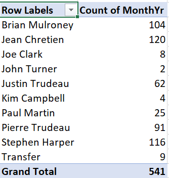

As we can see, the table shows the number of observations for each value of the
**PrimeMinister** variable, which also happens to be the number of months in
office for each prime minister. It also shows a grand total.
:::

In many applications, we are also interested in ***relative frequencies*** - the
*fraction* or *percentage* of observations that take on a particular value. As
we discussed earlier, a relative frequency can be interpreted as an estimate
of the corresponding relative probability.

:::example
**Reporting relative frequencies**

To add a relative frequency column, we first need to add a second absolute
frequency column:

1. In the PivotTable Fields box, drag **MonthYr** to the "$\Sigma$ values" box.

   

Then we convert it to a relative frequency column:

2. Right-click on the "Count of MonthYr2" column, and select 
   `Value Field Settings...`.

   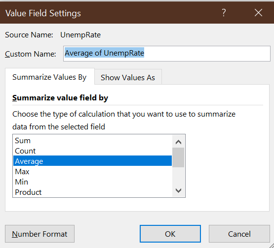   
3. Click on the `Show Values As` tab and select "% of Column Total" from
   the `Show Values As` drop-down box.
4. Select `OK`.

The third column will now show the number of observations as a percentage of
the total:

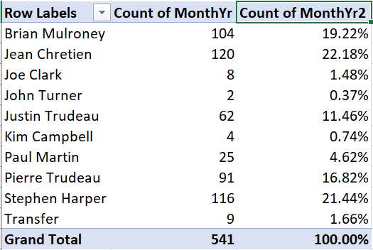 
:::

### Cross tabulations

We can also construct frequency tables for pairs of variables. There are 
various ways of laying out such a table, but the simplest is to have one
variable in rows and the other variable in columns.  When the table is
set up this way, we often call it a ***cross tabulation*** or crosstab. Crosstabs
can be expressed in terms of absolute frequency, relative frequency, or both.

:::example
**An absolute frequency table**

Starting with a blank Pivot Table:

1. Drag **PrimeMinister** into the Rows box.
2. Drag **Party** into the Columns box.
3. Drag **MonthYr** into the $\Sigma$ values box.

You will now have this table of absolute frequencies:

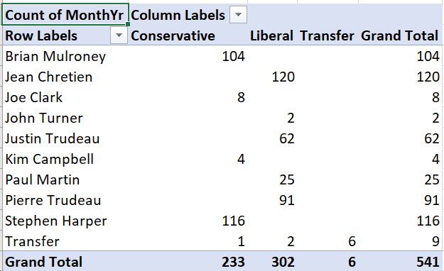

For example, this crosstab tells us Brian Mulroney served 104 months as
prime minister, with all of those months as a member of the (Progressive) 
Conservative party.
:::

We can also construct crosstabs using relative frequencies, but there is 
more than one kind of relative frequency we can use here. A 
***joint frequency crosstab*** shows the count in each cell 
as a percentage of all observations. Joint frequency tables can be 
interpreted as estimates of joint probabilities.

:::example
**A joint frequency crosstab**

To convert our absolute frequency crosstab into a joint frequency crosstab:

1. Right click on "Count of MonthYr" and select `Value Field Settings...`
2. Select the `Show Values As` tab, and select "% of Grand Total"
   from the Show Values As drop-down box.

Your table will now look like this:

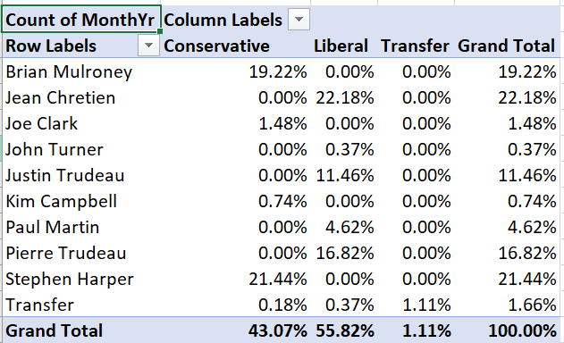

For example, the table tells us that Brian Mulroney's 104 months as 
prime minister represent 19.22% of all months in our data.
:::

A ***conditional frequency crosstab*** shows the count in each cell as a 
percentage in that row or column.  Conditional frequencies can be
interpreted as estimates of conditional probabilities.

:::example
**A conditional frequency crosstab**

To convert our crosstab into a conditional frequency crosstab:

1. Right click on "Count of MonthYr" and select `Value Field Settings`
2. Select the `Show Values As` tab, and select "% of column total"
   from the Show Values As drop-down box.

Your table will now look like this:

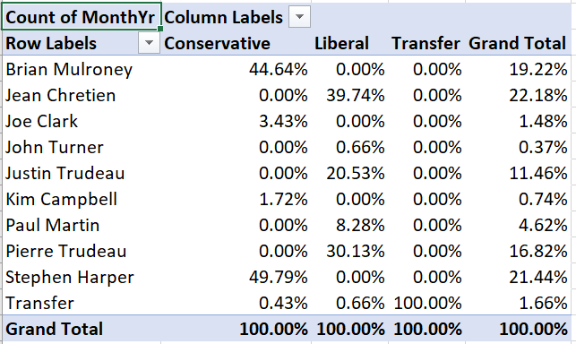 

For example, Brian Mulroney's 104 months as prime minister represent
44.64% of all months served by a Conservative prime minister in our data.
:::

### Conditional averages

We can also use Pivot Tables to report ***conditional averages***. A
conditional average is just the average of one variable, taken within a
sub-population defined by another variable.  For example, we might be interested
in average earnings for men in Canada versus average earnings for women.  

A conditional average can be interpreted as an estimate of the corresponding
conditional mean; for example average earnings for men in a random sample of 
Canadians can be interpreted as an estimate of average earnings among all Canadian
men.

::: example
**Adding a conditional average**

Suppose we want to add the average unemployment rate during
each prime minister's time in office to this Pivot Table:

 

1. Drag **UnempRate** into the box marked "$\Sigma$ values".  The table will 
   now look like this:

   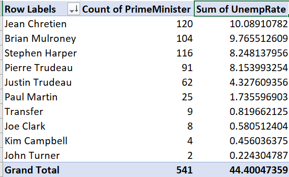 

Unfortunately, we wanted to see the *average* unemployment rate for 
each prime minister, but instead we see the *sum* of unemployment
rates for each prime minister.  To change this:

3. Right-click "Sum of UnempRate", then select `Value Field Settings...`.
4. Select `Average`

The table now looks like this:

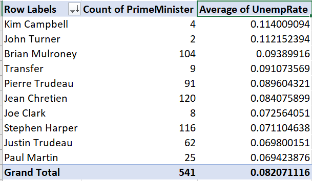 

We now have the average unemployment rate for each prime minister. It
is not very easy to read, so we will want to change the formatting
later.
:::

In addition to conditional averages, we can report other conditional statistics 
including variances, standard deviations, minimum, and maximum.

### Modifying a Pivot Table

As you might expect, we can modify Pivot Tables in various ways to make them 
clearer, more informative, and more visually appealing.

As with other tables in Excel, we can filter and sort them.  Filtering
is particularly useful with Pivot Tables since there are often categories
we want to exclude.

:::example
**Filtering a Pivot Table**

There is no Canadian prime minister named "Transfer." If you recall, we used
that value to represent months in the data where the prime minister
changed.  To exclude those months from our main table:

1. Click on the . The sort and filter
   menu will appear:

   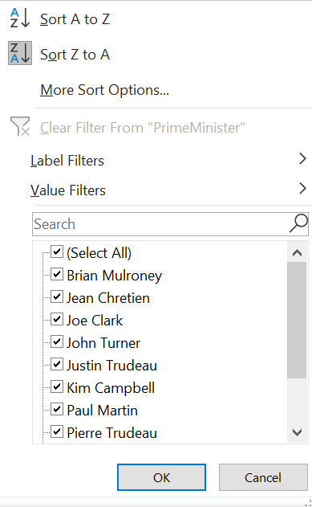   

2. Uncheck the check box next to "Transfer", and select `OK`:
  
The table no longer includes the Transfer value:
  
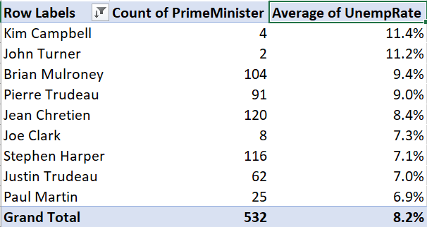

Note that the grand total has also gone down from 541 to 532.
:::

By default, the table is sorted on the row labels, but we can sort on any
column.

:::example
**Sorting a Pivot Table**

To sort our table by months in office:

1. Click on  and the 
   sort and filter menu will appear.
2. Select `More sort options`; the Pivot Table sort dialog box will appear:

   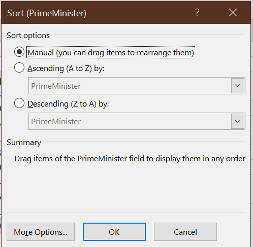 
3. Select the `Descending (Z to A)` radio button and "Count of MonthYr" 
   from the drop-down box.

The table is now sorted by number of months in office:
  
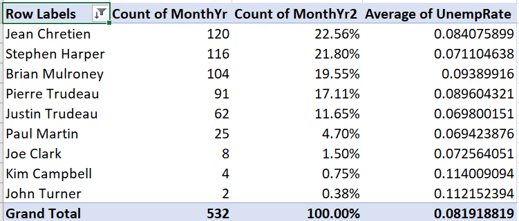
:::

We can change number formatting, column and row titles, and various
other aspects of the table's appearance.

::: example
**Cleaning up a table's appearance**

Our table can be improved by making the column headers more informative and
reporting the unemployment rate in percentage terms and fewer decimal places:

1. Right-click on "Average of UnempRate", and then select
   `Value Field Settings...`
2. Enter "Average Unemployment" in the `Custom Name` text box.
3. Select `Number Format`, then change the number format to Percentage 
   with 1 decimal place.
4. Select `OK` and then `OK` again. The table will now look like this:

   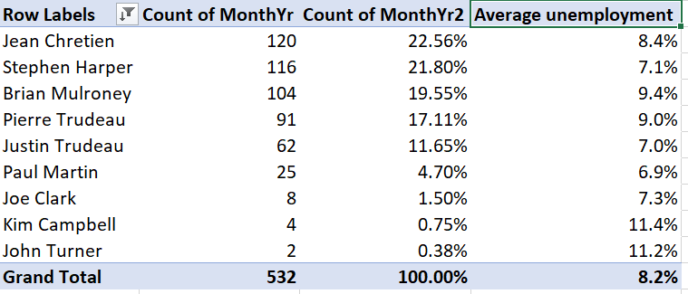 

5. Change the other three headers.  You can do this through `Value Field Settings...`
   but you can also just edit the text directly.
   - Change "Row Labels" to "Prime Minister"
   - Change "Count of MonthYr" to "Months in office"
   - Change "Count of MonthYr2" to "% in office"

Our final table looks like this:

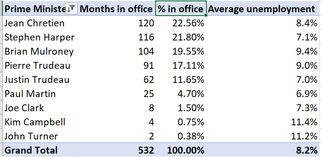  
:::

Finally, we can use Pivot Tables to create graphs.

::: example
**A Pivot Table graph**

To create a simple bar graph depicting months in office, we start by
cleaning up the Pivot Table so that it shows the data we want to
represent:

1. Select any cell in this table.

  
2. Use filtering to remove "Transfer" from the list
   of prime ministers.
3. Use sorting to sort by (grand total) number of months in office.

   The table should now look like this:

   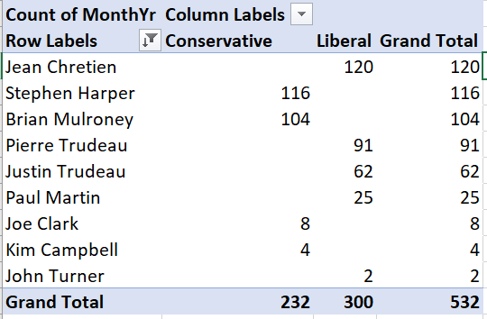

Then we can generate the graph:

4. Select any cell in the table, then select `Insert > Recommended Charts` 
   from the menu.
   
5. Select `Column`, and then `Stacked Column` from the dialog box, and then
   select `OK`.
   
Your graph will look like this:

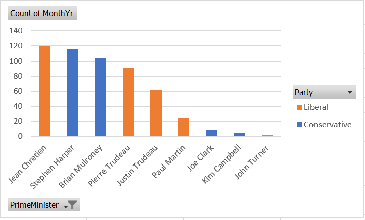 

As always, there are various ways we could customize this graph to
be more attractive and informative.
:::

You can download the full set of Pivot Tables and associated charts 
generated in this chapter at [EmploymentDataPT.xlsx](https://canvas.sfu.ca/files/15624691/).

## Graphical methods

Bivariate summary statistics like the covariance and correlation provide
a simple way of characterizing the relationship between any two numeric 
variables. Frequency tables, cross tabulations, and conditional averages 
allow us to gain a greater understanding of the relationship between two
discrete or categorical variables, or between a discrete/categorical variable 
and a continuous variable.

In order to develop a detailed understanding of the relationship between two
continuous variables (or discrete variables with many values), we need
to develop some additional methods.  The methods that we will explore in
this class are primarily graphical.  You will learn more about the 
underlying numerical methods in courses like ECON 333.

### Scatter plots 

A ***scatter plot*** is the simplest way to view the relationship between
two variables in data.  The horizontal ($x$) axis represents
one variable, the vertical ($y$) axis represents the other variable,
and each point represents an observation.

Scatter plots can be created in R using the `geom_point()` geometry:
```{r ScatterPlot}
ggplot(data = EmpData,
       aes(x = UnempPct,
           y = LFPPct)) +
  geom_point()
```

In some sense, the scatter plot shows everything about the relationship
between the two variables, since it shows every observation. The
negative relationship between the two variables indicated by the
correlation we calculated earlier (`r cor(EmpData$UnempRate,EmpData$LFPRate)`)
is clear, but it is also clear that this relationship is not very strong.

#### Jittering

If both of our variables are truly continuous, each point represents
a single observation.  But if both variables are actually discrete,
points can "stack" on top of each other.  In that case, the same point
can represent multiple observations, leading to a misleading scatter
plot.

For example, suppose we had rounded our unemployment and LFP data to 
the nearest percent:
```{r RoundEmpData}
# Round UnempPct and LFPPct to nearest integer
RoundedEmpData <- EmpData %>% 
  mutate(UnempPct = round(UnempPct)) %>% 
  mutate(LFPPct = round(LFPPct))
```

The scatter plot with the rounded data would look like this:
```{r ScatterPlotRounded} 
# Create graph using rounded data
ggplot(data = RoundedEmpData, 
       aes(x = UnempPct,
           y = LFPPct)) + 
  geom_point(col = "red")
```

As you can see from the graph, the scatter plot is misleading: there
are 541 observations in the data set represented by only 40 points.

A common solution to this problem is to ***jitter*** the data by adding a 
small amount of random noise so that every observation is at least a little
different and appears as a single point.  We can use the `geom_jitter()` 
geometry to do a jittered scatter plot:
```{r ScatterPlotJittered}
ggplot(data = RoundedEmpData,
       aes(x = UnempPct,
           y = LFPPct)) + 
  geom_point(col = "red") +
  geom_jitter(size = 0.5, 
              col = "blue")
```

As you can see the jittered rounded data (small blue dots) more accurately
reflects the original unrounded data than the rounded data (large red dots).

#### Using color as a third dimension

We can use color to add a third dimension to the data.  That is, we can 
color-code points based on a third variable by including it as part of 
the aesthetic:
```{r ScatterPlotColorCoded}
ggplot(data = EmpData,
       aes(x = UnempPct,
           y = LFPPct,
           col = Party)) + 
  geom_point()
ggplot(data = EmpData,
       aes(x = UnempPct,
           y = LFPPct,
           col = MonthYr)) + 
  geom_point()
```

As these graphs show, R will use a discrete or continuous color scheme
depending on whether the variable is discrete or continuous.

As we discussed earlier, you want to make sure your graph can be read by a
reader who is color blind or is printing in black and white. So we can use 
shapes in addition to color:
```{r UsingShapes}
ggplot(data = EmpData,
       aes(x = UnempPct,
           y = LFPPct,
           col = Party)) + 
  geom_point(aes(shape = Party))
```

We would also choose a color scheme other than red and green, since that
is the most common form of color blindness.

::: fyi
**Scatter plots in Excel**

Scatter plots can also be created in Excel, though it is more work and 
produces less satisfactory results.
:::

### Binned averages

In section \@ref(conditional-averages) we calculated a conditional average
of the (continuous) variable **UnempRate** for each observed value of the 
discrete variable **PrimeMinister**.  When both variables are continuous,
this isn't such a good idea: there are as many values of each variable
as there are observations, so the "conditional average" ends up just
being the original data

When both variables are continuous, one solution is to divide the range 
for $x_i$ into a set of bins and then take averages within each bin. We can 
then plot the average $y_i$ within each bin against the midpoint of the 
bin. This kind of plot is called a ***binned scatterplot***.

Binned scatterplots are not difficult to do in R but the code is quite 
a bit more complex than you are used to.  As a result, I will not ask
you to be able to produce binned scatter plots, I will only ask you
to interpret them.  Here is my binned scatter plot with 20 bins:
```{r BinnedScatterPlot, echo = FALSE}
ggplot(data = EmpData,
       aes(x = UnempPct,
           y = LFPPct)) + 
 geom_point(size = 0.5) +
  stat_summary_bin(fun = 'mean', 
                   bins=20,
                   col = "blue", 
                   size = 3, 
                   geom = 'point') +
  stat_summary_bin(fun = 'mean', 
                   bins = 20,
                   col = "blue", 
                   size = 0.5, 
                   geom = 'line')
```

The number of bins is an important choice.  The graph below adds a 
red line based on 4 bins and a green line based on 100 bins.
```{r HowManyBins}
ggplot(data = EmpData,
       aes(x = UnempPct,
           y = LFPPct)) + 
 geom_point(size = 0.5) +
  stat_summary_bin(fun = 'mean',
                   bins = 4,
                   col = "red", 
                   size = 1, 
                   geom = 'point') +
  stat_summary_bin(fun = 'mean', 
                   bins = 4,
                   col = "red", 
                   size = 0.5, 
                   geom = 'line') +
  stat_summary_bin(fun = 'mean', 
                   bins = 20,
                   col = "blue", 
                   size = 1, 
                   geom = 'point') +
  stat_summary_bin(fun = 'mean', 
                   bins = 20,
                   col = "blue", 
                   size = 0.5, 
                   geom = 'line') +
  stat_summary_bin(fun = 'mean', 
                   bins = 100,
                   col = "green", 
                   size = 1, 
                   geom = 'point') +
  stat_summary_bin(fun = 'mean', 
                   bins = 100,
                   col = "green", 
                   size = 0.5, 
                   geom = 'line') +
  geom_text(x = 13.8,
            y = 64.1,
            label = "4 bins",
            col = "red") +
  geom_text(x = 13.8,
            y = 62.5,
            label = "20 bins",
            col = "blue") +
  geom_text(x = 13.8,
            y = 60,
            label = "100 bins",
            col = "green")
```

As you can see, the binned scatterplot tends to be smooth when there 
are only a few bins, and jagged when there are many bins.  This reflects a
trade-off between bias (too few bins may lead us to miss important 
patterns in the data) and variance (too many bins may lead us to
see patterns in the data that aren't really part of the DGP).

### Smoothing

An alternative to binned averaging is ***smoothing***, which calculates a 
smooth curve that fits the data as well as possible.  There are many 
different techniques for smoothing, but they are all based on taking a
weighted average of $y_i$ near each point, with high weights on observations 
with $x_i$ close to that point and low (or zero) weights on observations 
with $x_i$ far from that point.  The calculations required for smoothing 
can be quite complex and well beyond the scope of this course.

Fortunately, smoothing is easy to do in R using the `geom_smooth()` geometry:
```{r SmoothedRegression}
ggplot(data = EmpData,
       aes(x = UnempRate,
           y = LFPRate)) + 
  geom_point(size = 0.5) +
  geom_smooth()
```

Notice that by default, the graph includes both the fitted line
(in blue) and a 95\% confidence interval (the shaded area around
the line).  Also note that the confidence interval is narrow in the 
middle (where there is a lot of data) and wide in the ends (where
there is less data).

### Linear regression

Our last approach is to assume that the relationship between the two
variables is linear, and estimate it by a technique called 
***linear regression***.  Linear regression calculates the straight
line that fits the data best.

You can include a linear regression line in your plot by adding the 
`method=lm` argument to the `geom_smooth()` geometry:
```{r LinearRegression}
ggplot(data = EmpData,
       aes(x = UnempPct,
           y = LFPPct)) + 
  geom_point(size = 0.5) +
  geom_smooth(method = "lm") 
```

We can compare the linear and smoothed fits to see where they differ:
```{r LinearAndSmoothed}
ggplot(data = EmpData,
       aes(x = UnempPct,
           y = LFPPct)) + 
  geom_point(size = 0.5) +
  geom_smooth(col = "red") + 
  geom_smooth(method = "lm",
              col = "blue") 
```

As you can see, the two fits are quite similar for unemployment rates below
12%, but diverge quite a bit above that level.  This is inevitable, because
the smooth fit becomes steeper, but linear fit *can't* do that.

Linear regression is much more restrictive than smoothing, but has
several important advantages:

- The relationship is much easier to interpret, as it can be summarized
  by a single number: the slope of the line.
- The linear relationship is much more precisely estimated 

These advantages are not particularly important in this case, with only
two variables and a reasonably large data set.  The advantages of linear
regression become overwhelming when you have more than two 
variables to work with. As a result, linear regression is the
most important tool in applied econometrics, and you will spend much of
your time in ECON 333 learning to use it.
