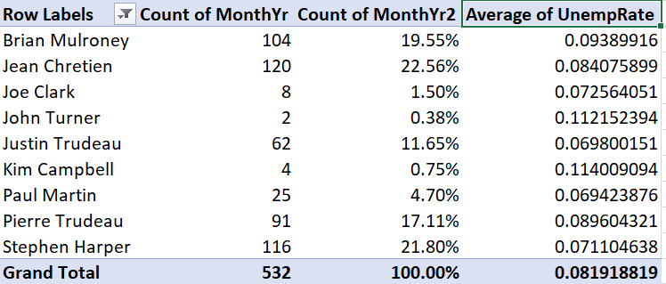

# Multivariate data analysis {#multivariate-data-analysis}

```{r setup12, include=FALSE}
knitr::opts_chunk$set(echo = TRUE,
                      prompt = FALSE,
                      tidy = FALSE,
                      collapse = TRUE)
library("tidyverse")
EmpData <- read_csv("sampledata/EmploymentData.csv")
# Make permanent changes to EmpData
EmpData <- EmpData %>%
  mutate(MonthYr = as.Date(MonthYr, "%m/%d/%Y")) %>% 
  mutate(UnempPct = 100*UnempRate) %>% 
  mutate(LFPPct = 100*LFPRate)
```

In previous chapters, we have learned to perform univariate statistical
analysis in both [Excel](#basic-data-analysis-with-excel) and
[R](#using-r). That is, the statistics and graphs we have learned describe
the behavior of a *single* variable. These statistics are useful, but most data
analysis in economics is focused on understanding relationships between
*two or more* variables.

This chapter will develop some simple statistical and graphical techniques for
describing the relationship between two variables. We will also apply these
techniques with our historical employment data, using both Excel and R.

::: {.goals data-latex=""}
**Chapter goals**

In this chapter, we will learn how to:

1. Construct and interpret frequency tables, cross-tabulations, and conditional
   averages using Excel pivot tables.
2. Calculate and interpret the sample covariance and correlation.
3. Distinguish between pairwise and casewise deletion of missing values.
4. Construct and interpret a scatter plot in R.
5. Construct and interpret a smoothed-mean or linear regression plot in R.
:::

To prepare for this chapter, please review the material on
[multiple random variables](#multiple-random-variables) and previous chapters
on using [Excel](#basic-data-analysis-with-excel) and [R](#using-r) for data
analysis.

To prepare for the Excel data analysis, make a working copy of the Excel file:
[https://bookdown.org/bkrauth/IS4E/sampledata/EmploymentData.xlsx](sampledata/EmploymentData.xlsx).
and open it in Excel.

To prepare for the R data analysis, start R and execute the following code:
```{r Setup12ForStudents, eval = FALSE}
library(tidyverse)
EmpData <- read_csv("https://bookdown.org/bkrauth/IS4E/sampledata/EmploymentData.csv")
# Make permanent changes to EmpData
EmpData <- EmpData %>%
  mutate(MonthYr = as.Date(MonthYr, "%m/%d/%Y")) %>% 
  mutate(UnempPct = 100*UnempRate) %>% 
  mutate(LFPPct = 100*LFPRate)
```

##  Pivot tables {#pivot-tables}

Excel's ***Pivot Tables*** are a powerful tool for the analysis of frequencies,
conditional averages, and various other aspects of the data. They are somewhat
tricky to use, and we will only scratch the surface here. But the more
comfortable you can get with them, the better.

The first step is to create a blank Pivot Table that is tied to a particular
data table.  We can create as many Pivot Tables as we want.

::: example
**Creating a blank Pivot Table**

To create a blank Pivot Table based on the employment data:

1. Open the *Data for Analysis* worksheet in 
   [EmploymentData.xlsx](sampledata/EmploymentData.xlsx)
   and select any cell in the data table.
2. Select `Insert > PivotTable` from the menu.
3. Excel will display the `Create PivotTable` dialog box:  
   {width=50%}  
   The default settings are fine, so select `OK`.
  
Excel will open a new worksheet that looks like this:  
  {width=90%}  
The Pivot Table itself is on the left side of the new worksheet.
:::

The next step is to add elements to the table. There are various tools 
available to do that: 

- The `Pivot Table Fields` box on the right side of the screen
- The `PivotTable Analyze` menu
- The `Design` menu.  

These tools only appear in context, so they will disappear if you click a cell 
outside of the Pivot Table. You can fix this by just clicking any cell in the 
Pivot Table.

### Simple frequencies

The simplest application of a Pivot Table is to automatically construct a table
of frequencies. By default, Pivot Tables report ***absolute frequencies***:
the *number* of times we observe a particular value in the data.

:::example
**A simple frequency table**

To create a simple frequency table showing the number of months in office for
each Canadian prime minister:

1. Check the box next to **PrimeMinister**. The Pivot Table will look like this:  
   {width=13%}  
2. Drag **MonthYr** into the box marked "$\Sigma$ values". The Pivot Table will
   now look like this:  
   {width=30%}  

As we can see, the table shows the number of observations for each value of the
**PrimeMinister** variable, which also happens to be the number of months in
office for each prime minister. It also shows a grand total.
:::

In many applications, we are also interested in ***relative frequencies***: the
*fraction* or *percentage* of observations that take on a particular value. When
data are constructed from a random sample, the relative frequency can be
interpreted as an estimate of the corresponding probability.

:::example
**Reporting relative frequencies**

To add a relative frequency column, we first need to add a second absolute
frequency column:

1. In the PivotTable Fields box, drag **MonthYr** to the "$\Sigma$ values" box.  
   {width=30%}  

Then we convert it to a relative frequency column:

2. Right-click on the "Count of MonthYr2" column, and select 
   `Value Field Settings...`  
   {width=30%}   
3. Click on the `Show Values As` tab and select "% of Column Total" from
   the `Show Values As` drop-down box.
4. Select `OK`.

The third column will now show the number of observations as a percentage of
the total:  
{width=30%} 
:::

### Cross tabulations

We can also construct frequency tables for pairs of variables. There are various
ways of laying out such a table, but the simplest is to have one variable in
rows and the other variable in columns.  When the table is set up this way, we
often call it a ***cross tabulation*** or crosstab. Crosstabs can be expressed
in terms of absolute frequency, relative frequency, or both.

:::example
**An absolute frequency table**

Starting with a blank Pivot Table:

1. Drag **PrimeMinister** into the Rows box.
2. Drag **Party** into the Columns box.
3. Drag **MonthYr** into the $\Sigma$ values box.

You will now have this table of absolute frequencies:  
{width=40%}

For example, this crosstab tells us Brian Mulroney served 104 months as
prime minister, with all of those months as a member of the (Progressive) 
Conservative party.
:::

We can also construct crosstabs using relative frequencies, but there is 
more than one kind of relative frequency we can use here. A 
***joint frequency crosstab*** shows the count in each cell 
as a percentage of all observations. If the data come from a random sample,
joint frequencies can be interpreted as estimates of joint probabilities.

:::example
**A joint frequency crosstab**

To convert our absolute frequency crosstab into a joint frequency crosstab:

1. Right click on "Count of MonthYr" and select `Value Field Settings...`
2. Select the `Show Values As` tab, and select "% of Grand Total"
   from the Show Values As drop-down box.

Your table will now look like this:  
{width=50%}

For example, the table tells us that Brian Mulroney's 104 months as prime
minister represent 19.22% of all months in our data.
:::

A ***conditional frequency crosstab*** shows the count in each cell as a 
percentage in that row or column. If the data come from a random sample,
conditional frequencies can be interpreted as estimates of conditional
probabilities.

:::example
**A conditional frequency crosstab**

To convert our crosstab into a conditional frequency crosstab:

1. Right click on "Count of MonthYr" and select `Value Field Settings`.
2. Select the `Show Values As` tab, and select "% of column total."
   from the Show Values As drop-down box.

Your table will now look like this:  
{width=50%} 

For example, Brian Mulroney's 104 months as prime minister represent 44.64% of
all months served by a Conservative prime minister in our data.
:::

### Conditional averages

We can also use Pivot Tables to report ***conditional averages***. A
conditional average is just the average of one variable, taken within a
sub-population defined by another variable.  If the data come from a random
sample, the conditional average can be interpreted as an estimate of the
corresponding conditional average in the population.

For example, we might calculate average earnings for men and for women in a
random sample of Canadians.  They can be interpreted as measuring average
earnings for all Canadian men and women.

::: example
**Adding a conditional average**

Suppose we want to add the average unemployment rate during each prime
minister's time in office to this Pivot Table:  
{width=30%}

1. Drag **UnempRate** into the box marked "$\Sigma$ values".  The table will 
   now look like this:  
   {width=40%} 

Unfortunately, we wanted to see the *average* unemployment rate for 
each prime minister, but instead we see the *sum* of unemployment
rates for each prime minister.  To change this:

3. Right-click "Sum of UnempRate", then select `Value Field Settings...`.
4. Select `Average`.

The table now looks like this:  
{width=40%} 

We now have the average unemployment rate for each prime minister. It
is not very easy to read, so we will want to change the formatting
later.
:::

In addition to conditional averages, we can report other conditional statistics 
including variances, standard deviations, minimum, and maximum.

### Modifying a Pivot Table

As you might expect, we can modify Pivot Tables in various ways to make them 
clearer, more informative, and more visually appealing.

As with other tables in Excel, we can filter and sort them.  Filtering is
particularly useful with Pivot Tables since there are often categories we want
to exclude.

:::example
**Filtering a Pivot Table**

There is no Canadian prime minister named "Transfer." If you recall, we used
that value to represent months in the data where the prime minister changed.
To exclude those months from our main table:

1. Click on the {height=16pt}. The 
   sort and filter menu will appear:  
   {width=30%}   

2. Uncheck the check box next to "Transfer", and select `OK`:
  
The table no longer includes the Transfer value:  
{width=50%}

Note that the grand total has also gone down from 541 to 532 to reflect the
filtered observations.
:::

By default, the table is sorted on the row labels, but we can sort on any
column.

:::example
**Sorting a Pivot Table**

To sort our table by months in office:

1. Click on {height=16pt} and the 
   sort and filter menu will appear.
2. Select `More sort options`; the Pivot Table sort dialog box will appear:  
   {width=30%} 
3. Select the `Descending (Z to A)` radio button and "Count of MonthYr" from
   the drop-down box.

The table is now sorted by number of months in office:  
{width=40%}
:::

We can change number formatting, column and row titles, and various other
aspects of the table's appearance.

::: example
**Cleaning up a table's appearance**

Our table can be improved by making the column headers more informative and
reporting the unemployment rate in percentage terms and fewer decimal places:

1. Right-click on "Average of UnempRate", and then select
   `Value Field Settings...`
2. Enter "Average Unemployment" in the `Custom Name` text box.
3. Select `Number Format`, then change the number format to Percentage with 1
   decimal place.
4. Select `OK` and then `OK` again. The table will now look like this:  
   {width=50%}

5. Change the other three headers.  You can do this through
   `Value Field Settings...` but you can also just edit the text directly.
   - Change "Row Labels" to "Prime Minister".
   - Change "Count of MonthYr" to "Months in office".
   - Change "Count of MonthYr2" to "% in office".

Our final table looks like this:  
{width=50%}  
:::

Finally, we can use Pivot Tables to create graphs.

::: example
**A Pivot Table graph**

To create a simple bar graph depicting months in office, we start by cleaning up
the Pivot Table so that it shows the data we want to represent:

1. Select any cell in this table:  
  {width=50%}
2. Use filtering to remove "Transfer" from the list of prime ministers.
3. Use sorting to sort by (grand total) number of months in office.

   The table should now look like this:  
   {width=50%}

Then we can generate the graph:

4. Select any cell in the table, then select `Insert > Recommended Charts` 
   from the menu.
   
5. Select `Column`, and then `Stacked Column` from the dialog box, and then
   select `OK`.
   
Your graph will look like this:  
{width=50%}

As always, there are various ways we could customize this graph to be more
attractive and informative.
:::

You can download the full set of Pivot Tables and associated charts  generated
in this chapter at
[https://bookdown.org/bkrauth/IS4E/sampledata/EmploymentDataPT.xlsx](sampledata/EmploymentDataPT.xlsx) 

## Covariance and correlation {#sample-covariance-and-correlation}

When two variables are both numeric, we can summarize their relationship using
their ***sample covariance***:
  $$s_{x,y} = \frac{1}{n-1} \sum_{i=1}^n (x_i-\bar{x})(y_i-\bar{y})$$
and their ***sample correlation***:
  $$\rho_{x,y} = \frac{s_{x,y}}{s_x s_y}$$
where $\bar{x}$ and $\bar{y}$ are the
[sample averages](#summary-statistics-theory) and $s_{x}$ and $s_{y}$ are the
[sample standard deviations](#summary-statistics-theory) as defined previously.

The sample covariance and sample correlation can be interpreted as estimates of
the corresponding population [covariance](#population-covariance) and
[correlation](#population-correlation) as defined previously.

### Covariance and correlation in R

The sample covariance and correlation can be calculated in R using the `cov()`
and `cor()` functions.  These functions can be applied to any two columns of
data.

::: example
**using `cov()` and `cor()` to calculate a covariance/correlation**

If you haven't done so already, open up R and execute the code from the
[introduction](#multivariate-data-analysis) to this chapter. You can then
execute the following code:

```{r CovCor}
# For two specific columns of data
cov(EmpData$UnempPct, EmpData$LFPPct)
cor(EmpData$UnempPct, EmpData$LFPPct)
```
As you can see, unemployment and labour force participation are *negatively*
correlated: when unemployment is high, LFP tends to be low. This makes sense
given the economics: if it is hard to find a job, people will move into other
activities that take one out of the labour force: education, childcare,
retirement, etc.
:::

Both `cov()` and `cor()` can also be applied to (the numeric variables in) an
entire data set.  The result is what is called a ***covariance matrix*** or
***correlation matrix***.

::: example
**using `cov()` and `cor()` to calculate a covariance/correlation matrix**

```{r CorMatrix}
# Covariance matrix for the whole data set (at least the numerical parts)
EmpData %>%
  select(where(is.numeric)) %>%
  cor()
# Correlation matrix for selected variables
EmpData %>%
  select(UnempRate, LFPRate, AnnPopGrowth) %>%
  cor()
```
Each element in the matrix reports the covariance or correlation of a pair of
variables.  As you can see:

- The matrix is symmetric since $cov(x,y) = cov(y,x)$.
- The diagonal elements of the covariance matrix are $cov(x,x) = var(x)$
- The diagonal elements of the correlation matrix are $cor(x,x) = 1$.
- All covariances/correlations involving **AnnPopGrowth** variable are
  `NA` since **AnnPopGrowth** contains `NA` values.
:::

Just like with univariate statistics, we can exclude missing values when
calculating a covariance or correlation matrix.  However, there are two
slightly different ways to exclude missing values from a data table:

1. ***Pairwise deletion***: when calculating the covariance or correlation of
   two variables, exclude observations with a missing values for either of
   *those two* variables.
2. ***Casewise*** or ***listwise deletion***: when calculating the covariance or
   correlation of two variables, exclude observations with a missing value for
   *any* variable.

The `use` argument allows you to specify which approach you want to use.

::: example
**Pairwise and casewise deletion of missing values**

```{r PairwiseOrListwise}
# EmpData has missing data in 1976 for the variable AnnPopGrowth
# Pairwise will only exclude 1976 from calculations involving AnnPopGrowth
EmpData %>%
  select(UnempRate, LFPRate, AnnPopGrowth) %>%
  cor(use = "pairwise.complete.obs")
# Casewise will exclude 1976 from all calculations
EmpData %>%
  select(UnempRate, LFPRate, AnnPopGrowth) %>%
  cor(use = "complete.obs")
```
:::

In most applications, pairwise deletion makes the most sense because it avoids
throwing out data. But it is occasionally important to use the same data for all
calculations, in which case we would use listwise deletion.

::: {.fyi data-latex=""}
**Covariance and correlation in Excel**

The sample covariance and correlation between two variables (data ranges) can
be calculated in Excel using the `COVARIANCE.S()` and `CORREL()` functions.
:::

## Graphical methods

Bivariate summary statistics like the covariance and correlation provide a
simple way of characterizing the relationship between any two numeric variables.
Frequency tables, cross tabulations, and conditional averages allow us to gain a
greater understanding of the relationship between two discrete or categorical
variables, or between a discrete/categorical variable and a continuous variable.

In order to develop a detailed understanding of the relationship between two
continuous variables (or discrete variables with many values), we need to
develop some additional methods.  The methods that we will explore in this
course are primarily graphical.  You will learn more about the underlying
numerical methods in later courses.

### Scatter plots 

A ***scatter plot*** is the simplest way to visualize the relationship between
two variables in data.  The horizontal ($x$) axis represents one variable, the
vertical ($y$) axis represents the other variable, and each point represents an
observation. In some sense, the scatter plot shows everything you can show about
the relationship between the two variables, since it shows every observation. 

Scatter plots can be created in R using the `geom_point()` geometry.

::: example
**Creating a scatter plot**

```{r ScatterPlot}
ggplot(data = EmpData,
       aes(x = UnempPct,
           y = LFPPct)) +
  geom_point()
```
Note that the scatter plot is consistent with the negative relationship between
the two variables indicated by the correlation we calculated earlier 
(`r cor(EmpData$UnempRate,EmpData$LFPRate)`).  At the same time, it is clear
that this negative relationship is not very strong.
:::

#### Jittering

If both of our variables are truly continuous, each point represents a single
observation.  But if both variables are actually discrete, points can "stack"
on top of each other.  In that case, the same point can represent multiple
observations, leading to a misleading scatter plot.

::: example
**A scatter plot with discrete variables**

For example, suppose we had rounded our unemployment and LFP data to the nearest
percent:
```{r RoundEmpData}
# Round UnempPct and LFPPct to nearest integer
RoundedEmpData <- EmpData %>% 
  mutate(UnempPct = round(UnempPct)) %>% 
  mutate(LFPPct = round(LFPPct))
```

The scatter plot with the rounded data would look like this:
```{r ScatterPlotRounded} 
# Create graph using rounded data
ggplot(data = RoundedEmpData, 
       aes(x = UnempPct,
           y = LFPPct)) + 
  geom_point(col = "darkorange")
```

As you can see from the graph, the scatter plot is misleading: there are 541
observations in the data set represented by only 40 points.
:::

A common solution to this problem is to ***jitter*** the data by adding a small
amount of random noise so that every observation is at least a little different
and appears as a single point.  We can use the `geom_jitter()` geometry to
create a jittered scatter plot.

::: example
**A "jittered" scatter plot with discrete variables**

```{r ScatterPlotJittered}
ggplot(data = RoundedEmpData,
       aes(x = UnempPct,
           y = LFPPct)) + 
  geom_point(col = "darkorange") +
  geom_jitter(size = 0.5, 
              col = "navyblue")
```

As you can see the jittered rounded data (small blue dots) more accurately
reflects the original unrounded data than the rounded data (large red dots).
:::

#### Using color as a third dimension

We can use color to add a third dimension to the data.  That is, we can 
color-code points based on a third variable by including it as part of the
aesthetic.

:::example
**Using color to add a third dimension**

We can use color to represent a third variable, whether it is discrete or
continuous.
```{r ScatterPlotColorCoded}
# Party is discrete/categorical, so each value is represented by a distinct color
ggplot(data = EmpData,
       aes(x = UnempPct,
           y = LFPPct,
           col = Party)) + 
  geom_point()
# MonthYr is (nearly) continuous, so values are represented along a spectrum
ggplot(data = EmpData,
       aes(x = UnempPct,
           y = LFPPct,
           col = MonthYr)) + 
  geom_point()
```

:::

As we discussed earlier, you want to make sure your graph can be read by a
reader who is color blind or is printing in black and white. So we can use 
shapes in addition to color.

::: example
**Using shapes to add a third dimension**

```{r UsingShapes}
ggplot(data = EmpData,
       aes(x = UnempPct,
           y = LFPPct,
           col = Party,
           shape = Party)) + 
  geom_point()
```
:::

We might also want to change the color scheme, since the most common form of 
color blindness is the inability to distinguish red and green.

::: {.fyi data-latex=""}
**Scatter plots in Excel**

Scatter plots can also be created in Excel, though it is more work and produces
less satisfactory results.
:::

### Binned averages

We earlier used pivot table to construct a
[conditional average](#conditional-averages) of the variable $y_i$
(**UnempRate** in the example) for each value of some discrete variable $x_i$
(**PrimeMinister** in the example).

When the $x_i$ variable is continuous, it takes on too many distinct values
to construct such a table.  Instead, we would want to divide its range into a
set of bins and then calculate averages within each bin. We can then plot the
average $y_i$ within each bin against the average $x_i$ within the same bin.
This kind of plot is called a ***binned scatterplot***.

Binned scatterplots are not difficult to do in R but the code is quite a bit
more complex than you are used to.  As a result, I will not ask you to be able
to produce binned scatter plots, I will only ask you to interpret them.  

::: example
**A binned scatter plot**

Here is my binned scatter plot with 20 bins:
```{r BinnedScatterPlot, echo = TRUE}
ggplot(data = EmpData,
       aes(x = UnempPct,
           y = LFPPct)) + 
 geom_point(size = 0.5) +
  stat_summary_bin(fun = 'mean', 
                   bins=20,
                   col = "darkorange",
                   size = 3, 
                   geom = 'point') +
  stat_summary_bin(fun = 'mean', 
                   bins = 20,
                   col = "darkorange",
                   size = 0.5, 
                   geom = 'line')
```
:::

The number of bins is an important choice. More bins allows us to find more 
complex patterns in the relationship.  But more bins also means fewer
observations per bin, which means more noise (variance) in our estimates.

::: example
**How many bins?**

The graph below includes the original binned scatter plot based on 20 bins
(orange), and adds a line based on 4 bins (dark blue) and a line based on 100
bins (light blue).

```{r HowManyBins}
ggplot(data = EmpData,
       aes(x = UnempPct,
           y = LFPPct)) + 
  geom_point(size = 0.5) +
  stat_summary_bin(fun = 'mean', 
                   bins = 4,
                   col = "navyblue",
                   size = 0.75, 
                   geom = 'line') +
  stat_summary_bin(fun = 'mean', 
                   bins = 20,
                   col = "darkorange",
                   size = 0.75, 
                   geom = 'line') +
  stat_summary_bin(fun = 'mean', 
                   bins = 100,
                   col = "lightblue",
                   size = 1.0, 
                   geom = 'line') +
  geom_text(x = 13.8,
            y = 64.1,
            label = "4 bins",
            col = "navyblue") +
  geom_text(x = 13.8,
            y = 62.5,
            label = "20 bins",
            col = "darkorange") +
  geom_text(x = 13.8,
            y = 60,
            label = "100 bins",
            col = "lightblue")
```

As you can see, the binned scatterplot tends to be smooth when there 
are only a few bins, and jagged when there are many bins.  This reflects a
trade-off between bias (too few bins may lead us to miss important 
patterns in the data) and variance (too many bins may lead us to
see patterns in the data that aren't really part of the DGP).
:::

### Smoothing

An alternative to binned averaging is ***smoothing***, which calculates a 
smooth curve that fits the data as well as possible.  There are many different
techniques for smoothing, but they are all based on taking a weighted average of
$y_i$ near each point, with high weights on observations with $x_i$ close to
that point and low (or zero) weights on observations with $x_i$ far from that
point.  The calculations required for smoothing can be quite complex and well
beyond the scope of this course.

Fortunately, smoothing is easy to do in R using the `geom_smooth()` geometry.

::: example
**Using `geom_smooth()` to add a smooth curve**

```{r SmoothedRegression}
ggplot(data = EmpData,
       aes(x = UnempRate,
           y = LFPRate)) + 
  geom_point(size = 0.5) +
  geom_smooth()
```

Notice that by default, the graph includes both the fitted line and a 95\%
confidence interval (the shaded area around the line).  Also note that the
confidence interval is narrow in the middle (where there is a lot of data) and
wide in the ends (where there is less data).
:::

### Linear regression

Our last approach is to assume that the relationship between the two variables
is linear, and estimate it by a technique called ***linear regression***. Linear
regression calculates the straight line that fits the data best.

You can include a linear regression line in your plot by adding the 
`method=lm` argument to the `geom_smooth()` geometry.

::: example
**Using `geom_smooth()` to add a linear curve**

```{r LinearRegression}
ggplot(data = EmpData,
       aes(x = UnempPct,
           y = LFPPct)) + 
  geom_point(size = 0.5) +
  geom_smooth(method = "lm") 
```

We can compare the linear and smoothed fits to see where they differ:
```{r LinearAndSmoothed}
ggplot(data = EmpData,
       aes(x = UnempPct,
           y = LFPPct)) + 
  geom_point(size = 0.5) +
  geom_smooth(col = "darkorange") +
  geom_smooth(method = "lm",
              col = "navyblue")
```

As you can see, the two fits are quite similar for unemployment rates below
12%, but diverge quite a bit above that level.  This is inevitable, because the
smooth fit becomes steeper, but linear fit *can't* do that.
:::

Linear regression is much more restrictive than smoothing, but has several
important advantages:

- The relationship is easier to interpret, as it can be summarized by a single
  number (the slope).
- The linear relationship is much more precisely estimated 

These advantages are not particularly important in this case, with only two
variables and a reasonably large data set.  The advantages of linear regression
become overwhelming when you have more than two variables to work with. As a
result, linear regression is the most important tool in applied econometrics,
and you will spend much of your next econometrics course learning to use it.

## Chapter review {-#review-multivariate-data-analysis}

Econometrics is mostly about the relationship between variables: price and
quantity, consumption and savings, labour and capital, today and tomorrow. So
most of what we do is multivariate analysis.

This chapter has provided a brief view of some of the main techniques for 
multivariate analysis: frequency tables, cross-tabulations, conditional
averages, covariance and correlation, and scatter plots.  We have also
learned how to implement these techniques using Excel pivot tables and
various tools in R.

The methods used here only scratch the surface of multivariate analysis. Any
subsequent course you take in econometrics will place heavy emphasis on
multivariate methods, especially linear regression. Those more advanced
methods will build on the core ideas introduced in this course: probability,
random variables, estimation, and inference.  They will also further develop
your coding skills in R or a similar statistical package.

## Practice problems {-#problems-multivariate-data-analysis}

Answers can be found in the [appendix](#answers-multivariate-data-analysis).

**GOAL #1: Construct and interpret frequency tables, cross-tabulations and conditional averages using Excel pivot tables**

1. The following tables are based on 2019 data for Canadians aged 25-34.
   Classify each of these tables as simple frequency tables, crosstabs, or
   conditional averages:
   a. 
      | Educational attainment     |  Percent   |
      |:---------------------------|:----------:|
      | Below high school          |     6      |
      | High school                |    31      |
      | Tertiary (e.g. university) |    63      |
   b.
      | Gender | Years of schooling |
      |:-------|:------------------:|
      | Male   |   14.06            |
      | Female |   14.74            |
   c.
      | Educational attainment | Male | Female |
      |:-----------------------|:----:|:------:|
      | Below high school      |  7   |    5   |
      | High school            | 38   |   24   |
      | Tertiary               | 55   |   71   |

**GOAL #2: Calculate and interpret the sample covariance and correlation**

2. Using the `EmpData` data set, calculate the covariance and correlation of
   **UnempPct** and **AnnPopGrowth**.  Based on these results, are periods of
   high population growth typically periods of high unemployment?

**GOAL #3: Distinguish between pairwise and casewise deletion of missing values**

3. In problem (2) above, did you use pairwise or casewise deletion of missing
   values?  Did it matter?  Explain why.

**GOAL #4: Construct and interpret a scatter plot in R**

4. Using the `EmpData` data set, construct a scatter plot with annual population
   growth on the horizontal axis and unemployment rate on the vertical axis.

**GOAL #5: Construct and interpret a smoothed-mean or linear regression plot in R**

5. Using the `EmpData` data set, construct the same scatter plot as in
   problem (4) above, but add a smooth fit and a linear fit.
