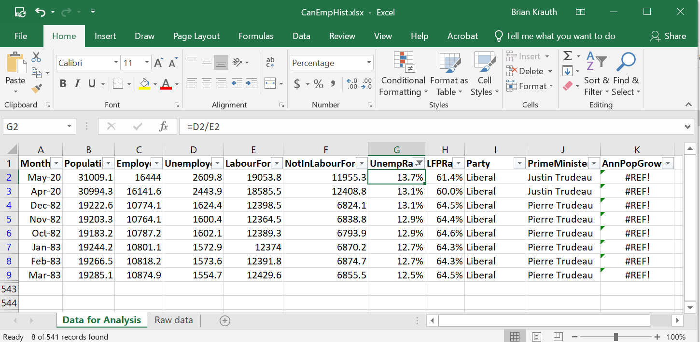
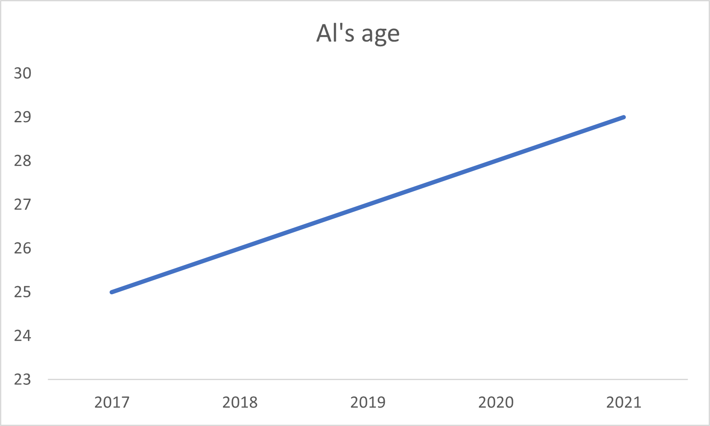
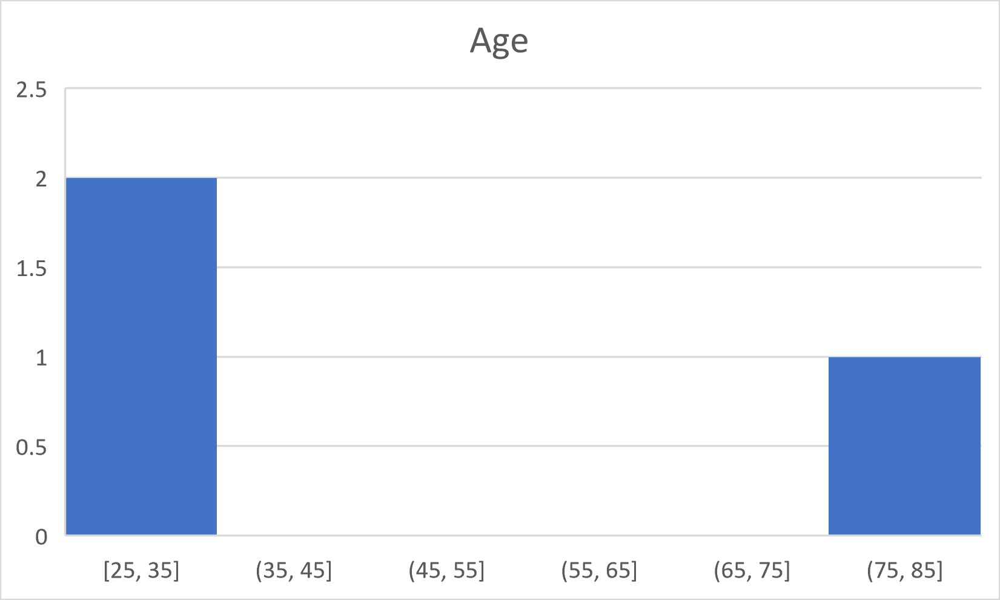

# Solutions to practice problems {#solutions}

```{r setup14, include=FALSE}
knitr::opts_chunk$set(echo = TRUE,
                      prompt = FALSE,
                      tidy = TRUE,
                      collapse = TRUE)
library("tidyverse")
EmpData <- read_csv("sampledata/EmploymentData.csv")
# Make permanent changes to EmpData
EmpData <- EmpData %>%
  mutate(MonthYr = as.Date(MonthYr, "%m/%d/%Y")) %>% 
  mutate(UnempPct = 100*UnempRate) %>% 
  mutate(LFPPct = 100*LFPRate)
```

This appendix provides solutions to all end-of-chapter practice problems.

## **2** Basic data cleaning with Excel {-#answers-basic-data-cleaning-with-excel}

[Click here to see the problems](#problems-basic-data-cleaning-with-excel)

1. Table (b) shows a tidy data set.
2. Master, working, and archive versions have the following features:
   a. The master version represents the project at its most recent completed
      stage. There should be only one, and it should not be edited directly.
   b. A working copy represents current work in progress. There should be one,
      and it can be edited directly.
   c. An archive copy represents an earlier master version or working copy that
      you are keeping for future reference.  There can be many, and they should
      not be edited directly.
3. Characteristic (a) is necessary for a variable to function as an ID variable.
4. The relevant tools are:
   a. Fill (copy/paste is also OK here).
   b. Copy/paste (fill only works on adjacent cells).
   c. Series.
   d. Insert.
5. The formulas are:
   a. `=SQRT(A2)`
   b. `=MIN(A2:A100)`
   c. `=ABS(A2-B2)`
6. Cell E15 is 2 columns and 3 rows away from cell C12.  So we change all
   relative references from column B to column D, and all relative references
   from row 2 to row 5, and all relative references from row 10 to row 13.
   Absolute references are not changed.
   a. `=D5`
   b. `=$B$2`
   c. `=$B5`
   d. `=D$2`
   e. `=SUM(D5:D13)`
   f. `=SUM($B$2:$B$10)`
   g. `=SUM($B5,$B13)`
   h. `=SUM(D$2,D$10)`
7. The formulas are:
   a. `=IF(A2<0.05,"Reject","Fail to reject")`
   b. `=CONCAT("A2 = ",A2)`
   c. `=LEFT(A2,2)`
8. The formulas are:
   a. `=MONTH(TODAY())`
   b. `=TODAY()+100`
   c. `=TODAY()-DATE(1969,11,20)` - using my birthday; yours will obviously be
      different.

## **3** Probability and random events {-#answers-probability}

[Click here to see the problems](#problems-probability)

1. The sample space is the set of all possible outcomes for $(r,w)$, and its
   cardinality is just the number of elements it has.
   a. The sample space is:
      \begin{align}
        \Omega &= \left\{ \begin{aligned}
          & (1,1),(1,2),(1,3),(1,4),(1,5),(1,6), \\
          & (2,1),(2,2),(2,3),(2,4),(2,5),(2,6), \\
          & (3,1),(3,2),(3,3),(3,4),(3,5),(3,6), \\
          & (4,1),(4,2),(4,3),(4,4),(4,5),(4,6), \\
          & (5,1),(5,2),(5,3),(5,4),(5,5),(5,6), \\
          & (6,1),(6,2),(6,3),(6,4),(6,5),(6,6) \\
          \end{aligned}
          \right\}
      \end{align}
   b. Counting up the number of elements in the set, we get $|\Omega| = 36$.
2. Each event is just a set listing the $(r,w)$ outcomes that satisfy the
   relevant conditions.
   a. Yo wins whenever $r+w = 11$.
      \begin{align}
        Yo &= \{(5,6),(6,5)\}
      \end{align}
   b. Snake eyes wins when $r+w = 2$:
      \begin{align}
        SnakeEyes = \{(1,1)\}
      \end{align}
   c. Boxcars wins when $r+w = 12$:
      \begin{align}
        Boxcars = \{(6,6)\}
      \end{align}
   d. Field wins when $r+w \in \{2,3,4,9,10,11,12\}$:
      \begin{align}
        Field &= \left\{\begin{aligned}
           & (1,1),(1,2),(1,3), \\
           & (2,1),(2,2), \\
           & (3,1),(3,6), \\
           & (4,5),(4,6), \\
           & (5,4),(5,5),(5,6), \\
           & (6,3),(6,4),(6,5),(6,6) \\
           \end{aligned}\right\}
       \end{align}
3. Statements (b) and (c) are true.
4. Statements (a) and (d) are true. 
5. Statements (b) and (c) are true.
6. Event (c) is an elementary event.
7. Statements (a), (c), (e), (g), and (i) are true.
8. Statements (b) and (c) are true.
9. Statements (a), (d), (e), (f), and (h) are true.
10. Statements (a) and (b) are true.
11. All three elementary events have probability $1/36 \approx 0.028$
12. The probability of each event can be calculated by adding up the
    probabilities of its elementary events.
    a. The probability a bet on Yo wins is:
       \begin{align}
         \Pr(Yo) &= \Pr(\{(5,6),(6,5)\}) \\
           &= \Pr(\{(5,6)\}) + \Pr(\{(6,5)\}) \\
           &= 2/36 \\
           &\approx 0.056
       \end{align}
    b. The probability a bet on Snake eyes wins is:
       \begin{align}
         \Pr(SnakeEyes) &= \Pr(\{(1,1)\}) \\
           &= 1/36 \\
           &\approx 0.028
       \end{align}
    c. The probability a bet on Boxcars wins is:
       \begin{align}
         \Pr(Boxcars) &= \Pr(\{(6,6)\}) \\
           &= 1/36 \\
           &\approx 0.028
       \end{align}
    d. The probability a bet on Field wins is:
       \begin{align}
         \Pr(Field) &= \Pr\left(\left\{\begin{aligned}
             & (1,1),(1,2),(1,3), \\
             & (2,1),(2,2), \\
             & (3,1),(3,6), \\
             & (4,5),(4,6), \\
             & (5,4),(5,5),(5,6), \\
             & (6,3),(6,4),(6,5),(6,6) \\
             \end{aligned}\right\}\right) \\
           &= \Pr(\{(1,1)\}) + \Pr(\{(1,2)\}) + \cdots + \Pr(\{(6,6)\}) \\
           &= 16/36 \\
           &\approx 0.444
       \end{align}
13. To calculate the joint probability, start by calculating the intersection
    of the two events:
    a. The joint probability is:
       \begin{align}
         \Pr(Yo \cap Boxcars)
            &= \Pr(\{(5,6),(6,5)\} \cap \{(6,6)\}) \\
            &= \Pr(\emptyset) \\
            &= 0
       \end{align}
    b. The joint probability is:
       \begin{align}
         \Pr(Yo \cap Field)
           &= \Pr\left(\{(5,6),(6,5)\} \cap \left\{\begin{aligned}
             & (1,1),(1,2),(1,3), \\
             & (2,1),(2,2), \\
             & (3,1),(3,6), \\
             & (4,5),(4,6), \\
             & (5,4),(5,5),(5,6), \\
             & (6,3),(6,4),(6,5),(6,6) \\
             \end{aligned}\right\}\right) \\
           &= \Pr(\{(5,6),(6,5)\}) \\
           &= 2/36 \\
           &\approx 0.056
       \end{align}
    c. The joint probability is:
       \begin{align}
        \Pr(Yo \cap Boxcars^C)
            &= \Pr(\{(5,6),(6,5)\} \cap \{(6,6)\}^C) \\
            &= \Pr(\{(5,6),(6,5)\}) \\
            &= 2/36 \\
            &\approx 0.056
       \end{align}
14. The conditional probability is just the ratio of the joint probability to
    the probability of the event we are conditioning on:
    a. The conditional probability is:
       \begin{align}
         \Pr(Yo | Boxcars)
            &= \frac{Pr(Yo \cap Boxcars)}{\Pr(Boxcars)} \\
            &= \frac{0}{1/36} \\
            &= 0
        \end{align}
    b. The conditional probability is:
       \begin{align}
         \Pr(Yo | Field)
            &= \frac{Pr(Yo \cap Field)}{\Pr(Field)} \\
            &= \frac{2/36}{16/36} \\
            &= 0.125
        \end{align}
    c. The conditional probability is:
       \begin{align}
         \Pr(Yo | Boxcars^C)
            &= \frac{Pr(Yo \cap Boxcars^C)}{\Pr(Boxcars^C)} \\
            &= \frac{2/36}{1-1/36} \\
            &\approx 0.057
        \end{align}
    d. The conditional probability is:
       \begin{align}
         \Pr(Field | Yo)
            &= \frac{Pr(Field \cap Yo)}{\Pr(Yo)} \\
            &= \frac{2/36}{2/36} \\
            &= 1
        \end{align}
    e. The conditional probability is:
       \begin{align}
         \Pr(Boxcars | Yo)
            &= \frac{Pr(Boxcars \cap Yo)}{\Pr(Yo)} \\
            &= \frac{0}{2/36} \\
            &= 0
        \end{align}
15. The events in (e) are independent.
16. Statements (b) and (c) are true.
17. The probability that Pass wins is:
    \begin{align*}
      \Pr(Pass) &= \Pr(Pass|c = 2)\Pr(c = 2) + \cdots + \Pr(Pass|c = 12)\Pr(c = 12) \nonumber \\
          &= \begin{aligned}[t]
             & (0 \times 1/36) + (0 \times 2/36) + (3/9 \times 3/36) \\
             & + (4/10 \times 4/36) + (5/11 \times 5/36) + (1 \times 6/36) \\
             & + (5/11 \times 5/36) + (4/10 \times 4/36) + (3/9 \times 3/36) \\
             & + (1 \times 2/36) + (0 \times 1/36) \\
             \end{aligned} \\
          &= 244/495 \\
          &\approx 0.4929
    \end{align*}
    Notice that this is less than 50\% (the house always has an advantage) but
    it is greater than the probability of winning a  bet on red or black in
    roulette, which we earlier calculated to be about 0.486.  Craps is typically
    the most favorable casino game to players (lowest house advantage), if you
    play Pass.
18. The conditional return probabilities are:
    \begin{align*}
      \Pr(Return|Body) &= \frac{\Pr(Body|Return)\Pr(Return)}{\Pr(Body)} \\
        &= \frac{0.7 \times 0.8}{0.6} \\
        &\approx 0.93 \\
      \Pr(Return|Engine) &= \frac{\Pr(Engine|Return)\Pr(Return)}{\Pr(Engine)} \\
        &= \frac{0.1 \times 0.8}{0.6} \\
        &\approx 0.13
    \end{align*}

## **4** Introduction to random variables {-#answers-random-variables}

[Click here to see the problems](#problems-random-variables)

1. We can define $t = r+w$.
2. We can define $y = I(r+w = 11)$.
3. The support of a random variable is the set of all values with positive
   probability.
   a. The support of $r$ is $S_r = \{1,2,3,4,5,6\}$.
   b. The support of $t$ is $S_t = \{2,3,4,5,6,7,8,9,10,11,12\}$.
   c. The support of $y$ is $S_y = \{0,1\}$.
4. The range of a random variable is just the interval defined by the support's
   minimum and maximum values.
   a. The range of $r$ is $[1,6]$.
   b. The range of $t$ is $[2,12]$.
   c. The range of $y$ is $[0,1]$.
5. The PDF can be derived from the probability distribution of the underlying
   outcome $(r,w)$, which was calculated in the previous chapter.
   a. The PDF of $r$ is:
    \begin{align}
      f_r(a) &= \begin{cases}
        1/6 & a \in \{1,2,3,4,5,6\} \\
        0 & \textrm{otherwise} \\
        \end{cases}
     \end{align}
   b. The PDF of $t$ is:
    \begin{align}
      f_t(a) &= \begin{cases}
        1/36 & a \in \{2,12\} \\
        2/36 \textrm{ (or $1/18$)} & a \in \{3,11\} \\
        3/36 \textrm{ (or $1/12$)} & a \in \{4,10\} \\
        4/36 \textrm{ (or $1/9$)} & a \in \{5,9\} \\
        5/36 & a \in \{6,8\} \\
        6/36 \textrm{ (or $1/6$)} & a = 7 \\
        0 & \textrm{otherwise} \\
        \end{cases}
     \end{align}
   c. The PDF of $y$ is:
    \begin{align}
      f_y(a) &= \begin{cases}
        17/18 & a = 0 \\
        1/18 & a = 1 \\
        0 & \textrm{otherwise} \\
        \end{cases}
     \end{align}
6. We can construct the CDF by cumulatively summing up the PDF:
   a. The CDF of $r$ is:
    \begin{align}
      F_r(a) &= \begin{cases}
        0 & a < 1 \\
        1/6 & 1 \leq a < 2 \\
        1/3 & 2 \leq a < 3 \\
        1/2 & 3 \leq a < 4 \\
        2/3 & 4 \leq a < 5 \\
        5/6 & 5 \leq a < 6 \\
        1 & a \geq 6 \\
        \end{cases}
     \end{align}
   b. The CDF of $y$ is:
    \begin{align}
      F_y(a) &= \begin{cases}
        0 & a < 0 \\
        17/18 & 0 \leq a < 1 \\
        1 & a \geq 1 \\
        \end{cases}
     \end{align}
7. The interval probabilities are:
   a. $\Pr(x \leq 5) = F_x(5) = 0.8$
   b. $\Pr(x < 5) = F_x(5) - f_x(5) = 0.7$
   c. $\Pr(x > 5) = 1 - F_x(5) = 0.2$
   d. $\Pr(x \geq 5) 1 - F_x(5) + f_x(5) = 0.3$
   e. $\Pr(0 < x \leq 5) = F_x(5) - F_x(0) = 0.5$
   f. $\Pr(0 \leq x \leq 5) = F_x(5) - F_x(0) + f_x(0) = 0.6$
   g. $\Pr(0 < x < 5) = F_x(5) - F_x(0) - f_x(5) = 0.4$
   h. $\Pr(0 \leq x < 5) = F_x(5) - F_x(0) + f_x(0) - f_x(5) = 0.5$
8. We find the expected value by applying the definition:
   a. The expected value is 
      \begin{align}
        E(r) &= \sum_{a \in S_r} a\Pr(r=a) \\
          &= 1*\frac{1}{6} + 2*\frac{1}{6} + 3*\frac{1}{6} + 4*\frac{1}{6} + 5*\frac{1}{6} + 6*\frac{1}{6} \\
          &= 21/6 \\
          &= 3.5 
      \end{align}
   b. The expected value is 
      \begin{align}
        E(r^2) &= \sum_{a \in S_r} a^2\Pr(r=a) \\
          &= 1^2*\frac{1}{6} + 2^2*\frac{1}{6} + 3^2*\frac{1}{6} + 4^2*\frac{1}{6} + 5^2*\frac{1}{6} + 6^2*\frac{1}{6} \\
          &= 91/6 \\
          &= 15.17 
      \end{align}
9. The key here is to write down the definition of the specific quantile you are
   looking for, then substitute the CDF you derived earlier.
   a. The median of $r$ is:
      \begin{align}
        F_r^{-1}(0.5) &= \min \{a: \Pr(r \leq a) \geq 0.5\} \\
          &= \min \{a: F_r(a) \geq 0.5\} \\
          &= \min \{a: a \geq 3\} \\
          &= 3
      \end{align}
   b. The 0.25 quantile of $r$ is 
      \begin{align}
        F_r^{-1}(0.25) &= \min \{a: \Pr(r \leq a) \geq 0.25\} \\
          &= \min \{a: F_r(a) \geq 0.25\} \\
          &= \min \{a: a \geq 2\} \\
          &= 2
      \end{align}
   c. The 75th percentile of $r$ is just its 0.75 quantile: 
      \begin{align}
        F_r^{-1}(0.75) &= \min \{a: \Pr(r \leq a) \geq 0.75\} \\
          &= \min \{a: F_r(a) \geq 0.75\} \\
          &= \min \{a: a \geq 5\} \\
          &= 5
      \end{align}
10. Let $d = (y - E(y))^2$.
    a. We can derive the PDF of $d$ from the PDF of $y$:
     \begin{align}
       f_{d}(a) &= \begin{cases}
         17/18 & a = (0-1/18)^2 \\
         1/18 & a = (1-1/18)^2 \\
         0 & \textrm{otherwise} \\
         \end{cases}
      \end{align}
    b. The expected value is:
       \begin{align}
         E(d) &= (0-1/18)^2 * \frac{17}{18} + (1-1/18)^2 *\frac{1}{18} \\
           &\approx 0.0525
       \end{align}
    c. The variance is:
       \begin{align}
         var(y) &= E(d) \\
           &\approx 0.0525
       \end{align}
11. Earlier, you found $E(r) = 3.5$ and $E(r^2) = 15.17$.  So we can apply
    our result that $var(x) = E(x^2) - E(x)^2$ for a simpler way of calculating
    the variance:
    \begin{align}
      var(r) &= E(r^2) - E(r)^2 \\
        &= 15.17 - 3.5^2 \\
        &= 2.92
    \end{align}
12. The standard deviation is just the square root of the variance.
    a. The standard deviation is:
       $$sd(y) = \sqrt{var(y)} \approx \sqrt{0.0525} \approx 0.229$$
    b. The standard deviation is:
      \begin{align}2
        sd(r) &= \sqrt{var(r)} = \sqrt{2.92} \approx 1.71
      \end{align}
13. The key here is to apply the formulas for the expected value and variance 
    of a linear function of a random variable.
    a. The expected value is:
       \begin{align}
          E(W) &= E(160*y - 10) \\
            &= 160*E(y) - 10 \\
            &= 160*1/18 - 10 \\
            &\approx -1.11
        \end{align}
    b. The variance is:
       \begin{align}
        var(W) &= var(160*y - 10) \\
          &= 160^2*var(y) \\
          &= 160^2*1/18*17/18 \\
          &\approx 1343.2
       \end{align}
    c. The event probability is 
       \begin{align}
        \Pr(W > 0) &= \Pr(y=1) = 1/18 \approx 0.056
       \end{align}
14. Applying the formulas for a linear function:
    a. The expected value is:
       \begin{align}
         E(W_{10}) &= E(16*Y_{10} - 10) \\
          &= 16*E(Y_{10}) - 10 \\
          &= 16*10*1/18 - 10 \\
          &\approx -1.11
        \end{align}
    b. The variance is:
       \begin{align}
         var(W_{10}) &= var(16*Y_{10} - 10) \\ 
          &= 16^2var(Y_10) \\
          &= 16^2 * 10*1/18*17/18 \\
          &\approx 134.32
        \end{align}
    c. The event probability is 
       \begin{align}
        \Pr(W_{10} > 0) &= \Pr(Y_{10} > 10/16) \approx 0.435
       \end{align}
15. The standardized form is constructed by subtracting the mean and dividing
    by the standard deviation.
    a. Since $E(y) = 1/18 \approx 0.056$ and $sd(y) \approx 0.229$, the
       standardized variable will be:
       \begin{equation}
          z = \frac{y - E(y)}{sd(y)} = \frac{y - 0.056}{0.229}
       \end{equation}
    b. The support of $y$ is $S_y = \{0,1\}$, so the support of $z$ is:
       \begin{align}
         S_z &= \left\{\frac{0 - 0.056}{0.229}, \frac{1 - 0.056}{0.229} \right\} \\
           &= \{-0.245, 4.122\}
       \end{align}
    c. The PDF of $z$ is:
       \begin{align}
         f_z(a) &= \begin{cases}
             17/18 & a = -0.245 \\
             1/18 & a = 4.122 \\
             0 & \textrm{otherwise} \\
             \end{cases}
       \end{align}
16. The Bernoulli distribution describes any random variable (like $y$) that
    has a binary $\{0,1\}$ support.
    a. $y$ has the $Bernouili(p)$ distribution with $p=1/18$, or
      $$y \sim Bernoulli(1/18)$$
    b. In the Bernoulli distribution $E(y)=p =1/18$.
    c. In the Bernoulli distribution, $var(y) = p*(1-p) = 1/18 * 17/18 \approx 0.525$.
17. The binomial distribution describes any random variable that describes the
    number of times an event happens in a fixed number of independent trials.
    a. $Y_{10}$ has the binomial distribution with $n=10$ and $p=1/18$.  We can
       also write that as:
       $$Y_{10} \sim Binomial(10,1/18)$$
    b. For the Binomial distribution we have:
       $$E(Y_{10}) = np = 10*1/18 \approx 0.556$$
    c. For the binomial distribution we have:
       $$var(Y_{10}) = np(1-p) = 10*1/18*17/18 \approx 0.525$$
    d. The Excel formula for $\Pr(Y_{10} = 0)$ would be
       `=BINOM.DIST(0,10,1/18,FALSE)` which produces the result
       $$\Pr(Y_{10} = 0) \approx 0.565$$
    e. The Excel formula for $\Pr(Y_{10} \leq 10/16)$ would be
       `=BINOM.DIST(10/16,10,1/18,TRUE)` which produces the result:
        $$\Pr(Y_{10} \leq 10/16) \approx 0.565$$
    f. The Excel formula for $\Pr(Y_{10} > 10/16)$ would be
       `=1-BINOM.DIST(10/16,10,1/18,TRUE)` which produces the result:
       $$\Pr(Y_{10} > 10/16) \approx 0.435$$

## **5** Basic data analysis with Excel {-#answers-basic-data-analysis}

[Click here to see the problems](#problems-basic-data-analysis)

1. The table should look like this:
   
2. The answers are:
   a. Sample size is 3
   b. Sample average of age is 45.
   c. Sample variance of age is 829.
   d. Sample standard deviation of age is 28.8.
3. The numerical answers and Excel formulas (assuming the table starts in cell
   A1) are:
   a. 3 `=COUNT(B2:B4)`
   b. 45 `=AVERAGE(B2:B4)`
   c. 32 `=MEDIAN(B2:B4)`
   d. 28.5  `=PERCENTILE.INC(B2:B4,0.25)`
   e. 829 `=VAR.S(B2:B4)`
   f. 28.8 `=STDEV.S(B2:B4)`
4. The binned frequency table should look something like this:

   | Range | Frequency | % Freq |
   |-------|-----------|--------|
   | 0-10  |    0      |   0    |
   | 11-20 |    0      |   0    |
   | 21-30 |    1      |  33    |
   | 31-40 |    1      |  33    |
   | 41-50 |    0      |   0    |
   | 51-60 |    0      |   0    |
   | 61-70 |    0      |   0    |
   | 71-80 |    1      |  33    |
5. The time series graph should look something like this:
   
6. The histogram should look something like this:
   

## **6** More on random variables {-#answers-more-on-random-variables}

[Click here to see the problems](#problems-more-on-random-variables)

1.  Based on these figures:
    a. $x$ is continuous.
    b. The top graph shows the PDF and the bottom graph shows the CDF.
    c. The median of $x$ is about 3.
    d. $x$ is more likely to be between 0 and 10.
2.  This question uses various formulas for the uniform distribution.
    a. The PDF is:
      \begin{align}
        f_x(a) &= \begin{cases}
          0 & a < -1 \\
          0.5 & -1 \leq a \leq 1 \\
          0 & a > 1 \\
          \end{cases}
      \end{align}
     b. The CDF is:
       \begin{align}
         f_x(a) &= \begin{cases}
           0 & a < -1 \\
           \frac{a+1}{2} & -1 \leq a \leq 1 \\
           1 & a > 1 \\
           \end{cases}
       \end{align}
     c. $x$ is a continuous random variable so $\Pr(x = 0) = 0$
     d. $x$ is a continuous random variable so:
        \begin{align}
          \Pr(0 < x < 0.5) &= F_x(0.5) - F_x(0) \\
            &= \frac{0.5+1}{2} - \frac{1}{2} \\
            &= 0.25
        \end{align}
     e. $x$ is a continuous random variable so:
        \begin{align}
          \Pr(0 \leq x \leq 0.5) &= F_x(0.5) - F_x(0) \\
             &= \frac{0.5+1}{2} - \frac{1}{2} \\
            &= 0.25
        \end{align}
     f. The median is:
        \begin{align}
          F_x^{-1}(0.5) &= \min \{a: \Pr(x \leq a) \geq 0.5\} \\
            &= \min \{a: F_x(a) \geq 0.5\} \\
            &= \min \{a: \frac{a+1}{2} \geq 0.5\} \\
            &= \textrm{the $a$ that solves the equation $\frac{a+1}{2} = 0.5$} \\
            &= 0
        \end{align}
     g. The 75th percentile is
        \begin{align}
          F_x^{-1}(0.75) &= \min \{a: \Pr(x \leq a) \geq 0.75\} \\
            &= \min \{a: F_x(a) \geq 0.75\} \\
            &= \min \{a: \frac{a+1}{2} \geq 0.75\} \\
            &= \textrm{the $a$ that solves the equation $\frac{a+1}{2} = 0.75$} \\
            &= 0.5
        \end{align}
     h. The mean of a $Uniform(a,b)$ random variable is $(a+b)/2$, so
        \begin{align}
          E(x) &= \frac{1 + (-1)}{2} \\
            &= 0
       \end{align}
     i. The variance of a $Uniform(a,b)$ random variable is $(b-a)^2/12$, so
        \begin{align}
          var(x) &= (b-a)^2/12 \\
            &= \frac{(1 - (-1))^2}{12} \\
            &\approx 0.33
        \end{align}
3.  A linear function of a uniform random variable is also uniform.
    a. When $x = -1$, we have $y = 3*(-1)+5 = 2$. When $x = 1$, we have
       $y = 3*(1)+5 = 8$.  Therefore $y \sim U(2,8)$
    b. The expected value is $E(y) = (2+8)/2 = 5$.
4.  This question applies various formulas for the normal distribution.
    a. The expected value of a $N(\mu,\sigma^2)$ random variable is $\mu$,
       so $E(x) = 10$
    b. The median of a $N(\mu,\sigma^2)$ random variable is $\mu$,
       so $Median(x) = 10$.
    c. The variance of a $N(\mu,\sigma^2)$ random variable is $\sigma^2$,
       so $var(x) = 4$.
    d. The standard deviation is $sd(x) = \sqrt{var(x)} = \sqrt{4} = 2$
    b. The Excel formula would be `=NORM.DIST(11,10,2,TRUE)` which
       yields the result $\Pr(x \leq 11) \approx 0.691$
5.  A linear function of a normal random variable is also normal.
    a. The distribution of $y$ will be normal with mean $3E(x) + 5 = 35$ and
       variance $3^2 var(x) = 36$, so $y \sim N(35,36)$
    b. If $x \sim N(10,4)$ then $z = \frac{x - 10}{2} \sim N(0,1)$.
    c. Solving for $x$ in terms of $z$ we get $x = 2z + 10$
       \begin{align}
          \Pr(x \leq 11) &= \Pr(2z + 10 \leq 11) \\
            &= \Pr(z \leq (11-10)/2) \\
            &= \Pr(z \leq 0.5) \\
            &= \Phi(0.5)
       \end{align}
    d. The correct Excel formula would be `=NORM.S.DIST(0.5,TRUE)` which
       yields the result $\Pr(x \leq 11) \approx 0.691$.
6.  The key here is to redefine joint events for $y$ and $b$ as events for the
    single random variable $t$.
    a. The joint PDF is:
       \begin{align}
         f_{y,b}(1,1) &= \Pr(y = 1 \cap b = 1) \\
           &= \Pr(t = 11 \cap t = 12) \\
           &= \Pr(\emptyset)  \\
           &= 0
       \end{align}
    b. The joint PDF is:
       \begin{align}
         f_{y,b}(0,1) &= \Pr(y \neq 1 \cap b = 1) \\
           &= \Pr(t \neq 11 \cap t = 12) \\
           &= \Pr(t = 12) \\
           &= f_t(12) \\
           &= 1/36 \\
           &\approx 0.028
       \end{align}
    c. The joint PDF is:
       \begin{align}
         f_{y,b}(1,0) &= \Pr(y = 1 \cap b = 0) \\
           &= \Pr(t = 11 \cap t \neq 12) \\
           &= \Pr(t = 11)  \\
           &= f_t(11) \\
           &= 1/18 \
           &\approx 0.056
       \end{align}
    d. The joint PDF is:
       \begin{align}
         f_{y,b}(0,0) &= \Pr(y = 0 \cap b = 0) \\
           &= \Pr(t \neq 11 \cap t \neq 12) \\
           &= \Pr(t \notin \{11,12\})  \\
           &= 1 - \Pr(t \in \{11,12\}) \\
           &= 1 - 1/36 - 1/18 \\
           &= 11/12 \\
           &\approx 0.917
       \end{align}
7.  The marginal PDF is constructed by adding together the joint PDFs.
    a. The marginal PDF is:
       \begin{align}
          f_b(0) &= f_{y,b}(0,0) + f_{y,b}(1,0) \\
            &= 11/12 + 1/18 \\
            &= 35/36 \\
            &\approx 0.972
        \end{align}
    b. The marginal PDF is:
       \begin{align}
          f_b(1) &= f_{y,b}(0,1) + f_{y,b}(1,1) \\
            &= 1/36 + 0 \\
            &= 1/36 \\
            &\approx 0.028
        \end{align}
    c. The expected value is:
        \begin{align}
          E(b) &= 0*f_b(0) + 1*f_b(1) \\
            &= f_b(1) \\
            &= 1/36 \\
            &\approx 0.028
        \end{align}
8.  The conditional PDF is the ratio of the joint PDF to the marginal PDF:
    a. The conditional PDF is:
       \begin{align}
         f_{y|b}(1,1) &= \Pr(y=1|b=1) \\
           &= \frac{f_{y,b}(1,1)}{f_b(1)} \\
           &= \frac{0}{1/36} \\
           &= 0
      \end{align}
    b. The conditional PDF is:
       \begin{align}
         f_{y|b}(0,1) &= \Pr(y=0|b=1) \\
           &= \frac{f_{y,b}(0,1)}{f_b(1)} \\
           &= \frac{1/36}{1/36} \\
           &= 1
      \end{align}
    c. The conditional PDF is:
       \begin{align}
         f_{y|b}(1,0) &= \Pr(y=1|b=0) \\
           &= \frac{f_{y,b}(1,0)}{f_b(0)} \\
           &= \frac{1/18}{35/36} \\
           &\approx 0.057
      \end{align}
    d. The conditional PDF is:
       \begin{align}
         f_{y|b}(0,0) &= \Pr(y=0|b=0) \\
           &= \frac{f_{y,b}(0,0)}{f_b(0)} \\
           &= \frac{11/12}{35/36} \\
           &\approx 0.943
      \end{align}
9.  Based on your previous calculations:
    a. The probability you and Betty both win is $f_{y,b}(1,1) = 0$.
    b. The probability you and Betty both lose is $f_{y,b}(0,0) \approx 0.917$.
    c. The probability Betty wins is $f_b(1) \approx 0.028$.
    d. The probability that you win when Betty loses is $f_{y|b}(1,0) \approx 0.057$.
10. $r$ and $w$ (item c) are independent.
11. Since $E(y) = 1/18$ and $E(b) = 1/36$ we have
    \begin{align}
     cov(y,b) &= E((y-E(y))(b-E(b))) \\
       &= \begin{aligned}[t]
         & (0-E(y))*(0-E(b))*f_{y,b}(0,0) \\
         &+ (1-E(y))*(0-E(b))*f_{y,b}(1,0) \\
         &+ (0-E(y))*(1-E(b))*f_{y,b}(0,1) \\
         &+ (1-E(y))*(1-E(b))*f_{y,b}(1,1) \\
         \end{aligned} \\
       &= \begin{aligned}[t]
         & (0-1/18)*(0-1/36)*(11/12) \\
         &+ (1-1/18)*(0-1/36)*(1/18) \\
         &+ (0-1/18)*(1-1/36)*(1/36) \\
         &+ (1-1/18)*(1-1/36)*(0) \\
         \end{aligned} \\
       &\approx -0.00154
    \end{align}
12. The alternate formula for the covariance is $cov(y,b) = E(yb) - E(y)E(b)$.
    a. The expected value is:
       \begin{align}
        E(yb) &= \begin{aligned}
            & 0*0*f_{y,b}(0,0) \\
            &+ 1*0*f_{y,b}(1,0) \\
            &+ 0*1*f_{y,b}(0,1) \\
            &+ 1*1*f_{y,b}(1,1) \\
            \end{aligned} \\
          &= f_{y,b}(1,1) \\
          &= 0
        \end{align}
    b. The covariance is:
       \begin{align}
        cov(y,b) &= E(yb) - E(y)E(b) \\
          &= 0 - (1/18)*(1/36) \\
          &\approx -0.00154
        \end{align}
    c. Yes, if you have done it right you should get the same answer.
13. The correlation is:
    \begin{align}
      corr(y,b) &= \frac{cov(y,b)}{\sqrt{var(y)var(b)}} \\
        &\approx \frac{-0.00154}{\sqrt{ 0.0525*0.027}} \\
        &\approx -0.04
    \end{align}
14. In this question we know the correlation and several values of the formula
    defining it, and we use this to solve for the missing value.
    a. We know that $corr(b,t) = \frac{cov(b,t)}{\sqrt{var(b)var(t)}}$, so
       we can substitute known values to get:
       \begin{align}
          0.35 &= \frac{cov(b,t)}{\sqrt{0.027*5.83}}
       \end{align}
       Solving for $cov(b,t)$ we get
       \begin{align}
          cov(b,t) &= 0.35*\sqrt{0.027*5.83} \\
            &= 0.139
       \end{align}
    b. We know that $cov(b,t) = E(bt) - E(b)E(t)$, so we can substitute
       known values to get:
       \begin{align}
          0.139 &= E(bt) - (1/36)*7
       \end{align}
       Solving for $E(bt)$ we get:
       \begin{align}
          E(bt) &= 0.139 + (1/36)*7 \\
            &= 0.333
       \end{align}
15. Remember that independent events are also uncorrelated. So:
    a. The covariance is $cov(r,w) = 0$.
    b. The correlation is $corr(r,w) = 0$.
16. This question uses the formulas for the mean of a linear function of two
    random variables.
    a. The expected value is:
       \begin{align}
          E(y+b) &= E(y) + E(b) \\
            &= 1/18 + 1/36 \\
            &= 3/36 \\
            &= 1/12
        \end{align}
    b. The expected value is:
       \begin{align}
          E(16y + 31b - 2) &= 16 E(y) + 31 E(b) - 2 \\
            &= 16/18 + 31/36 - 2 \\
            &= -9/36
       \end{align}
17. This question uses the formulas for the variance and covariance of a linear
    function of two random variables.
    a. The covariance is:
       \begin{align}
          cov(16y,31b) &= 16 * 31 * cov(y,b) \\
            &\approx 16 * 31 * (-0.00154) \\
            &\approx -0.7638
       \end{align}
    b. The variance is:
       \begin{align}
          var(y+b) &= var(y) + var(b) + 2 cov(y,b) \\
            &\approx 0.0525 + 0.027 + 2*(-0.00154) \\
            &\approx 0.07642
        \end{align}
18. Statement (b) is correct: the result of a bet on Boxcars is *negatively*
    related to the result of a bet on Yo.

## **7** Statistics {-#answers-statistics}

[Click here to see the problems](#problems-statistics)


1. Since we have a random sample, the joint PDF is just a product of the
   marginal PDFs.
   a. The support is just the set of all possible combinations: 
      $$S_{D_n} = \{(1,1),(1,2),(2,1),(2,2)\}$$
   b. Since we have a random sample, the joint PDF is the product of the
      marginal PDFs: 
      \begin{align}
        f_{D_n}(1,1) &= f_x(1)f_x(1) \\
          &= 0.4*0.4 \\
          &= 0.16
      \end{align}
   c. Since we have a random sample, the joint PDF is the product of the
      marginal PDFs: 
      \begin{align}
        f_{D_n}(2,1) &= f_x(2)f_x(1) \\
          &= 0.6*0.4 \\
          &= 0.24
      \end{align}
   d. Since we have a random sample, the joint PDF is the product of the
      marginal PDFs: 
      \begin{align}
        f_{D_n}(1,2) &= f_x(1)f_x(2) \\
          &= 0.4*0.6 \\
          &= 0.24
      \end{align}
   e. Since we have a random sample, the joint PDF is the product of the
      marginal PDFs: 
      \begin{align}
        f_{D_n}(2,2) &= f_x(2)f_x(2) \\
          &= 0.6*0.6 \\
          &= 0.36
      \end{align}
2. A random sample needs to be independent (not just uncorrelated) and
   identically distributed (not just the same mean and variance).
   a. Possibly a random sample.
   b. Possibly a random sample.
   c. Not a random sample.
   d. Definitely a random sample.
   e. Possibly a random sample.
   f. Not a random sample.
3. Identify the sampling type (random sample, time series, stratified sample.
   cluster sample, census, convenience sample) for each of the following data
   sets.
   a. This is a convenience sample.
   b. This is a random sample.
   c. This is a stratified sample.
   d. This is a time series.
   e. This is a census.
4. This is a long question but we can make it easier by preparing a simple table
   mapping each of the four possible values of $D_n$ into a value for each
   statistic:
   
   | $x_1$ | $x_2$ |$f_{D_n}(\cdot)$|$\hat{f}_1$ |$\bar{x}$ | $\hat{\sigma}_x^2$ | $\hat{\sigma}_x$ | $xmin$ | $xmax$ |
   |-------|-------|--------------|-------------|----------|--------------------|------------------|--------|--------|
   |  1    |   1   |    0.16      |    1        |   1      |       0            |       0          |   1    |   1    |
   |  2    |   1   |    0.24      |    0.5      |   1.5    |       0.5          |       0.71       |   1    |   2    |
   |  1    |   2   |    0.24      |    0.5      |   1.5    |       0.5          |       0.71       |   1    |   2    |
   |  2    |   2   |    0.36      |    0        |   2      |       0            |       0          |   2    |   2    |
   
   This will make our lives much easier. 
   a. The support is $S_{\hat{f}_1} = \{0,0.5,1\}$ and the sampling distribution
      is:
      \begin{align}
         f_{\hat{f}_1}(0) &= \Pr(\hat{f}_1 = 0) \\
           &= f_{D_n}(2,2) \\
           &= 0.36 \\
         f_{\hat{f}_1}(0.5) &= \Pr(\hat{f}_1 = 0.5) \\
           &= f_{D_n}(2,1) + f_{D_n}(1,2) \\
           &= 0.24 + 0.24 \\
           &= 0.48 \\
         f_{\hat{f}_1}(1) &= \Pr(\hat{f}_1 = 1) \\
           &= f_{D_n}(1,1) \\
           &= 0.16 
       \end{align}
   b. The support is $S_{\bar{x}} = \{1,1.5,2\}$ and the sampling distribution
      is:
      \begin{align}
          f_{\bar{x}}(1) &= \Pr(\bar{x} = 1) \\
            &= f_{D_n}(1,1) \\
            &= 0.16 \\
          f_{\bar{x}}(1.5) &= \Pr(\bar{x} = 1.5) \\
            &= f_{D_n}(2,1) + f_{D_n}(1,2) \\
            &= 0.24 + 0.24 \\
            &= 0.48 \\
          f_{\bar{x}}(2) &= \Pr(\bar{x} = 2) \\
            &= f_{D_n}(2,2) \\
            &= 0.36 
       \end{align}
   c. The support is $S_{\hat{\sigma}_x^2} = \{0,0.5\}$ and the sampling 
      distribution is:
      \begin{align}
          f_{\hat{\sigma}_x^2}(0) &= \Pr(\hat{\sigma}_x^2 = 0) \\
            &= f_{D_n}(1,1) + f_{D_n}(2,2)\\
            &= 0.16 + 0.36 \\
            &= 0.52 \\
          f_{\hat{\sigma}_x^2}(0.5) &= \Pr(\hat{\sigma}_x^2 = 0.5) \\
            &= f_{D_n}(2,1) + f_{D_n}(1,2) \\
            &= 0.24 + 0.24 \\
            &= 0.48 
       \end{align}
   d. The support is $S_{\hat{\sigma}_x} = \{0,0.71\}$ and the sampling
      distribution is:
      \begin{align}
          f_{\hat{\sigma}_x^2}(0) &= \Pr(\hat{\sigma}_x = 0) \\
            &= f_{D_n}(1,1) + f_{D_n}(2,2)\\
            &= 0.16 + 0.36 \\
            &= 0.52 \\
          f_{\hat{\sigma}_x^2}(0.71) &= \Pr(\hat{\sigma}_x = 0.71) \\
            &= f_{D_n}(2,1) + f_{D_n}(1,2) \\
            &= 0.24 + 0.24 \\
            &= 0.48 
       \end{align}
   e. The support is $S_{xmin} = \{1,2\}$ and the sampling distribution is:
      \begin{align}
          f_{xmin}(1) &= \Pr(xmin = 1) \\
            &= f_{D_n}(1,1) + f_{D_n}(2,1) + f_{D_n}(1,2) \\
            &= 0.16 + 0.24 + 0.24 \\
            &= 0.64 \\
          f_{xmin}(2) &= \Pr(xmin = 2) \\
            &= f_{D_n}(2,2) \\
            &= 0.36 
        \end{align}
   f. The support is $S_{xmax} = \{1,2\}$ and the sampling distribution is:
      \begin{align}
          f_{xmax}(1) &= \Pr(xmax = 1) \\
            &= f_{D_n}(1,1) \\
            &= 0.16 \\
          f_{xmax}(2) &= \Pr(xmax = 2) \\
            &= f_{D_n}(2,2) + f_{D_n}(2,1) + f_{D_n}(1,2) \\
            &= 0.36 + 0.24 + 0.24 \\
            &= 0.84 
        \end{align}
5. The mean can be calculated from each statistic's PDF.
   a. The mean is:
      \begin{align}
          E(\hat{f}_1) &= 0*f_{\hat{f}_1}(0) +  0.5*f_{\hat{f}_1}(0) +  1*f_{\hat{f}_1}(1) \\
            &= 0*0.36 +  0.5*0.48 +  1*0.16 \\
            &= 0.4 
      \end{align}
   b. The mean is:
      \begin{align}
         E(\bar{x}) &= 1*f_{\bar{x}}(1) +1.5*f_{\bar{x}}(1.5) + 2*f_{\bar{x}}(2) \\
             &= 1*0.16 +1.5*0.48 + 2*0.36 \\
             &= 1.6
      \end{align}
   c. The mean is:
      \begin{align}
        E(\hat{\sigma}_x^2) &= 0*f_{\hat{\sigma}_x^2}(0) + 0.5*f_{\hat{\sigma}_x^2}(0.5) \\
            &= 0*0.52 + 0.5*0.48  \\
            &= 0.24
      \end{align}
   d. The mean is:
      \begin{align}
        E(\hat{\sigma}_x) &= 0*f_{\hat{\sigma}_x}(0) + 0.71*f_{\hat{\sigma}_x}(0.71) \\
            &= 0*0.52 + 0.71*0.48  \\
            &= 0.34
     \end{align}
   e. The mean is:
      \begin{align}
         E(xmin) &= 1*f_{xmin}(1) + 2*f_{xmin}(2) \\
             &= 1*0.64 + 2*0.36 \\
             &= 1.36  
      \end{align}
   f. The mean is:
      \begin{align}
         E(xmax) &= 1*f_{xmax}(1) + 2*f_{xmax}(2) \\
             &= 1*0.16 + 2*0.84 \\
             &= 1.84  
      \end{align}
6. We have already found the mean of each statistic, so we can calculate the
   variance using the alternative formula $var(x) = E(x^2) - E(x)^2$.
   a. To calculate the variance, we can use the alternative formula:
      \begin{align}
          E(\hat{f}_1^2) &= 0^2*f_{\hat{f}_1}(0) +  0.5^2*f_{\hat{f}_1}(0) +  1^2*f_{\hat{f}_1}(1) \\
            &= 0*0.36 +  0.25*0.48 +  1*0.16 \\
            &= 0.28 \\
          var(\hat{f}_1) &= E(\hat{f}_1^2) - E(\hat{f}_1)^2 \\
            &= 0.28 - 0.4^2 \\
            &= 0.12
      \end{align}
   b. To calculate the variance, we can use the alternative formula:
      \begin{align}
          E(\bar{x}^2) &= 1^2*f_{\bar{x}}(1) +1.5^2*f_{\bar{x}}(1.5) + 2^2*f_{\bar{x}}(2) \\
            &= 1*0.16 +2.25*0.48 + 4*0.36 \\
            &= 2.68 \\
          var(\bar{x}) &= E(\bar{x}^2) - E(\bar{x})^2 \\
            &= 2.68 - 1.6^2 \\
            &= 0.12
      \end{align}
   c. To calculate the variance, we can use the alternative formula:
      \begin{align}
          E(xmin^2) &= 1^2*f_{xmin}(1) + 2^2*f_{xmin}(2) \\
             &= 1*0.64 + 4*0.36 \\
             &= 2.08 \\
          var(xmin) &= E(xmin^2) - E(xmin)^2 \\
            &= 2.08 - 1.36^2 \\
            &= 0.23
      \end{align}
   d. To calculate the variance, we can use the alternative formula:
      \begin{align}
          E(xmax^2) &= 1^2*f_{xmax}(1) + 2^2*f_{xmax}(2) \\
             &= 1*0.16 + 4*0.84 \\
             &= 3.52 \\  
          var(xmax) &= E(xmax^2) - E(xmax)^2 \\
            &= 3.52 - 1.84^2 \\
            &= 0.134
      \end{align}
7. All three of these statistics are simple linear functions of the data, so
   their mean and variance can be calculated without using the PDF.
   a. The mean and variance are already given to us:
      \begin{align}
        E(x_1) &= 1.6 \\
        var(x_1) &= 0.24 
      \end{align}
   b. The mean and variance can be found using the standard formulas for 
      the sample average:
      \begin{align}
        E(\bar{x}) &= E(x_i) \\
          &= 1.6 \\
        var(\bar{x}) &= var(x_i)/2 \\
          &= 0.24/2 \\
          &= 0.12 
      \end{align}
   c. The mean and variance can be found using the standard formula for a linear
      function of two random variables:
      \begin{align}
        E(w) &= E(0.2*x_1 + 0.8*x_2) \\ 
          &= 0.2*E(x_1) + 0.8*E(x_2) \\
          &= 0.2*1.6 + 0.8*1.6 \\
          &= 1.6 \\
        var(w) &= var(0.2*x_1 + 0.8*x_2) \\ 
          &= 0.2^2*var(x_1) + 0.8^2*var(x_2) + 2*0.2*0.8*cov(x_1,x_2)\\
          &= 0.2^2*0.24 + 0.8^2*0.24  + 2*0.2*0.8*0 \\
          &= 0.16 
      \end{align}
8. Unknown parameters: $\mu$,$\sigma^2$, $E(x_i)$, $E(x_i^3)$, $var(x_i)$, and
   $sd(x_i)/\sqrt{n}$. Statistics: $D_n$, $\bar{x}$.
9. We can find the true values directly from the PDF $f_x(\cdot)$:
   a. The true probability is:
      $\Pr(x_i = 1) = 0.4$
   b. The population mean is:
      $E(x_i) = 1*0.4 + 2*0.6 = 1.6$
   c. The population variance is:
      $var(x_i) = (1-1.6)^2*0.4 + (2-1.6)^2*0.6 = 0.24$
   d. The population standard deviation is:
      $sd(x_i) = \sqrt{var(x_i)} = \sqrt{0.24} = 0.49$
   e. The population minimum is:
      $min(S_x) = 1$
   f. The population maximum is:
      $max(S_x) = 2$
10. Since $\max(S_x) = 2$, the error is either $err = 1 -2 = -1$ or $err = 2 - 2 = 0$.
    a. The sampling error has support $S_{err} = \{-1,0\}$
    b. The sampling error has PDF:
       \begin{align}
          f_{err}(-1) &= f_{D_n}(1,1) \\
            &= 0.16 \\
          f_{err}(0) &= f_{D_n}(2,1) + f_{D_n}(1,2) + f_{D_n}(2,2) \\
            &= 0.24 + 0.24 + 0.36 \\
            &= 0.84
       \end{align}
11. We have already calculated the mean of each statistic and the true value of
    each parameter, so we can calculate the bias and then use the result to
    classify each estimator.
    a. Unbiased
       \begin{align}
         bias(\hat{f}_1) &= E(\hat{f}_1) - \Pr(x_i=1) \\
           &= 0.4 - 0.4 \\
           &= 0
        \end{align}
    b. Unbiased
       \begin{align}
         bias(\bar{x}) &= E(\bar{x}) - E(x_i) \\
           &= 1.6 - 1.6 \\
           &= 0
        \end{align}
    c. Unbiased
       \begin{align}
         bias(\hat{\sigma}_x^2) &= E(\hat{\sigma}_x^2) - var(x_i) \\
           &= 0.24 - 0.24 \\
           &= 0
        \end{align}
    d. Biased
       \begin{align}
         bias(\hat{\sigma}_x) &= E(\hat{\sigma}_x) - sd(x_i) \\
           &= 0.34 - 0.49 \\
           &= -0.15
        \end{align}
    e. Biased
       \begin{align}
         bias(xmin) &= E(xmin) - \min(S_x) \\
           &= 1.36 - 1 \\
           &= 0.36
        \end{align}
    f. Biased
       \begin{align}
         bias(xmax) &= E(xmax) - \max(S_x) \\
           &= 1.84 - 2 \\
           &= -0.16
        \end{align}
12. Remember that the expected value passes through *linear* functions, but not
    *nonlinear* functions.
    a. It is unbiased, as $E(\bar{y}_M - \bar{y}_W) = E(\bar{y}_M) - E(\bar{y}_W) = \mu_M - \mu_W$.
    b. It is biased, as $E(\bar{y}_M/\bar{y}_W) \neq E(\bar{y}_M)/E(\bar{y}_W) = \mu_M/\mu_W$.
13. We have already calculated the variance and bias, so we can apply the
    formula $MSE = var + bias^2$.
    a. The MSE is:
       \begin{align}
         MSE(\hat{f}_1) &= var(\hat{f}_1) + bias(\hat{f}_1)^2 \\
           &= 0.12 + 0^2 \\
           &= 0.12
        \end{align}
    b. The MSE is:
       \begin{align}
         MSE(\bar{x}) &= var(\bar{x}) + bias(\bar{x})^2 \\
           &= 0.12 + 0^2 \\
           &= 0.12
        \end{align}
    c. The MSE is:
       \begin{align}
         MSE(xmin) &= var(xmin) + bias(xmin)^2 \\
           &= 0.23 + 0.36^2 \\
           &= 0.36
        \end{align}
    d. The MSE is:
       \begin{align}
         MSE(xmax) &= var(xmax) + bias(xmax)^2 \\
           &= 0.13 + (-0.16)^2 \\
           &= 0.16
        \end{align}
14. Again, these estimators are both linear functions of the data, so their mean
    and variance are easy to calculate.
    a. Both estimators are unbiased.
    b. The variance is $var(\bar{x}) = \sigma^2/2$
    c. The variance is $var(x_2) = \sigma^2$
    d. The MSE is $MSE(\bar{x}) = \sigma^2/2$
    e. The MSE is $MSE(x_2)= \sigma^2$
    f. The estimator $\bar{x}$ is preferred under the MVUE criterion.
    g. The estimator $\bar{x}$ is preferred under the MSE criterion.
15. The standard error is:
    \begin{align}
      se(\bar{x}) &= \hat{\sigma}/\sqrt{n} \\
        &= \sqrt{4}/\sqrt{100} \\
        &= 0.2
    \end{align}
16. Both the sample average (a) and the average of all even numbered
    observations (d) are consistent estimators of $\mu$, because they keep using
    more and more information as the sample size increases.  In contrast the
    estimators based on the first observation, and on the first 100 observations
    are both unbiased, but they do not change as the sample size increases.  So
    the LLN does not apply, and the estimators are not consistent. The LLN does
    apply to the sample median because of Slutsky's theorem, but that makes it a
    consistent estimator of the population *median*, which may or may not be
    equal to the population *mean*.

## **8** Statistical inference {-#answers-inference}

[Click here to see the problems](#problems-inference)

1. The null is:
     $$H_0: \beta = 0$$
   and the alternative is:
     $$H_w: \beta \neq 0$$
2. Test statistics need to possess characteristics (a), (d), and (e).
3. In this setting:
   a. $x_i$ must have a normal distribution.
   b. The asymptotic distribution is $N(0,1)$
4. The expression is:
    $$t = \frac{\bar{x}-\mu_1}{\hat{\sigma}_x/\sqrt{n}} + \frac{\mu_1-\mu_0}{\hat{\sigma}_x/\sqrt{n}}$$
5. This question is about calculating the size given the critical values.
   a. The size is:
      \begin{align}
        size &= F_{T_{13}}(-1.96) + 1 - F_{T_{13}}(1.96) \\
          &= 0.035894296 + 1 - 0.964105704 \\
          &\approx 0.07
      \end{align}
      and the formula for calculating this in Excel is
      `=T.DIST(-1.96,13,TRUE) +1 - T.DIST(1.96,13,TRUE)`.
   b. The size is:
      \begin{align}
        size &= \Phi(-1.96) + 1 - \Phi(1.96) \\
          &= 0.024997895 + 1 - 0.975002105 \\
          &\approx 0.05
      \end{align}
      and the formula for calculating this in Excel is
      `=NORM.S.DIST(-1.96,TRUE) +1 - NORM.S.DIST(1.96,TRUE)`.
   c. The size is:
      \begin{align}
        size &= F_{T_{13}}(-3) + 1 - F_{T_{13}}(2) \\
          &\approx 0.005119449 + 1 - 0.966579821 \\
          &\approx 0.04
      \end{align}
      and the formula for calculating this in Excel is
      `=T.DIST(-3,13,TRUE) +1 - T.DIST(1.96,13,TRUE)`.
   d. The size is:
      \begin{align}
        size &= \Phi(-3) + 1 - \Phi(2) \\
          &\approx 0.001349898 + 1 - 0.977249868 \\
          &\approx 0.02
      \end{align}
      and the formula for calculating this in Excel is
      `=NORM.S.DIST(-3,TRUE) +1 - NORM.S.DIST(2,TRUE)`.
   e. The size is:
      \begin{align}
        size &= F_{T_{13}}(-\infty) + 1 - F_{T_{13}}(2) \\
          &\approx 0 + 1 - 0.966579821 \\
          &\approx 0.03
      \end{align}
      and the formula for calculating this in Excel is
      `=1 - T.DIST(2,13,TRUE)`.
   f. The size is:
      \begin{align}
        size &= \Phi(-\infty) + 1 - \Phi(2) \\
          &\approx 0 + 1 - 0.977249868 \\
          &\approx 0.02
      \end{align}
      and the formula for calculating this in Excel is
      `=1 - NORM.S.DIST(2,TRUE)`.
6. This problem asks you to find the critical values that deliver a given size.
   a. The critical values are:
      \begin{align}
        c_L &= F^{-1}_{T_{17}}(0.005) \\
          &\approx -2.90 \\
        c_H &= F^{-1}_{T_{17}}(0.995) \\
          &\approx 2.90
      \end{align}
      and the formulas for calculating this in Excel are `=T.INV(0.005,17)` and
      `=T.INV(0.995,17)`.
   b. The critical values are:
      \begin{align}
        c_L &= F^{-1}_{T_{17}}(0.025) \\
          &\approx -2.11 \\
        c_H &= F^{-1}_{T_{17}}(0.975) \\
          &\approx 2.11
      \end{align}
      and the formulas for calculating this in Excel are `=T.INV(0.025,17)` and
      `=T.INV(0.975,17)`.
   c. The critical values are:
      \begin{align}
        c_L &= F^{-1}_{T_{17}}(0.05) \\
          &\approx -1.74 \\
        c_H &= F^{-1}_{T_{17}}(0.95) \\
          &\approx 1.74
      \end{align}
      and the formulas for calculating this in Excel are `=T.INV(0.05,17)` and
      `=T.INV(0.95,17)`.
   d. The critical values are:
      \begin{align}
        c_L &= \Phi^{-1}(0.005) \\
          &\approx -2.58 \\
        c_H &= \Phi^{-1}(0.995) \\
          &\approx 2.58
      \end{align}
      and the formulas for calculating this in Excel are `=NORM.S.INV(0.005)`
      and `=NORM.S.INV(0.995)`.
   e. The critical values are:
      \begin{align}
        c_L &= \Phi^{-1}(0.025) \\
          &\approx -1.96 \\
        c_H &= \Phi^{-1}(0.975) \\
          &\approx 1.96
      \end{align}
      and the formulas for calculating this in Excel are `=NORM.S.INV(0.025)`
      and `=NORM.S.INV(0.975)`.
   f. The critical values are:
      \begin{align}
        c_L &= \Phi^{-1}(0.05) \\
          &\approx -1.65 \\
        c_H &= \Phi^{-1}(0.95) \\
          &\approx 1.65
      \end{align}
      and the formulas for calculating this in Excel are `=NORM.S.INV(0.05)` and
      `=NORM.S.INV(0.95)`.
7. The only thing we have tested here is whether there is no effect.  We
   rejected that null, so we can rule out the possibility that there is no
   effect.  But that does not tell us whether the effect is small or large - in
   order to say anything about that question we need to test other nulls, or
   construct a confidence interval.
   a. Probably false.
   b. Probably true.
   c. Possibly true.
8. The only thing we have tested here is whether there is no effect, and we
   haven't been able to rule out that possibility.  So we can't really rule
   anything out.
   a. Possibly true.
   b. Possibly true.
   c. Possibly true.
9. The confidence interval for a mean always follows the same formula
   a. The confidence interval is:
      \begin{align}
        CI^{95} &= \bar{x} \pm F_{T_{15}}^{-1}(0.975)*\hat{\sigma}/\sqrt{n} \\
          &\approx 4 \pm 2.13*0.3/\sqrt{16} \\
          &\approx (3.84, 4.16)
      \end{align}
      and the formulas for calculating these numbers in Excel are
      `=4-T.INV(0.975,15)*0.3/SQRT(16)` and `=4+T.INV(0.975,15)*0.3/SQRT(16)`
   b. The confidence interval is:
      \begin{align}
        CI^{90} &= \bar{x} \pm F_{T_{15}}^{-1}(0.95)*\hat{\sigma}/\sqrt{n} \\
          &\approx 4 \pm 1.75*0.3/\sqrt{16} \\
          &\approx (3.87, 4.13)
      \end{align}
      and the formulas for calculating these numbers in Excel are
      `=4-T.INV(0.95,15)*0.3/SQRT(16)` and `=4+T.INV(0.95,15)*0.3/SQRT(16)`
   c. The confidence interval is:
      \begin{align}
        CI^{99} &= \bar{x} \pm F_{T_{15}}^{-1}(0.995)*\hat{\sigma}/\sqrt{n} \\
          &\approx 4 \pm 2.95*0.3/\sqrt{16} \\
          &\approx (3.77, 4.22)
      \end{align}
      and the formulas for calculating these numbers in Excel are
      `=4-T.INV(0.995,15)*0.3/SQRT(16)` and `=4+T.INV(0.995,15)*0.3/SQRT(16)`.
   d. The confidence interval is:
      \begin{align}
        CI^{95} &= \bar{x} \pm \Phi^{-1}(0.975)*\hat{\sigma}/\sqrt{n} \\
          &\approx 4 \pm 1.96*0.3/\sqrt{16} \\
          &\approx (3.85, 4.15)
      \end{align}
      and the formulas for calculating these numbers in Excel are
      `=4-NORM.S.INV(0.975)*0.3/SQRT(16)`
      and `=4+NORM.S.INV(0.975)*0.3/SQRT(16)`
   e. The confidence interval is:
      \begin{align}
        CI^{90} &= \bar{x} \pm \Phi^{-1}(0.95)*\hat{\sigma}/\sqrt{n} \\
          &\approx 4 \pm 1.64*0.3/\sqrt{16} \\
          &\approx (3.88, 4.12)
      \end{align}
      and the formulas for calculating these numbers in Excel are
      `=4-NORM.S.INV(0.95)*0.3/SQRT(16)` and `=4+NORM.S.INV(0.95)*0.3/SQRT(16)`
   f. The confidence interval is:
      \begin{align}
        CI^{99} &= \bar{x} \pm \Phi^{-1}(0.995)*\hat{\sigma}/\sqrt{n} \\
          &\approx 4 \pm 2.58*0.3/\sqrt{16} \\
          &\approx (3.81, 4.19)
      \end{align}
      and the formulas for calculating these numbers in Excel are
      `=4-NORM.S.INV(0.995)*0.3/SQRT(16)` and `=4+NORM.S.INV(0.995)*0.3/SQRT(16)`
10. In effect, the confidence interval simultaneously reports the results of
    every possible null hypothesis.  So anything in the range $(0.10,0.40)$
    cannot be ruled out but anything outside of that range can be ruled out.
    a. Probably false.
    b. Probably true.
    c. Probably true.
    d. Probably false.

## **9** Advanced data cleaning {-#answers-advanced-data-cleaning}

[Click here to see the problems](#problems-advanced-data-cleaning)

1. The file formats are:
   a. Fixed width 
   b. Space or tab delimited
   c. CSV 
2. Here are my descriptions, yours may be somewhat different:
   a. A crosswalk table is a data table we can use to translate variables that
      are expressed in one way into another way.  For example, we might use a
      crosswalk table to translate country names into standardized country
      codes, or to translate postal codes into provinces.
   b. When we have two data tables that contain information on related
      cross-sectional units, we can combine their information into a single
      table by matching observations based on a variable that (a) exists in both
      tables and (b) connects the observations in some way.
   c. Aggregating data by groups allows us to group observations according to a
      common characteristic, and describe those groups using data calculated
      from the individual observations.
3. You can edit cell A1 under scenarios (a) and (c).
4. If you do this:
   a. Nothing will happen, but you can ask Excel to mark invalid data.
   b. Excel will not allow you to enter invalid data.

## **10** An introduction to R {-#answers-introduction-to-r}

[Click here to see the problems](#problems-introduction-to-r)

1. The chapter describes how to do each of these.
2. Items (a), (b), (d), and (e) are valid R expressions.
3. Write the R code to perform the following actions:
   a. `cookies <- c("oatmeal", "chocolate chip", "shortbread")`
   b. `threes <- seq(3,100,by=3)`
   c. `threes[5]`
   d. `threecookies <- list(cookies = cookies, threes = threes)`.
4. This code will load a built-in data set of automobile gas mileage, and
   produce a graph that depicts the relationship between weight and miles per
   gallon:
``` {r pp_09_04}
   data("mtcars")  # load data
   ggplot(mtcars, aes(wt, mpg)) + geom_point(aes(colour=factor(cyl), size = qsec))
```
5. The R code will be something like this.
```{r pp_10_05}
library("tidyverse")
deniro <- read_csv("https://people.sc.fsu.edu/~jburkardt/data/csv/deniro.csv")
nrow(deniro)
ncol(deniro)
```

## **11** Using R {-#answers-using-r}

[Click here to see the problems](#problems-using-r)

1. The R code to create this data table is as follows:

```{r PP_11_01, collapse = FALSE}
PPData <- EmpData %>%
  mutate(Year = format(MonthYr, "%Y")) %>%
  mutate(EmpRate = Employed/Population) %>%
  filter(Year >= 2010) %>% 
  select(MonthYr,Year,EmpRate,UnempRate,AnnPopGrowth) %>%
  arrange(EmpRate)
print(PPData)
```

2. The R code is as follows. None of the variables have missing data.

```{r PP_11_02, collapse = FALSE}
### A: Mean employment rate
mean(PPData$EmpRate)
### B: Table of medians
PPData %>%
    select(where(is.numeric)) %>%
    lapply(median)
```
   
3. The employment rate is a continuous variable, so the appropriate kind of 
   frequency table here is a binned frequency table.
   
```{r PP_11_03, collapse = FALSE}
PPData %>%
    count(cut_interval(EmpRate, 6))
```

4. The R code for these calculations is as follows:
   
```{r PP_11_04, collapse = FALSE}
qnorm(0.45,mean=4,sd=6)
qt(0.975,df=8)
pnorm(0.75)
rbinom(5,size=10,prob=0.5)
```

5. The code below is the minimal code needed to create the histogram using the default
   options.  You could improve on the graph quite easily by adjusting some of these 
   options.

```{r PP_11_05}
ggplot(data = PPData, mapping = aes(x = EmpRate)) + geom_histogram()
```

6. The code below is the minimal code needed to create the graph using the default
   options.  You could improve on the graph quite easily by adjusting some of these 
   options.

```{r PP_11_06}
ggplot(data = PPData, mapping = aes(x = MonthYr, y = EmpRate)) + geom_line()
```

## **12** Multivariate data analysis {-#answers-multivariate-data-analysis}

[Click here to see the problems](#problems-multivariate-data-analysis)

1. The tables are
   a. Simple frequency table
   b. Conditional average
   c. Crosstab
2. The covariance and correlation is negative here, so periods of high
   population growth tend to be periods of *low* unemployment.
``` {r PP_12_01}
cov(EmpData$UnempPct,EmpData$AnnPopGrowth,use="complete.obs")
cor(EmpData$UnempPct,EmpData$AnnPopGrowth,use="complete.obs")
```

3. I used casewise deletion but it does not matter. It only matters when you add
   a third variable.
4. The scatter plot should look something like this:
``` {r PP_12_04}
ggplot(data = EmpData, mapping = aes(x = AnnPopGrowth, y = UnempRate)) + geom_point()
```

5. The plot should look something like this:
```{r PP_12_05}
ggplot(data = EmpData, mapping = aes(x = AnnPopGrowth, y = UnempRate)) + geom_point() + 
  geom_smooth(col = "green") + geom_smooth(method = "lm", col = "blue")
```

## **Appendix A** Math review {-#answers-math-review}

[Click here to see the problems](#problems-math-review)

1. In my case it would be $A = (Brian, Charlie, Hazel, Sue)$.
2. This would be $B = \{x \in Z: 1 \leq x \leq 1000\}$
3. The cardinality is $|A| = 4$ (in my case, yours may be different) and
   $|B| = 1000$.
4. Remember that sets are subsets of themselves.
   a. $B$ and $D$ are identical ($B = D$)
   b. $C$ is disjoint with $A$
   c. All four sets are subsets of $A$ ($A \subset A$, $B \subset A$, 
      $C \subset A$, and $D \subset A$)
   d. $C$ and $D$ are subsets of $B$.
5. Remember that $\cap$ means "and", $\cup$ means "or", and ${}^C$ means "not"
   a. $A \cap B = \{2\}$
   b. $A \cup B = \{1,2,3,4\}$
   c. $A \cap D = \{2\}$
   d. $A \cup D = \{1,2,3\}$
   e. $B^C = \{1,3,5\}$
   f. Enumeration is not an option here, so we use set-builder notation: 
      $B^C = \{x \in \mathbb{Z}: x \notin \{2,4\}\}$
6. Remember that the indicator function $I(\cdot)$ returns one for true 
   statements and zero for false statements.
   a. $I(x < 5) = I(4 < 5) =1$
   b. $I(x \textrm{ is an odd number}) = I(4 \textrm{ is an odd number}) = 0$
   c. $I(x < 5) - I(\sqrt{x} \textrm{ is an integer}) = I(4 < 5) - I(\sqrt{4} \textrm{ is an integer}) = 1 - 1 = 0$
7. The summation values are:
   a. $\sum_{x = 1}^5 x^2 = 1^2 + 2^2 + 3^2 + 4^2 + 5^2 = 55$
   b. $\sum_{i \in \{1,3,5\}} \ln(i) = \ln(1) + \ln(3) + \ln(5) \approx 2.708$
   c. $\sum_{i \in 1}^\infty x_i I(i < 4) = x_1 + x_2 + x_3$
8. Statements (a) and (c) are true.
9. The limits are:
   a. The limit of this sequence is $0$.
   b. This sequence has no limit.
   c. The limit of this sequence is $5$.
   d. The limit of this sequence is $0$.
   e. The limit of this sequence is $\infty$.
